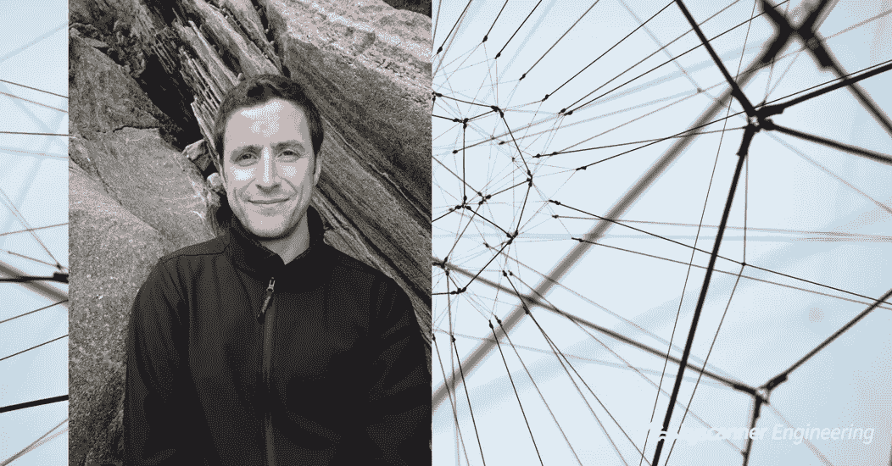
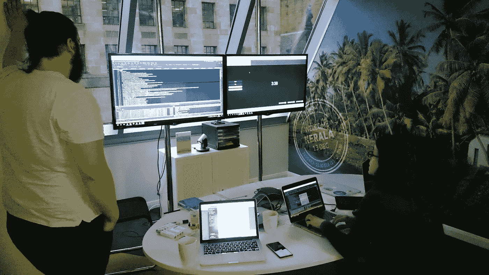
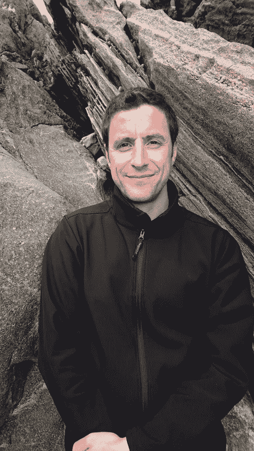

# 暴民的智慧

> 原文：<https://medium.com/hackernoon/the-wisdom-of-the-mob-801c50477b08>

## 在 Skyscanner 工程中试验 Mob 编程

基思·柯克霍普

Experimenting with Mob programming in Skyscanner Engineering

> “所有优秀的人都在同一时间、同一空间、同一台电脑上做同一件事。”伍迪·朱尔

自 2016 年 12 月以来，我们(旅行者内容平台团队)彻底改变了我们的工作方式。我们不再使用传统的概念和工作方式，对我们来说，这是基于拿起一张吉拉卡，独自工作，或者两人一组，坐在有双显示器的桌子前。

相反，我们现在都在同一时间，在同一台电脑上完成同一项任务，我们喜欢这样！看看我是如何发现这个过程的，如果你喜欢在这里工作的声音，请记住，[我们正在招聘](http://grnh.se/y0x7fj1)。

## **概念**

我第一次听说 Mob 编程是在两年前，当时我们在苏格兰格拉斯哥的 Skyscanner 办公室举办了一场由 Serial Seb 主持的 Mob talk。从那以后，除了和我们的飞行搜索队和 TCP 队一起尝试了几天，我除了谈论它之外什么也没做。然后，在 2016 年 11 月，Woody Zuill 在 JP Morgan 的欧洲技术中心(距离格拉斯哥办公室两个街区)做了一次演讲，所以我去了那里寻求另一种观点。

在谈话过程中，我突然意识到，他谈到的许多问题，我在我们的 TCP 团队中每天都会遇到。我们的知识分布不均，技能差距巨大。例如，我来自 ASP.Net 的 Windows 和前端背景，TCP 是 Python Linux 后端平台，8 个月后，我仍然不能有效地工作许多系统。我们在写卡片时遇到了问题，这些卡片要么没有解释问题和我们想要解决的问题，要么过于具体，因此它们的实施需要重写验收标准。我们可以完成工作，但如果做这件事的人不在，我们就不得不把它留到他们回来，因为不清楚他们是如何完成任务的。

## **正在做**

本着[建立、测量和学习](http://theleanstartup.com/principles)的精神，通过请求原谅而不是许可，我挑选了格拉斯哥办公室一个未使用的部分，找到了一台备用的带轮子的电视(被遗弃在格拉斯哥办公室的角落里，放在果岭上)，从一个研讨会房间里拿了一张折叠式桌子和带轮子的白板。我从 IT 服务部拿了一台备用的 MacBook，然后我们就出发了。

*Our first mobbing station set up!*

在实践中，它的工作原理是有一个被称为打字员(有时被称为司机)的角色，坐在“mobbly”(我们的 mobbing mac)的键盘前。然后，导航器会指示打字员键入什么内容。我们使用一个计时器，大约每 10 分钟轮换一次打字员的角色，如果人多，我们减少时间，如果人少，我们增加时间。导航员可以打开他们的笔记本电脑，充当当前任务的研究者(或者你知道下一个任务即将到来)。大约每隔一个小时，你就休息一下，给每个人时间充电。

如果任何人认为他们没有从 mob 中学习或为其做出贡献，他们可以离开 mob 去做研究或处理我们的一些较小的请求。通常，当这种情况发生时，这是一个很好的检查点，让我们验证我们正在以正确的方式做正确的事情。当他们重新加入暴民时，他们必须向暴民汇报他们所学或所做的事情。

Mobbing in dedicated space in our Skyscanner office in Glasgow, Scotland.

我们已经在办公室里创建的专用空间里做了四个月了。在这段时间里，我们打破了团队中存在的许多知识孤岛。团队现在对我们的目的和目标及其背后的商业原因有了清晰的认识。我们不再需要花几个小时写吉拉卡片，或者表演单口相声，或者策划或预先策划会议。相反，如果我或其他人理解了问题，我们就充当主要导航员，向每个人解释。知道我们为什么要做一项任务意味着我们每个人都可以挑战和/或改进我们执行它的方式。

## **是不是慢了？**

有了四名工程师组成的团队，我们在吉拉的电路板上移动的卡片和正在进行的工作肯定比以前少了。它可能会让人感觉慢一些，因为你不能像科技或商业忍者一样，尽可能快地在吉拉董事会上打出一张“完成”的牌。但是，这是因为要完成任何事情，你的想法在输入电脑时必须经过至少一个人的大脑，也就是说，你必须教至少一个人如何去做。

我们发现我们的工作速度比以前稳定多了。如果你对此仍不确定，那么想想有多少次你被一个问题困扰了一段时间，只是为了向同事解释，然后马上解决了它。想象一下大部分时间都可以使用它？

## **暴徒能有多大？**

我们仍在学习，通过与格拉斯哥其他公司的 Mob 编程人员交流，我认为最好的经验法则是:

*只有当人们不再学习或不再有能力做出贡献时，才分裂暴徒。*

## 我们学到了什么？

1.  我们每个人都意识到每个人的技能和知识优势和劣势。
2.  我们意识到有些人学习的方式非常不同。我们中的一些人会去阅读技术/工具，然后在其他人阅读和探索技术的同时开始使用它。当我们在做还没有人理解的事情时，知道这一点是很有用的。
3.  我们只是通过观察我们每个人使用的工具、技术和技巧来不断提高技能。
4.  假期和缺席不再阻塞任务。我们都有能力继续努力。
5.  我们保持更稳定的进步速度。我们发现的问题会随着我们的前进而得到解决，最终会带来更好的软件。
6.  每个人永远是一致的(是的，真的)。
7.  我们谈论/讨论/计划的时间比以前多得多——我们总是使用白板
8.  与所有人交流和合作很好，而不是坐在他们旁边独自工作

## **那么，该不该试一试呢？**

**是的**。

你不必一直这样做。你可以在特定的日子、特定的项目中尝试，或者只是在早上。

## **我怎么试？**

这确实是一个由慢变快的实际例子。召集一些同事，带着带计时器的笔记本电脑，试一试。就这么简单。

如果您对我有任何问题，请在下面评论，看看我们是否能进一步提供帮助。

这方面的进一步阅读可能会有所帮助:

*   [GOV . UK 的 12 大 mob 编程技巧和想法](https://gdstechnology.blog.gov.uk/2016/09/08/our-top-12-mob-programming-tips-and-thoughts/)
*   [尝试用 mob 编程来重建 GOV.UK 验证前端](https://identityassurance.blog.gov.uk/2016/02/26/experimenting-with-mob-programming-to-rebuild-the-gov-uk-verify-frontend/)
*   [使用 mob 编程解决问题](https://gds.blog.gov.uk/2016/09/01/using-mob-programming-to-solve-a-problem/)
*   [团队编码员:Mob 编程](https://team-coder.com/mob-programming/)
*   [暴民编程 RPG](https://github.com/willemlarsen/mobprogrammingrpg)

# 想和我这样的人一起工作吗？

我们在 Skyscanner 以不同的方式做事，我们正在全球办事处寻找更多的工程团队成员。看看我们的 [Skyscanner 职位](https://www.skyscanner.net/jobs/)寻找更多空缺。

We’re hiring for Skyscanner Engineering Managers

# **关于作者**

大家好，我是 Keith，是一名高级软件工程师，也是 Skyscanner 苏格兰格拉斯哥办事处旅游内容平台小组的组长。除了解决工作中的问题，你会发现我在苏格兰骑山地车时摔了下来，试图引起我的两只猫中的一只的注意，或者和我的妻子计划假期。我发现以最佳方式构建正确的软件解决方案通常不是技术问题，而是人的问题。在 [Skyscanner](http://skyscanner.net?utm_medium=blog&utm_source=engmediumblogpost&utm_campaign=keith_mobbing) 这里，我们能够学习和尝试我们的工作方式，这使我们能够提供更好的产品。

Keith Kirkhope, Skyscanner