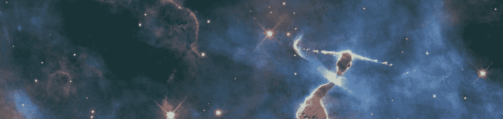
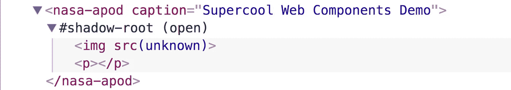
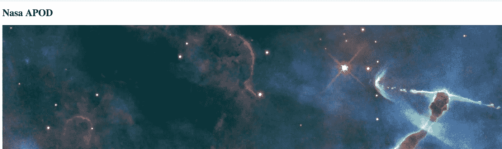
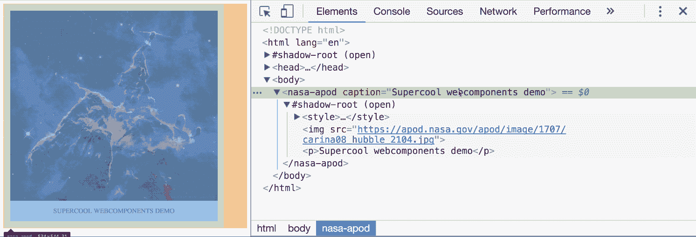

# Web 组件的奇妙世界

> 原文：<https://medium.com/hackernoon/the-wonderful-world-of-web-components-e4c1675c6901>

Web 组件是一组新的浏览器 API，允许您创建具有自己的封装样式和功能的自定义 HTML 元素。



NASA, ESA and M. Livio (STScl)

这些 API 使开发人员能够以基于组件的方式构建 web 应用程序，而不是“默认的”基于文档的 web 方法。

整个“Web 组件”包由四个子 API 组成，这四个子 API 也可以相互独立使用。然而，当这四个人走到一起时，真正的奇迹就发生了。

# HTML 模板

[HTML](https://hackernoon.com/tagged/html) 模板允许你声明[标记](https://hackernoon.com/tagged/markup)的片段，这些片段被解析为 HTML，在页面加载时不使用，但是可以在以后的运行时实例化。

> 它们是一个放一大堆 HTML 的地方，你根本不想让浏览器弄乱它们…不管是出于什么原因。
> 拉斐尔·温斯坦(HTML 模板规范作者)

创建模板就像创建任何其他常规 DOM 元素一样简单:

```
<template id="template-author">
  <h2>Rijk</h2>
  </template>
```

关键要点:

*   模板内容在激活之前是惰性的
*   在使用模板之前没有副作用
*   该内容被认为不在 DOM 中
*   模板可以放在任何地方
*   没有任何形式的本地数据绑定。因此，您仍然需要一个库来处理这个问题，或者自己编写一些业务逻辑来用有用的内容填充模板。

# HTML 导入

现在，我们已经有了将 CSS 和 JavaScript 文件等资产导入 HTML 标记的方法。有了 HTML 导入，我们现在有了一种在其他 HTML 文档中包含 HTML 文档的方法。这也不仅限于标记。导入还可以包含它自己的 CSS、JavaScript 或任何其他内容。

导入 HTML 文档与包含 CSS 文件非常相似:

`<link rel="import" href="/author.html" />`

一旦加载了导入的文件，它的嵌入式脚本将运行，并且可以通过引用元素的`import`属性来使用内容:

```
const content = document.querySelector('link[rel="import"]').import;
```

在导入其他定制元素时，可以非常有效地使用这个 API，稍后将演示这一点。

关于浏览器支持 HTML 导入的一个重要注意事项:Chrome 已经实现并发布了它，但是 WebKit 和 Firefox ***根本不打算实现它。*** *WebKit 提供了他们想要调查的一个与 ES6 模块的组合。*

关键要点:

*   `link rel=import`自动删除所有重复请求。
*   导入的文档并不放在 DOM 中，只是供使用
*   导入文档中的脚本标签将在导入时运行
*   默认情况下，导入语句是阻塞的，但是接受`async`属性
*   当从要导入的文档中访问`document`时，您实际上是在访问父文档。`document.currentScript.ownerDocument`是对“子”文档的引用。
*   深度嵌套的 html 导入将会影响`document.currentScript.ownerDocument`。用`document.currentScript.ownerDocument`作为参数将嵌套脚本包装在 iife 中以防止这种情况。

# 阴影 DOM

来自[谷歌的影子 DOM 基础](https://developers.google.com/web/fundamentals/getting-started/primers/shadowdom):

> 影子 DOM 只是普通的 DOM，有两个不同点:
> 1)它是如何被创建/使用的，以及
> 2)它如何与页面的其他部分相关联。
> 
> 通常，您创建 DOM 节点并将它们作为另一个元素的子元素追加。使用 shadow DOM，您可以创建一个作用域 DOM 树，该树附加到元素上，但与其实际的子元素分开。这个限定了作用域的子树被称为影子树。它所依附的元素是它的影子宿主。你在阴影中添加的任何东西都会成为宿主元素的一部分，包括`*<style>*`。这就是影子 DOM 实现 CSS 样式范围的方式。

你可能以前用过 shadow DOM，甚至在你没有意识到的时候。浏览器对许多不同的原生 HTML 元素使用阴影 DOM，如范围输入:


Shadow DOM of a standard <input type=”range”>

shadow DOM API 允许开发人员创建自己的 shadow DOM 并将其附加到元素上，这与定制元素非常匹配。

关键要点:

*   shadow-root 中的所有内容都是有作用域的。
*   使用`:host`选择器来样式化父容器
*   `position: fixed`和其他 css 定位使用组件边界作为"视口"
*   shadow-root 中元素的样式可以被 light-dom 覆盖(“常规”/“父”-dom)。

# 自定义元素

使用自定义元素，开发人员可以创建新的 HTML 标记，扩展现有的 HTML 标记，或者扩展其他开发人员已经构建的组件。它提供了一种创建可重用组件的本地方式。

定制元素必须在 JavaScript 中定义。它们有几个生命周期挂钩:

```
class ArticleAuthor extends HTMLElement { // When element is created or upgraded  
  constructor() {...} // When element is inserted into a document 
  connectedCallback() {...} // When element is removed from a document
  disconnectedCallback() {...} // When an [observed attribute](https://developer.mozilla.org/en-US/docs/Web/Web_Components/Custom_Elements#Observed_attributes) changes
  attributeChangedCallback() {...} // When the element is adopted into a new document
  adoptedCallback() {...}
}// Register <article-author>
customElements.define('article-author', ArticleAuthor);
```

将 DOM 添加到元素中可以通过将标记插入到`this.innerHTML`中来完成:

```
...
connectedCallback() {
  this.innerHTML = '<b>Hi there!</b>';
}
...
```

添加内容(imo)的一个更好的方法是结合上面提到的 HTML 模板和影子 DOM(见下面的演示)。

关键要点:

*   名称必须包含连字符(-)(例如`<article-author>`)
*   名称必须是唯一的
*   自定义元素不能自结束
*   根据规范，你可以扩展现有的 HTML 元素(比如`HTMLButtonElement`)，而不是默认的`HTMLElement`。这将继承该元素的所有默认功能(如按钮上的 tabindex)。遗憾的是，到目前为止，这还没有在任何地方实现。
*   HTML 模板是标记自定义元素的(影子)DOM 的理想方式。
*   总是为组件将要使用的任何属性添加 getter 和 setter 方法。

# 现在都在一起

让我们创建一个`nasa-apod`标签，它使用[他们的 API](https://api.nasa.gov/api.html#apod) 来呈现美国宇航局当天的天文图片(APOD)。

为了清晰起见，我将在这个演示中内嵌所有的 CSS 和 JS。完整的演示可以在 https://github.com/rijkvanzanten/nasa-apod 找到。

目标是创建一个支持如下`caption`属性的元素:

`<nasa-apod caption="Supercool Web Components Demo"></nasa-apod>`

让我们从创建一个`nasa-apod.html`文件开始，该文件将创建并注册定制元素。

```
<!-- nasa-apod.html --><script> **class NasaApod extends HTMLElement {}** **customElements.define('nasa-apod', NasaApod);**</script>
```

我们的元素需要显示图像。为了实现这一点，我们将向元素的 shadow DOM 添加一个常规的``标签。

首先，让我们从给元素附加一个阴影 DOM 开始，并添加一个模板供以后使用。

```
<!-- nasa-apod.html -->**<template>
  
  <p></p>
</template>**<script> class NasaApod extends HTMLElement {
 **   constructor() {
      super();** **this.attachShadow({mode: 'open'});
    }**
  } customElements.define('nasa-apod', NasaApod);</script>
```

要将模板插入阴影 DOM，我们需要用`document.querySelector`或其他选择方法选择它。但是，因为这个元素被导入到另一个文档中，`document`实际上引用了导入当前文档的*文档。为了获得对`ownerDocument`的引用，我们需要将我们的`random-img.html`逻辑包装到一个生命中，在这个生命中我们提供`document.currentScript.ownerDocument`作为参数:*

```
<!-- nasa-apod.html --><template>
  
  <p></p>
</template><script>**(function(ownerDocument) {** class NasaApod extends HTMLElement {
  constructor() {
      super(); this.attachShadow({mode: 'open'});
    }
  } customElements.define('nasa-apod', NasaApod);**}(document.currentScript.ownerDocument))**</script>
```

现在我们有了对正确文档的引用，我们可以选择模板并将其插入到影子 DOM 中。

```
<!-- nasa-apod.html --><template>
  
  <p></p>
</template><script>(function(ownerDocument) { class NasaApod extends HTMLElement {
  constructor() {
      super(); this.attachShadow({mode: 'open'}); **const {shadowRoot} = this;
      const template = ownerDocument.querySelector('template');
      const instance = template.content.cloneNode(true);
      shadowRoot.append(instance);** }
  } customElements.define('nasa-apod', NasaApod);}(document.currentScript.ownerDocument))</script>
```

现在我们有了一个可以实际呈现的元素，让我们通过将它导入到我们的主 HTML 文档中来尝试一下。

```
<!-- index.html --><!doctype html>
<html>
<head>
  <meta charset="utf-8">

  <!-- import and register the nasa-apod component -->  
  **<link rel="import" href="nasa-apod.html" />** </head>
<body> **<nasa-apod caption="Supercool Web Components Demo"></nasa-apod>** </body></html>
```

如果你的浏览器支持所有的 webcomponents 规范(目前只支持 Chrome ),你应该可以在检查器中看到:



它还没有做任何特别有用的事情，但是它工作了！

让我们继续让我们的元素从 API 获取一个图像，并在 shadow DOM 中显示它。

```
<!-- nasa-apod.html --><template>
  
  <p></p>
</template><script>(function(ownerDocument) { class NasaApod extends HTMLElement {
  constructor() {
      super(); this.attachShadow({mode: 'open'}); const {shadowRoot} = this;
      const template = ownerDocument.querySelector('template');
      const instance = template.content.cloneNode(true);
      shadowRoot.append(instance);
    } connectedCallback() {
      const {shadowRoot} = this;

      **fetch('**[**https://api.nasa.gov/planetary/apod?api_key=DEMO_KEY'**](https://api.nasa.gov/planetary/apod?api_key=DEMO_KEY')**)
        .then(res => res.json())
        .then(res => {
          const image = shadowRoot.querySelector('img');
          image.src = res.hdurl;
        })
        .catch(err => console.error);**
    }
  } customElements.define('nasa-apod', NasaApod);}(document.currentScript.ownerDocument))</script>
```

这难道不可爱吗？



The rendered picture in our <nasa-apod> element

让我们添加对`caption`属性的支持。

首先，我们需要让元素知道它需要观察`caption`属性，并为它提供一个 getter 和 setter 方法。这允许通过检查器或 JavaScript 改变元素的属性来更新主文档中的元素。

```
<!-- nasa-apod.html --><template>
  
  <p></p>
</template><script>(function(ownerDocument) { class NasaApod extends HTMLElement {
  constructor() {
      super(); this.attachShadow({mode: 'open'}); const {shadowRoot} = this;
      const template = ownerDocument.querySelector('template');
      const instance = template.content.cloneNode(true);
      shadowRoot.append(instance);
    } **static get observedAttributes() {
      return ['caption'];
    }** **get caption() {
      return this.getAttribute('caption');
    }** **set caption(val) {
      this.setAttribute('caption', val);
    }** connectedCallback() {
      const {shadowRoot} = this; fetch('[https://api.nasa.gov/planetary/apod?api_key=DEMO_KEY'](https://api.nasa.gov/planetary/apod?api_key=DEMO_KEY'))
        .then(res => res.json())
        .then(res => {
          const image = shadowRoot.querySelector('img');
          image.src = res.hdurl;
        })
        .catch(err => console.error);
    }
  } customElements.define('nasa-apod', NasaApod);}(document.currentScript.ownerDocument))</script>
```

然后我们需要动态更新影子根中段落标签`<p>`的内容。

```
<!-- nasa-apod.html --><template>
  
  <p></p>
</template><script>(function(ownerDocument) { class NasaApod extends HTMLElement {
  constructor() {
      super(); this.attachShadow({mode: 'open'}); const {shadowRoot} = this;
      const template = ownerDocument.querySelector('template');
      const instance = template.content.cloneNode(true);
      shadowRoot.append(instance);
    } static get observedAttributes() {
      return ['caption'];
    } get caption() {
      return this.getAttribute('caption');
    } set caption(val) {
      this.setAttribute('caption', val);
    } connectedCallback() {
      const {shadowRoot} = this; **const caption = this.getAttribute('caption');** **if (caption) {
        const paragraph = shadowRoot.querySelector('p');
        paragraph.innerText = caption;
      }** fetch('[https://api.nasa.gov/planetary/apod?api_key=DEMO_KEY'](https://api.nasa.gov/planetary/apod?api_key=DEMO_KEY'))
        .then(res => res.json())
        .then(res => {
          const image = shadowRoot.querySelector('img');
          image.src = res.hdurl;
        })
        .catch(err => console.error);
    } ** attributeChangedCallback(name, oldVal, newVal) {
      if (name === 'caption') {
        const {shadowRoot} = this;
        const paragraph = shadowRoot.querySelector('p');
        paragraph.innerText = newVal;
      }
    }**
  } customElements.define('nasa-apod', NasaApod);}(document.currentScript.ownerDocument))</script>
```

如果您在浏览器的元素检查器中更新属性，或者通过设置属性用 JavaScript 动态更新它们，元素会实时更新！

最后但同样重要的是，给我们的元素添加一些限定范围的样式，然后就到此为止。

```
<!-- nasa-apod.html --><template>
 **<style>
    :host {
      display: flex;
      flex-direction: column;
      align-items: center;
      padding: 15px;
      border: 2px dashed grey;
      width: max-content;
    }** **img {
      max-width: 500px;
      max-height: 500px;
      object-fit: cover;
    }** **p {
      text-align: center;
      text-transform: uppercase;
      color: grey;
    }
  </style>**
  
  <p></p>
</template><script>(function(ownerDocument) { class NasaApod extends HTMLElement {
  constructor() {
      super(); this.attachShadow({mode: 'open'}); const {shadowRoot} = this;
      const template = ownerDocument.querySelector('template');
      const instance = template.content.cloneNode(true);
      shadowRoot.append(instance);
    } static get observedAttributes() {
      return ['caption'];
    } get caption() {
      return this.getAttribute('caption');
    } set caption(val) {
      this.setAttribute('caption', val);
    } connectedCallback() {
      const {shadowRoot} = this; const caption = this.getAttribute('caption'); if (caption) {
        const paragraph = shadowRoot.querySelector('p');
        paragraph.innerText = caption;
      } fetch('[https://api.nasa.gov/planetary/apod?api_key=DEMO_KEY'](https://api.nasa.gov/planetary/apod?api_key=DEMO_KEY'))
        .then(res => res.json())
        .then(res => {
          const image = shadowRoot.querySelector('img');
          image.src = res.hdurl;
        })
        .catch(err => console.error);
    } attributeChangedCallback(name, oldVal, newVal) {
      if (name === 'caption') {
        const {shadowRoot} = this;
        const paragraph = shadowRoot.querySelector('p');
        paragraph.innerText = newVal;
      }
    }
  } customElements.define('nasa-apod', NasaApod);}(document.currentScript.ownerDocument))</script>
```



*注意:我在这个例子中使用了 NASA 的演示 api-key，它的速率限制非常低。在 https://api.nasa.gov*注册自己的(免费)api_key。