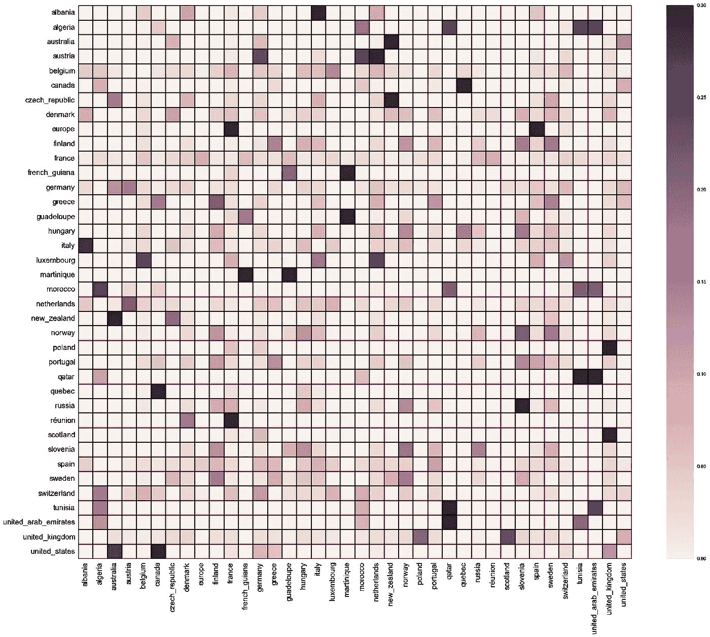
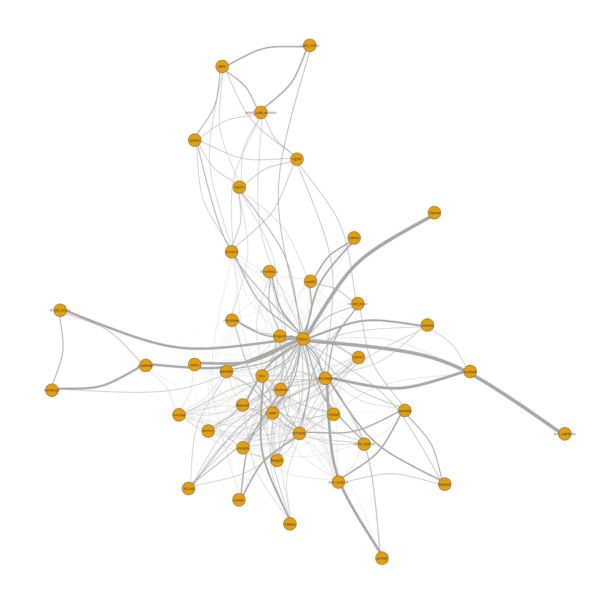

# 由食物连接的世界

> 原文：<https://medium.com/hackernoon/the-world-connected-by-food-51192f5984c5>

把这个世界想象成一个社交网络。国与国之间分享的食物数量在很大程度上反映了他们的关系，就像有很多共同朋友的人自己也可能成为朋友一样。

感谢 Kaggle 上发布的[数据集，我得以探索这个网络并展示一些有趣的联系。值得注意的是，法国遥遥领先，紧随其后的大多是其他西方国家。这可能是由于数据集的众包性质。因此，在图表中，你会发现一些传统上被认为的烹饪巨头不见了。](https://www.kaggle.com/openfoodfacts/world-food-facts)

这张图表在 x 轴和 y 轴上显示了两个国家分享食物的百分比。它以 y 轴为中心。例如，在显示新西兰的行中，您会注意到在 x 轴上对应澳大利亚和捷克共和国的两个深色框。这意味着所有与其他国家分享的新西兰食物中，有许多是与澳大利亚和捷克共和国分享的。实际百分比可以从颜色条中读取。

我还用同样的信息制作了另一张图，包括更多的国家。同样作为一个用户界面的考虑，这是一个互动的情节，当你的鼠标悬停在盒子上时，它会向你显示一对国家。这是一个静态版本，因为 Medium 不允许 javascript 嵌入，但可以在这里找到互动版本。

[代码在 Github 上。](https://github.com/BillGu/everthoughtabout/blob/master/FoodFacts/Food_Influencers.ipynb)

> [黑客中午](http://bit.ly/Hackernoon)是黑客如何开始他们的下午。我们是 [@AMI](http://bit.ly/atAMIatAMI) 家庭的一员。我们现在[接受投稿](http://bit.ly/hackernoonsubmission)并乐意[讨论广告&赞助](mailto:partners@amipublications.com)机会。
> 
> 如果你喜欢这个故事，我们推荐你阅读我们的[最新科技故事](http://bit.ly/hackernoonlatestt)和[趋势科技故事](https://hackernoon.com/trending)。直到下一次，不要把世界的现实想当然！

