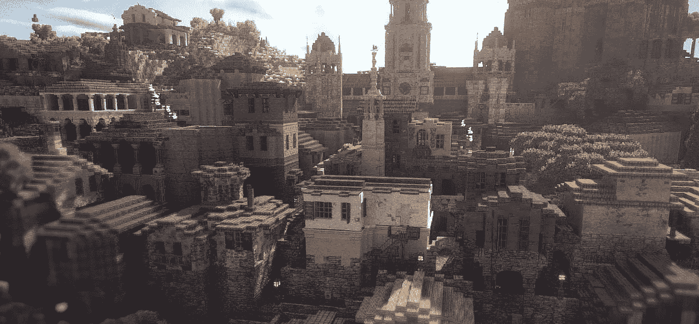
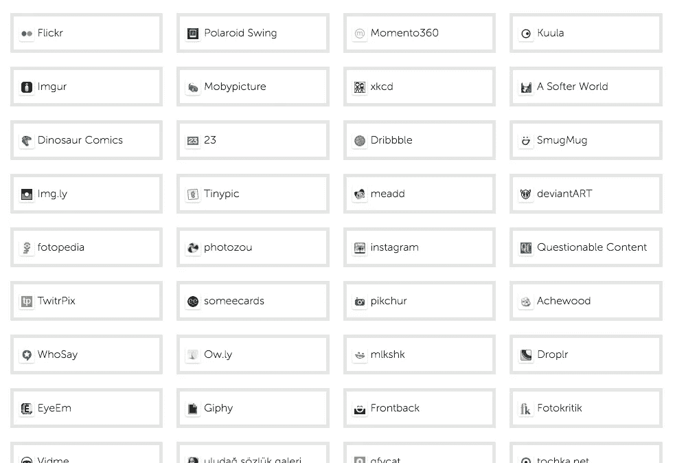
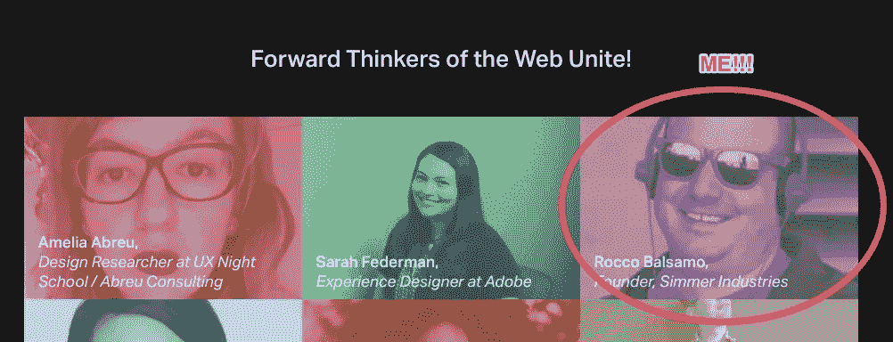

# 世界上第一个 3D 环境？

> 原文：<https://medium.com/hackernoon/the-worlds-first-3d-environment-in-a-medium-post-6d2811f7e705>



好的，这个很酷。让我们从演示开始，然后是解释:

那么，在一篇中等博客文章中，怎么可能有 3D 环境呢？？？

## 首先，简单介绍一下背景

在过去的几个月里，我一直致力于一个商业想法，那就是为网络上的 3D (WebGL)内容创建一个集中的家。很自然，我研究了各种竞争对手和与[不太相关的](https://hackernoon.com/webgl-needs-a-home-part-ii-bit-rot-d8c5fec0ebd4)网站。

以上嵌入来自一个名为 [Sketchfab](https://sketchfab.com) 的网站，该网站的任务是:

> 在线和在虚拟现实中发布、共享和发现 3D 内容。

哎哟。听起来很像我想做的与我的网站，[煨工业](http://simmerindustries.com)。他们比我多出了 950 万美元。

但是，我没有被吓住。我[有一个利基](https://hackernoon.com/how-i-built-and-deployed-a-webgl-game-to-a-new-website-in-35m-15b2e8339c31)，与 Sketchfab 目前所做的是分开的。我对互动体验比对模型和动画更感兴趣。

this one’s pretty cool but doesn’t work as well on mobile

## 回到技术层面

那么，上面的 3D 环境是怎么加到 Medium 上的呢？实际上非常简单。我刚刚从 sketchfab 的网站上粘贴了这个 URL:

```
[https://sketchfab.com/models/3e85bbfa467c4d21b86ada94649d8881](https://sketchfab.com/models/3e85bbfa467c4d21b86ada94649d8881)
```

Medium 使用 [embed.ly](http://embed.ly) 通过 oEmbed 自动将内容嵌入帖子。oEmbed 是什么？

> oEmbed 是一种允许在第三方网站上嵌入 URL 的格式。简单的 API 允许网站在用户发布资源链接时显示嵌入的内容(如照片或视频)，而不必直接解析资源。

我仍在学习 oEmbed 的具体工作方式，但如果你想了解更多信息，你可以查看官方网站。(更新:我为我的站点实现了 OEmbed，[smelle . io](https://simmer.io)，你可以在这里用通俗易懂的语言阅读它)；

所以一旦 Sketchfab 在他们的网站上正确配置了 oEmbed，想必他们[申请成为嵌入式提供商](http://embed.ly/providers/new)。

## 中等岗位还能做什么？

很棒的问题！你可以添加像[这种](https://upscri.be/4eb21c/)的电子邮件形式。

no really, sign up for my awesome email list!

您可以像这样添加 Github Gists:

some crap I wrote about 3 years ago

像这样的代码笔:

purdy

或者，像无数其他的事情一样:

[](http://embed.ly/providers)

[http://embed.ly/providers](http://embed.ly/providers)

## 灵媒肯定不会让这种情况继续下去…他们会吗？

我非常喜欢 Medium 平台的一点是，像我这样的程序员真的很难创建难看的博客帖子。当然，媒体将终结所有这些嵌入式提供商，对吗？

嗯，事实上，似乎所有的媒体都在。再研究一下，发现[传媒在 2016 年收购了 Embed.ly](https://venturebeat.com/2016/08/02/medium-acquires-rich-media-embedding-api-platform-embedly/) 。狂野。

## 时钟在滴答作响

好了，这篇博文写到这里就够了，我需要回到我的 3D 内容新网站上工作，[煨行业](https://simmerindustries.com/)。如果我能搞定的话，2017 年 7 月 24 日周一会有一个试运行；-).[在上面的电子邮件列表中注册](https://upscri.be/1c08e9/)以获得预览站点的双密位置通知。

如果你在旧金山湾区，也可以来看我在 ForwardJS 大会上的现场直播。我将在 7 月 27 日谈论 WebGL 和 Unity 的简单方法。



yeeehaw!

在媒体上看到 3D 环境是不是很酷？如果是这样的话，我真的很感激💚！这给了我很大的动力继续写这样的文章。