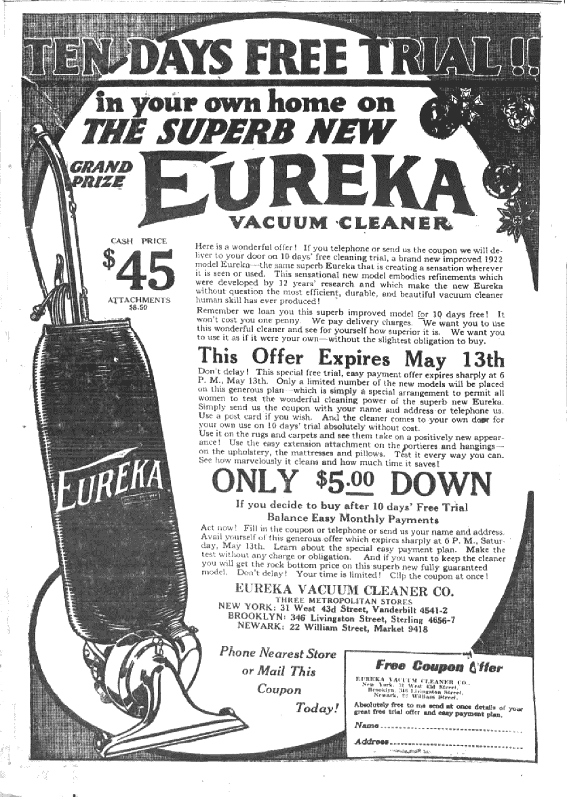

# 最糟糕的发明

> 原文：<https://medium.com/hackernoon/the-worst-invention-cc09e2626481>

[Photo credit](https://en.wikipedia.org/wiki/Eureka_(company))

你见过放松的人用吸尘器打扫吗？不存在这样的事情。吸尘器显然是人类有史以来最糟糕的发明之一，原因如下。

没必要。随着家庭变得越来越干净，我们变得越来越容易患现代疾病，如哮喘和过敏。你可能会说这可能与真空吸尘器没有直接联系，但在使用真空吸尘器的冲动和使用其他经常含有致癌和危险化学物质的清洁产品的冲动之间显然有联系。真空吸尘器不是在 19 世纪 60 年代之前发明的，直到 20 世纪初才真正流行起来。由于其他几个因素，我们对清洁的病态痴迷在这一时期开始流行。例如，大众媒体助长了这样一种错觉，即每个家庭都应该时刻保持干净整洁。你永远不知道，有一天一个名人可能会敲你的门，你不会想看起来邋遢，你会吗？有人可能会把真空吸尘器视为病态社会的症状之一。由于许多腐败的潜在机制，在这个社会中，人们把他们的时间和资源奉献给毫无意义的事情。我们对地位和权力的渴望，我们的虚荣心和我们对不被社会接受的恐惧使我们很容易被市场力量所欺骗。我们对混乱的恐惧和对有序的热爱，产生了过去吸尘器之外的其他暴行，比如法西斯政权和电梯音乐。

压力很大。无声吸尘器还没有被发明出来。即使是机器人也没有配套的恼人的声音方案。声音本身是有压力的，但是当你看到一个家庭主妇在生日聚会前打扫卫生，或者一个学生在考试前试图做其他事情而不是学习时，声音和视觉的结合是非常令人讨厌的。这几乎等同于在繁忙的一天试图走出宜家。很少有事情会像一个人沉迷于吸尘器的压力一样具有传染性。你可以感受到压力。顺便说一句，所有的吸尘器听起来都很糟糕。白噪音刚好超过建筑工地允许的水平。

缺乏标准。你有没有试过为吸尘器找一个合适的袋子？几乎不可能。更糟糕的是，不同的洲和不同的国家有不同的标准，所以如果你有一艘游艇或一个活动房屋，如果你打算出国，把你的吸尘器留在家里。有不同的管尺寸，不同的喷嘴和不同的部件。除了打印机墨盒和中央进纸辊，真空吸尘器是最糟糕的。

那么我们怎样才能摆脱这些邪恶的野兽呢？通过使用人类*有史以来最好的*发明，区块链。给自己买些比特币，等几年，变得非常富有，让别人帮你打扫卫生。谁先到谁就赢。走吧。

> [黑客中午](http://bit.ly/Hackernoon)是黑客如何开始他们的下午。我们是 [@AMI](http://bit.ly/atAMIatAMI) 家庭的一员。我们现在[接受投稿](http://bit.ly/hackernoonsubmission)，并乐意[讨论广告&赞助](mailto:partners@amipublications.com)机会。
> 
> 如果你喜欢这个故事，我们推荐你阅读我们的[最新科技故事](http://bit.ly/hackernoonlatestt)和[趋势科技故事](https://hackernoon.com/trending)。直到下一次，不要把世界的现实想当然！

