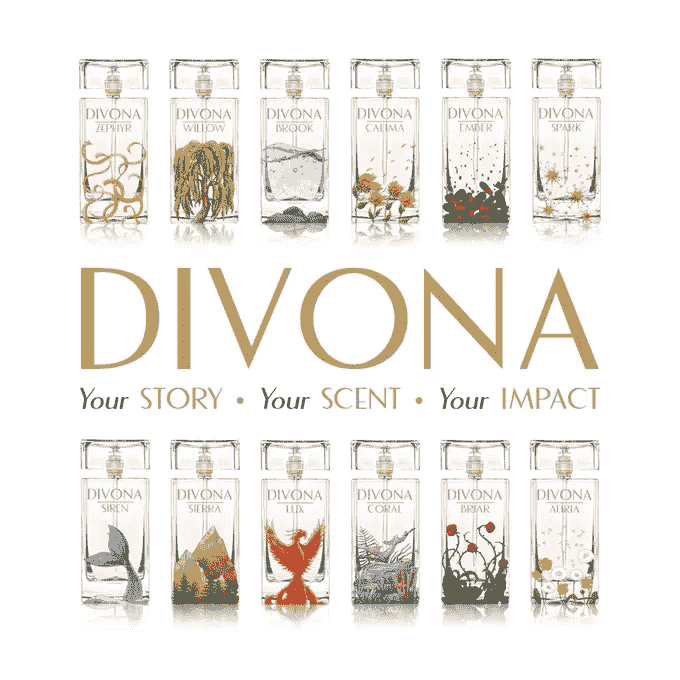
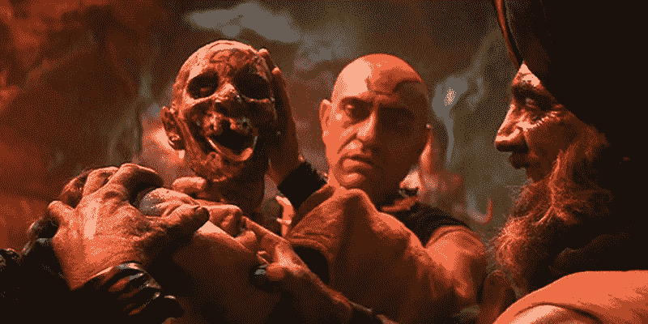
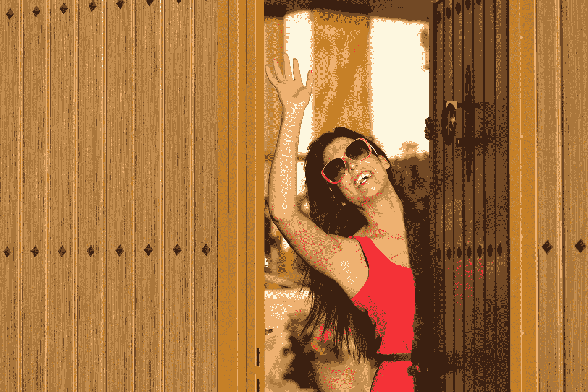

# 地球历史上最糟糕的登船比赛

> 原文：<https://medium.com/hackernoon/the-worst-onboarding-for-a-contest-in-earths-history-for-the-best-possible-cause-d5cc94b20eed>

当你在棒球比赛中使用厕所时，你甚至不能盯着你面前的墙，而不会有某种品牌比赛打你的脸。虽然这已经成为通过数字媒体渠道获得参与和线索的常见现象，但你仍然必须权衡一下，如果把你的手机扔在一小滩尿里，是否值得你赢得或不赢得两个免费的热狗和可乐。从好的方面来看，你刚刚一天收到 38 封邮件，内容是关于一堆与你的生活方式完全无关的产品和服务。

这些年来，用于营销和引导的竞赛已经发生了变化，以适应新的社交网络和人口变化，但吸引人的竞赛的关键因素没有变。

你让它变得简单、快速，成为消费者真正想要赢得的奖品，而不仅仅是你想要赠送的东西。

Divona 香水品牌模型背后有一个奇妙的方面。每次你购买他们的产品，他们都会拿出一部分来为经历困难时期的女性制作护理包。他们还与其他社会公益品牌合作，扩大对女性的影响和赋权。

> DIVONA 的联合创始人米琳·帕奎因说:“我对家庭暴力的亲身经历是创建 DIVONA 的最大动力，DIVONA 是一个香水系列，它不仅赋予你力量，也赋予了全球许多女性力量。”

我喜欢他们在这个产品背后所做的每一部分，因为它创造和培养了这个世界非常需要的“向前支付”的心态。

另一方面，这场竞赛就像有人强行把印第安纳琼斯和末日神殿里的卡莉玛的血灌到了整个营销团队的喉咙里。每个人都必须失去独立思考的自由意志，全押在一场有 9872398573 级台阶的竞赛中。

## 这是去蹩脚的康特斯维尔的七小时旅程的地图

在这庄严的一天，你跳上自行车，开始沿街叫卖。微风带来了恰到好处的凉爽，吹拂着你的头发，而你只是微笑着，像个傻瓜一样享受着大自然的馈赠。

你注意到在你右边有一个看起来很友好的女人在挥手示意你休息一下，并且很快地看看这扇门里面。“这里有免费的东西！”她说着，又向你做了几个手势。

这是懒惰的一天，你意识到看看这个女人谈论的所有“免费的东西”并没有什么坏处。另外，她看起来有很多朋友，人们可能会关心她要说的事情！

你一进门，她就开始告诉你她的创业想法，要制造闻起来像你刚刚在海滩上的香水。你提出整个事情听起来像是《宋飞正传》中的情节，但她忽略了你的担忧，并立即要求你支持她的想法，如果你想要里面的免费东西的话。

她大声说，“才一美元多！”

好吧，你有一美元，如果你能得到免费的东西，实际上不再是免费的，因为你为它们付费，这有什么坏处。

“或者更多！”她再次宣布。

“我会坚持一个。”你侧笑着回答。

她抓住你的手，把你带到一张桌子前，桌子上有一堆表格和一支笔。

“在给我钱之前，你需要注册！这样，我也可以把其他人的好主意发给你！”

一想到下半辈子再也不会有零收件箱，你会有点不安，但你会得到一些免费的香水，所以完全值得！这些表格很容易填写，然后你就可以交钱了。

这个女人开始自己笑，并指向更多的形式。

“你需要先添加你所有的信用卡信息傻！我不能像 1986 年那样从你手里拿走一张纸币！”

这时，你开始争论你花在填表上的时间是否真的值得隧道尽头的某种未知香味，它开始破坏你一天的计划。

你已经走了这么远，所以再走一步应该不会花太多时间。

“现在，我需要你把你刚刚填写的表格拍下来，并把它邮寄给我。这张表格已经过处理，信息很容易被其他人获取。”

"去你的女士"

## 该过程

如你所知，还有一个步骤也有要点，所以实际上有四个以上的步骤。还提到了关注和评论一个独立的 Instagram 帖子，这样她就知道你参加了。我猜这只是为了防止第一个 Kickstarter 表单失败，支付表单服务器被闪电击中，屏幕截图被破坏，她不小心把她的笔记本电脑和手机掉到了码头上，匹兹堡企鹅队赢得了斯坦利杯。

有道理。

整个竞赛旅程看起来像你个人试图解决 JFK 暗杀事件，同时在它的顶部绘制一个双螺旋结构。

知道你的观众和潜在的潜在客户时间对他们来说是有价值的，这并不困难。如果你不能在像赠品这样简单的事情上表明你对它的重视，你怎么能指望消费者发现呢？他们肯定不会再花一个小时浏览你的媒体频道，就像在某个该死的密室里一样。

品牌倡导者和品牌对手来的一样快，这从他们第一次接触你的内容开始。回报丰厚的简单经历会得到很多提及和分享，但为了一支免费铅笔而试图解决癌症也是如此。

> [黑客中午](http://bit.ly/Hackernoon)是黑客如何开始他们的下午。我们是 [@AMI](http://bit.ly/atAMIatAMI) 家庭的一员。我们现在[接受投稿](http://bit.ly/hackernoonsubmission)，并乐意[讨论广告&赞助](mailto:partners@amipublications.com)机会。
> 
> 如果你喜欢这个故事，我们推荐你阅读我们的[最新科技故事](http://bit.ly/hackernoonlatestt)和[趋势科技故事](https://hackernoon.com/trending)。直到下一次，不要把世界的现实想当然！

