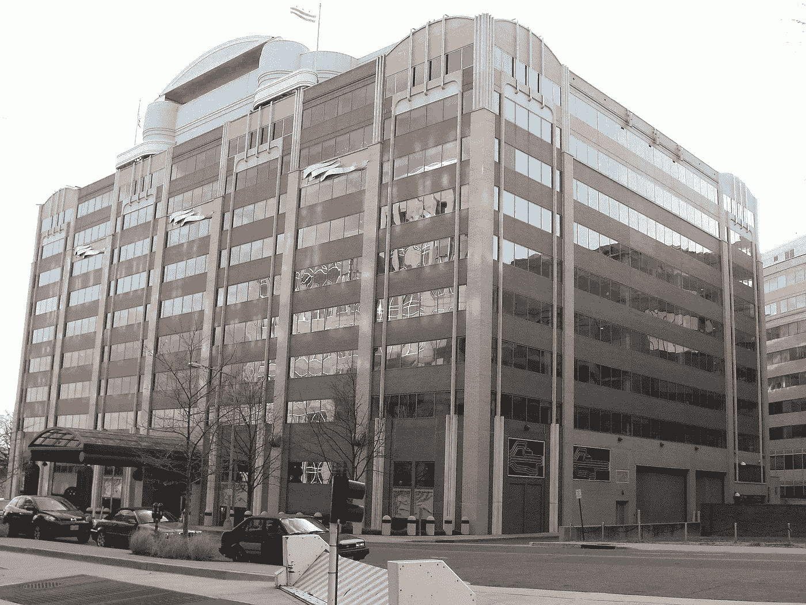

# 《华尔街日报》的“虚假”互联网隐私专栏

> 原文：<https://medium.com/hackernoon/the-wsjs-phony-internet-privacy-op-ed-5ab6b1d4ea52>

## 对华尔街日报“[虚假的互联网隐私恐慌](https://www.wsj.com/articles/the-phony-internet-privacy-panic-1491000504#livefyre-toggle-SB10763462972621734832704583054763922087712)”的回应

FCC HQ in Washington, DC by [Ser Amantio di Nicolao](https://commons.wikimedia.org/wiki/File:FCC_HQ.jpg)

3 月 31 日,《华尔街日报》发表了一篇[专栏文章](https://www.wsj.com/articles/the-phony-internet-privacy-panic-1491000504),声称要为关于 [S.J. Res. 34](https://www.congress.gov/bill/115th-congress/senate-joint-resolution/34/text) 的讨论“增加一些事实”,该决议撤销了奥巴马时代 FCC 对消费者[互联网](https://hackernoon.com/tagged/internet)隐私的保护。不幸的是,《华尔街日报》的事实调查任务被它自己的不准确从根本上破坏了。

# 客观地说,《华尔街日报》错在哪里

## 康卡斯特和谷歌不一样

> 联邦通信委员会抛弃了这种方法，颁布了一条[针对互联网服务提供商的]规则，奇怪的是，这条规则并不适用于像谷歌或亚马逊这样的公司
> 
> 推动这项规定的工作人员表示，有线电视公司应该受到审查，因为更换网站很容易，但更换互联网服务提供商却很难。现实正好相反:根据佐治亚理工学院去年的一篇论文，普通互联网用户通过六种设备连接，并在不同地点和网络间移动。但是，无论是在家用笔记本电脑上还是在工作中使用 iPhone，你会使用哪个搜索引擎呢？可能是谷歌。

这显然是不准确的。“机组推规则”是对的。让我们来看看消费者在搜索引擎和互联网服务提供商(ISP)上行使选择权所需的步骤:

*在你的 iPhone 上切换到 Bing 搜索*

1.  启动设置应用程序
2.  在搜索栏中键入“搜索引擎”
3.  轻按“Safari 搜索引擎”
4.  点击“必应”

这很简单。作为一名消费者，如果我对谷歌的服务不满意，我可以很容易地行使我的选择。如果我担心的话，iOS 甚至会让我切换到一个以隐私为导向的搜索引擎。

现在让我们说，我担心威瑞森的数据收集做法，我想行使我的消费者选择，并转向像康卡斯特这样的竞争对手。

1.  查看我的家是否由多个 ISP 提供服务。如果没有，就搬新家。
2.  试着取消我在威瑞森网站上的服务，在康卡斯特网站上注册。支付提前终止威瑞森的任何额外费用以及康卡斯特的设置费用。(感谢[爱德华多·f·奥尔蒂斯](https://medium.com/u/671cde860113?source=post_page-----5ab6b1d4ea52--------------------------------)提醒我费用的事情。)
3.  如果网站不工作(这是很常见的事)，打电话给客户服务，通过电话树和漫长的等待时间。当你在打电话的时候，你要从那些被激励着试图说服你不要换电话的客服代表面前杀出一条血路。
4.  开车去商店取或放 ISP 电缆设备，然后自己安装(如果你知道怎么做)，或者预约安装。(有趣的是，安装预约很少准时进行。)
5.  如果路由器不允许您选择 WiFi 网络名称和 ID，请重置家中每台设备的 WiFi 连接。

这两个程序根本不一样。

的确，一个普通用户可能会在家里、工作中以及旅行中与许多不同的 ISP 打交道。但是谁行使过消费者的选择权，根据公司使用的 ISP 来选择他们的工作呢？你最后一次选择一家咖啡店而不是另一家咖啡店来使用一家你对其隐私政策更放心的 ISP 是什么时候？认为使用多种设备可以提供有意义的消费者选择是完全错误的。

华尔街日报还指出，“互联网用户平均通过六种设备连接”。这不能提供一定程度的隐私。互联网服务提供商可以将数据出售给第三方整合商，第三方整合商通过将数据流整合在一起，创建一张用户在多种设备上的图片，从而为广告商提供价值。这对他们来说并不难。

因此，不，这一规则适用于互联网服务提供商并不“奇怪”，因为互联网服务提供商通常是区域性垄断企业，消费者转换成本很高，而不适用于谷歌或亚马逊这样的互联网公司，它们不是垄断企业，消费者转换成本低得多。总的来说,《华尔街日报》编辑部正确地赞扬了自由市场和竞争刺激创新和保护消费者利益的力量。如果他们感到困惑，没有意识到 ISP 看起来更像公用事业公司，而不是互联网公司，那么他们犯这个错误是可以理解的。但是，只有一家基本上不受消费者选择影响的公司才能看到其[净收入增长 150%，股价上涨 50%，尽管其消费者满意度下降了 3%，仍然是全国最低的公司之一](https://web.archive.org/web/20101127010803/http://www.theacsi.org/index.php?option=com_content&task=view&id=169&Itemid=168)。

当你明白互联网公司比互联网服务提供商更容易受到自由市场力量的影响时，你就不会惊讶于谷歌和必应为消费者提供了非常完美的体验，而威瑞森和康卡斯特提供的网站却很糟糕，呼叫中心的等待时间似乎没完没了。

## 加密不是万能的

> 加密和其他技术将很快保护 70%的互联网免受服务提供商的攻击。

这是误导。(而这 70%的数字是从哪里来的呢？“互联网的”是什么意思？70%的网站？70%的流量？70%的在线时间都在使用加密技术？)

《华尔街日报》推测加密的意思是 [HTTPS](https://en.wikipedia.org/wiki/HTTPS) ，它确实保护了网络服务提供商的信息内容。*但这并不能保护交通的目的地。*想象一个名叫山姆的康卡斯特客户患有艾滋病，并在 ihaveaids.com**进行研究**。康卡斯特知道山姆访问了那个网站，但不知道他们在那里做什么。然后，康卡斯特可以将山姆的浏览历史卖给一家广告公司，后者可以从他们在该网站上的表现推断出他们可能对 Ziagen 的广告感兴趣。当他们下一次在工作中打开 CNN 时，广告网络为他们提供了一个艾滋病毒药物的广告，他们可能会在他们的同事面前暴露。如果你觉得这种情况很糟糕，那么《华尔街日报》的“加密”并不能取代保护消费者的监管。

HTTPS 甚至不完全保护互联网流量的内容。对于一个网站来说，使用 HTTPS 和古老的加密算法是可能的，这种算法早已失效，只是名义上提供加密。或者，一个站点可以混合使用加密和非加密内容，这可能会危及整个站点，因为非加密内容可以窥探加密内容。这些破了的案子算不算在未标注的“70%”数字里？

如果消费者想保护内容*和*的目的地不被 ISP 发现，他们可以使用 [VPN](https://en.wikipedia.org/wiki/Virtual_private_network) 。这需要额外的费用，并且远远超出了大多数用户的技术能力。此外，尽管它可以防范 ISP，但它需要信任一组新的组，而这些组可能不再值得信任。

# 《华尔街日报》主观上错在哪里

## 人们不信任康卡斯特是有原因的

> 这证明了康卡斯特和其他虚构的恶棍的想法是错误的

“虚构的恶棍”是一个主观的术语，但要添加一点额外的背景:康卡斯特十多年来一直因对消费者不好而产生问题。问题范围广泛，从 2004 年发现康卡斯特在所有组织或政府机构中拥有[最低的美国客户满意度指数](https://web.archive.org/web/20090312061951/http://www.theacsi.org/index.php?option=com_content&task=view&id=86&Itemid=90) (ASCI)得分，到 2007 年[意外播放色情](https://web.archive.org/web/20080520232418/http://cbs5.com/watercooler/New.Jersey.Disney.2.283039.html)而不是迪士尼频道的事件，到 2015 年当他们试图取消服务时将客户的名字改为“[混蛋布朗](http://www.huffingtonpost.com/2015/01/29/comcast-asshole-brown_n_6568238.html)”的实例。以免你认为 2004 年美国客户满意度指数的调查结果是一个异常值:康卡斯特和互联网服务提供商行业的其他公司的糟糕分数从那时起就一直在垫底。

令人震惊的是，ASCI [在 2004 年发现](https://web.archive.org/web/20090312061951/http://www.theacsi.org/index.php?option=com_content&task=view&id=86&Itemid=90)“几乎一半的有线电视用户都有这样或那样的投诉”。

消费者对康卡斯特和其他互联网服务提供商的信任度非常低，这就是为什么人们不愿意给他们更多的自由来使用他们的数据。《华尔街日报》不承认康卡斯特在这里的历史是一种误导。华尔街日报抨击国税局，称其一有机会就针对保守派政治团体。2004 年，康卡斯特在 ASCI 上的得分比 IRS 低，而 ISP 行业的其他公司也只是稍微好一点。华尔街日报至少应该对那些警惕互联网服务提供商的人有些同情。

## 互联网隐私不仅仅是关于熊猫

> …像谷歌或亚马逊这样的公司，其商业模式包括利用大规模数据收集赚钱——你看什么熊猫视频或你买什么园艺工具。

虽然这种描述对反对隐私保护法规的人来说很方便，但这是一种模糊的在线描述隐私问题的方式。是的，互联网活动的某些部分是琐碎的，对没有隐私的消费者造成不良后果的风险有限。但人们也使用互联网进行比“熊猫视频”更敏感的活动，如银行业务、研究医疗问题和寻找约会。目标试图确定你是否怀孕，脸书[帮助探测未出柜的男同性恋](http://americablog.com/2013/03/facebook-might-know-youre-gay-before-you-do.html)，并给他们出柜的建议。这些隐私问题不成比例地影响着社会中的边缘人群，但即使是那些“没什么可隐瞒的”人也有理由感到担忧。正如科利·多克托罗[写的](https://www.theguardian.com/technology/blog/2013/jun/14/nsa-prism)，“我知道你在厕所里做什么，但这并不意味着当你走进厕所时不想关门。”

# 《华尔街日报》做对了什么

尽管《华尔街日报》增加事实使命的主旨在客观上是错误的，但我应该承认他们有一点是对的:

> [最高法院第 34 号决议]的结果将是。。。现状。

该法案废除的法规从未生效，因为它们发生在奥巴马政府后期。取消这些规定所导致的消费者隐私的减少是微不足道的；对 ISP 的消费者隐私保护一直很少。更广泛地说，如果你非常担心隐私，整个数字世界就是一个可怕的地方。大多数人都在不断地与数字系统互动，他们的行为被记录、分析，并以他们通常不理解的方式货币化。

所以，不，这不是一个“天要塌下来”的时刻，尽管它提高了人们对互联网隐私问题的认识是件好事。

# 结论

如果您对 ISP 出售您的浏览历史和行为感到不安，您应该联系您选出的代表，让他们知道您对 S.J. Res. 34 的看法。现已死亡的 FCC 规则正在解决一个真正的问题，但废除这些规则并没有产生新的问题，而是取消了一个旧问题的解决方案。

我喜欢几乎每天阅读《华尔街日报》的社论版，了解他们对理性保守主义的看法。“虚假的互联网隐私恐慌”是我所期待的质量水平的一个例外，所以我想知道编辑委员会是否只是从他们咨询技术话题的人那里收到了不好的信息。如果《华尔街日报》的任何人正在阅读这篇文章:如果你想了解某个技术层面的问题，我很乐意提供准确的技术信息。有兴趣的话就发 [@nickheiner](https://twitter.com/nickheiner) 给我 DM。

> [黑客中午](http://bit.ly/Hackernoon)是黑客如何开始他们的下午。我们是 [@AMI](http://bit.ly/atAMIatAMI) 家庭的一员。我们现在[接受投稿](http://bit.ly/hackernoonsubmission)并乐意[讨论广告&赞助](mailto:partners@amipublications.com)机会。
> 
> 如果你喜欢这个故事，我们推荐你阅读我们的[最新科技故事](http://bit.ly/hackernoonlatestt)和[趋势科技故事](https://hackernoon.com/trending)。直到下一次，不要把世界的现实想当然！

