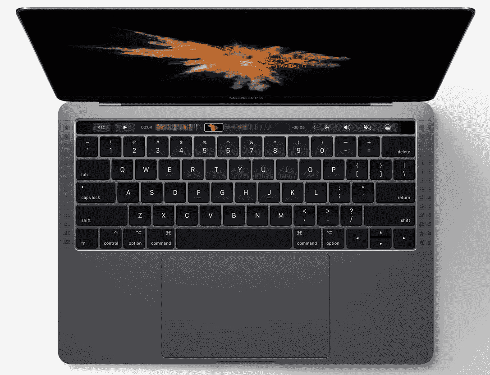
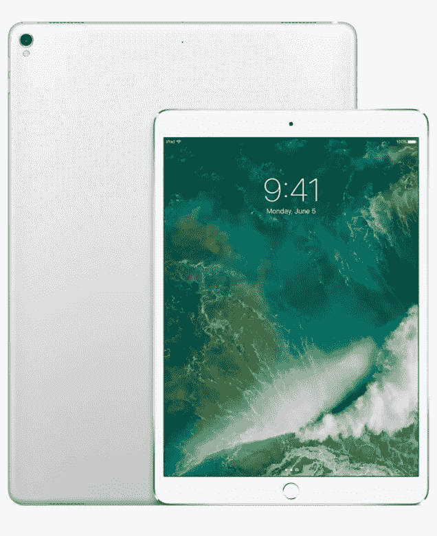
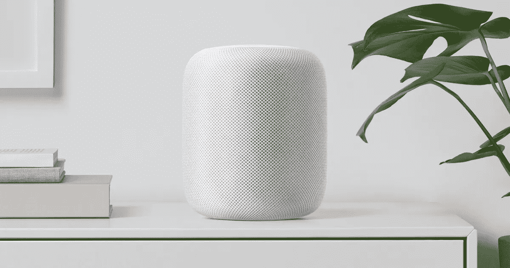

# WWDC 2017 主题年谱

> 原文：<https://medium.com/hackernoon/the-wwdc-2017-keynote-chronicles-da3aad5d70aa>

Photo by [Harris Vo](https://unsplash.com/@hoanvokim?utm_source=medium&utm_medium=referral) on [Unsplash](https://unsplash.com?utm_source=medium&utm_medium=referral)

没有从一开始就给出太多，WWDC 2017 的主题似乎是围绕迟到。是的，从一个时髦的迟到的主题演讲开始，迟到的与会者自己有时看起来非常困惑，不知道他们是否应该坐着，站着，对着镜头挥手或做鬼脸，到几乎所有宣布的事情，我们要么希望去年得到，要么希望几年前就有。但是这里面有积极的一面。这意味着——最后——苹果确实实现了我们的许多希望和期望，也许——仅仅是也许——也有一点创新，尽管这取决于你对创新的标准。

虽然开场视频试图以真正的 WWDC 方式强调苹果开发者的重要性，这是真的，但不要误会我的意思；对我来说，这更符合我对技术和互联网依赖的最新观点。看到世界陷入绝对的恐慌和混乱，处于世界末日的状态，凸显了一个我越来越担心的问题:互联网的崩溃。作为一个在大大小小的计算机网络方面受过专业训练的人，我知道互联网是多么年轻，它是多么不稳定。冗余并不总是必然的，公平地说，你能创造的冗余只有这么多，来让像互联网这样的野兽保持快乐。看到我的想法以一个精心设计和剪辑的视频的形式出现，有点令人不寒而栗，尤其是在当前的政治和经济气候下。但是不要介意我。只是在咆哮…

为了表扬开发人员，Tim——我认为他还是和前两三年一样是个乏味的演讲者——介绍了最年轻和最年长的开发人员，年龄分别为 10 岁和 82 岁。嗯，我想这很好，虽然我不认为这很特别。积极的人在不同的年龄也做过其他的事情。这只是表明趋势依然存在:有创造力的人在任何年龄都会如此，苹果对此几乎无能为力。

# tvOS

这里还没有发生太多的事情，未来会发生什么还不完全清楚，但肯定有两条好消息:

*   这个电视应用程序现在有超过 50 个合作内容提供商，而且这个数字还在不断增长。
*   此外，大家过去几年一直在等待的东西——亚马逊 Prime Video——终于要在今年的某个时候出现了。我从来不明白到底是什么原因造成了这种停滞，但我相当肯定这是政治原因。血腥的政治扼杀创新，破坏用户体验…

# watchOS 4

好吧，我在这里会有偏见。从最初的 Apple Watch 发布的那一刻起，我就从来没有喜欢或欣赏过那个…东西，所以我在这里听起来不为所动。

当然，它可以做很多事情。一个最多能持续两个(两个！！！)天。Pebble、FitBit 和三星都在某个时间点打破了这一纪录。所以事不宜迟，你会得到同样的蹩脚手表，但现在有了 watchOS 4。你知道，相比于 3。

*   它现在有三个新的表盘:Siri、万花筒(转移你对糟糕电池寿命的注意力)和玩具总动员——因为这些被认为是手表上非常重要的卡通人物。
*   在活动方面，随着一些实际上有意义的改进，情况有所好转。例如，我很高兴看到 HIIT(高间隔训练)被引进。虽然我讨厌健身房，但新的健身房同步功能对所有健身房的猴子也很有用，他们最终会获得一些更准确和汇总的数据。当然，他们之后还是会去汉堡王，但那是以后的事了。
*   核心蓝牙和重新设计的音乐应用程序是我所说的“meh”。不知道。在这一点上，[博拉琪 Dash Pro](https://www.bragi.com/thedashpro/) 听起来比 Apple Watch 有趣得多，所以我将把它留在那里。

P.S .恐怖和难以置信的强迫演示。假孩子和假父母的假笑话真的需要停止了…

# 马科斯(高)山脉

据 Tim 称，苹果正在完善 Sierra。从那以后，我得到的更像是*“看，我们知道 Sierra 并没有那么好，我们发布了大量错误代码(记得电池和 USB 耳机的问题)，所以我们现在要更加努力一点。”*

是的，Sierra 还可以，但不太好，为此苹果决定将下一个版本命名为*“High Sierra”*，因为这将让我充满信心……根据新名称，我可能会认为错误代码可以用*来原谅。“当我们按下释放按钮时，我们很兴奋，它在名称中说，这实际上是一个免责声明，伙计……”*。

话虽如此，还是有几个有趣的点值得一提:

*   Safari 承诺现在比装有 ES6 的 Chrome 快 80%。我不得不说，这是一个大胆的承诺，因为 Chrome 相当快，而且我每天都在写 ES6。希望这是真的。
*   Safari 自带视频自动播放阻止功能，这是一个很棒的功能，因为很多网站都有自动播放视频的可怕倾向。我在开会，你们这些笨蛋！啊啊啊。
*   浏览时的跟踪也将被阻止/阻止。所以下次你(为你的朋友)买性玩具时，广告不会出现在你之后浏览的任何地方。
*   APFS 文件系统。看，除了像本地加密和 64 位这样的技术术语，你需要知道的就是它的安全性和速度。以前需要 5 秒钟才能复制的内容，现在只需要不到一秒钟。这是令人印象深刻的，我会说！
*   Metal 2——与上一代 Metal 相比难以置信的原创名称，现在将比 OpenGL 快 100 倍。是的，金属是关于图形性能，如果你不熟悉的话。这允许更好的 4K，VR 和外部 GPU 支持。

# iMac

我从未拥有过 iMac，但毫无疑问，它们是性感的台式电脑。随着 4K 和 5K 屏幕的加入，它们变得更加性感，但对我来说，它们从来没有感觉到——或者足够强大(我真的讨厌融合驱动器的想法)，或者足够便携以拥有一个(它们太重了！).

但是今天苹果终于设法至少让我真正感兴趣了。除了对现有生产线进行技术升级之外:

*   速度更快的 Kaby Lake CPU、高达 64GB 的 RAM、标准的 Fusion Drive、速度快 50%的 SSD 和两个支持 USB-C 雷电 3 的端口，所有 4K 版本都有独立显卡，入门级型号比上一版本快 80%

iMac pro hardware architecture mockup

他们推出了 Mac 从未有过的东西——绝对的动力，他们称之为 iMac Pro。虽然不是一个非常原始的名字，这似乎暗示着 Mac 本身已经一劳永逸地死去，但 iMac Pro 是一台令人印象深刻的机器:

*   8 到 18 核英特尔至强 CPU
*   镭龙·维加显卡，配有高达 16GB 的 VRAM (11 到 22 万亿次浮点运算，不过 22 万亿次是半精确计算)
*   高达 128 GB 的内存

所有这一切，都以比原来的 MAC 低得多的价格和 PC 的价格竞争。这对苹果来说是新的！将于 2017 年 12 月上市，正好赶上假日消费节。

# MacBook(Air/Pro)

所有三个都得到了微小但必要的升级。不幸的是，Air 只更新了一次 CPU。然而，这次升级意味着我将更有信心购买 13 英寸的触摸杆型号。

Just small internal updates on the MacBook Pro

MacBook 和 MacBook Pro 现在都拥有更高的时钟 Kaby Lake 处理器，而 13 英寸的版本更便宜(取代了 2016 年之前的系列)，只有 128GB 的固态硬盘，而 15 英寸的则有一些图形更新。今天全部发货。

# iOS 11

iOS 可能会成为明天的头条新闻。与虚假的版本 10 相比，版本 11 感觉更像是一次升级。当然，Tim 不可能在不提及 Android 的情况下让主题演讲通过。他做到了。关注其可怕的碎片和在全球范围内采用新版本的结果。嗯，是的，当然，但是 Android 必须运行在 12 美元的印度或中国手机上。它必须迎合几乎任何设备，每个人都知道和理解这一点。iOS 基本上只在高端手机上运行，而且数量很少。当然，在一个既生产软件又生产硬件的封闭生态系统中，新软件的采用率会高得多。蒂姆，你在这里和开发商说话…

无论如何。iOS 11 是我所说的专注于重要事情的适当更新，而不是表情符号和其他不重要的、幼稚的废话。

*   设备之间的 iMessage 同步。你在一台设备上做的任何事情，都会在其他设备上发生。当你清楚地记得那些短信已经在你的手机上被删除的时候，你的妻子就不会再在 ipad 上看到情妇发来的短信了！
*   通过 ApplePay 和 iMessage 的苹果个人对个人支付。我必须承认，这是一个绝妙的主意。
*   Siri 语音现在更像人类了，能够检测上下文并进行翻译。下次我在西班牙的时候一定会用到它。我本来打算在 Duolingo 上花些时间，但我可能会带着 Siri 去兜风。
*   在保持质量不变的情况下，视频和照片压缩率提高了两倍。考虑到我们通过抓拍和记录“记忆”所使用的“记忆”量，这真是太棒了。不错的双关语，是吧？；)
*   随着长时间曝光、循环和弹跳等功能的增加，现场照片变得更加有用。您现在还可以选择什么是主/最佳框架。
*   地图获得平面图功能，商场和机场平面图将及时添加。如果你去过希思罗机场、慕尼黑机场或史基浦机场，这又是一个非常有用的功能。
*   驾驶时的免打扰功能。这将停止所有通知并保持您的屏幕关闭。
*   HomeKit 通过 airplay 2 获得多房间扬声器支持。
*   app 开发者分阶段发布，基本上是批量发布给一部分用户。开发人员还可以访问视觉 API 和神经语言 API。
*   ARkit，这是一个面向增强现实创作者的完整工具集。我看到这在教育、游戏甚至桌面游戏领域变得非常流行。

# iPad Pro

这个让我非常兴奋。我正要从我的 iPad mini 4 过渡，现在我有一个额外的理由这样做。一个额外的 20%的原因实际上是因为 9.7 英寸“现在是 10.5 英寸”，这意味着在同样轻薄的包装中有更多的屏幕空间。这个 HDR 屏幕也非常亮，亮度提高了 50%，刷新率为 120Hz。这可能是我今年看到的为数不多的创新之一，或者至少它肯定为竞争对手树立了一个新标准。如果这还不够令人印象深刻的话，这个刷新率是动态的，并且基于你正在看的内容的类型。这使得电池寿命保持在 12 小时，尽管屏幕的尺寸、亮度和刷新率更高。

The new 10.5" iPad Pro

摄像头和 iPhone 7 中的一样。没什么值得大书特书的，但至少他们也升级了。pencil 现在也拥有 20 毫秒的延迟，这是一个改进。入门级存储也提升到了 64GB。所有这些都很容易买到，价格比我预期的要低得多。

但 iPad (Pro)也有一些软件更新:应用程序 dock(类似于 macOS 上的应用程序)，拖放功能，令人惊讶的是……一个文件应用程序，可以让你像在 Mac 上一样浏览文件。我没想到会发生这种事。鉴于硬件和软件的所有更新，iPad Pro 开始真正看起来像 MacBook 或 MacBook Air 的竞争者。我们现在需要的只是一个终端，我们这些开发者是快乐的营员！

# homePod

这最后一个有点奇怪，它确实是苹果有时会迟到的一个很好的例子。虽然亚马逊 Echo 已经有了许多迭代和变化，但苹果直到现在才决定推出一款智能扬声器。虽然我不一定说它是创新的，但它肯定与市场上的产品不相上下，如果你不是完全吝啬，并且至少有一点喜欢苹果，你会得到一台，因为:

*   它有 7 个高音和中频高音扬声器，6 个麦克风来听 Siri 命令。说话者会忽略周围的所有其他声音或信息。它只监听 Siri 命令。发送到苹果服务器的数据是匿名的，只包含你实际的命令或问题。
*   一个基于音频演示的大低音扬声器相当不错，类似于 Bose 或 Sonos 的声音，但声音是空间感知的，这意味着你应该获得更好、更身临其境的听觉体验。
*   它使用 iPhone 中使用的 A8 芯片。
*   你可以把两个 homePods 链接在一起。
*   它可以通过 HomeKit 和 Siri 充当家庭助手。它可以处理某些主题，很像 Alexa 的技能。

它将于今年晚些时候上市，售价 349 美元。如果你问我，那是一个相当不错的价格。我已经为我的 Bose 设备支付了类似的费用，虽然它们工作得很好，但更好的苹果生态系统集成将是可取的。homePods 将提供预期的音质。

# 最后的想法

这是一个很好的 WWDC 主题演讲。当然，演示是被迫的，一切都开始得很晚，一些更新感觉像是我们去年就应该得到的，但至少它挤满了真正的更新，其中许多对我们大多数人都很重要，开发者和消费者都一样。

鉴于今年的 WWDC 主题演讲如此多事，我几乎担心 10 月份他们还能向我们展示什么，除了*“又一部看起来与去年略有不同的 iPhone”。我已经知道今年我会从苹果公司得到什么:新的 iPad Pro，新的 MacBook Pro，也许还有 homePod。你呢？*

> [黑客中午](http://bit.ly/Hackernoon)是黑客如何开始他们的下午。我们是 [@AMI](http://bit.ly/atAMIatAMI) 家庭的一员。我们现在[接受投稿](http://bit.ly/hackernoonsubmission)，并乐意[讨论广告&赞助](mailto:partners@amipublications.com)机会。
> 
> 如果你喜欢这个故事，我们推荐你阅读我们的[最新科技故事](http://bit.ly/hackernoonlatestt)和[趋势科技故事](https://hackernoon.com/trending)。直到下一次，不要把世界的现实想当然！

