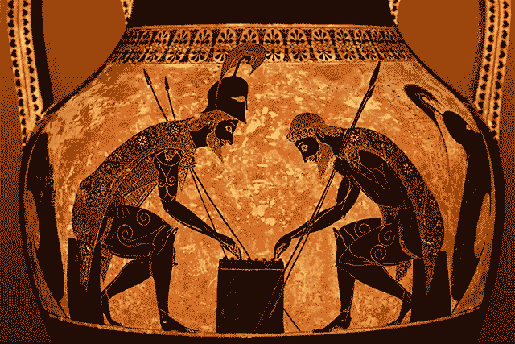

# 你不想要的 XHR 历史课

> 原文：<https://medium.com/hackernoon/the-xhr-history-lesson-you-never-wanted-2c892678f78d>

尽管 JavaScript 本质上是一种单线程语言，但它最大的优势之一是能够发出异步请求——AJAX。



The Greek hero **Ajax** was good friends with **Achilles** during the Trojan War until **Odysseus** made a request for Achilles’ armor

以 Instagram 或 Pinterest 这样的应用为例。为什么我可以不停地滚动页面，而不需要重新加载页面，并且继续显示内容呢？幕后发生的事情是，这个对服务器的异步请求最终不会打扰用户？大约在 2005 年(【AJAX 一词被创造出来)，这是一场相当具有革命性的变革。从那以后，新技术建立在旧技术的基础上，以创造更有用、更快的网络。

# 但是我们是怎么到达那里的呢？进入 XHR

在 Chrome 或其他浏览器上，如果你要查看任何一个页面，你可以直接进入“网络”标签，然后注意到一个名为“XHR”的子标签。在这个选项卡中，您可以看到请求的状态、请求需要多长时间等等。事实上，当你在如上所述的页面( [Instagram](http://instagram.com) 或 [Pinterest](http://pinterest.com) )上使用这个选项卡时，它会变得更加有趣，因为你可以看到 AJAX 在工作，每次页面点击底部并向服务器发送另一个请求。

但是这一切是怎么开始的呢？

XHR 是 XMLHTTP 请求的简称。虽然是由微软的 Outlook Web Access 开发的，但这种请求的一些最早实例是在你的 Gmail 收件箱中使用的。不用刷新页面就能看到收件箱的更新，这是一个革命性的变化。它的工作方式是每隔 20-30 秒，发送一个新的请求来查看你是否有新邮件。

你到底该怎么写这个请求:

```
var XHR = new XMLHttpRequest();XHR.onreadystatechange = function() {
  if(XHR.readyState == 4) {
    if(XHR.status == 200) {
      console.log(XHR.responseText);
    } else {
      console.log("Error!");
    }
  }
}XHR.open("GET", "url");
XHR.send();
```

上面的代码很难理解，但是请记住，这是在更新、更快的方法建立在请求之上之前。

这个请求的有趣之处在于，虽然 XML 是用全大写字母写的，但 HTTP 不是——可能只是为了让您迷惑。这段代码的另一个不熟悉的部分是第 3 行:readyState 是什么，为什么它应该等于 4？就绪状态是一个属性，给它加标签 4 是一种发信号通知[获取操作完成](https://developer.mozilla.org/en-US/docs/Web/API/XMLHttpRequest/readyState)的方式。

# 取得


提出请求可以有很多种方式。这是计算机相互交流的标准方式。因此，最终构建上面的庞大代码是正确的。[获取](https://developer.mozilla.org/en-US/docs/Web/API/Fetch_API)数据是以一种更加简洁的方式完成的(见下文),使用的承诺可以被链接起来，变得更加复杂。

```
fetch(url)
  .then(function(res){
    console.log(res);
  })
  .catch(function(error){
    console.log(error);
  });
});
```

Fetch 请求的酷之处在于，它提供了可以包含的选项，这些选项在 XHR 主持节目时是不可能的。观察下面，相同的获取请求，只是现在增加了一个包含 POST 请求的对象，与我们目前看到的默认 GET 相反。

```
fetch(url, {
      method: 'POST',
      body: JSON.stringify({
         username: 'Ajax_Hero_123',
         password: 'iwantarmor',
    })
  })
  .then(function(res){
    console.log(res);
  })
  .catch(function(error){
    console.log(error);
  });
});
```

Fetch 最大的缺点是浏览器兼容性，尤其是与 Internet Explorer 的兼容性。但主要的收获是，它使 XHR 更平滑、更简洁，并允许更多的选择。像网络的许多其他部分一样，这是一个完美的例子，说明这些技术不是在真空中产生的，而是相互结合的。这就把我们带到了旅程的下一部分。

# 美元符号和其他第三方

如果你听说过 JavaScript，那么很有可能你遇到过 [jQuery](https://jquery.com/) ，这是有史以来最流行的第三方库。虽然用普通的 JavaScript 可以做任何事情，但是 jQuery 创建[更简洁代码的能力是巨大的](http://youmightnotneedjquery.com/)，尤其是在发出 AJAX 请求时。

还记得最上面的那一大块代码吗？在那里，我们做了一个包含多行代码的 XML HTTP 请求，一个检查我们处于什么 readyState 的 if 语句，一个确保我们获得 200 状态的 if 语句，对我们接收到的 JSON 数据的解析，以及一个最终确保代码做它应该做的事情的点 send。

下面是用 jQuery 完成的相同代码:

```
$.getJSON('/my/url', function(data) {});
```

我认为这是一个进步。

如果您不熟悉 jQuery，也请注意，任何美元符号的实例都可以替换 jQuery 这个词。我的印象是，时间就是金钱，从编写大量代码中节省下来的时间会让你在其他方面浪费时间，因此有了美元符号。

jQuery 是一个非常棒的库，原因有很多，包括发出 AJAX 请求。它创建于 2006 年，并从此腾飞。但是，如果您只想对这些请求使用 jQuery，而不想做其他事情，该怎么办呢？为此，有其他第三方库，如 [Axios](https://github.com/axios/axios) ，其主要焦点是发出请求，而不是其他。所以，如果你不需要 jQuery 来制作淡入动画，你的代码会感谢你使用了更轻量级的东西。

以下是 Axios 在实践中的样子:

```
axios.get(url)
.then(function(res){
  console.log(res.data);
})
.catch(function(error){
  console.log(error);
})
```


Ajax’s untimely end came when he threw himself on his own sword

Axios 的特点是能够从 Node.js 发出 HTTP 请求。它还自动解析 JSON 数据，因此不需要在 promise 中包含一行额外的代码。

总结一下，看到网络在十年多一点的时间里走了多远真是令人惊讶。这四种发出请求的方式都只是 XML HTTP 请求，正如您可以在开发人员工具中看到的那样，但是具有更多的功能(比如流，这是 2005 年最初的 XHR 中所没有的)，并且只会随着更酷的库而变得更好。

📚*感谢阅读，如果你喜欢这篇文章，请关注我*📚