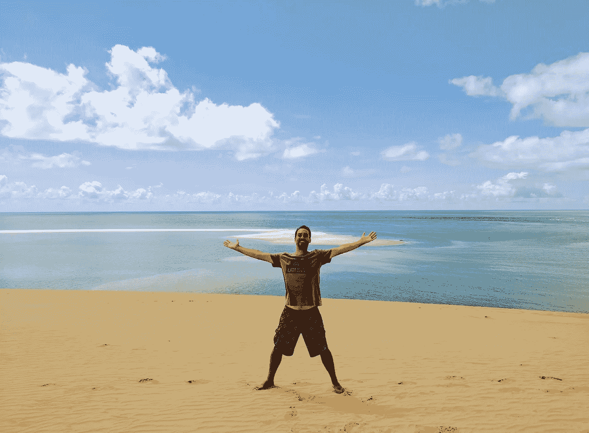
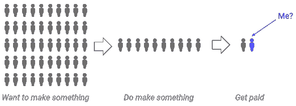
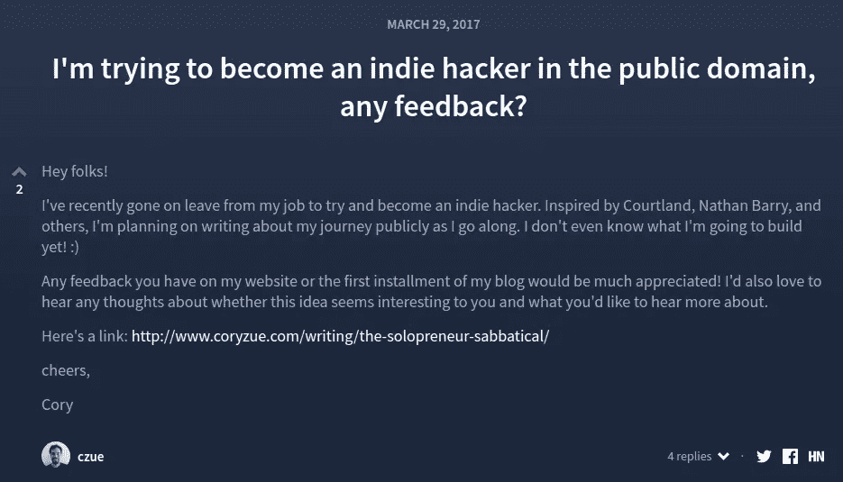
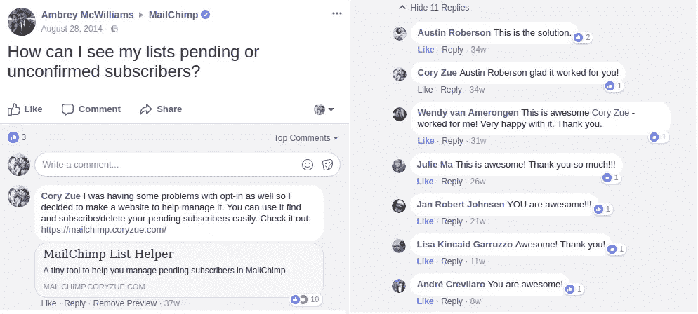
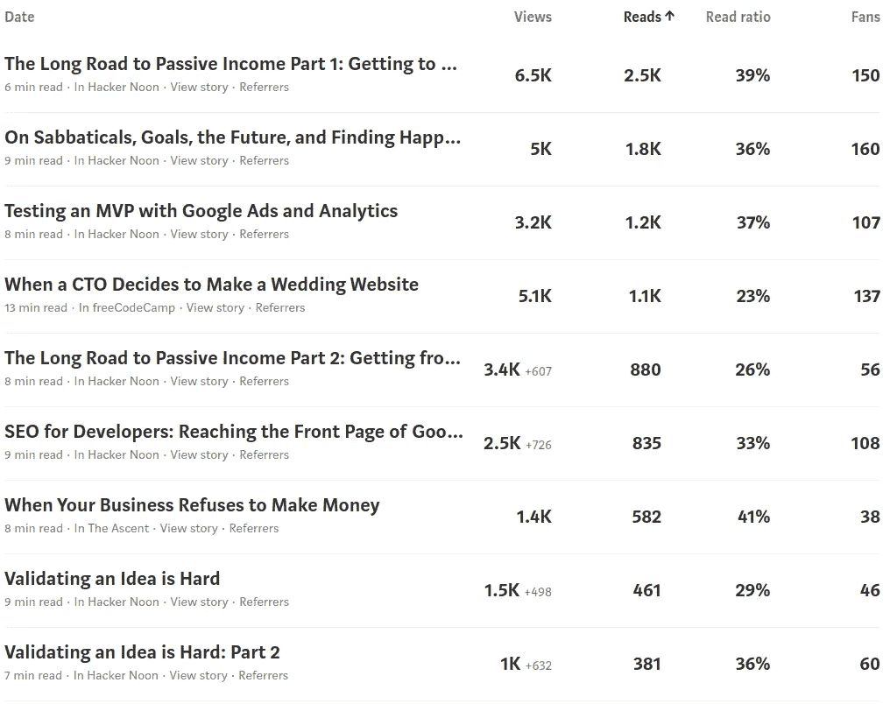
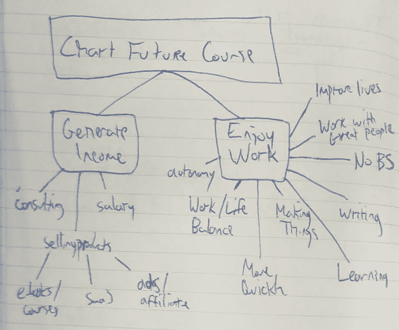
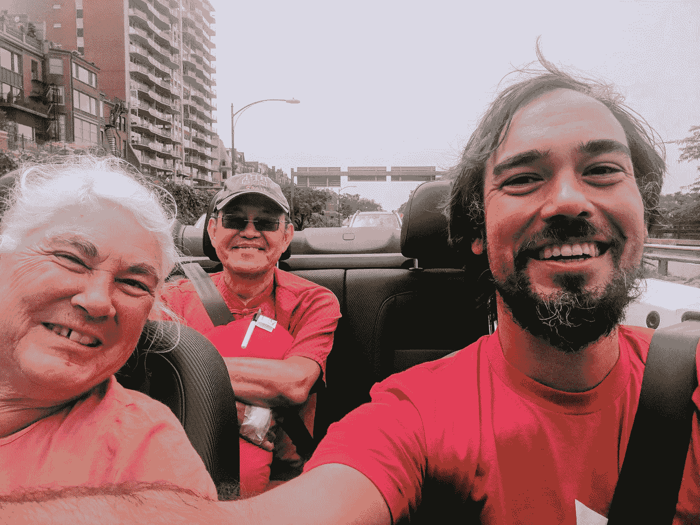
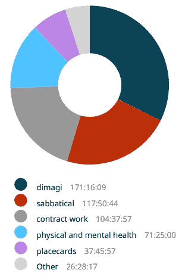
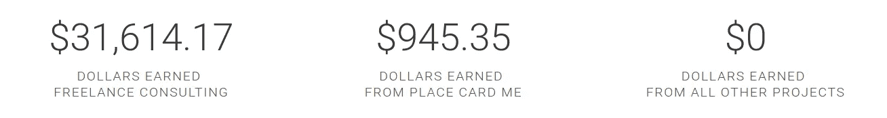

# 这一年一切都变了

> 原文：<https://medium.com/hackernoon/the-year-everything-changed-3e13008fbef9>

## 一次慢下来，有目标，反思，寻找幸福的旅程

One hobby I developed in 2017 was taking pictures of myself looking out over grand vistas to incorporate into my blog.
Drakensberg, South Africa, September, 2017.

> “你知道，当我回顾我的人生故事时，我想知道 2017 年是否会成为一切都改变的一年。”
> —我给我妻子，2017 年 12 月 26 日

感觉重要的事情很有趣。

2015 年我搬到了非洲。2016 年我结婚了。你可能会认为这些将会是重大的、变革性的经历，但我非常确定，在我的人生故事中，2017 年将远远超过它们。

为什么？

我可以最简洁地说，虽然到目前为止每年都以*事件*的变化为标志，但 2017 年感觉像是我成年后第一次形成了一个全新的*视角*。

2017 年，我做了一系列事情。我辞职了。我[开了个博客](http://www.coryzue.com/writing/)。我建立并启动了[一堆项目](http://www.coryzue.com/projects/)。我学会了冲浪。我徒步旅行。我旅行了。我开始从事自由职业。

最终，我几乎回到了起点。

只是现在一切都不同了。

这篇文章是关于改变视角的旅程——放慢脚步，发现目标，寻找幸福的旅程。

希望到最后，我会明白为什么我觉得这是我成年生活中最重要的一年。

但是为了达到这个目标，我们必须从头开始。

# 我意识到不对劲的那一年(1 月)

一年前的今天，我担任迪马吉的首席技术官，这个头衔我已经保持了十年。我每周定期工作 60 个小时，试图管理一个 30 人的技术团队，领导 CommCare HQ 的编码和架构，同时阻止我们一些最大的项目被划上红线。

我深深地投入到这项工作中——将我自己的个人和职业身份与 Dimagi 的成功以及我自己对该组织的贡献联系在一起。我也感到压力很大，筋疲力尽，可能大部分时间都不太开心。

感觉到有些不对劲，我决定从三月份开始向迪马吉休假。我会给自己六个月的时间，在这期间我会……*想出办法*。

到底想出什么？

当时我不确定。我只是觉得有些事情需要解决，因为我对自己的工作不再感到特别快乐或积极。

就在那一刻，我很难看清眼前燃烧的火焰，也很难规划未来。我希望一旦我有时间和空间逃离眼前的压力，事情就会变得更加清晰。

# 我休息的那一年(三月)

最重要的是，2017 年将由我的休假来定义。在我的职业生涯中，我第一次决定休息一下。

休假的头两个星期是一个光荣的无联系假期。在没有电脑的情况下，我和妻子去毛里求斯和莫桑比克度蜜月。我们和蝠鲼一起潜水，和海豚一起游泳，爬山，大吃大喝。

Trying on relaxation for size. Bazaruto, Mozambique, March, 2017.

在活动间隙，我花了很多时间盯着新笔记本的空白页，试图弄清楚接下来的六个月我到底要做什么。这是可怕的，自由和有趣的。**我实际上没有责任，我发现责任的缺失创造了一种刻意的目标。**查收邮件和救火的日常琐事一去不复返了，取而代之的是一个问题的种子，它开始在我心中生长。

*我这辈子想做什么？*

这个问题，尽管是最明显、最核心、最老生常谈的问题，却是我多年来从未真正思考过的问题。在日常琐事中，这是一个很难关心的问题。

我没有得到答案，但这种感觉一直伴随着我，成为了一个教训，将带我度过这一年的剩余时间。

空间很重要。休息很重要。大而难的问题很重要。

我认为，与外界隔绝是获得以前无法触及的洞见的一个重要途径，并决定放慢脚步将是前进的一个主要优先事项。

我也有一个使命:*弄清楚自己的人生。很容易，对吗？*

# 那一年，我决定尝试独自创业(3 月)

我从两周的假期回来后，感觉既有灵感又迷失了方向。受到选择自己命运的想法的启发；被摆在我面前的大量选择弄得不知所措。我需要专注。

我知道我想要比以前更慢、压力更小的事情。我想要的东西有可能给我提供足够的收入来生活，并且有足够的自由来设定我自己的条件、时间和责任。

就在那时，我产生了追求个体创业的想法，这是一种非常特殊的专注于保持小规模(准确地说，一个人大小)的创业类型。吸引我的是自举的一个子集，因为在管理一个大型团队这么长时间后，我对雇佣员工甚至合作者没有兴趣。我想自己做这件事——拥有随之而来的自主权、自由和责任。我不需要 10 亿美元的退出，只要有足够的钱让我有地方住，有足够的食物，同时我享受着不再将收入与工作时间挂钩的灵活性。

至少计划是这样的。

所以我决定给自己六个月的时间来建立一些被动产生收入的东西*。这不是最高的目标，但我不知道自己在做什么，所以我把目标定得很低。*

I really just wanted to earn a single dollar in six months.

# 我让自己在公共场合变得自在的那一年(三月)

如果你在 2017 年之前不认识我，你可能会惊讶地发现，从历史上看，我是一个非常注重隐私的人——在 2017 年之前，我几乎没有在网上出现过。

在休假开始之前，我的上一条推文是在 2013 年 11 月。在 2014 年加入 Instagram 的三年里，我一共发了六次。我当时的网站只是一个简单的页面，上面写着“这个地方是一片贫瘠的荒地”。

This is the entirety of [my personal website from 2012–2017](https://web.archive.org/web/20161004150105/http://czue.org/). The word “currently” contains five years of failed optimism.

那么，为什么会发生变化呢？

**从事公共事业的动机源于追求个人创业的愿望。**你看，一旦我决定做 solopreneur，我就开始在像 [Indie Hackers](https://www.indiehackers.com/) 这样的网站上寻找如何开始的建议。我读的第一批东西之一来自[内森·巴里](http://nathanbarry.com/)，他有以下建议:*先建立一个受众群，然后想清楚你想卖给他们什么*。因为我不知道我想卖什么，这听起来很完美。我会从观众开始说起。不幸的是，这意味着把我自己放在那里。

所以，我做了我的第一个项目[我自己的网站](http://www.coryzue.com/)。

我会用它来建立我自己的互联网小角落，我会通过写博客来吸引读者，不管我在做什么。我会这样做，直到我弄清楚我真正想做和卖的是什么。

在我的第一个休假周结束时，这个网站推出了，就像今天一样，此后不久，我发表了第一篇关于 solopreneur 想法本身的帖子。

My very first attempt at audience building [on Indie Hackers](https://www.indiehackers.com/forum/im-trying-to-become-an-indie-hacker-in-the-public-domain-any-feedback--KgNe4vEnLdN9egV51jy). March, 2017.

## 我意识到我可以创造有价值的东西的那一年(4 月)

我主要记录了我今年与 [Place Card Me](http://placecard.me/) 的旅程，这是一家在线 place card maker，也是我休假期间投入时间最多的项目。然而，我在 4 月份推出的第一个产品是[黑猩猩列表助手](http://mailchimp.coryzue.com/)——一个帮助管理 MailChimp 待定订阅者的小工具。

我制作它是为了解决我遇到的一个问题:人们注册了我的时事通讯，但从不确认他们的电子邮件地址。在四处搜索并意识到没有更好的解决方案后，我决定公开这个工具并在几个地方发布。

在这之后，我很快就看到了一些人成功地使用了这个工具，随着时间的推移，我开始从那些发现并成功使用它的人那里得到一些积极的反馈。

A few of the adoring Chimp List Helper fans. Source: [this Facebook thread](https://www.facebook.com/mailchimp/posts/10152414437270777). About 20,000 email addresses have been subscribed since its launch in April.

这一小步非常激励人！

**这让我意识到，尽管今天的互联网是如此饱和和拥挤，但我仍然可以制作一些小东西，比其他任何东西都更好地解决人们的问题。这给了我信心，让我相信只要我想出一些值得创造的东西，我就能为这个世界增加真正的价值。**

# 我成为“名片男”的那一年(5 月)

如果我在这篇文章中一点也不谈论位置卡，那我就失职了。5 月标志着我的位置卡 MVP 的首次推出，以及第一批成功使用[位置卡 Me](https://www.placecard.me/) 的人！这也标志着我的在线身份开始变得越来越依赖于位置卡，不管是好是坏。

The most ironic thing about building a product for the wedding industry was how little I knew about it. I ended up embracing my ignorance and it worked out okay.

# 我记得我热爱写作的那一年

在高中和大学，我梦想成为一名作家。

然而，来自一个工程师的家庭，并且对数学和科学有着强烈的兴趣，这从来都不太现实。当我从大学毕业并获得计算机科学学位时，我的道路似乎已经被选择了，当我进入软件开发时，我发现产品制造和工程是我精力的一个类似的创造性的出口。

尽管如此，我还是喜欢写作，只是大多采用电子邮件、演讲等形式。

还记得那个“建立观众群”的计划吗？

事实证明，要做到这一点，你必须打造一款*能让*与你的受众产生关联的产品。就我而言，我最终为婚礼行业制作了一个产品，并写下了成为一名独立黑客/solopreneur 的经历，但这并没有真正奏效。一点也不。

尽管如此，定期在网上发表东西还是有一个很大的副作用:*它重新点燃了我写作的兴趣*。

我可以在网上吸引人们的注意，这是一个非常神奇的想法。世界另一端的人认为我写下的东西很有价值，足以给我时间和注意力——有时甚至会有所回应！那就是*惊艳*。

一开始，充满了不安全感和自我怀疑，我从来没有真正觉得我会产生任何有实际价值的东西，所以即使是适度的人参与其中也是非常激励人的。这创造了一个写作和出版的积极反馈循环，激励我至今。

Stats for my ten most-read stories [on Medium](/@cory.zue). In total I’ve probably had around 12,000 story-reads, which is a modest but motivating enough number to keep at it.

# 我找回记忆的那一年(六月)

6 月份，我觉得我可能没有选择好整个 place cards 的想法，我决定花些时间做点别的，主要是为我自己。其结果是[照片新标签](http://www.photosnewtab.com/)——一个 Chrome 扩展，在新的浏览器标签中显示你谷歌账户中的照片。结果呢？我现在可以看到我一天中拍摄的照片。

为了拥抱一个持续的目标，即走出自己的舒适区，我也做了一些可怕的事情，并在 YouTube 上发布自己，试图推广它。

Me awkwardly attempting to talk up my [chrome extension](https://chrome.google.com/webstore/detail/fpljkobkodmnmldgodfefnmjgjlljbjn/)

和我的大多数项目一样，照片新标签获得了适度的关注，自 6 月份推出以来，向 375 名活跃用户展示了约 18 万张照片。

# 我发现有许多道路的那一年(七月)

大约在我休假的中点，我开始有点紧张。我还没有从我的任何产品中赚到钱，看起来也不会很快。我意识到，在我六个月的期限结束时，我不可能成为一名“成功”的个体创业者。

Attempting to model my future career. July, 2017.

这个[让我思考什么才是真正的职业](https://hackernoon.com/on-sabbaticals-goals-the-future-and-finding-happiness-d621f2ae9c92)，我能够将我的需求归结为两个简单的要求。我需要赚钱，我想享受我所做的事情。

这向我敞开了通向一个完全不同的未来的大门——一个我可以从零开始设计我的生活来满足这些要求的未来。

我意识到收入将是我需要解决的第一个要求，因此开始考虑我是否可以通过自由职业获得收入——以及我是否喜欢它。我也开始认真思考我想从未来职业中获得的品质类型，以及我如何才能找到符合要求的工作。

在今年下半年，我将设法从五个不同的自由职业客户那里获得演出机会，并在自由职业软件开发方面获得超过 3.2 万美元的收入，向自己证明如果我想要的话，这将是一个完全可行的未来。

# 我开始照顾自己的那一年

我休假的首要目标是试图找出难以捉摸的对幸福的追求。虽然很多努力最终得到了专业的指导，但第二个重要的组成部分是我的健康和精神。

我很快意识到，每当我做了以下两件事，我就会感觉更好:

1.  吃
2.  做一些积极的事情

因此，有了这些知识，我设定了一个目标，每周做五次户外活动。谢天谢地，开普敦是一个让这个目标尽可能容易实现的地方。我开始冲浪，买了一本关于我周围的徒步旅行的书，并定期在我家周围的山上跑步。

The iconic Table Mountain from Wally’s Cave on Lion’s Head. Cape Town, South Africa, August, 2017.

我没有完全成功地做到一周击打五次(最终我平均击打 4.7 次)，但是我成功地感觉到了比以前更健康的身体和精神状态。

# 那一年我安排好了我的优先事项(7 月)

五月下旬，我父亲因为对自己的心脏感到紧张，住进了台湾的一家医院。到了 6 月份，事情变得很明显，出了问题，有必要进行重大干预。

我住在离父母很远的地方，准确地说有 7723 英里。但我决定回家做手术。结果是这一年中最美好的经历之一:我有机会和我的父母一起生活了一个多月，而我的父亲准备、经历并从一次非常成功的心脏手术中恢复过来。

有机会花更多的时间和我的父亲在一起，支持我的母亲，并最终在恐惧、情绪和紧张情绪高涨的时候陪在我身边，这感觉是一年中最重要的时刻。

Driving my parents home from the hospital post-my father’s quintuple bypass. Boston, USA, July 2017.

我把我在那里的事实几乎完全归因于休假。

在另一个世界，医生们称之为“常规心脏手术”的在家进行的手术——这听起来很像一个矛盾修饰法——面对堆积如山的工作可能会感觉很遥远和不方便。事实上，它们显然是我生命中最重要的事情，我非常感激有时间和空间去意识到这一点并采取相应的行动。

听到我爸爸在五重分流术后从他嘴里拔掉呼吸管后咕哝着“小菜一碟”——看到我妈妈如释重负和幸福——是我余生都不会忘记的记忆。

# 我正式成为企业家的那一年(8 月)

8 月 24 日，我在[做了我的第一张销售名片](http://www.coryzue.com/writing/first-dollar/)，正式成为一名企业家！

一周后，我又做了两笔 1 美元的生意，我记得我对我妻子说“你知道，我想如果我运气好并坚持下去，这东西一年内每个月能赚 100 美元！”

我一点也不知道，仅仅两个月后它就赚了[100 美元，到 12 月将赚 500 美元——全年总计接近 1000 美元(仍然不多，但趋势良好)。](http://www.coryzue.com/writing/road-to-passive-income/)

[Place Card Me’s](https://www.placecard.me/) usage stats and first five months of revenue, as of December 28, 2017\. Sadly, it will likely not crack $1,000 by year’s end.

# 我没有忘记我的过去的一年(十月)

随着分配给我的休假时间接近尾声，我面临着一个选择:继续我为自己开始的新的自由职业/创业之旅，或者回到迪马吉——我在过去十年里全心全意投入的地方。

我意识到我两样都想要。

就像硬币的两面，两者都是我和我所建立的生活的一部分。迪马吉占据了我的过去，但仍在成长，并朝着[惊人的(对我们来说)规模](https://www.dimagi.com/blog/the-digital-health-tipping-point-do-large-scale-digital-deployments-have-higher-adoption-rates-than-smaller-ones/)前进，而我的个人创业项目在我未来拥有完全可持续的被动收入的梦想中隐约可见。

If you want to do both, divide your time in half.

谢天谢地，我与迪马吉达成了一项协议，在那里我得以实现这一目标。10 月，我带着一个很酷的新头衔回到迪马吉做兼职:“首席加速器”。这个新角色让我能够继续回馈我帮助起步的组织，同时保持足够的独立性，以实现我的其他职业生活。

# 我建立新常态的那一年(11 月)

**周一**:迪马吉工作，制作新的地方卡片，冲浪，写作。

星期二:自由职业者，跑步，做新的副业。

**周三** : Hike，Dimagi 工作，写作，修复 chrome 扩展中的 bug。

My time split so far, post-return to Dimagi at 40%.

现在，我的生活因各种不同的个人和职业活动而变得丰富多彩。然而可变性是一致的。每周我工作大约 40 个小时。大约 40%的时间花在了迪马吉身上，25%花在了自由职业上，剩下的时间花在了我想去的任何地方。我还在努力每周出去五次。

这种“新常态”已经持续了大约 10 周，似乎已经成为我自 3 月份开始休假以来的一种惯例。在我的兼职迪马吉工作和自由职业之间，我在迪马吉做全职工作时赚了多少钱。但我生活中的其他一切都要丰富得多。

这种稳定的感觉会持续多久？我不确定——我认为答案不是“永远”。但目前来说，这很好。

# 这一年，我重新设计了我的生活(而不是让它溜走)

2017 年从一个低点开始，一个问题(“我想要什么？”)，以及寻找答案的空间。

有了这个空间，我能够从基本原则重新评估我的生活。我想要什么？我需要什么？我怎么才能找到那些东西？

一旦我开始寻找答案，答案就变得简单了。

放慢速度。不断学习。保持活跃。求自治。探索。

最重要的是，*对我的生活方式有自己的想法。*

# 数字上的 2017

这个帖子到此为止！为了好玩，我想我会从我的 2017 年扔几个快速的数字。

## 时间

## 收入

## 其他项目

Links: [my log](http://www.coryzue.com/), [Chat Stats](https://chatstats.co/), [Django Wedding Website](https://github.com/czue/django-wedding-website), [Chimp List Helper](https://mailchinmp.coryzue.com/), [Photos New Tab](https://www.photosnewtab.com/), [Cape Town Drought](http://www.capetowndrought.com/)

【www.coryzue.com】最初发表于**。新年快乐**

**此外，如果你对下一步有兴趣，你可以在这里* *阅读* [*我的 2018 年计划。*](/@cory.zue/my-plans-and-goals-for-2018-d26641963d0c)*