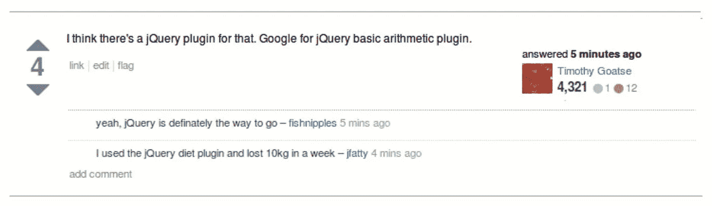
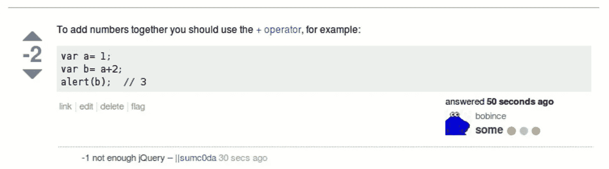

# npm 是新的 jQuery 吗？🔊

> 原文：<https://medium.com/hackernoon/there-is-an-npm-module-for-that-d6b384678f6c>

## Npm 可能正在经历一些我们以前已经见过的事情

A marketing picture showing the main characters of the show "Battlestar Galactica" around a big table

Listen to the audio version!

如果你现在在前端工作，当开始构建某个东西时，有一件事会浮现在你的脑海中:

> …有一个 npm 模块可以解决这个问题

听起来耳熟吗？

就在不久前，如果你必须建造什么东西，答案是:

> …有一个 jQuery 插件可以做到这一点

在过去，许多来自 JavaScript 社区的开发人员被 [Cargo Cult 编程](https://en.wikipedia.org/wiki/Cargo_cult_programming)严重驱动。在 jQuery 被认为是解决所有 web 开发问题的[银弹](/@fagnerbrack/how-to-reject-the-belief-on-the-silver-bullet-1d86b686acbb)的时代，有一个著名的 StackOverflow 问题(现已不存在)引发了一场有趣的讨论:

> 如何用 JavaScript 将一个数字加到另一个数字上？

A StackOverflow question that says “hallo, I have got a number in my JavaScript variable! Now how do I add another number to it? Please”. The answer below says “You should definitely use jQuery. It’s really great and does all things”. While the question has zero votes, that answer has 22.

这个讽刺性的问题完美地展示了这种“jQuery 效应”在当时是如何影响的。

就像你知道的那样，给你一点背景知识，很多年前 DOM APIs 处于非常糟糕的状态。没有`document.querySelectorAll`,浏览器实现现有的 API 也不一致。

最初创建 jQuery 是为了方便使用 JavaScript 遍历 DOM。但它也有助于修复现有浏览器的不一致性，并提供了一种由插件作者扩展的简单方法。

那些最后的东西从来都不是图书馆的核心目的。

有些人开始使用`$`名称空间创建小部件和全功能应用程序作为 jQuery 插件，而不是使用它来扩展通用 DOM 处理功能。这个社区最终赶上了这股潮流，并开始创建 jQuery 插件来解决各种问题，包括与 DOM 处理无关的问题，如向网站添加雪或重力、将颜色从 RGB 转换为 HEX 等。

Another satirical answer of a StackOverflow member, in the same thread. It’s written “I think there is a jQuery plugin for that. Google for jQuery basic arithmetic plugin”. There are two comments below. The first is “yeah. jQuery is definitely the way to go” and the second is “I used the jQuery diet plugin and lost 10kg in a week”. The answer is upvoted 4 times.

这种效果类似于我们今天用 [**npm**](http://npmjs.com) 观察到的情况。

Npm 最初充当 NodeJS 的模块库。然而，现在它被 web 开发者用来发布任何东西，从[单行模块](https://github.com/sindresorhus/ama/issues/10)到各种插件、库和框架。它不再是面向 nodeJS 的，而是成为整个 web 事实上的代码分发服务。鲍尔本应更加关注网络，但最终被 npm 的流行扼杀了。

使用 jQuery 时，您必须复制/粘贴插件的代码才能使用它。现在有了 npm，所有“插件”的代码分发都是通过注册表自动完成的。虽然这让事情变得更方便，但没有 T2 的权衡，这种方便是不会到来的。

A masterpiece. It sings that “if you want to do anything, there is a benalman.com jQuery plugin for that”. Ben Alman is a former jQuery contributor, he coined the term [IIFE](http://benalman.com/news/2010/11/immediately-invoked-function-expression/) and built the “Grunt” task manager.

jQuery 插件网站只是为了发现，而不是为了分发代码。由于[降低优先级和缺乏维护资源](https://github.com/jquery-archive/plugins.jquery.com/issues/161)，它已经处于只读模式很长时间了。建议将其替换为 npm 上的`jquery-plugin`标签。

一句话:我们现在都依赖 npm 进行代码分发，即使是 jquery 插件。

> npm 是新的 jQuery 插件站点吗？

大多数人喜欢有用的小代码片段，并且不存在依赖第三方的问题。以前的 jQuery 插件和现在的 npm 的受欢迎程度就证明了这一点。

然而，人们倾向于过度使用这些工具，并倾向于在它的基础上构建一切。Npm 正在成为 JavaScript 代码分发的银弹，就像 jQuery 是 web 页面的银弹一样。

也许这是一件好事，也许不是。

有一件事是肯定的，那就是让你的代码依赖于单一的技术会让你在技术过时后改变它变得困难和危险。如果你把所有鸡蛋放在一个篮子里，而它掉了，你就失去了一切。

Another answer to the same StackOverflow thread. The answer is “To add numbers together you should use the plus operator” with an example in JavaScript. It was down voted by 2 users and there’s a comment saying “-1 not enough jQuery”.

我希望我是错的。

我希望没有过度使用东西的倾向，它是我头脑中的一切。

有一个[著名节目](https://pt.wikipedia.org/wiki/Battlestar_Galactica)曾经说过“所有这一切以前都发生过，而且还会再次发生”。

嗯…对于 npm，我希望它不会…

感谢阅读。如果您有一些反馈，请通过 [Twitter](https://twitter.com/FagnerBrack) 、[脸书](https://www.facebook.com/fagner.brack)或 [Github](http://github.com/FagnerMartinsBrack) 联系我。