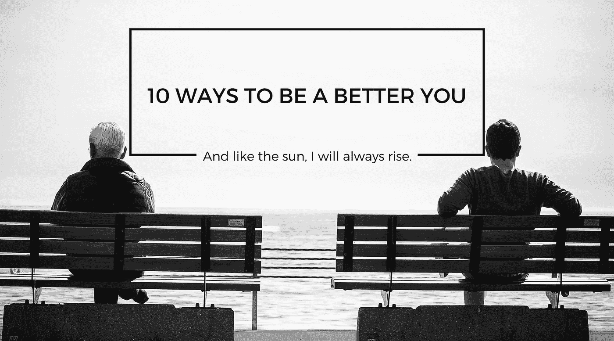
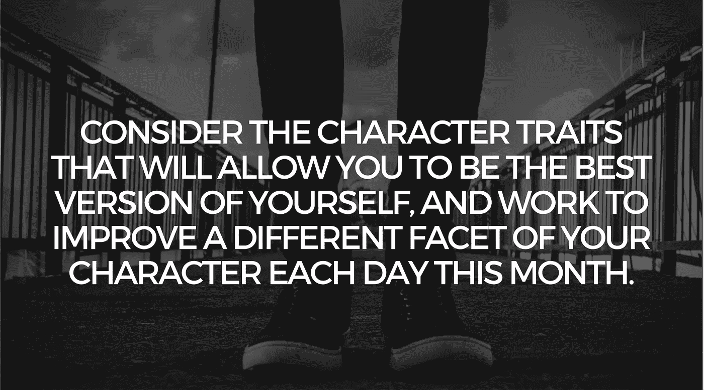
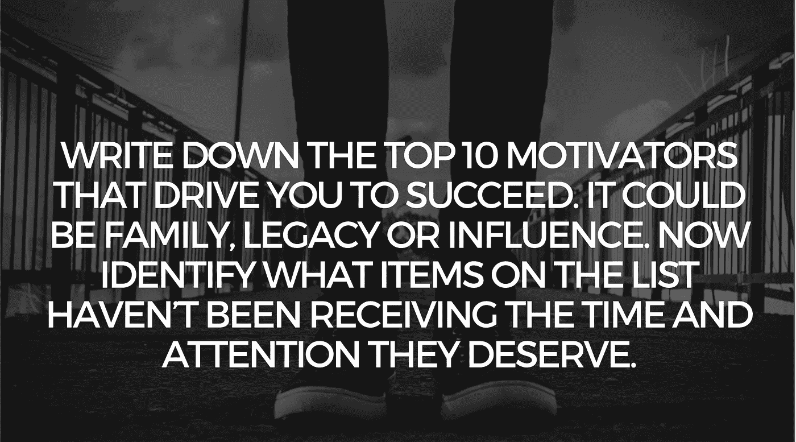
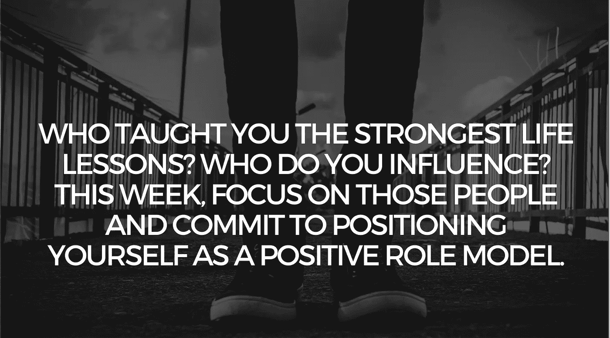
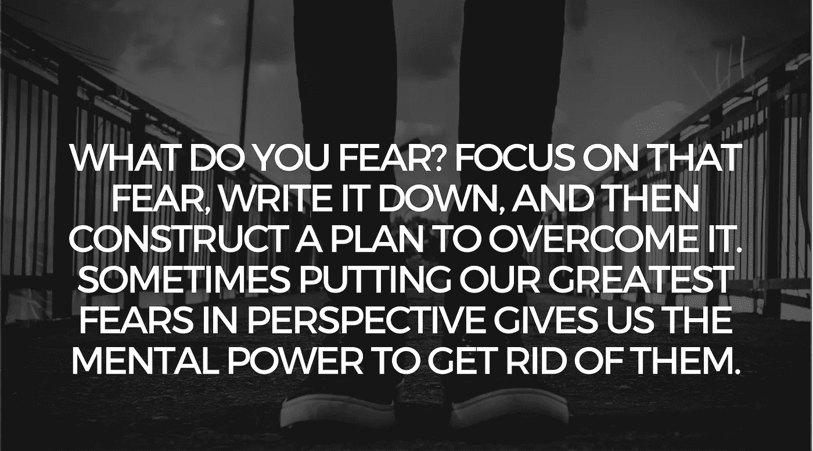
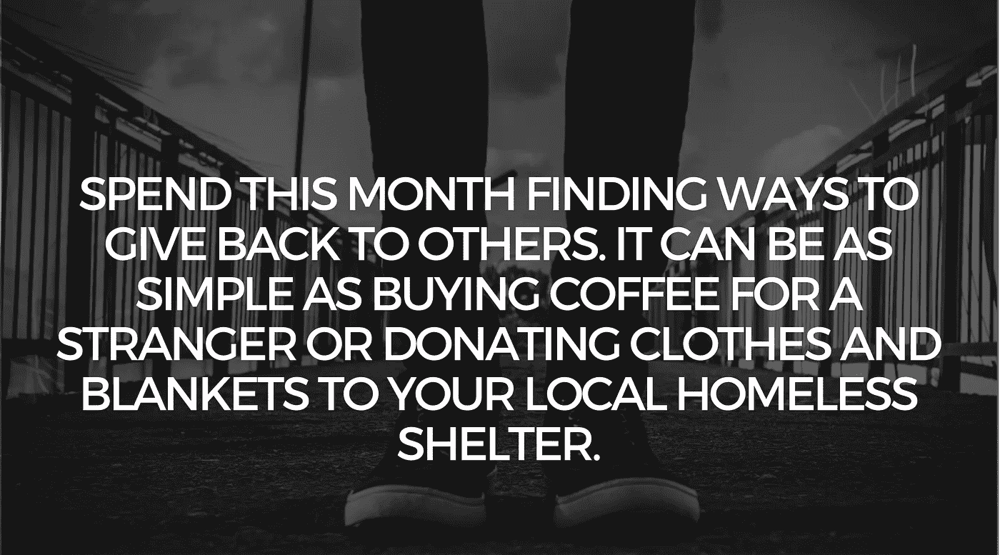
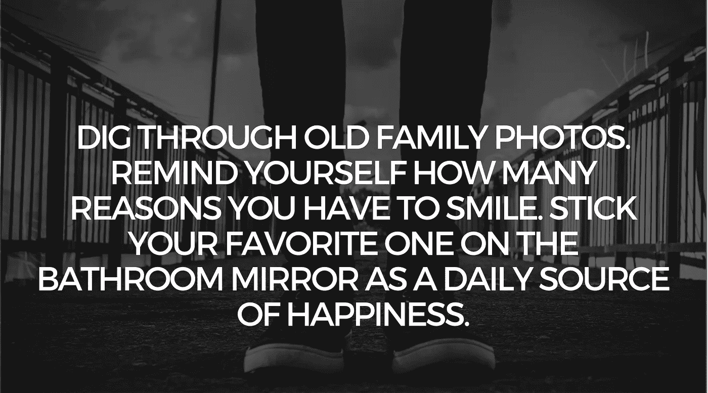
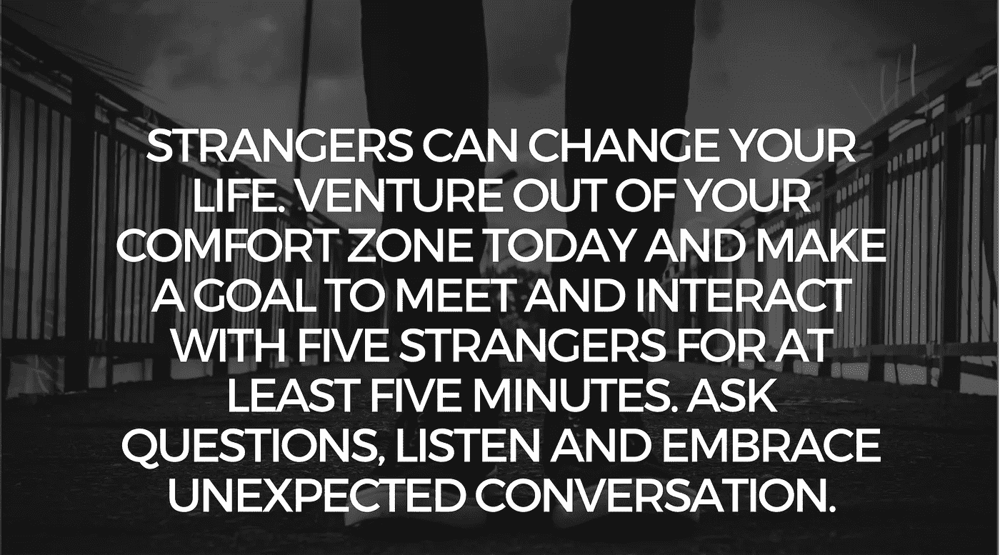
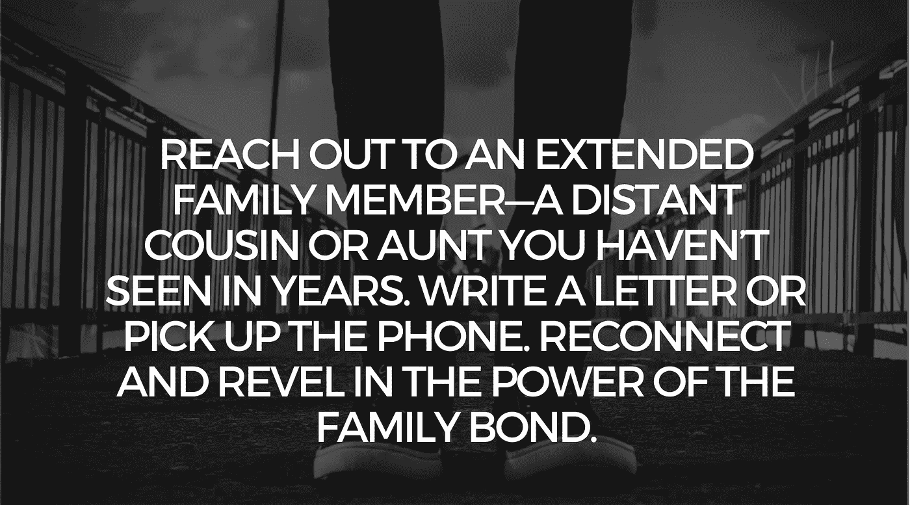
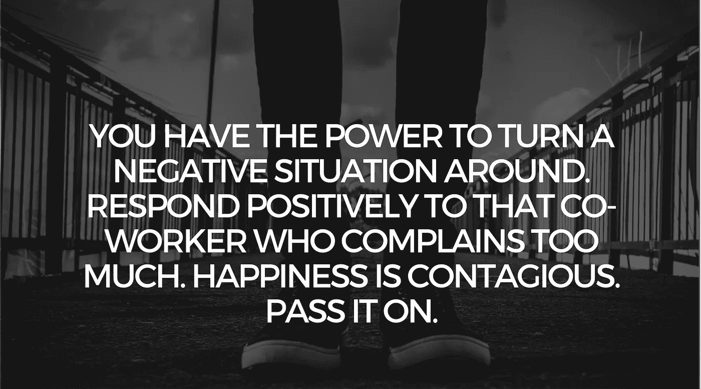

# 没有比今天更好的开始成为最好的你的一天了！

> 原文：<https://medium.com/hackernoon/there-is-no-better-day-than-today-to-start-being-the-best-you-de2d70960ad0>

T[hugStart.com](http://www.thugstart.com)

我每天早上醒来都知道我可以比昨天做得更好。我知道我可以成为任何我想成为的人，只要我专注于那个目标。我试图让每一天都朝着我的梦想前进一步。没有比今天更好的一天，让你开始成为最好的*。*

*你拥有的每一天，都有机会让不可思议的事情发生。当然，地球上有将近 70 亿人，但是你仍然可以改变你的生活。我要求你做的是，你做一点小小的尝试，让自己在某些方面变得更好！*

*这个月，花些时间和家人在一起，然后花些时间反省自己、自己的希望和梦想——在这个过程中成为更好的自己。*

**********************

*实际上试试你在这里读到的东西。这些任务并不复杂、困难。它们是令人难以置信的方法，可以让你的生活发生重大的积极变化。所以，对我来说，就试一个月吧。*

*我希望通过这 10 个步骤，你也能看到每天成为更好的你的好处。*

# *如果你喜欢这个并且想要更多:*

*帮我一个坚实的❤心吧，💬评论它，和/或关注我😀*

*此外，如果你想通过我的常规帖子阅读更多关于企业家精神、[营销](https://hackernoon.com/tagged/marketing)、社交媒体、领导力、[技术](https://hackernoon.com/tagged/technology)、创新和风险投资等话题的精彩内容，请点击“关注”，并随时通过 [SlideShare](http://www.slideshare.net/abhishekshah) 、 [Twitter](https://twitter.com/abhishekshah) 、[脸书](https://www.facebook.com/iAbhishekShah)和 [LinkedIn](https://www.linkedin.com/in/findingnewlands) 联系。*

*时间到 [**ThugStart**](http://www.thugstart.com/)*

*附:这是我关于媒体的其他[文章。](/@abhishekshah)*

******

> *[黑客中午](http://bit.ly/Hackernoon)是黑客如何开始他们的下午。我们是 [@AMI](http://bit.ly/atAMIatAMI) 家庭的一员。我们现在[接受投稿](http://bit.ly/hackernoonsubmission)，并乐意[讨论广告&赞助](mailto:partners@amipublications.com)机会。*
> 
> *如果你喜欢这个故事，我们推荐你阅读我们的[最新科技故事](http://bit.ly/hackernoonlatestt)和[趋势科技故事](https://hackernoon.com/trending)。直到下一次，不要把世界的现实想当然！*

**