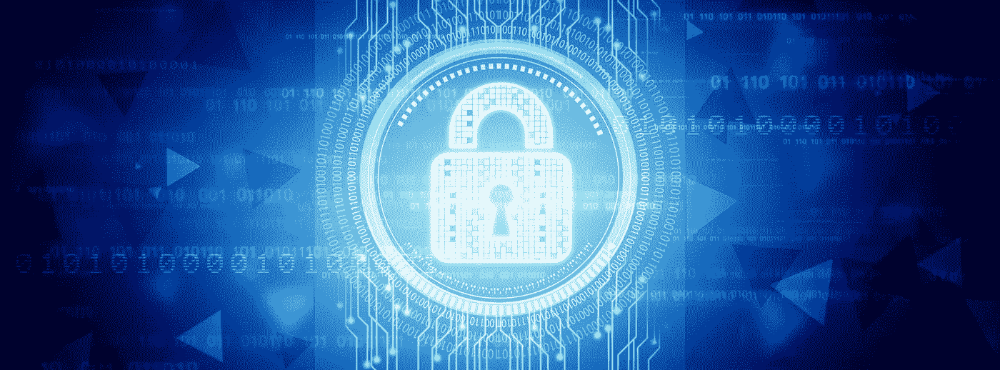

# 不再有关于加密的争论:后门威胁着整个世界

> 原文：<https://medium.com/hackernoon/there-is-no-more-encryption-debate-backdoors-threaten-the-whole-world-8e1793ed32be>

加密辩论现在结束了。作为一个社会，我们不能允许加密中的后门。任何人告诉你，否则绝对不知道计算机如何工作。

后门是对整个世界安全的威胁。

这里没有辩论的余地，没有妥协。

随着 [Petya 勒索病毒在全球](https://arstechnica.com/security/2017/06/a-new-ransomware-outbreak-similar-to-wcry-is-shutting-down-computers-worldwide/)肆虐，关闭了各地的医院、学校和主要企业，大肆抹杀数据，我们拥有了我们需要的所有证据，证明没有人能够建立后门并保证其安全。为什么？因为 Petya 和 WannaCry 都使用了美国国家安全局保密多年的强大漏洞。

直到他们做不到。

接下来还有更多。[影子经纪人](https://en.wikipedia.org/wiki/The_Shadow_Brokers)不断从美国国家安全局的潘多拉盒子里倾倒网络武器。预计会有更多的病毒和对关键基础设施的破坏。

最糟糕的是，这并不令人惊讶。

最终，秘密总会从庞大、混乱的官僚机构中泄露出来。我想让你好好看看过去十年中被攻击的美国公司和机构的名单。去吧。慢慢来。以下是世界上最伟大的黑客攻击的简要综述:

*   国内税收署
*   联邦医疗补助制度
*   纳斯达克
*   英国国防部
*   英国海关
*   美国陆军
*   美国国防部
*   退伍军人事务部
*   美国国家安全局
*   美国银行
*   全美 70 个不同的执法机构
*   佛罗里达州少年教养局
*   德克萨斯州
*   民主党全国委员会
*   克里夫兰美联储银行
*   摩根大通

我们要把后门的钥匙留在那些连自己的房子都锁不住的人手里？

这就像在纽约把一把上膛的枪交给一个愤怒的弃儿。

本·富兰克林说过，“三个人可以保守一个秘密，如果其中两个人死了。”

100%的技术专家同意，我们不能建立只有“好人”才能使用的后门。这根本不可能。

这甚至不是气候变化的辩论。我说的是 100%同意，不是 97%。没有回旋的余地。如果你是一个想要雇佣一个“红蓝团队”来对此进行假辩论的政客，你不会找到一个真正的技术人员同意你的观点。一个都没有。所以不用麻烦了。你会发现傻瓜和其他人认为电脑像魔法一样工作，由独角兽和精灵粉驱动，或者像悬崖上的旅鼠一样走向话题。但是你不会找到任何一个真正懂电脑的人同意你的观点。

毫无疑问:一旦我们用后门破坏了加密，我们就制造了一个定时炸弹。我们为了安全的幻觉牺牲了真正的安全，这是我们作为一个社会非常擅长的。

不是*如果*一个后门的钥匙泄露出去的问题，而是*什么时候*的问题？

如果真的发生了，那将是整个世界的灾难。

没有什么是安全的。

银行将会遭到袭击而不受惩罚，人们一生的积蓄将会在几秒钟内蒸发。随着关键医疗设备在勒索软件攻击中被占用，人们会死去，这使得今天的全球攻击看起来像是儿戏。投票系统将会崩溃。军事通讯将会崩溃。

这一切都是因为我们[不再愿意接受社会风险](https://www.schneier.com/blog/archives/2013/09/our_newfound_fe.html)。我们如此不顾一切地想要阻止恐怖主义，以至于失去了理智。我们再也不能做出理性的决定了。我们再也不能接受总会有坏人做坏事。

答案不是惩罚其他所有人，而是惩罚做了那些坏事的人。

相反，流行的“逻辑”是我们应该*削弱整个系统*给我们一个舒适的错觉，认为坏人会更容易被发现。但他们不会。在 20 世纪 60 年代和 70 年代，远在我们拥有加密技术之前，爱尔兰共和军炸毁了英国的许多咖啡馆。911 的渣滓没有 WhatsApp。反正他们杀了 3000 人。我们仍然有英国的特里萨·梅呼吁后门，以及澳大利亚政府和联邦调查局在常识的协调攻击。

你很容易就能认出说谎的政客。如果有恶意攻击，看看第二天*说话的人如何出现在电视上*哭喊着需要停止加密。这使他们自动成为骗子，因为他们会有*攻击中甚至没有使用加密的证据*。这实际上是不可能的。调查没那么快。所以唯一合理的结论是他们只是在利用一场悲剧来达到自己的目的。这就是为什么在 2015 年巴黎恐怖袭击后，大量的“会说话的人”出现了，却发现袭击者使用的是纯文本信息。

但我甚至不是说坏人不会使用加密技术。他们会的，也确实会的。ISIS 建立了他们自己的安全信息应用程序。

不过，事情是这样的:我打赌 ISIS 不会很快给我们他们消息应用的后门密钥。

那么，强制 WhatsApp 安装后门会有什么帮助呢？

不是的。因为政客们知道这不是为了阻止恐怖分子。这是关于监视普通公民、记者和活动家。是懒的问题。而是想要集中控制一切。

他们没办法，这是他们的天性。蝎子螫人，即使螫人会使它们下沉。

这很简单。如果一个政客呼吁后门，这是出于三个原因之一:

*   他们不知道电脑是如何工作的
*   他们故意无知
*   他们在撒谎

我的猜测是 99%的人都属于第三点[，因为自 20 世纪 90 年代以来，专家们一直在一遍又一遍地告诉他们这一点。他们知道这是不可能的。他们就是不在乎。他们愿意因为自己的愚蠢而危及整个世界的安全。这不仅愚蠢，而且危险。](https://en.wikipedia.org/wiki/Clipper_chip)

他们现在利用恐怖主义的恶魔来为每一项被误导的、危险的越权法律的通过辩护。

[警察可以无缘无故地偷市民的钱](http://www.heritage.org/research/reports/2014/03/civil-asset-forfeiture-7-things-you-should-know)就像他们是一群邪恶的墨西哥警察，在春假时敲诈游客。情报机构可以不受惩罚地监视每一个人，而一个秘密法庭在 97.97%的时间里给他们一个橡皮图章。国土安全部可以不经审判无限期拘留人。我们的旅游业正在崩溃。没有人愿意来我们的国家，因为现在进门简直是一场噩梦。

我们到底在做什么？

开国元勋们在坟墓里打滚。他们不希望他们的领导人有星际室和完全缺乏透明度。这就是为什么[他们把那些邮票扔进了海里](http://www.history.com/topics/american-revolution/boston-tea-party)。

在我们醒来之前还会有多荒谬？

难道我们不厌倦因为一些疯子而损害每个人的权利和自由吗？这就像因为一个人偷拿了一个果冻甜甜圈就惩罚了军营里的每个人。这毫无意义。

去他妈的恐怖分子。

我们不应该为他们改变。

我们应该继续做我们喜欢的事情，因为这会让他们发疯。

公开生活，喝酒，抽烟，做爱，说出我们的想法，祈祷，毫无畏惧地崇拜我们想要的任何人。

相反，我们做了相反的事情。

我们已经全面损害了我们的自由。我们现在像对待孩子一样对待社会上的每个人。

政客们公开表示，我们需要后门来阻止恐怖分子，这意味着我们需要损害银行、股市、医院和军队的安全。哪个正常人会认为这是个好主意？

加密不是敌人。这对我们的国家安全至关重要。疯狂、狂热的极端分子是敌人。

政客们不能承认的是他们不能阻止恐怖主义。生活中会发生坏事。太可怕了，太可怕了。我们都希望有一个真正的答案。但是没有。我不愿意假装有，只是因为它让我感觉更好。

以下是自 20 世纪 60 年代以来的一系列[伊斯兰极端袭击事件。看看这个国家的名单。地球上几乎每个国家都有。不管我们是采用专制主义的铁腕，比如中国或俄罗斯，还是民主的完全开放和灵活的本质，它仍然会发生。](https://en.wikipedia.org/wiki/List_of_Islamist_terrorist_attacks)

但这是撒谎的政客不会告诉你的另一件事。这种事不常发生。远非恐怖分子在街道上横冲直撞，轻松越过边境，您死于恐怖袭击的几率为 360 万分之一。你被难民杀死的机会有多大？更少。少得多。1 在*36 亿*。像保罗·瑞安这样的白痴用来激起每个人恐惧的非法移民杀死他们的几率有多大？109 亿分之一。这与您在飞机失事中丧生的几率(110 亿分之一)相同。

实际上，您赢得彩票的机会比死于非法移民更大。

顺便说一下，在你的一生中，你有 114 分之一的几率死于车祸。

见鬼，你被闪电击中*的几率比死于恐怖主义更大。几率是 161856 分之一。*

*哦，在你有生之年，你有四分之一的[几率死于心脏病或癌症。](https://www.cdc.gov/heartdisease/facts.htm)*

*但是我们每年花在心脏病和癌症研究上的钱只有区区 100 亿美元，却花了 1 万亿美元来阻止恐怖主义。*

*换句话说，我们把所有的精力集中在最不可能的情况上。我不知道还能叫它什么，但它是人类推理中的一个灾难性缺陷。*

*就像人类推理中的其他缺陷一样，这是纯粹的认知失调。将恐怖袭击归咎于加密就像将你最喜欢的球队输掉超级碗归咎于西瓜和绿色一样。*

*政客们总是在寻找得分点，而不是真正的解决方案。他们寻找任何虚构的幽灵来指责生活的混乱和不确定性。太恶心了。加密只是另一个方便的替罪羊。*

*我们需要开始选举能够为问题提供真实、理智、胜任的解决方案的人，如果这样的人真的存在的话。我不太确定。但是我可以肯定一件事:*

*我们越是沿着当前疯狂的推理和虚假的解决实际问题的道路走下去，我们就越是迷失。*

*恐怖分子赢了。*

*本·拉登不只是摧毁了两栋建筑，冷血地杀害了 3000 人。*

*他让我们向内转，毁灭我们自己。*

*############################################*

***如果你喜欢这篇文章，我很乐意你能打小心脏推荐给别人。之后，请随时将文章通过电子邮件发送给朋友！非常感谢。***

*############################################*

*如果你喜欢我的作品**请** [**赏光访问我的作品页面**](https://www.patreon.com/danjeffries) **因为这是我们一起改变未来的方式。帮我脱离母体，我会百倍回报你的慷慨，把我所有的时间和精力集中在写作、研究和为你和世界提供令人惊奇的内容上**。*

*###########################################*

## *如果你和我一样热爱加密空间，那就来吧，加入 [DecStack，这是一个虚拟的加密货币和分散应用项目的合作场所](http://decstack.com/)，在这里你可以接触到多个项目。永远完全免费。只是进来和社交，一起工作，分享代码和想法。通过反馈让你的想法更好。寻找新朋友。见见你的新家人。*

*############################################*

**

*[Photo credit](https://extranewsfeed.com/the-winds-of-world-war-iii-8bc369584f67)*

*关于我:我是一名作家、工程师和连续创业者。在过去的二十年中，我涉及了从 Linux 到虚拟化和容器的广泛技术。*

**你可以看看我的最新小说，* [***一部史诗般的中国科幻内战传奇***](http://amzn.to/2gAg249) *在这部小说中，中国摆脱了共产主义的枷锁，成为世界上第一个直接民主国家，运行着一个高度先进的、人工智能的去中心化应用平台，没有领导人。**

## *[加入我的读者群，你可以免费得到一本我的第一部小说《蝎子游戏》。读者称之为“神经癌的第一次严重竞争”和“黑色侦探会见约翰尼记忆术。”](http://meuploads.com/join-my-readers-group/)*

## *你也可以根据书中的想法查看一下[蝉开源项目](http://iamcicada.com/)，这本书概述了如何立即将该技术变为现实，你可以参与其中。*

## *最后，你可以[加入我的私人脸书小组，Nanopunk Posthuman 刺客](https://www.facebook.com/groups/1736763229929363/)，在这里我们讨论所有的科技、科幻、幻想等等。*