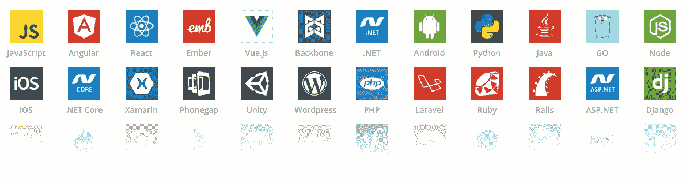
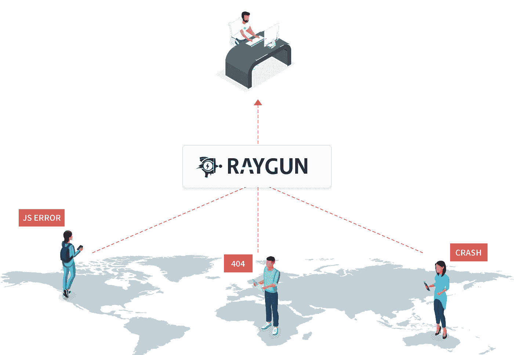

# 对软件工程师来说，这是最好的(或者最坏的)时机

> 原文：<https://medium.com/hackernoon/theres-never-been-a-better-or-a-worse-time-to-be-a-software-engineer-5cf8b2aa2845>

有时候，以编程为生的浮华和魅力会被一个同事用头撞键盘打断。

现代有许多创新，使得软件工程师更有生产力，并以更高的速度和质量发布代码。**但是也有一些事情让我们的工作变得更加困难……**

# 让我们从坏消息开始…

## 1.你的工作永远不会结束

作为一名开发人员，你在工作的大部分时间里都会遇到一份软件问题清单。

所有它做错的事情。**还有所有人们希望它做而它没有做的事情。**

几乎所有你和使用你软件的人的互动都是因为他们想要一些你没有给他们的东西。他们不明白为什么没有他们想象的那么简单。

我们梦想有一天有人感谢我们完美地完成了项目中的每一件事。没有任何“额外”的要求。

更好的规格和要求，请提前！

## 2.人们不明白你是做什么的(仍然)

也许你妈妈的朋友在她的打印机上需要帮助，并被告知你“使用它”。或者你的产品经理零技术背景，零了解工程最佳实践。

**似乎没有人理解你的工作**，你不得不向不知道要求或限制的人汇报。

有时候，解释清楚你在做什么似乎是一个不值得费心的挑战。

所以你只要在社交场合选择*‘我和电脑打交道’*。

## 3.有如此多的新语言和框架需要学习

在你阅读这篇文章的时间里，可能有另一个新的 JavaScript 框架[是你*真正*应该使用的。好像再也没有人直接编码 HTML 了。](https://hackernoon.com/how-it-feels-to-learn-javascript-in-2016-d3a717dd577f)

感觉好像你必须每五年重新学习一次你的工作，否则就有被抛弃的危险。

It just goes on and on and on and on…

需要支持的语言和框架数量呈爆炸式增长，开发人员会发现很难跟上这种趋势！

学习对现有的 400 多种编程语言和框架的任何补充将是一项全职工作。

你为什么不把每个周末都花在玩最新科技上呢？也许你有工作之外的生活，不吃，不呼吸，不睡觉。

你真可耻。

## 4.使用他人的代码

> “世卫组织写了这段代码？!"
> 
> “这完全是意大利面。没道理啊！”
> 
> “我正在检查提交历史记录…我想知道是谁写了这些垃圾…”
> 
> “哦，等等，等一下……
> 
> “去年是我。”

除了修改你自己的遗留代码，**试图理解一段遗留代码是如何运作的是一件非常痛苦的事情**，然而你被期望直接投入其中，继续写作。

当最初的开发人员不在了，并且代码编写、注释或文档记录都很糟糕的时候，弄清他的意图就更加困难了。

要是人们能理解就好了。

# **但是，也有很多好东西……**

现代软件工程实际上从未如此简单。

原因如下…

## 应用程序现在会告诉你他们何时生病

传统上，开发者依赖他们的用户来发现他们的应用在生产中遇到的问题，但这一切都在改变。

[**错误监控工具**](https://raygun.com) **可以告诉你你的应用程序出了什么问题，以及为什么**，不需要用户报告问题，已经被世界上最具创新性的公司所使用，而且它们还会变得更加智能。告诉你什么时候应该注意，问题的根本原因最终在哪里。

这意味着可以分配更多的工程师来开发新的特性、功能和产品，而不是维护它们。将问题自动加载到 bug 追踪器中，消除了手动过程。

您的工具可能比您更了解您的软件和客户。**所以才会有** [**没有借口出货蹩脚软件**](https://thenextweb.com/tech/2017/08/22/there-is-no-excuse-for-shipping-crappy-software) **。**

## 你的工具可以帮你做重活

我们过去只需要担心一些设备和屏幕尺寸。

现在，每当苹果、三星或谷歌的主题演讲上发布新产品时，这种局面就会完全改变。

跨平台框架和工具允许开发人员减少支持用户在他们选择的任何设备、浏览器或操作系统上所需的重复工作和工作量。

[渐进式网络应用](https://developers.google.com/web/progressive-web-apps/)越来越受欢迎，因为它们适用于每个用户，不管他们选择什么样的浏览器，因为它们是以渐进式改进为核心原则构建的。

2016 年被微软收购的 Xamarin 已经使数千个团队能够使用现有的技能、团队和代码来提供原生的 Android、iOS 和 Windows 应用，而不必为每个平台创建单独的应用。

像 [Foundation](http://foundation.zurb.com/) 、 [Bootstrap](http://getbootstrap.com/) 和 [Semantic UI](http://semantic-ui.com/) 这样的工具意味着前端开发人员不再需要从一个空的 CSS 文件开始，让他们的像素很好地发挥作用。

如果没有这些工具，生活会变得更加艰难，不需要从头开始做任何事情是一种奢侈。

## 航运时代已经一去不复返了——万岁！

随着按下发布生产按钮的时间越来越近，发货的日子过去常常会涉及到很多紧张和压力。

**持续集成和交付正在加快速度，因为团队开始回避大而可怕的发布周期**而倾向于更多迭代和更小的部署。现在，许多公司每天都会发布几次更新、功能发布和错误修复。

这可能会给他们带来取悦客户的优势，因为他们有更多的机会提供新的价值，而且他们发布的产品质量更高。

结果是更快的上市时间、更好的客户体验和对市场变化的更快响应。

至少对大多数团队来说，将一个不完整的版本推向生产，以及对最终用户来说一切都是爆炸性的(害怕这种事情发生)的日子已经过去了。

## 你觉得怎么样？

我们有过这么好的经历吗？

对你来说，软件工程最好和最差的部分是什么？