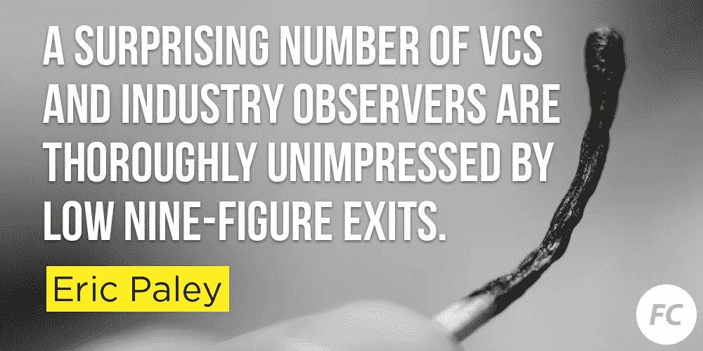
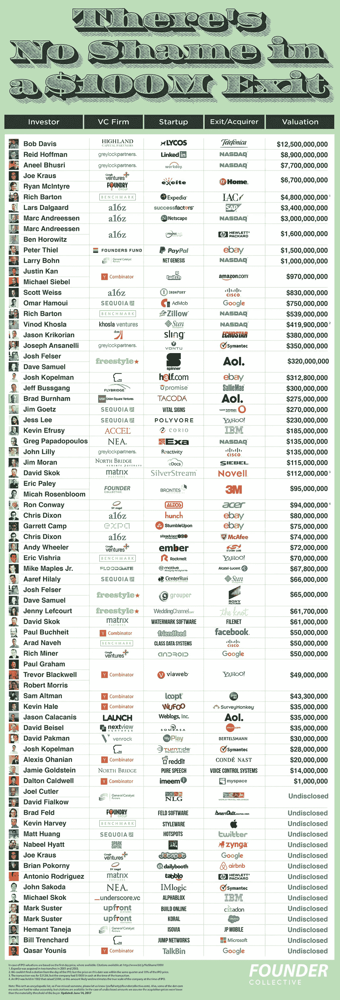
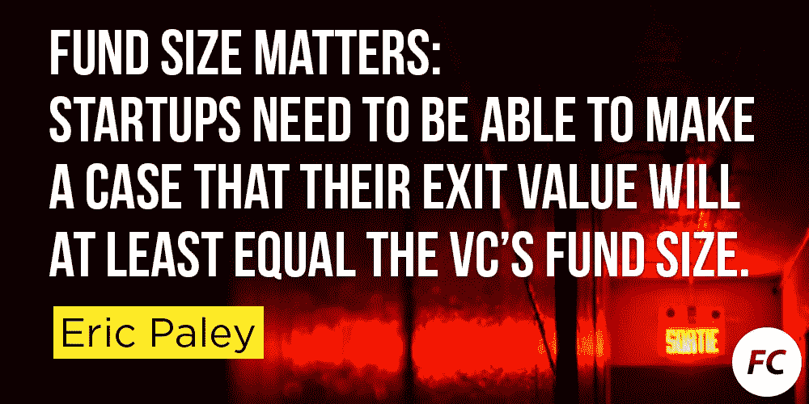

# 1 亿美元的初创公司没什么丢人的

> 原文：<https://medium.com/hackernoon/theres-no-shame-in-a-100m-startup-56caf1b873fd>

*由* [*埃里克*](https://twitter.com/epaley) *，搭档&* [*乔·弗莱厄蒂*](https://twitter.com/josephflaherty) *，内容&组成的社区。*

独角兽创业公司的时代造就了一种扭曲的创业成功观。所有关于十亿美元退出的谈论都夸大了定义胜利的数字。从纯粹的创业概率来看，以 1 亿美元创办并出售一家公司是一个异数事件，但在当今创业世界的许多角落，这样的结果也被视为不成功。

这种奇怪的想法并不普遍，但数量惊人的风投和行业观察人士对 9 位数的低退出率完全不感兴趣。

在我们这个被炒作驱动的社会，这其实并不奇怪。政治记者想写的是总统和最高法院，而不是州政府。同样，科技记者希望报道那些把 *million* 写成“b”的公司。十亿美元基金的投资者希望向获胜的公司投入 5000 万美元，而 1 亿美元的退出被视为安慰奖，而不是欢呼的理由。在这个回音室里，1 亿多美元的退出看起来像是一笔巨大的收购。

为了将这种现实扭曲放到背景中，我们考察了近几十年来成功创始人中的一个特殊群体——那些成为风投的人——的结局。通过对顶级风险投资公司的广泛调查，我们发现了 63 位有创业背景的投资者。在这些由创始人转型的投资者中，只有 11 人建立了上市或出售价值超过 10 亿美元的企业。

许多最成功的投资者建立了卓越的创业公司，只是按照今天扭曲的标准看起来像是“适度的”经济成果。Y Combinator 的保罗·格拉厄姆是过去 10 年中最有影响力的风险投资家之一，然而他的初创公司 Viaweb [仅卖了 4900 万美元。从任何现实的标准来看，Viaweb 都是成功的，但从今天大肆宣传的成功故事和筹资储备来看，或许并非如此。该公司在出售前仅筹集了 250 万美元——这是一个相当可观的回报，也是保罗·格拉厄姆未来的惊人预兆。事实证明,“小”出口可以导致大事情。](https://www.cnet.com/news/yahoo-buys-viaweb-for-49-million/)

注意:这不是一个百科全书式的列表，所以如果我们漏掉了某个人，请让我们知道。此外，一些网络时代的退出很难准确估价，但可以引用。在未披露金额的情况下，我们假设收购价格低于买方的实质性门槛。

# 贬低 1 亿美元的成功故事

以 1 亿美元出售一家公司不仅经常遭到风投的嘲笑，有时还会遭到初创企业群体的公然嘲笑。Aaron Patzer 因建造 Mint.com 而闻名，该网站强大的 UX 是一个突破，因此 Intuit 公司为该公司支付了 1.7 亿美元。他不相信“不成功便成仁”的风气；相反，他赚了一大笔钱——并因此遭到了广泛的嘲笑。对 1 亿美元的“小”销售额的鄙视是如此强烈，甚至有一个城市字典条目是关于以太低的价格出售你的初创公司的——它被称为“[拉着帕策](http://www.urbandictionary.com/define.php?term=patzer)”不，说真的，去查一下。我们会等的。

 [## 不要“拉一个帕兹”和我们在沙希尔路上的其他经验教训

### 编者按:本月早些时候，BrightRoll 为其视频广告网络筹集了 1000 万美元的 B 轮融资。在此嘉宾…

techcrunch.com](https://techcrunch.com/2010/02/28/dont-pull-a-patzer-and-other-lessons-learned-on-our-trip-down-sand-hill-road/) 

我们投资组合中的一家公司最近以一亿多美元的价格卖给了一家科技巨头。这笔收购在短时间内给了我们令人兴奋的倍数，每个联合创始人去年赚的钱都比勒布朗·詹姆斯多。这笔交易很可能是该公司所能预期的最好的现实结果，也是各方的巨大胜利。

在这个迷恋独角兽的创业时代，对这些胜利缺乏欣赏，往好里说是远见的失败，往坏里说是不幸的愤世嫉俗。

# “不成功便成仁”的逻辑已经被打破

我们并不是建议企业家应该寻求快速周转或低估他们公司的潜力。我们想投资下一个优步、谷歌和脸书。现实是，并不是每个企业都适合这样做。如此多的风投在远低于独角兽幻想水平的情况下取得了巨大成果，部分原因是他们以维持退出选择的估值为自己的企业筹集了适量的资金。

在种子阶段看起来像十亿美元企业的想法可能会遇到意想不到的障碍。对于资金不足的创业公司来说，这些错误不一定是致命的。不幸的是，大多数风险投资的规模使得他们只有在投资组合中有几家公司的退出金额超过 10 亿美元时才能成功。因此，风险投资过度投资那些取得了不错但缺乏创意的进展的初创企业，这切断了现实而丰富的退出机会。

例如，你可能有一家去年总收入为 1000 万美元的公司，它在最后一轮中获得了 5000 万美元的估值。这家公司希望今年的收入能够翻一番，并且属于一个很有吸引力的类别，但是它的利润率很低，并且在单位经济上处理得很松散。在正常情况下，该公司下一步可能会在 8000 万美元的投资前估值基础上融资 2000 万美元。

相反，在当前的环境下，风投会看到进步的迹象，对市场感到兴奋，并说服创始人“要么做大，要么回家”。这位风险投资者口袋里有 2000 万美元(他需要部署这笔资本来筹集他的下一笔资金)，并说服企业家以 2.6 亿美元的估值接受 4000 万美元(其中一半给内部人士)。现在，有了 3 亿美元的融资后估值，该公司需要以 10 亿美元的价格出售，才值得风投的时间。

收入只有 1000 万美元，利润非常微薄，该公司已经出售了 5 亿美元的退出选择权。如果他们筹集的资金少一些，5 亿美元的交易会让所有人都高兴。相反，他们可能会提高烧钱速度，筹集更多资金。最终，当没有收购者愿意支付虚高的价格，风投对继续助长虚假希望所需的过度烧钱失去兴趣时，这家有前途的公司可能会破产。

# 基金规模告诉你一切

只有你不过度投资你的企业，才有可能获得 1 亿美元的利润。如果你想要灵活性，你必须战略性地筹集资金。这从选择你的投资者开始。方正集体合伙人大卫·弗兰科尔常说，“基金规模告诉你一切。”作为一个非常粗略的经验法则，你的初创公司需要能够证明，它可以以至少相当于风投资金规模的价值退出。从一只 5000 万美元基金中融资，你可以轻松卖出 1 亿美元。从 10 亿美元的基金中融资，你需要向月球发射。仔细选择，确保你知道你报名参加的是什么。

# 1 亿美元的初创公司没什么丢人的

绝大多数科技公司的售价都不到 1 亿美元。筹集相对较少的资金，以 1 亿美元的价格出售一家公司，这应该值得庆祝。对于大多数由创始人转型的风投来说，当我们出售自己的公司时，这就是成功的定义。在某些情况下，对创始人来说，以数千万美元的价格出售可能比以数亿甚至数十亿美元的价格出售更有利可图。

卖掉一家相对成功的创业公司，可以创造足够的财富，让你的余生过得舒舒服服。它可以让你处于开创另一家公司的有利位置，或者可能是世界上领先的加速器。许多创始人将创业领域的“适度”成功转化为风险投资领域的惊人事业。

这最初出现在 TechCrunch 上。更新时间:2017 年 6 月 14 日

> [黑客中午](http://bit.ly/Hackernoon)是黑客如何开始他们的下午。我们是 [@AMI](http://bit.ly/atAMIatAMI) 家庭的一员。我们现在[接受投稿](http://bit.ly/hackernoonsubmission)并乐意[讨论广告&赞助](mailto:partners@amipublications.com)机会。
> 
> 如果你喜欢这个故事，我们推荐你阅读我们的[最新科技故事](http://bit.ly/hackernoonlatestt)和[趋势科技故事](https://hackernoon.com/trending)。直到下一次，不要把世界的现实想当然！

