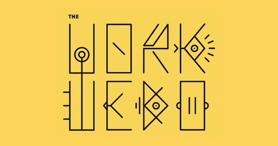
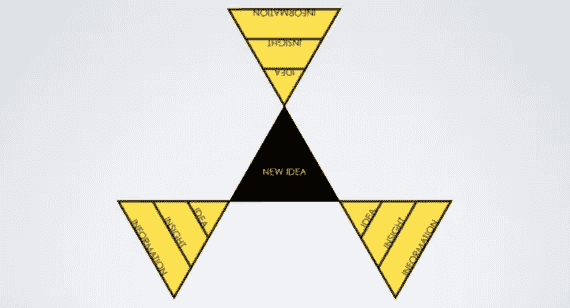
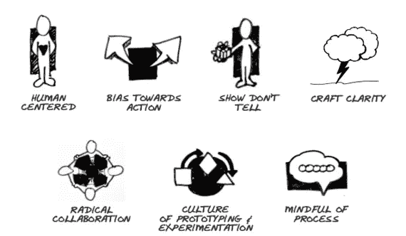
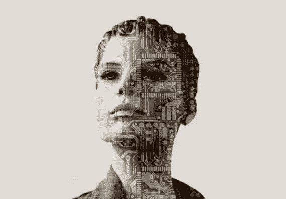
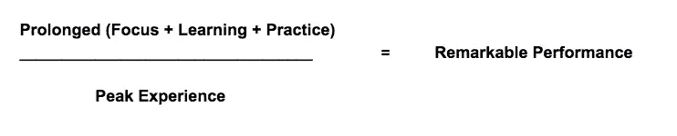

# 没有什么比丰厚的赌注更好的了

> 原文：<https://medium.com/hackernoon/theres-nothing-like-a-juicy-bet-ef6c6bcd2634>

Image via [The Work We Do](https://soundcloud.com/theworkwedo)

# 文化唐，维多利亚斯托扬诺娃说，她想庆祝其他人的创造性的方式。她当场被一个朋友挑战:*别说了，开始做。*

斯托扬诺娃不是一个容易被说服的人，她随机应变，十天后 [**我们做的工作**](http://www.theworkwedo.co/) 诞生了。在播客系列中，她与嘉宾的对话是原始的。她深入挖掘了专业人士无法静止不动的实践、旅程和仪式。在今天的注意力经济中，这些主题变得越来越有说服力——在这里，寻找空间，并成为你最好的自己可能是一种考验。

以下是一些可能有所帮助的轶事:

# 培养万花筒般的职业

Image via [Victoria Stoyanova](http://victoria.works/)

斯托扬诺娃出生于保加利亚，是一名定居伦敦的环球旅行家，她透过多维视角看世界。这让她可以称自己为社区建筑师，更重要的是，做有意义的工作:大规模建设有弹性的生态系统。她以前为许多组织做过这样的事，现在她正集中精力培育这个星球上最大的创意社区。如果这一切听起来很复杂，这正是因为它是。

她解释说，就像万花筒一样，今天的专业人士有许多面。或者说今天的专业人士有很多职业。每个工人带来了他的观点，技能，实践，经验和网络的融合。每一层都与另一层相结合，以一种独特的方式叠加在一起。正是这种模块化使得那些栖息在门槛上的人，在一个 [**的门槛空间**](http://liminalthinking.com/) 中，能够做他们擅长的事情。

有着应对转变的不可思议的能力，每一个新的挑战都提供了另一个展现现有能力和掌握新能力的机会。

# 偏向于行动

Image via [Stanford d.School](https://dschool.stanford.edu/)

# “用新的思维方式行动比用新的行为方式思考更容易。”

俗话说[之父杰里·斯特恩**积极越轨**](https://www.fastcompany.com/42075/positive-deviant) 。今天，拖延的代价会非常高。在我们的网络经济中，推出和改进是制胜的策略。

Joi Ito 和 Jeff Howe 在他们的书 *Whiplash* 中解释道，“企业通常把‘失败’视为廉价的学习机会。”当变化正以前所未有的速度加速，而你周围的每个人都在忙着“做事”时——很容易感觉自己是个旁观者。不要害怕，因为做的真正好处是学习。正如伊藤，他本人是一名大学辍学生，现在是麻省理工学院媒体实验室的主任，他断言，

> “教育是别人对你做的。学习是你对自己做的事情。”

斯托扬诺娃本可以轻松地谈论几个月的播客，但她抓起麦克风，点击了记录。不仅她每一集都学到了更多，谢天谢地我们也是。

# 排练你的节奏和仪式

Image via [Vinyana](https://www.vinaya.com/)

那些已经掌握如何无缝开启 [**突发工作**](http://www.huffingtonpost.co.uk/jonas-altman/burst-working_b_7142752.html) 并轻松关闭的人正在酝酿一场运动。计算机科学家卡尔·纽波特称其为“分批”工作。就像一个冲浪运动员在一组具有强烈焦点和爆发力的海浪中导航一样，今天的知识工作者必须以精准的认知能力破解如何做 [**深度工作**](http://calnewport.com/books/deep-work/) 。

心流本身就有一个目的，它曾经与艺术家和运动员这样的人奇妙地坐在一起。它已经渗透到信息经济中。只要互联世界和辅助工具允许，那些用知识工作的人可以发现他们的最佳状态。

尽管哲学家芭芭拉·盖尔最近 [**提出反对心流**](https://aeon.co/essays/the-true-expert-does-not-perform-in-a-state-of-effortless-flow)**——处于心流中与最佳表现并不相互排斥。事实上，发现心流和做伟大的工作是天生的伙伴。这并没有得到任何定量研究的支持，相反，这只是我所相信的。一个非常简单的等式可能是这样的:**

****

**但比找到(这个看似虚幻的)等式更紧迫的是潜伏在暗处的敌人。我们的好朋友技术——相当矛盾的是——使这些新的工作方式成为可能，同时也是最大的贬低者。正如阿兰·德波顿警告我们的那样:**

> **“我们这个时代更令人尴尬和自我放纵的挑战...是重新学习如何集中注意力的任务。在过去的十年里，我们坚定不移地做任何事情的能力受到了前所未有的打击。静坐思考，不屈服于对机器的焦虑，已经变得几乎不可能。”**

**为了应对不断的数字噪音，一些人暂时退出了社交媒体，而另一些人则故意使用**这种极端的技术。****

# ****享受旅程****

********

****Image via [Wikimedia Commons](https://commons.wikimedia.org/wiki/File:A_typewriter_(10995863465).jpg)****

****长期以来，抽出时间一直是提高生产率和创新的行之有效的方法。设计师 Stefan Sagmeister 虔诚地每 7 年休假一年，然后关闭他的公司。他相信，这样做，他会为他的公司在未来六年所需要的创造性和商业上的成功添砖加瓦。****

****我们可能都不会奢侈到关门一年，但是一个解决方法可能会简单得多；比方说一次长距离的散步。对于查尔斯·狄更斯来说，一天走十几英里看起来像是今天的偷懒，但是休闲对于知识工作的好处是 [**科学上合理的**](http://nautil.us/issue/46/balance/darwin-was-a-slacker-and-you-should-be-too?utm_source=pocket&utm_medium=email&utm_campaign=pockethits) 。和许多其他创造性追求一样，写作需要:专注、流动性和(希望)满足感。****

****英国历史学家西蒙·塞包·蒙特菲奥雷揭示:****

> ****“旅程就是一切——对一个作家来说，生活和工作只是一系列的旅程，这些旅程往往比我们最终身处地狱时更重要。旅程不一定是地理上的，而是一次心灵、灵魂、大脑和身体的旅程。灵魂的旅程是关于灵感的；内心的爱是关于爱的；身体的运动和地理，但也是感官，气味和味道；大脑的功能是研究新知识。但是，我生活的每个阶段都被划分成一个新的旅程、主题、项目，运动感和新奇感是必不可少的。”****

****与斯托扬诺娃非常相似，世界各地的人们都在拥抱激动人心的新工作方式。有了觉知和富足，他们唤醒了对什么是可能的感觉。他们肮脏的小秘密:这不是目的地，而是旅程的荣耀。****

*****偷听我和斯托扬诺夫在这里聊天……*****

*****如果你喜欢这篇文章，请分享你的爱并鼓掌或鼓掌:*****

********************************

> ****[黑客中午](http://bit.ly/Hackernoon)是黑客如何开始他们的下午。我们是 [@AMI](http://bit.ly/atAMIatAMI) 家庭的一员。我们现在[接受投稿](http://bit.ly/hackernoonsubmission)，并乐意[讨论广告&赞助](mailto:partners@amipublications.com)机会。****
> 
> ****如果你喜欢这个故事，我们推荐你阅读我们的[最新科技故事](http://bit.ly/hackernoonlatestt)和[趋势科技故事](https://hackernoon.com/trending)。直到下一次，不要把世界的现实想当然！****

********