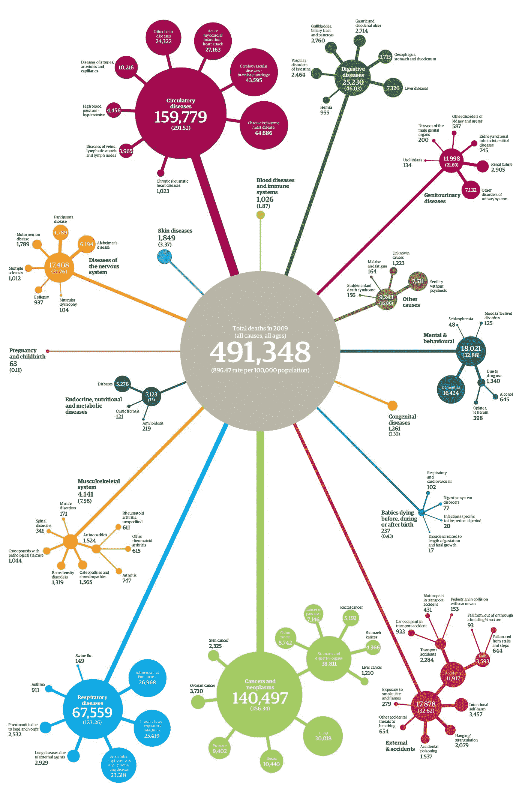

# 特里萨·梅对加密的看法是错误的

> 原文：<https://medium.com/hackernoon/theresa-may-is-wrong-about-encryption-92f1b43ab11a>

特里萨·梅的 [*立场和监管加密的计划*](http://uk.businessinsider.com/david-cameron-encryption-back-doors-iphone-whatsapp-2015-7) *是被误导的，背叛了一种根本上计算机盲的方法。她对最近事件的膝跳反应是非理性的，这是一个方便的借口，为长期以来寻求的破解加密的权力立法。她对计算和加密的历史一无所知，她的计划会损害英国。* ***注意:这不是对保守党的批评。*** *它同样适用于* ***任何地方的任何政府*** *想要规范其管辖范围内的加密。*

## 背景和事实

特里萨·梅和所有政客一样，对电脑和软件几乎一无所知。在她忙碌的世界里，电脑是秘书和助理的工具，而不是她特别感兴趣的东西。

另一方面，安全部门的专业人员确实了解计算机，并要求对软件进行瘫痪处理，这样就不会有私人通信。他们知道加密的完整历史，也知道以前取缔或削弱加密的尝试是如何失败的。他们劫持了大众对恐怖主义的歇斯底里，试图从公众手中夺走加密技术。

英国的《2000 年电子通信法案》是一项早期尝试，旨在将销售没有政府访问后门的软件产品定为非法。它被击败并从 T21 的法律中删除。

在美国，已经进行了几次尝试，要求政府访问所有私人通信；有些是通过新的硬件设备如[削波芯片](http://www.cryptomuseum.com/crypto/usa/clipper.htm)，有些是通过设定[判例](http://www.cnet.com/news/judge-man-cant-be-forced-to-divulge-encryption-passphrase/)。他们还试图阻止 T4 对菲利普·齐默曼的三年骚扰所发布的加密工具，菲利普·齐默曼是《非常好的隐私》的作者，爱德华·斯诺登承认 NSA 和 GCHQ 无法破解的工具。

即使在今天，任何密钥长度超过 64 位的加密系统在出口之前都必须得到美国商务部工业与安全局的批准。这显然是荒谬的，因为全球每个人都可以无限制地使用 4095 位的密钥长度，并且所有 SSL 在默认情况下至少是 128 位的。

## 时势

今天，苹果和谷歌及其 iOS 和 Android 操作系统已经推出了[全设备加密](http://www.theguardian.com/technology/2015/may/19/apple-google-letter-president-obama-encryption-fbi-surveillance)，这样就没有人能够读取用户手机的内容。这是对美国国家安全局大规模入侵数百万无辜民众的通信和设备的直接回应。

现在，特里萨·梅(Theresa May)在利用其计算机无知的 IT 专业人士的压力下，再次试图恢复他们几十年来削弱公众对加密和隐私的访问权的旧尝试。他们在 20 世纪 90 年代末失败了，他们将再次失败，因为 iPhone 已经饱和，“自拍”世界今天是一个非常不同的地方。

不管是否知道，每个人每天都在使用加密技术。所有的电子商务都依赖于它。如果英国议会制定法律，规定所有加密必须有一个后门，那么犯罪分子将可以默认访问所有出售任何东西的网站，还可以轻松访问所有设备上数十亿网络用户的个人信息。她的要求是不可行和无效的，因为不同的司法管辖区不会跟随她，世界上任何软件开发人员都可以使用[旧的](https://www.gnupg.org/)和[新的绝对可靠的工具](https://home.silentcircle.com/)来进行安全的聊天、电子邮件和文件存储，或者简单地将他们的服务转移到一个自由的司法管辖区，避开反科技的英国法律。

梅可以要求加密在英国有后门，但她不能要求美国人或其他任何人跟着她。这意味着只有英国的网站和服务易受攻击；整个英国互联网将被全球公认为电子商务的不安全区域。对于政府如此热衷于推动的英国科技行业来说，这将是一场灾难。

## 混杂的信息

来自政府的信息并不连贯，很明显特里萨·梅只不过是一个不快乐的信使。一方面，她的政府希望“硅环岛”成为欧洲科技爆炸的中心，但另一方面，他们被告知要削弱让这项技术发挥作用的关键工具。很明显，这是两个互相矛盾的声音。

Silicon Roundabout in North London. The centre of the UK’s “Tech City”.

受到英国反进步立场威胁的不仅仅是电子商务。网上掀起了一场声势浩大的运动，要求所有的互联网服务，不管是什么，都默认支持 HTTPS。要求政府对从英国访问的所有网站进行后门访问实际上是不可能的。这意味着从根本上重新设计整个网络，没有人会同意这一点。如果你从英国访问美国的电子邮件服务，比如 Gmail，SSL 将不会被后门，通信将是保密的。反过来，它们就不是私有的了。这意味着没有公司会在英国托管他们的电子邮件服务，资金、人才和技术将会流出英国。*“科技外流”。*

既然全球流通中的所有货币的流动都依赖于加密，那么在不破坏商业本身的情况下，削弱保护货币流动的工具是不可能的。你不能削弱保护每一个人的工具而不给罪犯以全面的机会。特里萨·梅(Theresa May)得到了糟糕的简报，他将被迫让步，或者放弃英国成为全球科技中心的任何希望。

## 有缺陷的理由

这种打破全球电子商务的新举措的公开借口是最近“圣战者”的反常杀戮。犯罪事件，尤其是那些更加骇人听闻的，总是离群值和统计异常值。世界上绝大多数人从未遇到过这类事件，他们的安全必须永远放在第一位。默认情况下，这意味着强加密。

政客们非常习惯于权衡取舍。在这种情况下，我们正在用数万亿美元和数十亿使用电子商务的人的安全这一绝对事实与针对极少数人的*远程* *检测*和*也许*防止**极其罕见的**犯罪的可能性进行交易，这些人的数量在全球范围内加起来比死于世俗原因的人数还要低[。](http://image.guardian.co.uk/sys-files/Guardian/documents/2011/01/14/Factfile_deaths_v2_2011.pdf)

当我们谈论保护人民时，我们不仅仅意味着保护他们的金钱。你生活的每一个方面都受到加密保护，包括你通过互联网连接设备发送或接收的所有私人信息。加密使你的私人信息远离除了预定接收者之外的任何人。政府只是众多试图获取你的通信、金钱、医疗记录和位置的敌对对手中的一个。

加密是民主的；它平等地保护每个人的安全。

## 真实的现实

安全部门能够随意阅读每个人的通信的时代基本上已经结束了。这一天的到来，从 PGP 和 SSL 开发发布的那一刻起，就不可避免。对社会的净效益是全球电子商务的出现和网上犯罪的大量减少，因为坏人被永久地关在外面。

如果特里萨·梅的顾问们真的想减少恐怖主义，他们会建议采取不同的外交政策，这是英国面临的恐怖主义问题的根本原因。

比如，如果利比亚没有受到影响，它本可以避免欧盟面临的移民危机。糟糕政策的后果才是英国问题的根源，而不是加密，为所有人破解加密并不能解决问题。事实上，这将导致一连串的连锁反应和另一类意想不到的后果，在可预见的未来，这将有效地终结英国作为科技中心的地位。

特里萨·梅(Theresa May)必须大力反击那些利用谬误的论点来通过新的破坏性法律的声音。如果她不这样做，英国将面临科技行业的崩溃，因为在英国不可能生产出对消费者安全的产品。世界变了；即使是共产主义的中国也不建议全球标准的加密工具存在后门，他们使用所有西方使用的软件来保护他们的网站和通讯。

我们不应该在每次媒体疯狂报道大屠杀的时候一次又一次地经历这个过程。卡梅伦政府中必须有人被雇佣，唯一的目的是让他们对与软件相关的一切事情的声明变得理智。也许是时候让“ [MinTech](https://en.wikipedia.org/wiki/Minister_of_Technology) ”内阁职位回归了，这个职位应该由软件业选出的业内人士担任，而不是外行。这应该在[另一项自杀性法案颁布之前完成](https://www.gov.uk/government/consultations/digital-currencies-call-for-information/digital-currencies-call-for-information)，这至少会浪费每个人的时间来捍卫他们的商业模式，更糟糕的是，会引发“技术外流”。

> [黑客中午](http://bit.ly/Hackernoon)是黑客如何开始他们的下午。我们是 [@AMI](http://bit.ly/atAMIatAMI) 家庭的一员。我们现在[接受投稿](http://bit.ly/hackernoonsubmission)并乐意[讨论广告&赞助](mailto:partners@amipublications.com)机会。
> 
> 如果你喜欢这个故事，我们推荐你阅读我们的[最新科技故事](http://bit.ly/hackernoonlatestt)和[趋势科技故事](https://hackernoon.com/trending)。直到下一次，不要把世界的现实想当然！

