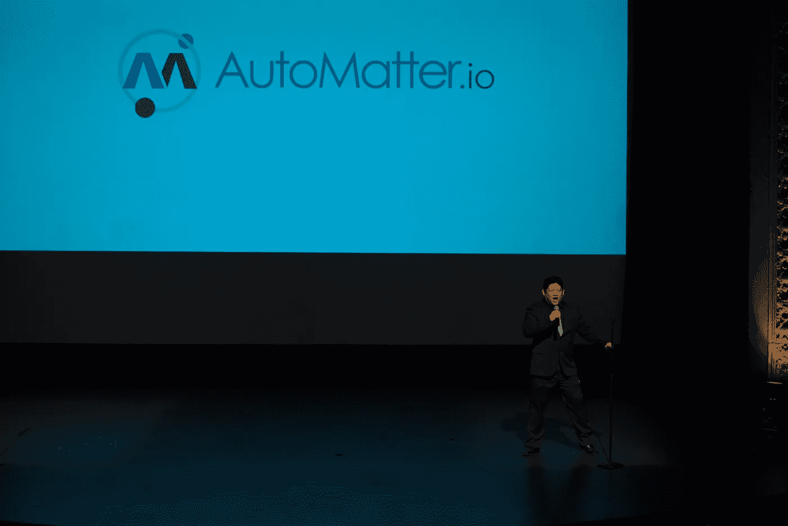
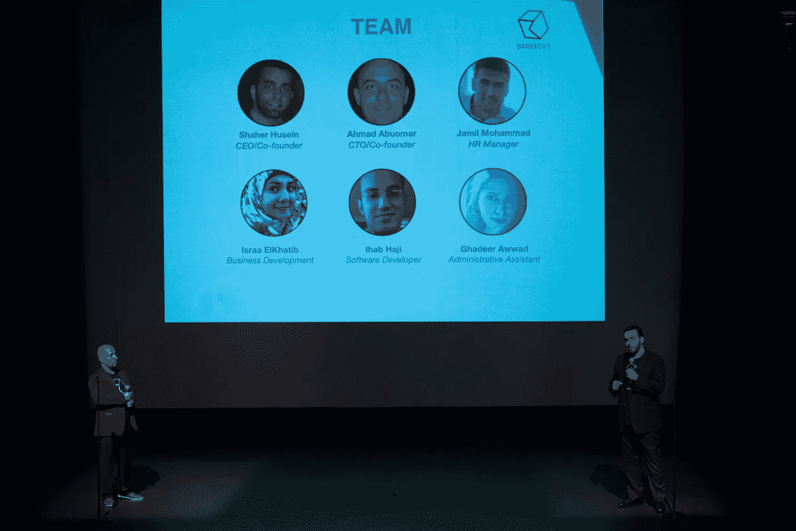
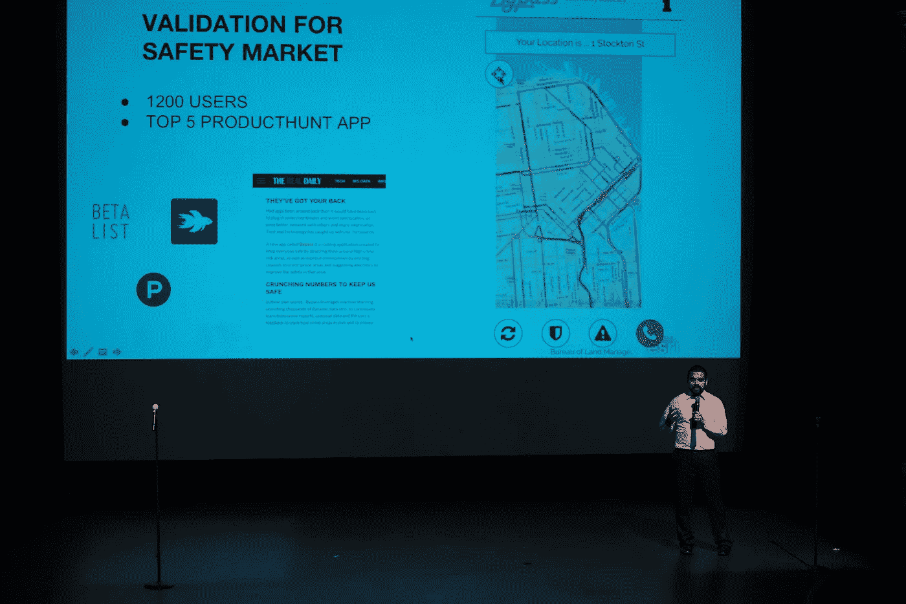
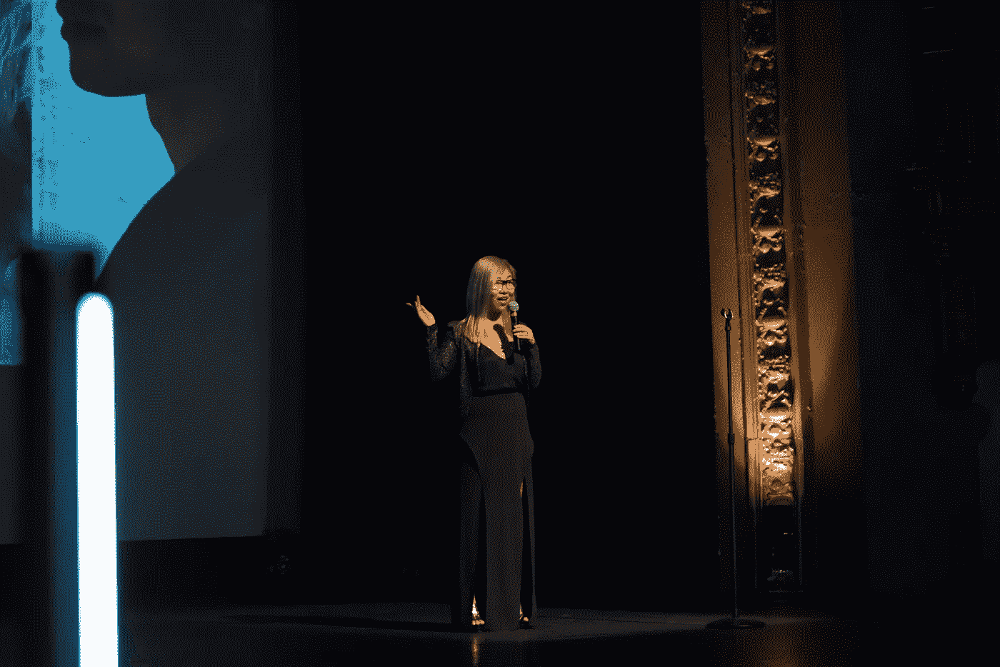
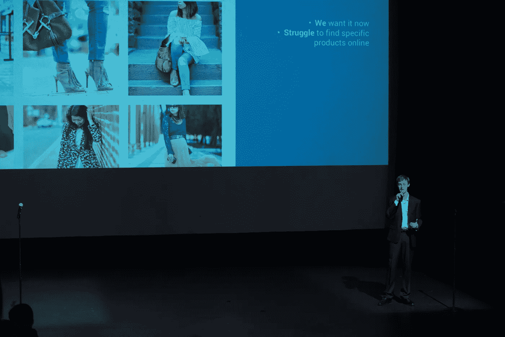
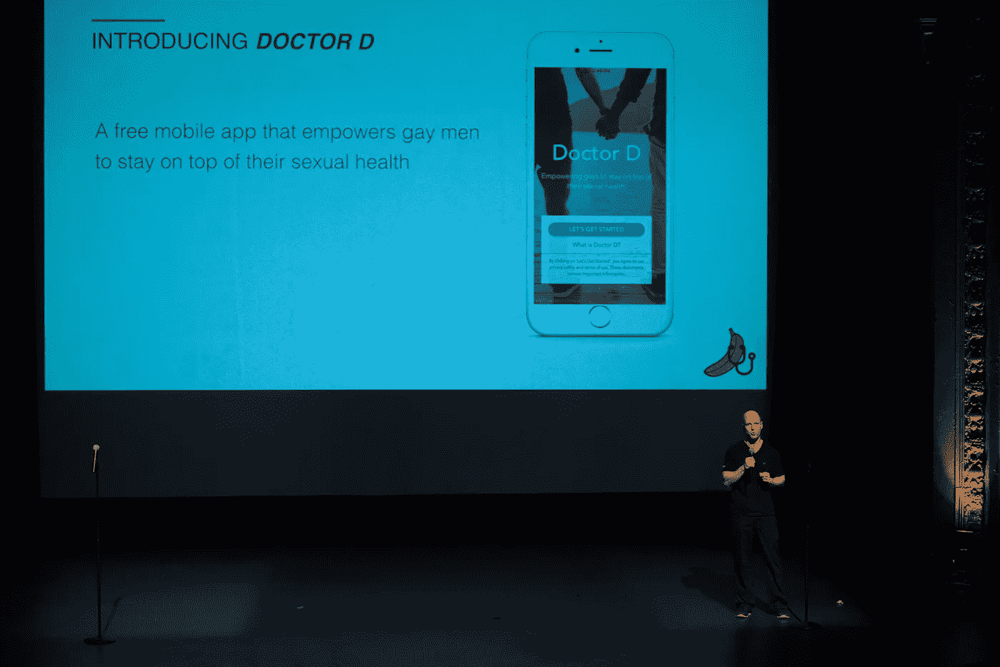
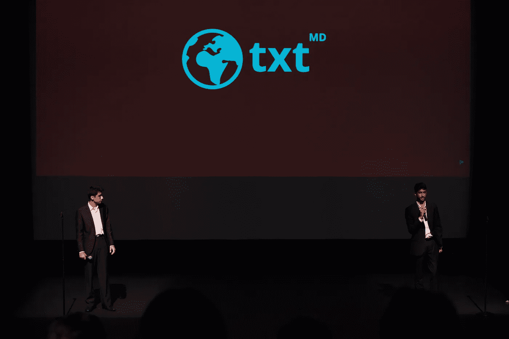
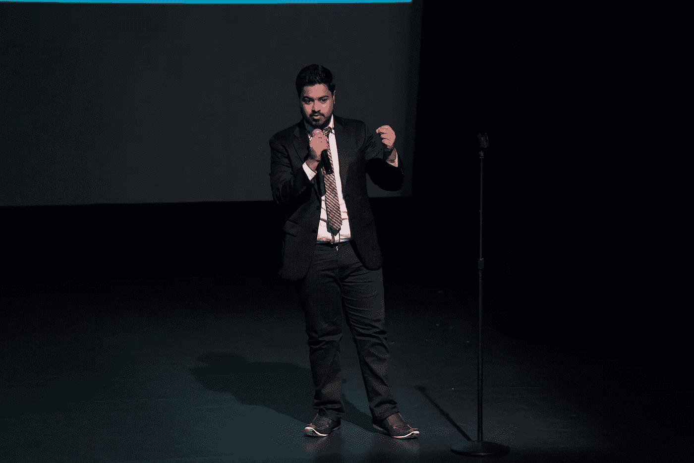

# 这 13 家新的创业公司诞生于黑客马拉松

> 原文：<https://medium.com/hackernoon/these-13-new-startups-were-born-at-hackathons-b758c37dde42>

## ……他们飞到三藩市，在 11 月 3 日 AngelHack 的[全球演示日](http://globaldemoday16.com)上，向一屋子的湾区创业社区、投资者和来自 [HACKcelerator](https://medium.com/u/d12b11b4aabd#.ely24aeul) 的邀请。

预加速器专注于帮助非常早期的初创公司建立 MVP(最小可行产品)，但使加速器计划与众不同的是，它是世界上唯一一个专注于黑客马拉松项目的计划。阅读更多关于迄今为止的一些[成功故事](/angelhack/5-startups-that-prove-the-hackcelerator-breeds-awesomeness-f12dc3e6c3bf#.bi7uctdsq)。

。了解下面的团队，以及他们在湾区创业世界中学到的东西。

# [automater . io](http://automatter.io/#index)

**德克萨斯州奥斯汀**——[automater . io](http://automatter.io/#index)实现电子邮件、聊天和电话的自动化。让 Gmail 和 Zendesk 更上一层楼。

当你赢得你的黑客马拉松比赛时，你有没有想过对黑客组织者有什么期望？

> 当我们赢得黑客马拉松的时候，我们多少知道会发生什么。我们被每个人聚集在一个地方所震撼。人太多了，我们打破了一切——Slack、WebEx、Hangout。我惊讶于世界上所有不同的人都在一起建造东西。— [杂注](https://medium.com/u/ee0a39c69ca7# <a class=)
> 
> **印度孟买**——[# Pragma](http://hash-pragma.xyz/)旨在保持互联网无儿童色情内容。
> 
> 
> 
> 在黑客时代，你学到/发现的最有价值的东西是什么？
> 
> > 你的奉献和你的技能一样重要。—奥姆卡尔·帕蒂尔

# [巴里迪](http://bareedee.co/)

**巴勒斯坦拉马拉** — [BareedEE](http://bareedee.co/) 为企业提供一个易于使用的平台，通知自由快递员有包裹要送。

在黑客时代，你学到/发现的最有价值的东西是什么？

> 3 个月的黑客生涯让我明白，为了确保初创公司稳步前进，并让每个成员对自己的可交付成果负责，每周都有可交付成果是多么有价值。沙赫尔·侯赛因

# [HypeHash](http://www.hypehash.com/)

**斯里兰卡科伦坡—** [HypeHash](http://www.hypehash.com/) 是全球第一个以标签为中心的时尚设计师买家平台。

**如果你有愿望，你会在全球演示日为你的团队做些什么？**

> 脱颖而出，成为第一个来自新兴国家的冠军！—拉维汉斯·韦塔克波塔

# [旁路](http://gobypass.com/)

**加州洛杉机—** 使用机器学习和大数据技术的安全路线图应用。遇到[绕道](http://www.gobypass.com/)。

到目前为止，你觉得 SLV 周怎么样——你有什么体验？

> 有很多东西扔给我们。我们正在从容应对一切，并真的试图找出如何最好地表达我们的信息。有能力和这么多我们以前没有接触过的人说话是非常有用的。—哈里·狄克逊&赫米尼奥·格拉西亚斯

# [Elev8](http://www.elev8learning.co/)

**俄亥俄州辛辛那提**—Alexa 的 Wix， [Elev8](http://www.elev8learning.co/#/) 通过自动化技术细节，使构建和发布 Alexa 应用变得容易。

**全球演示日你最期待什么？**

> 向职业选手投球的机会！—瑞安·埃切特纳赫特

# [卢斯特](https://lustr.style/)

**澳大利亚悉尼—** [Lustr](https://lustr.style/) **是一个** B2C 平台，通过智能地将新兴时装设计师与时尚购物者匹配起来，增加他们的销售额。

**全球演示日最让你紧张的是什么？你如何克服这种恐惧？**

> 我们担心在短短的 3 分钟内传达我们的信息。练习，练习，练习！——梁安琪

# [流浪者](https://mahahahajan.github.io/NomadLandingPage/)

**加州硅谷—** [Nomad](https://mahahahajan.github.io/NomadLandingPage/) 正在帮助零售商将物体识别集成到他们的电子商务解决方案中。

硅谷周中你最喜欢的事情是什么？

> 团队的指导和反馈真的对球场很有帮助。——[伊森·里德](https://medium.com/u/f25290bd008d?source=post_page-----b758c37dde42--------------------------------)

# [医生 D](http://askdoctordick.com/)

加州圣弗朗西斯科——[医生 D](http://www.askdoctordick.com/) 是一款手机应用程序，让同性恋男子能够掌控自己的性健康。

**几乎所有其他黑客团队都飞到了旧金山，但你们是当地人。你对硅谷周和全球演示日有哪些期待？**

> 在过去的几个月里，我们大部分时间都在分开工作，所以在硅谷周一起回来和导师们一起工作非常有用，并且每天有差不多 14 个小时的球场练习。—大卫·恩斯特

# [TXT MD](http://www.txtmd.xyz/)

**加拿大多伦多**——[TXT MD](http://www.txtmd.xyz/)通过短信诊断发展中国家的病毒性疾病。

**我们已经安排了一些大牌评委，一些来自大型加速器(包括 YC、Techstars 和 500 Startups)。你最期待在哪个评委面前演示？**

> 实际上，我们最初被 YC 拒绝了。虽然他们有一个政策，如果你被拒绝，但能够给合作伙伴留下深刻印象，合作伙伴可以邀请你参加面试，所以这就是我们所追求的。归根结底，我们要把信息传递出去，这样我们才能专注于帮助他人。—基兰·西瓦吉辛甘

# [单桅帆船](http://sloopstream.xyz/)

**印度斋浦尔—** [Sloop](http://sloopstream.xyz/) 是一款面向实体电子商务世界的强大分析洞察工具。

**全球演示日你最期待什么？**

> 筹集资金，建立联系，建立关系网。我们已经在大日子前后安排了一些会议。所以主要目标是建立有用的联系。Kunal Sachdeva

# 哪个创业公司会大获成功？下面评论！

> [黑客中午](http://bit.ly/Hackernoon)是黑客如何开始他们的下午。我们是阿美族家庭的一员。我们现在[接受投稿](http://bit.ly/hackernoonsubmission)并乐意[讨论广告&赞助](mailto:partners@amipublications.com)机会。
> 
> 如果你喜欢这个故事，我们推荐你阅读我们的[最新科技故事](http://bit.ly/hackernoonlatestt)和[趋势科技故事](https://hackernoon.com/trending)。直到下一次，不要把世界的现实想当然！

