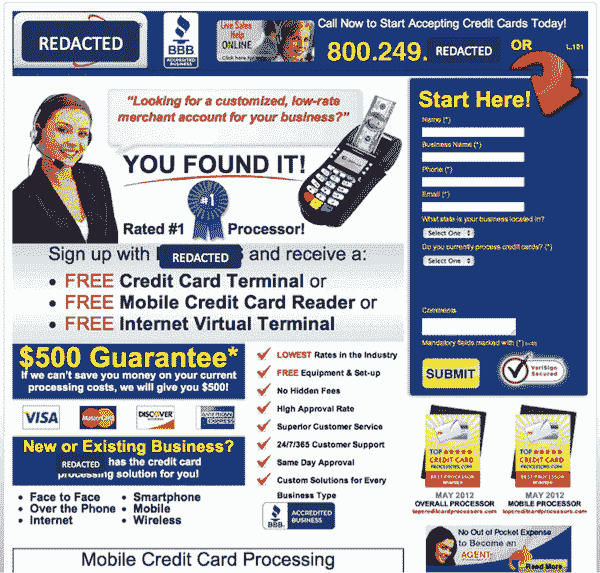
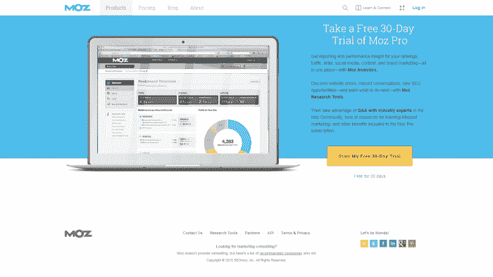
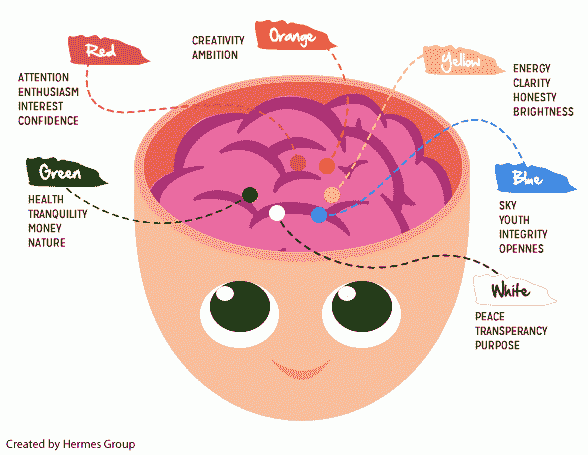
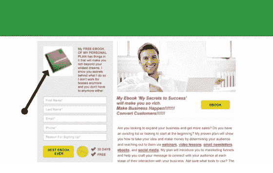
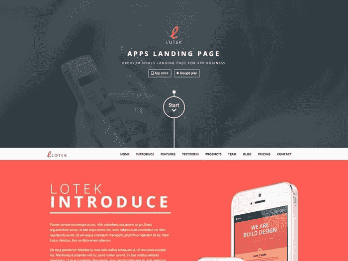
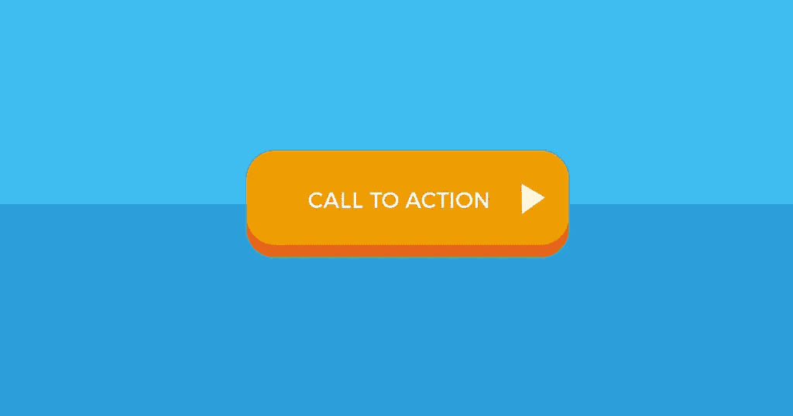
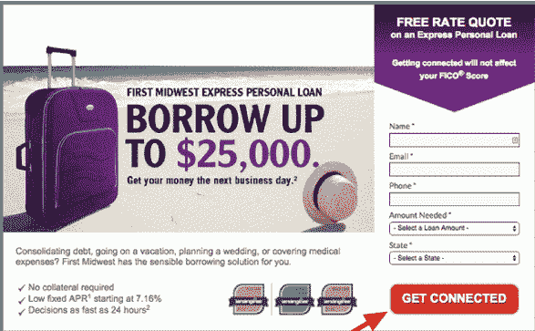
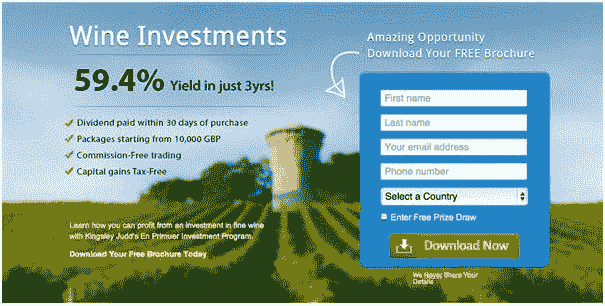
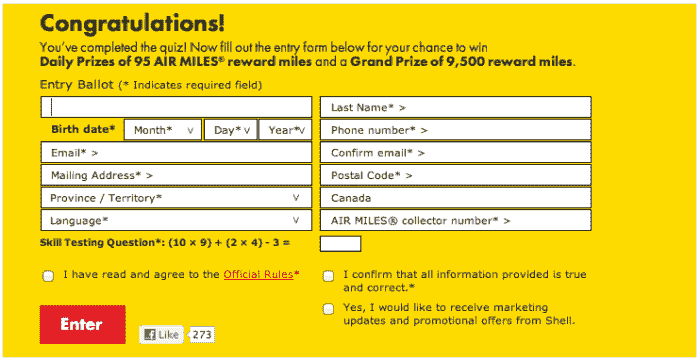
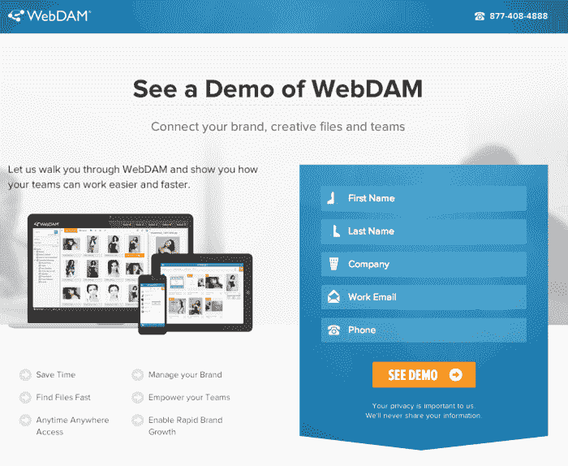

# 你还能如何提高登陆页面的转化率？

> 原文：<https://medium.com/hackernoon/these-4-minute-changes-can-actually-boost-your-landing-page-conversions-3461f9be570d>

## 4 个美丽的提示

Image Source: Unsplash

你需要更多的投资回报率吗？然后，你必须努力工作在你的登陆页面上。

来自登陆页面的高质量线索可以迅速增加你的网站转化率。你在网站上做的微小改变实际上可以让你的业务快速增长。

> "如果你已经在测试你的登陆页面，那太好了！"

对于那些毫无头绪或急于做出模棱两可决定的人，这里有一些简单明了的建议，可以帮助他们创建一个更好的登陆页面。

这些都是快速修复你的登陆页面的简单方法。

立即行动！

## **整洁的登录页面——总是成功**

你知道吗，你的投资中只有 1%带来了真正的转化机会？当有如此多的精力和金钱投入到一个登陆页面时，保持它的清晰非常重要。

登陆页面上过多的信息会变成剧透，访问者一登陆页面就会离开。一个登陆页面必须看起来容易让任何人理解他们为什么在你的页面上，以及他们需要从那里做什么。

由于大多数访问者都是浏览者，所以要让你页面上的所有描述简明扼要，让他们容易做出决定。

**行动计划:**

1)突出重要术语

2)支持友好导航

3)使用项目符号

4)设计得体的干净网页

**错误**:

**右**:

## **关注配色方案——合适的方案胜出！**

这在**社交网站**中起到了有效的作用。

颜色设计和网页上的图片一样重要。的确，吸引人的图片和非凡的色彩设计/组合大多是在网上分享的。登陆页面中合适的颜色组合是最重要的关注点。

一般来说，为登陆页面选择**好的颜色组合**可以对访问者产生积极的影响，吸引他/她在页面上停留更长时间。它可以带来更多的潜在游客，他们有可能成为你的付费客户。永远为你的网站使用互补色。这不是一项艰巨的任务。

如果你没有内部设计团队，网上有很多配色工具可以使用。

*   佩顿
*   *绘声绘色*

**行动计划:**

1)将颜色与产品搭配起来[例如。环境相关产品/服务的绿色或大地色调]

2)去掉导致眼睛疲劳的颜色[取决于观众的选择]

3)不要偏离常规字体颜色[黑色]

4)在登录页面上保持最少的颜色[最多 2-3 种颜色]

**错了**:

**右**:

## **CTA 为王**

Image Source: Flickr

你的登陆页面是你网站的主要位置，它比其他任何页面都更具营销性。保持你的登陆页面对访问者有效，这样他们会停留更长时间并采取预期的行动。确保 **CTA 按钮**被放置在网站上**的正确位置**，尤其是在页面上方。

据说，CTA 看似强大，却常常被忽视。人们通常不会向下滚动页面，除非有吸引他们注意力的东西。这可能是一个吸引眼球的图像或令人信服的短语。

很少有人将 CTA 称为“**主要行动号召**，因为在大多数情况下，它会成为你希望看到该页面的任何人执行的最重要的行动。换句话说，保持相关信息在屏幕上清晰可见，而不必向下滚动。代表您的**主要目标**的**按钮**必须易于识别。

**行动计划:**

1)对 CTA 使用对比色

2)以行动为导向的词语[行动起来的那种]

3)创造性地在按钮上制作 CTA，使其能够执行某个操作

4)选择 CTA 按钮的逻辑位置并突出显示。

**错误**:

**右**:

## **决定表单长度**

在通过广告活动或有机搜索结果将大量潜在客户推向你的网站后，将访问者转化为潜在客户的最聪明的方法是让他们通过在线表格注册。

它们通常是我们网站上其他目标的入口。例如，要使用一个产品，用户必须首先填写表单。这主要取决于用户在填写表格时的心理过程。他们达到目标花费的时间越长，你就越不可能让他们改变。

平心而论，这完全取决于网站的类型。在一些网站中,“D . o . b ”( D . o . b )( D . o . b )( D . o . b )( D . o . b )( D . o . b )( D . o . b )( D . o . b )( D . o . b )( D . o . b )( D . o . b )( D . o . b )( D . o . b )( D . o . b )( D . o . b )( D . o . b)。为了给你的**网站**决定**完美的表单长度**，做几个测试来检查你的访问者不习惯填写的内容。

当然，填写在线表格的清晰路径是需要考虑的最重要的因素。因此，必须通过对匹配的字段进行分组来很好地组织表单的布局。

**行动计划:**

1)有恒定的标签

2)使用清晰的字体[16 像素是安全的]

3)把它放在容易点击的地方[我们处于触摸设备的世界]

4)一般错误消息更有帮助

**错误**:

**右**:

登录页面与网站的分离将使您能够通过简化**分析**、**报告**和**测试**任务来专注于单一目标。此外，一旦有人登陆这个页面，你不再需要给出任何冗长的解释，因为你已经知道他们对你的产品感兴趣。

## 只要保持干净、简单，便于他们购买。