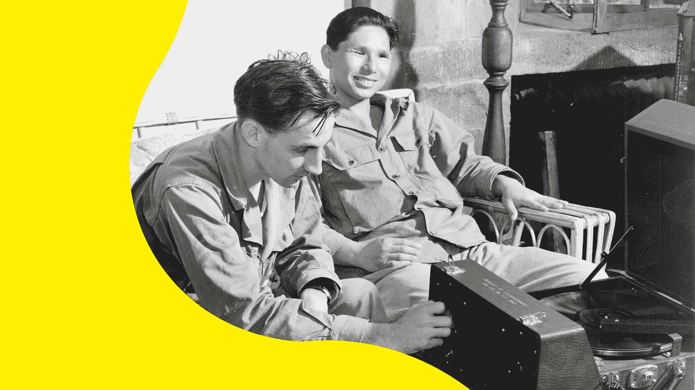
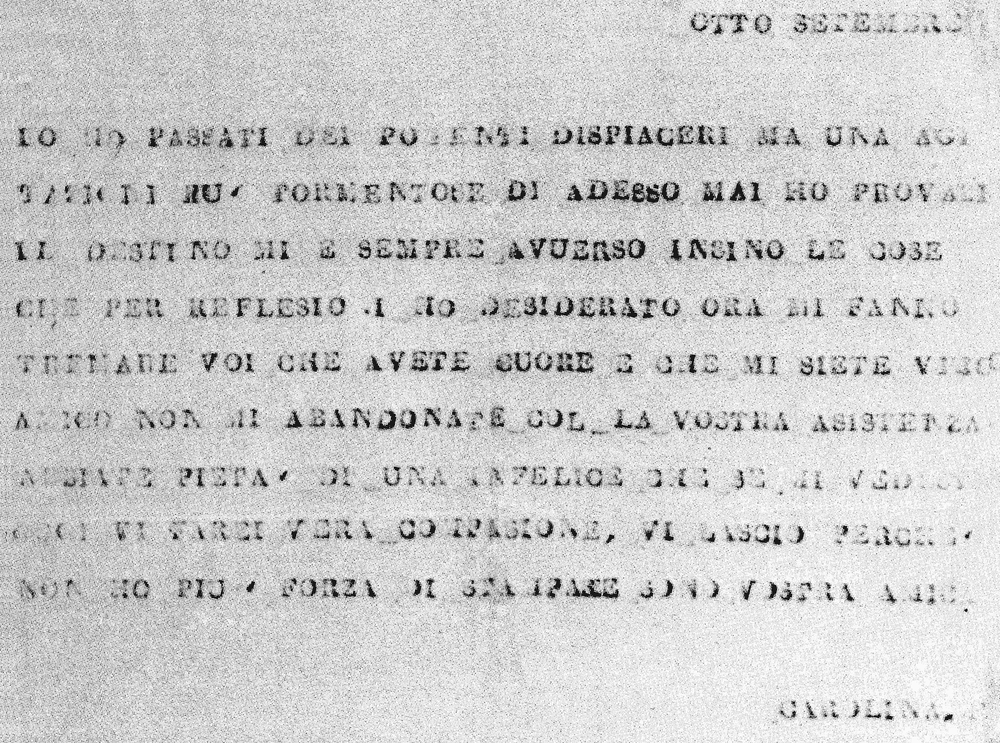
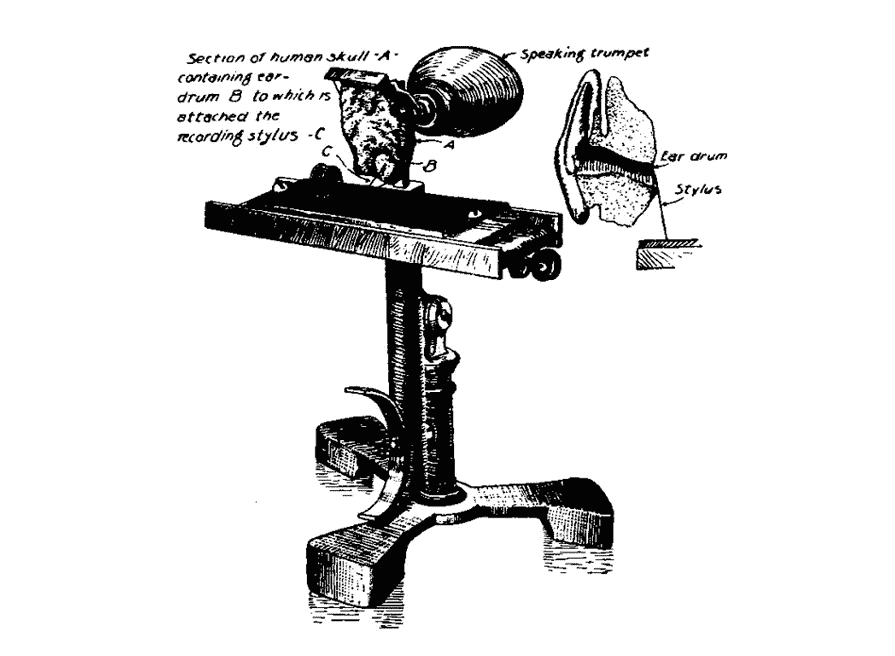
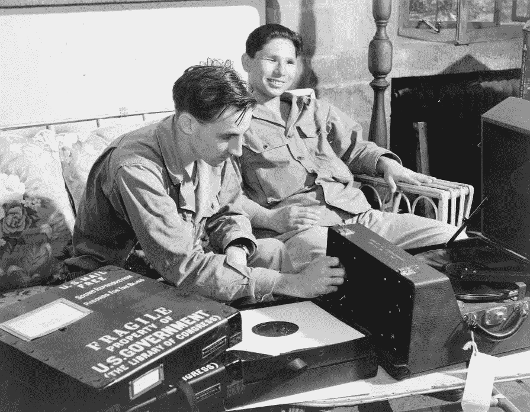
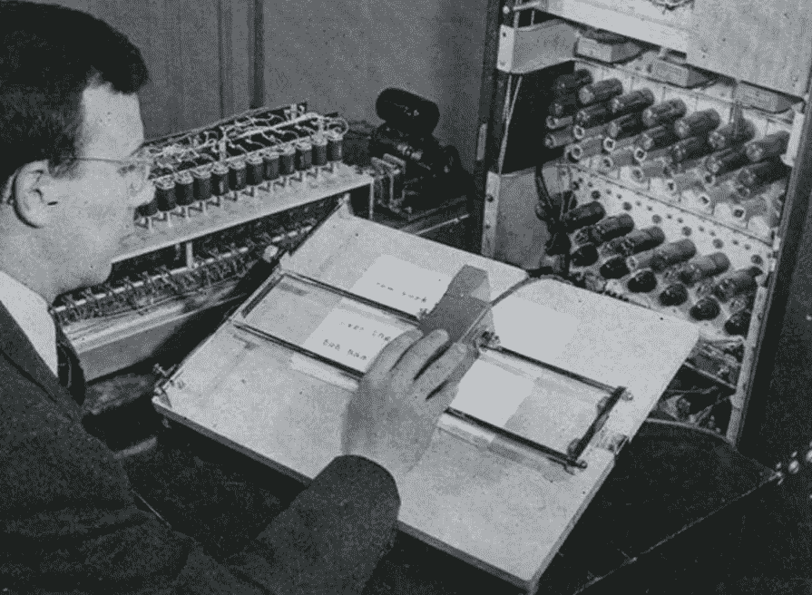

# 这 5 种日常用品都有一段隐藏的无障碍设计历史

> 原文：<https://medium.com/hackernoon/these-5-everyday-products-have-a-hidden-history-of-accessible-design-774d2adbcde8>

我在 BBC 设计数字体验。作为这个角色的一部分，我加入了无障碍冠军[网络](https://hackernoon.com/tagged/network)，并成为我们制作的东西中无障碍设计的倡导者。

自从加入该网络以来，我开始着迷于这样一个想法，即当我们设计所有人都可以访问的东西时，每个人的体验实际上都将得到改善，而不仅仅是那些有障碍的人，从而推动企业和整个行业的创新。

这方面的经典例子是在十字路口放下路缘石，这种解决方案最初是为轮椅通道开发的，但它对任何有手推车或有轮行李的人来说也是一个巨大的好处。

通过听[高清频道的奥古斯特·德洛斯·雷耶斯播客](https://www.highresolution.design/22-august-de-los-reyes-pinterest/0j09mvu7y8rezwlhkczqf6qrywenxy)，我了解到我们每天使用的许多产品都有一段不为人知的历史。

我做了一些研究，发现了五种产品，它们是为了满足可访问用户的需求而发明的，但直接或间接被主流采用，变得如此受欢迎，以至于它们最初的用途已经被遗忘了。

我现在就来揭晓。

## 打字机

佩莱格里诺·图尔里发明了一种打字机，这样他的盲人情人卡罗琳娜·凡托尼伯爵夫人就可以给他写信，而不需要她向书记员口述。

虽然机器本身丢失了，但伯爵夫人的信仍然存在。众所周知，Turri 的机器使用了与打字机和计算机键盘至今仍在使用的相同的按键原理来打印字符。

One of Countess Carolina Fantoni’s love letters via [OzTypewriter](http://oztypewriter.blogspot.co.uk/2014/05/put-black-in-for-me-carbon-paper-its.html)

## 电话

1874 年，亚历山大·格雷厄姆·贝尔发明了一种叫做“留声机”的装置，这种装置可以让失聪学生看到蚀刻在烟熏玻璃上的声音振动。这项发明使用了一种不寻常的成分……死人的耳朵。

正是这项工作使贝尔走上了两年后发明电话的道路。

Phonautograph complete with section of human skull via [The Baldwin Project](http://www.mainlesson.com/display.php?author=bachman&book=inventors&story=bell)

## 有声读物

有声书籍是留声机在 1877 年发明时的首批应用之一——正如托马斯·爱迪生所说，它们可以“毫不费力地与盲人交谈”

有声读物在 20 世纪 30 年代开始被更广泛地使用，当时它们被分发给在第一次世界大战中受伤的退伍军人。

直到 20 世纪 80 年代中期，有声读物才开始获得主流的吸引力。盒式磁带的引入使得有声读物更加便于携带，普通大众开始享受听而不是读的便利。

Blinded airman listening to talking book - *1944* [*Library of Congress*](http://www.loc.gov/pictures/item/93505800/)

## OCR 扫描仪

1949 年，RCA 实验室的 L.E. Flory 和 W.S. Pike 创造了一种机器，它使用光学字符识别(OCR)扫描文本，并大声朗读给盲人听(详见[科普](http://books.google.com/books?id=pCQDAAAAMBAJ&lpg=PA125&ots=3cnACr-VKH&dq=1949%20rca%20scanner%20blind&pg=PA125#v=onepage&q&f=false)杂志)。

这项发明从未在商业上起飞，但它刺激了一个全新的 OCR 行业。这项技术现在被用于从图书馆数字化档案到邮政服务扫描地址的方方面面。

W.S. Pike using the first OCR device — Herbert Luckett via [Modern Mechanix](http://blog.modernmechanix.com/early-ocr/)

## 坐立不安的纺纱工

最后，过去 12 个月席卷全球的热潮。虽然不是什么秘密，但有些人可能不知道坐立不安旋转器最初是为了安抚患有焦虑和注意力障碍的人，如自闭症和多动症。

2017 年初，它们成为全世界年轻人的必备小工具，整个行业都致力于发布新鲜、有创意的设计和发明新把戏。

[Dude Perfect](https://www.youtube.com/watch?v=3J6o7hcm8bE)’s Fidget spinner trick shots — 57 million views and counting

我被无障碍设计所吸引，因为它提供了棘手的问题——那种需要真正伟大的思维才能解决的问题。正如我们在这五个例子中所看到的，伟大的思想改善了数百万人的生活，经受住了时间的考验。