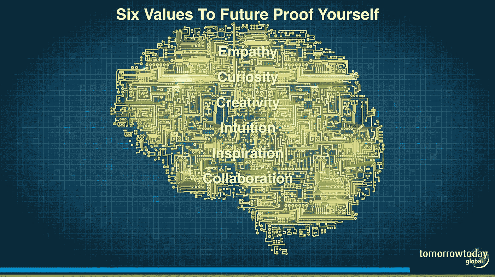

# 这是计算机、人工智能和智能机器不能做的 6 件事，但人类可以。至少在可预见的未来。

> 原文：<https://medium.com/hackernoon/these-6-things-computers-ai-and-smart-machines-cannot-do-but-humans-can-c9a8435ad4f5>

牛津大学的研究表明，机器人技术和自动化技术将在未来二十年内取代 47%的知识工作者的工作。所以，如果你不打算在未来的 10 到 20 年内退休，让我们面对平均寿命上升和养老金下降的现实，我们中的许多人可能永远不会在未来“退休”。

事实上，在明天今天，我们实际上预测到 2030 年，我们所知道的退休将会消失，至少我们所知道的概念将会被其他东西所取代。

无论哪种方式，我们大多数人都会感受到对自动化的影响。所以我们必须问自己这样一个问题:至少在可预见的未来，人类能做什么是计算机、人工智能和智能机器做不到的？答案在于六种独特的人类价值观。

1.  **同理心**关心错误的事情，并有热情和精力寻求更好的事情。
2.  探索和去别人从未去过的地方的好奇心。
3.  寻找激动人心的新解决方案的**创造力**。
4.  知道自己错了的直觉和跟随直觉尝试新路线的能力。
5.  激发他人加入你疯狂而又有意义的冒险的能力。
6.  与人和机器灵活协作的能力。

这是每个领导者和个人都需要掌握的六个价值观，以在未来证明自己不会被机器人取代。

以柏杨·史莱特为例，他是一名热情的潜水者，在地中海潜水时，他注意到漂浮在水面下的塑料购物袋比海蜇还多。现在，如果伯颜是一个机器人潜水员，他可能会注意到并识别出购物袋，但机器人伯颜不会在意。另一方面，人类伯颜变得非常担忧。

他关心海洋生物和依赖海洋生存的人类的生命，他的同情心驱使他开始了海洋清理活动。

他的好奇心让他发现，目前有 5 万亿块塑料垃圾，将近 250 亿吨。这些垃圾堆积在 5 个海洋垃圾带中，最大的是位于夏威夷和加利福尼亚之间的大太平洋垃圾带，其面积相当于现在的法国或德克萨斯州。有些路段太厚，被塑料堵塞，船只无法通过。

他的**创造力**让他发明了一种 [V 形阵列](https://bb166.infusionsoft.com/app/email/broadcast/~Link-29652~)，一种可以捕获塑料而不伤害海洋生物的浮动屏障。他的直觉帮助他明白“如果你试图与海洋抗争，你将会失败。”所以海洋清理阵列被设计得尽可能灵活。允许它随着波浪移动，“这是确保该结构能够在最极端的条件下生存的关键，”伯颜说。

他的 TED 演讲激励了数百万人支持他的倡议，认识到清洁海洋并不容易，伯颜一直小心翼翼地与世界知名的离岸公司和机构合作。

正如经济学家安德鲁·迈克菲(Andrew McAfee)所言，“当我们的机器变得有自我意识，并决定站起来协调对我们的攻击时，会发生什么，这种反乌托邦式的愿景并不缺乏。当我的电脑意识到我的打印机时，我就开始担心这些了。”说得好，正如柏杨·史莱特的故事所展示的那样，在那之前，享受一个由机器增强并变得更好的人类世界，因为正是这六个特征让我们成为独一无二的人类。

**想了解更多信息？**

成就非凡的事情[http://bit.ly/achieveremarkablethings](http://bit.ly/achieveremarkablethings)

迪安·范·卢文:[http://bit.ly/powerofquest](http://bit.ly/powerofquest)

[迪安](http://www.deanvanleeuwen.com/)正在寻求激励 5 亿[提问者](http://www.tomorrowtodayglobal.com/2016/03/09/the-rise-of-the-socia-intrapreneur/)他是[作家](http://bit.ly/leadersquest)、 [TEDx 演讲者](https://www.youtube.com/playlist?list=PLJdXjE5MXhn-AoC_quqEnDarihw3hgHsz)以及领导力、未来趋势和竞争优势方面的专家。他是 CEDEP(位于巴黎附近 INSEAD 校区的欧洲高管发展中心)的教员，也是牛津和亨利商学院的访问学者。作为一名成功的企业家，他共同创立了一家咨询公司 [TomorrowToday Global](http://www.tomorrowtodayglobal.com/) ，帮助领导者度过动荡时期。他的书[Quest:21 世纪的竞争优势和领导艺术](http://bit.ly/leadersquest)，在亚马逊有印刷版和 kindle 版。

你可以联系[dean@tomorrowtodayglobal.com](mailto:dean@tomorrowtodayglobal.com?subject=)预约迪安在你下一次活动中的[演讲](https://www.youtube.com/playlist?list=PLJdXjE5MXhn-AoC_quqEnDarihw3hgHsz)