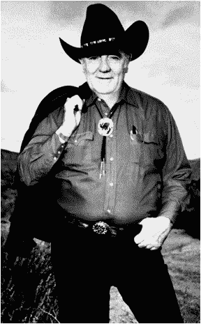

# 这些高中辍学生用一些简单的成长技巧粉碎了它

> 原文：<https://medium.com/hackernoon/these-high-school-dropouts-crushed-it-with-some-simple-growth-hacks-101c70e20c3e>

这篇文章的一个版本曾出现在《福布斯》杂志上。

Novelist and High School Dropout Louis L’Amour knew the importance of seemingly unimportant people (AP Photo)

“增长[黑客](https://hackernoon.com/tagged/hacking)”是当今最被滥用的术语之一，尽管它很时髦，但它比互联网早了几个世纪。自从商业出现以来，企业家们就一直在寻找聪明的捷径来刺激他们的[增长和绕过他们的竞争对手。](https://hackernoon.com/tagged/growth)

通过回顾过去，现代企业家可以借鉴前数字时代的技巧，这些技巧在今天仍然适用。这些聪明的想法通常来自不同寻常的来源，包括一个没有受过教育的嘉年华经营者，一个 15 岁从高中辍学的作者，一个十几岁离家出走的洗衣公司老板和一个 13 岁离开学校的餐馆老板。没错，下面描述的所有增长黑客都是由高中(和初中)辍学者创造的。

瞄准没有瞄准的目标，提供价值，忽略传统智慧

你可能没有听说过雷蒙德“帕皮”史密斯，但他利用他的初中教育成为一个娱乐帝国，改变了美国人看待赌博的方式。

他的成功是基于为一个被忽视的市场提供巨大价值，以及一些常识性的增长技巧。

帕皮 14 岁离开家，在接下来的 20 年里，他在巡回嘉年华的中途游戏公司工作。这些游戏包括向气球投掷钝飞镖，用软木塞填充的垒球打翻含铅的牛奶罐，以及由操作者操纵轮盘赌以达到特定数字，这些游戏都是众所周知的作弊行为，几乎不可能获胜。

在他演艺生涯的后期，帕皮开始不作弊地操作他的轮盘赌。商业繁荣。他将这一实验扩展到其他游戏，并意识到显而易见的事实——如果人们相信他们有公平的获胜机会，他们就会玩得更频繁。

帕皮后来说，“我想让他们赢”——他明白非法博彩运营商错过的交换条件。人们会为了赌博的娱乐价值而放弃金钱，但前提是他们觉得可能会赢。雷蒙德的创新导致了现代拉斯维加斯的诞生，在这里，赌场获得了相当可观的回报，平均回报率为 97%。

帕皮的一些常识性增长技巧包括:

*   目标——帕皮服务于一个被忽视的市场:女性。他的赌场光线充足，干净整洁，雇佣女商人，并提供儿童看护服务
*   教育——当他开第一家赌场时，赌博并不是主流。因此，他必须教育他的赌徒。为此，鼓励庄家建议不要下错注，并向新手玩家解释游戏
*   退款保证——如果你在帕皮的赌场输了，他会报销你的差旅费(这是一次性优惠)
*   娱乐——他是融合表演、烟火等的先驱。赌博的经历
*   营销——在汽车时代，帕皮在他赌场半径 500 英里范围内的广告牌上布满了巧妙的信息，所有这些信息都以“哈罗德俱乐部或破产”的标语结束。注意他赌场名称中的错别字，这是他缺乏正规教育的遗产，即使在他被告知这个错误后，他也拒绝改变。

**教训:** *(i)过度向你的用户传递价值。不管你卖什么，如果你能提供公平的价值，并提供比竞争对手更广泛的价值主张，你就会赢。(ii)做一个反向投资者，当所有人都在摇摆时，就摇摆。质疑传统智慧。(iii)寻找一个未被服务的市场，并根据目标用户的需求定制您的产品。*

**没有不重要的人**

美国西部作家路易斯·拉摩在十年级时离开家，在开始写作生涯之前做了十几年的各种流动工作。在流浪的日子里，路易斯学到了非常重要的一课，“世上没有不重要的人。”

《爱情先生》的销量最终超过了他同时代的几乎所有作家，成为有史以来第 20 大畅销书作家，仅次于斯蒂芬·金，销量超过 3.3 亿本。

一旦他成为一个知名作家，并开始旅行推销他的书，路易斯总是寻找当地的货架批发商——那些在超市和药店收银台旁边的架子上摆放平装书的人。他会和这些谦逊的人在一起，经常带他们去吃饭，边喝边认识他们。

路易斯知道，传统上，批发商很少或根本得不到作者的认可，但他们展示(或不展示)作者书籍的方式会极大地影响其销售。

遇到一个真正对它们感兴趣的名人作家的影响确保了在前亚马逊时代，路易斯的平装书总是图书购买公众的前沿和中心。

**第一课:** *你所在的行业中有哪些散户？要明白没有“不重要的人”这种东西，尊重并认可每一个能够帮助你创业的人。*

*你可以在推特上关注约翰:*[***@ johngreathouse***](https://twitter.com/#!/johngreathouse)*。*

*图片来源:美联社图片*

> [黑客中午](http://bit.ly/Hackernoon)是黑客如何开始他们的下午。我们是 [@AMI](http://bit.ly/atAMIatAMI) 家庭的一员。我们现在[接受投稿](http://bit.ly/hackernoonsubmission)，并乐意[讨论广告&赞助](mailto:partners@amipublications.com)机会。
> 
> 如果你喜欢这个故事，我们推荐你阅读我们的[最新科技故事](http://bit.ly/hackernoonlatestt)和[趋势科技故事](https://hackernoon.com/trending)。直到下一次，不要把世界的现实想当然！

