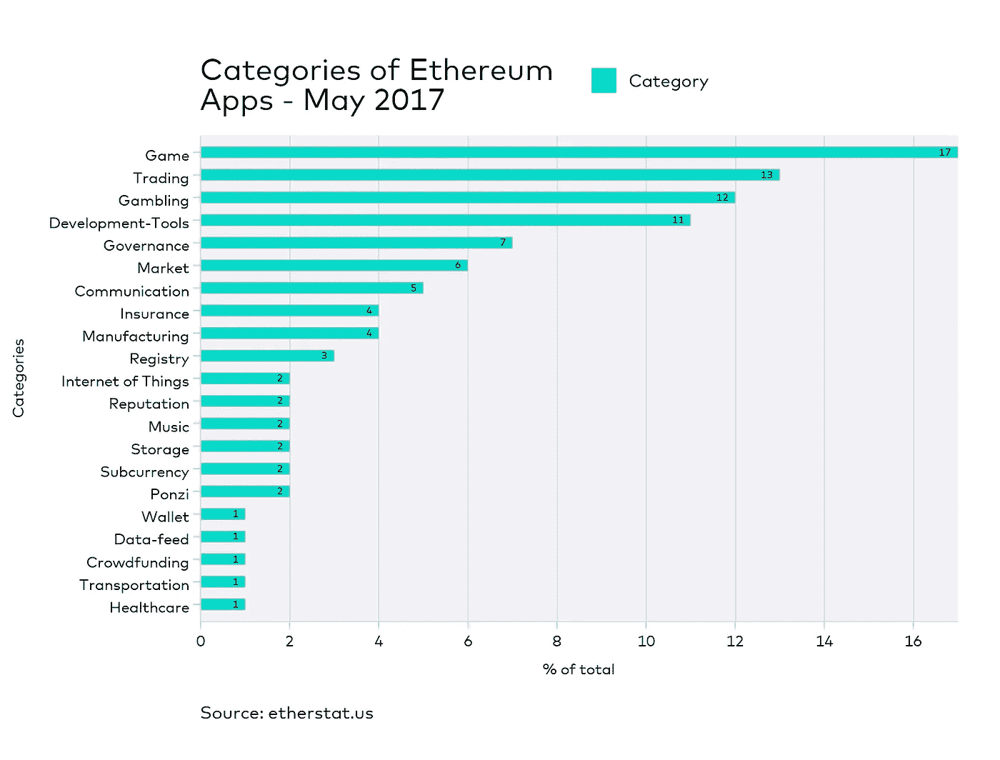
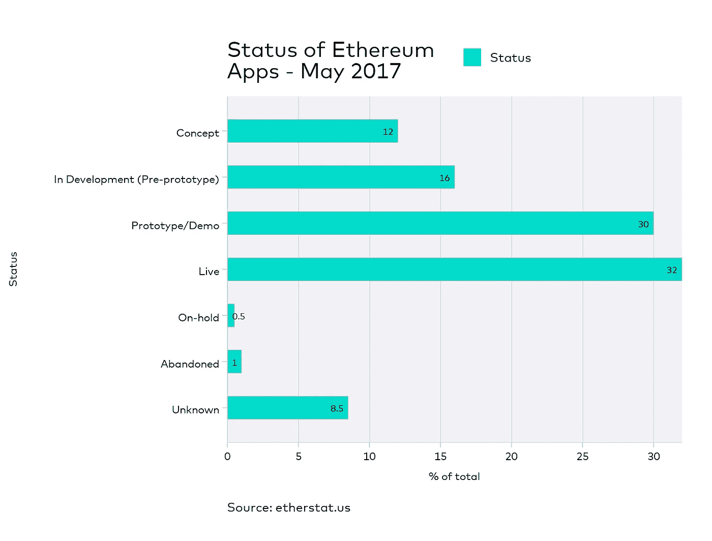

# 这些项目将决定以太坊的成败

> 原文：<https://medium.com/hackernoon/these-projects-are-going-to-make-or-break-ethereum-eaaf1b0463b6>

## 以太坊网络上正在开发的项目概述。

在过去的几周里，我从以太网广播和社交媒体平台收集数据。我将这些数据汇编到一个[中心平台](http://www.etherstatus.com)上，允许任何人探索和众包信息。

我最终得到的是一个包含 21 个类别的 407 个[以太坊](https://hackernoon.com/tagged/ethereum)项目的数据库。这个数据库将不断更新，我会报告每月的趋势。

**类别**

查看已知以太坊项目的类别，我们可以看到游戏目前是最大的类别，占已知总数的 17%。这个百分比加上交易、赌博和开发工具，占已知公共项目总数的 53%。

小便笺；类别游戏与赌博密切相关，因此很难单独分类。一些来源将赌博项目归类为游戏，而另一些来源则将其列为赌博。有人可能会说，赌场类别中的大多数 ICO 都被认为是游戏和赌博，因此将它们作为一个占 29%的群体来看待是有意义的。

**状态**

以上是当前[项目](https://hackernoon.com/tagged/project)的状态。32%的项目目前处于活动状态。请记住，这些是我们所知道的项目的统计数据，可能有更多的项目正在秘密开发。

大约 10%的项目要么被搁置，要么被放弃，要么不为人知。没有联系信息来收集必要数据的项目被简单地归类为未知项目。

**Etherstatus.com**

通过将这些信息放入数据库，并以清晰的界面呈现在网站上，我们可以更好地了解以太坊的现状及其项目。

所有这些信息都可以在我的网站[https://www.etherstatus.com](http://www.etherstatus.com)上公开获得，并将很快作为公共 API 提供。我目前正在更新网站，通过允许用户更新项目以换取以太网来众包数据。

如果你对这些报告感兴趣，API 或作为众包奖励的收入以太在这里加入我的邮件列表:[http://eepurl.com/cNVHxT](http://eepurl.com/cNVHxT)，也可以随时联系 marc@etherstat.us

马克·塔伦
etherstatus.comtwitter.com/MarcThalenEtherstat.com 捐款:[0xe 139 aa 506614 E0 fac 30222 B3 af 55 DC E0 ed 521 ea 7](https://etherscan.io/address/0xe139aa506614e0fac30222b3af55dce0ed521ea)

> [黑客中午](http://bit.ly/Hackernoon)是黑客如何开始他们的下午。我们是阿妹家庭的一员。我们现在[接受投稿](http://bit.ly/hackernoonsubmission)并乐意[讨论广告&赞助](mailto:partners@amipublications.com)机会。
> 
> 如果你喜欢这个故事，我们推荐你阅读我们的[最新科技故事](http://bit.ly/hackernoonlatestt)和[趋势科技故事](https://hackernoon.com/trending)。直到下一次，不要把世界的现实想当然！

