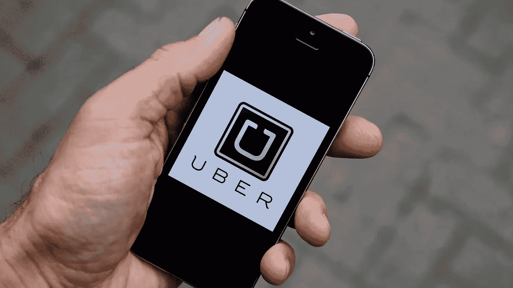
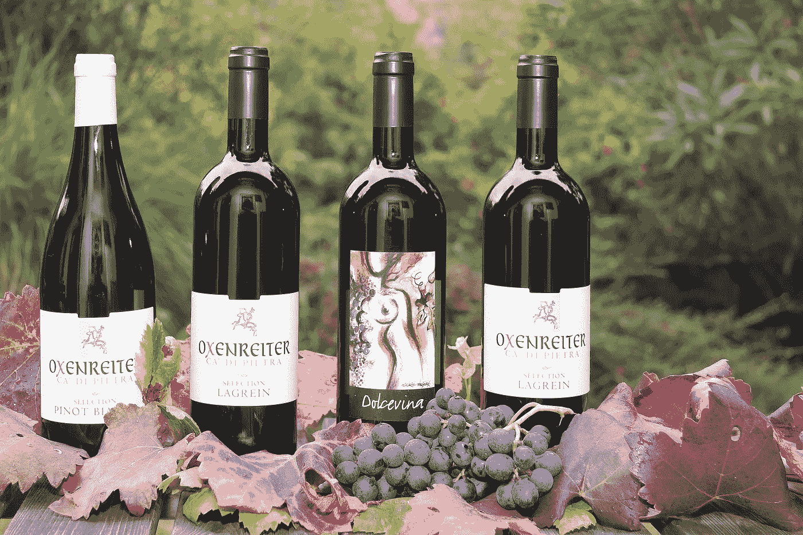
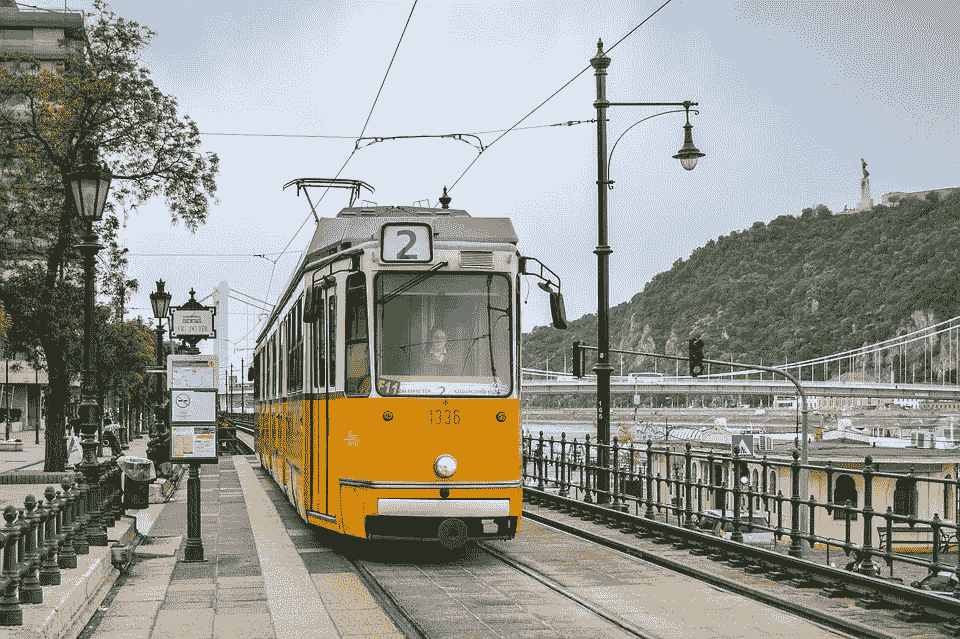
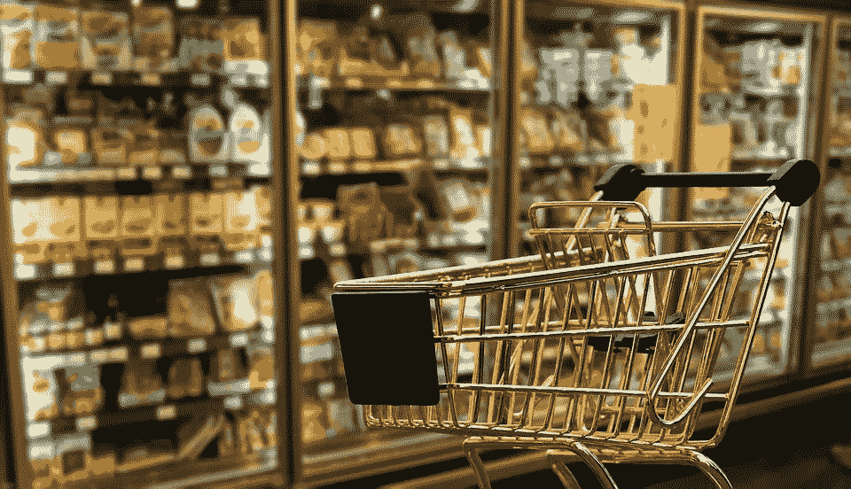

# 24 个我无法忘怀的应用创意！

> 原文：<https://medium.com/hackernoon/these-what-are-the-apps-you-would-love-to-have-c665b63b756c>

*爱上来自* [*的贴纸*](https://medium.com/u/89e606173af3?source=post_page-----c665b63b756c--------------------------------) *。*

## 对不起

这些应用程序现在处于 ***敏捷思维模式*** 。不过，总得有人帮我建造它们。

我可以咆哮于来自平行宇宙的信号/无线电波。但这件事已经困扰我很久了。

几天前，带着那种‘T14’想要‘T15’的感觉，我在一家 **LandMark** 专卖店，希望能偶遇加里最近的一次下跌——**碾碎它。**确保我检查了每个架子。毫无疑问，找不到它的副本！

查看了**管理手册/自助**页面的每个角落。

没有。没有这样的迹象。

我马上赢得了商店主管的好感。

**我**先生，我期待着一本书的出现。作者: **GaryVee** 。(人们说这是生的，胡言乱语)。介意查一下商店的数字目录吗？

**门店主管**确定。(带着犹豫的微笑)。嗯，看起来你运气不好，因为我们没有存货了。对不起。

**我**哇！好吧。仅供参考，我已经四处寻找了一段时间。不管怎样，谢谢。

我艰难地走着自己的路，思考为什么没有一个应用程序通过运行**快速扫描**来发现商店是否有特定书籍/物品的库存？！(可使用**图像识别技术**对带有外标签的图书进行识别。或者，通过输入其**唯一 ID** 将该物品拣出。

> 我有时会变得相当反思。

## 所以，以下是从那时起我就一直在想的 **24 个应用想法**。

让我们把它们分组，然后继续，这样你就可以知道哪一个垂直方向是你愿意设计的下一个应用的基石。

> **扰流板警告**:我可能偷了你的一些。P:好的

我们都存在于同一个世界，面临着同样的问题。

因此，有些想法可能会和你的想法产生共鸣。甚至可以是你的**后生活书签**中的那个。有可能。*只是说*。

## 从现在开始…

## 耐久品

> 如果可以的话，说出这些应用的名字，并留下评论。

*   自动为车辆加油(包括燃油和燃气)。汽油也是)。
*   当冰箱用完列表中的任何东西(应用程序内的可定制应用程序)并在线购买时发出警报(我有一个很长的列表)。
*   显示沙发和其他家具是否清除了**蟑螂的便便**(针对那些对*灰尘/螨虫过敏的人*)。
*   自动化**水循环**和**再利用**在家里。
*   **扫描垃圾桶**，显示可降解和不可降解垃圾数据。
*   保持**跟踪**家庭的**保修日期**(告诉我们何时停止愤怒地砸东西)。

*   Syncs **UBER** 根据地图上的距离计算时间，让**三明治制作者**知道你什么时候到家。
*   **扫描**处方并显示**药品**(地点，商店名称)。
*   当**预测到房屋内有未知脚印**时发出警报。
*   将自己连接到耳机上(**神经网络**)。决定食物选择并实时点菜。

## 食物和饮料

> 如果可以的话，给这些应用命名，并留下评论。

*   **定期进行身体检查**并显示当天要食用的食物清单。
*   **预测**谁可能是**最匹配**去咖啡馆、餐厅、酒吧等。(那一天)使用**聊天记录**。
*   分析社交存在并扫描账单历史。然后**删除** **联系人**你和谁在食物上花了更多的钱。
*   显示预算友好的啤酒(如果您已经将您的银行账户与您的 **Pavlok** 关联，这是必不可少的)。
*   通过合并账单显示选择哪家**酒店**(经济实惠)。
*   比较多个餐馆的**评论**，然后**将乘坐**转移到最佳目的地(考虑旅行所需的津贴)。

## 运输

> 如果可以的话，给这些应用命名，并留下评论。

*   了解每月/每年的预算分配。
*   投标最快的送货无人机。
*   **冻结**在**家**内的每一个**功能**到了下班的时间(与日历同步，了解自己的优先级)。
*   **保留**服务站**中的**位置，并注明下次车辆服务的截止日期。
*   **虚拟酒精测试仪**(仅当驾驶员稳定时解锁)

## 零售

> 如果可以的话，给这些应用命名，并留下评论。

*   将个性化购物清单发送给 **Wegmans** 。
*   在线分析优惠券，并在记账时使用它们(当我们匆忙时，不会花力气去搜索和使用优惠券)。
*   根据一个人的工资和支出比例，在**一元店**保留席位。(只对炫耀的家伙有益的应用程序)

这些只是我众多想法中的一小部分。

但是你知道，我们的想法和我们的梦想一样快。在我们日复一日的忙碌中，我们忘记了擦肩。

难道你不认为社交媒体**的兴起**已经为我们每个人 ***保持联系*** 尽了自己的一份力量，不管我们愉快地接受着身体上的分离吗？

当然有。

让我们不要责怪福利(社交媒体、互联网等等)。)是我们过去一些最聪明的头脑留给我们的。让我们也不要牵连那些努力优化这个世界的人。

## 没有吗？伙计，你得乐观点。

## 如果你喜欢这些想法，就按那个按钮。并且记得在评论里留下你的想法。

## 再见:)