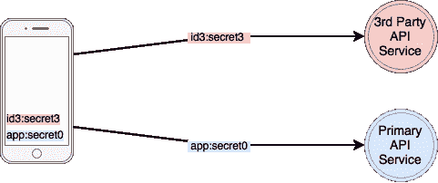
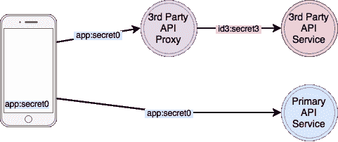
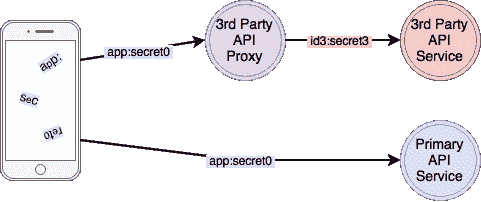
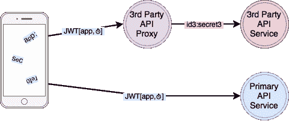
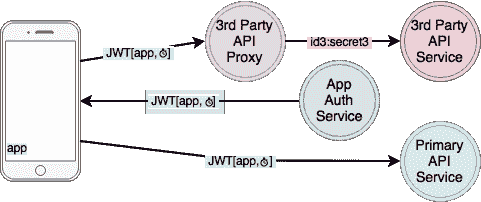

# 他们对 16k 应用程序进行逆向工程；这是我们要解决的问题

> 原文：<https://medium.com/hackernoon/they-reverse-engineered-16k-apps-heres-what-we-d-fix-67e9eeceefb5>

## 保护移动 API 密钥和机密的建议

在“[我们对 16k 应用程序进行逆向工程，这是我们发现的](https://hackernoon.com/we-reverse-engineered-16k-apps-heres-what-we-found-51bdf3b456bb#.q62corpmp)”中，Fallible 使用他们的[在线逆向工程工具](https://android.fallible.co/)来探测 Android 应用程序，寻找秘密。他们测试了超过 16000 个应用程序，发现其中大约 2500 个包含 API 密钥和/或秘密。如果他们的工具可以找到他们，那么那些想利用你的应用的人也可以。

让我们假设你正在开发一个 Android 或 iOS 移动应用程序。您的后端应用服务器通过 RESTful API 很好地公开了信息。为了验证您的移动应用程序，每个 API 调用都会传递一个 API 密钥。这个简单格式化为 <id>: <secret>的密钥，使后端服务器能够轻松识别你的应用并验证共享的秘密。您的移动应用程序还直接调用一些第三方 API，每个 API 都使用类似的关键策略。</secret></id>

我们将假设您使用 TLS 和[证书锁定](https://www.owasp.org/index.php/Certificate_and_Public_Key_Pinning)来试图防止您的 API 调用被观察到，但是您的 API 密钥都作为常量 XXX_API_KEY 存储在您的移动应用程序包中。如果你的任何 API 键可以在你的应用程序中被观察或发现，你就暴露了。

以下是一些建议:

# 1.尽量减少应用中的#秘密

我们真的需要你存储在应用程序中的所有秘密吗？数量惊人的密钥是用于第三方 API 的，我们认为我们可能会使用，但从来没有使用过。清除你应用程序中的所有秘密。

对于我们实际使用的第三方 API 密钥，考虑为所有这些服务设置代理服务器。

不要直接调用第三方 API，而是通过代理间接调用，使用您的主要应用 API 密钥作为身份验证。使用此方案，您可以从手机应用程序中删除所有第三方 API 密钥；它们隐藏在您的代理服务之后会更加安全。此外，如果您出于任何原因需要更改第三方 API 密钥，您可以这样做，而无需更新您的移动应用的安装基础。

我们刚刚将我们的关键需求减少到一个 API 密钥。如果该应用密钥被泄露，恶意参与者仍然可以通过代理使用第三方 API。在代理上，您可以添加一些额外的保护，例如，只允许某些 API 调用序列，以尝试限制损害。如果您的应用程序密钥被泄露，您将需要更改它并推出移动应用程序更新，但至少您不需要更改第三方 API 密钥。

# 2.混淆剩余的秘密

目前，快速搜索应用程序中的字符串将很容易找到剩余的 APP_API_KEY。使用[代码混淆器](http://stackoverflow.com/questions/14570989/best-practice-for-storing-private-api-keys-in-android)使定位和提取秘密常数变得更加困难。进一步考虑[以某种计算简单的方式编码 API 密匙](https://www.approov.io/blog/simple-app-authentication.html)并在你的应用程序中分割和分发编码的秘密。只在需要的时候重组和解码内存中的秘密。

您的密钥最终可能会被泄露，但要尽可能使其难以逆向工程。与代理 API 密钥不同，如果此应用程序密钥被盗，您将不得不升级整个安装基础来替换它。

# 3.发送令牌，而不是密钥

即使我们使用 TLS，攻击者仍然可以找到方法来观察我们的 API 调用。不要每次调用都发送完整的 <id>: <secret>，让我们使用<secret>来加密或签名所有或部分 API 通信。</secret></secret></id>

一个简单的方法是让移动应用程序使用<secret>对一个 [JSON Web 令牌(JWT)](https://jwt.io/) 进行编码，该令牌带有一个包含我们的< id >和一个短过期时间的有效载荷。</secret>

对于每个 API 调用，都会发送一个令牌来代替 API 密钥；API 秘密不会暴露。使用相同的<secret>，后端服务器可以验证令牌的编码和生命周期。每当前一个令牌过期时，移动应用程序都会生成一个新令牌。</secret>

如果令牌被盗，它可以用来调用您的 API 和代理，但它只会在该令牌的生命周期内成功，因此要保持较短的到期时间。

当然，如果模糊的秘密被泄露，攻击者可以生成有效的令牌，您仍然需要升级您的安装基础来修复它。

您可以通过不同的方式使用<secret>来获得其他好处。例如，[亚马逊 S3 REST API 签名和授权方案](http://docs.aws.amazon.com/AmazonS3/latest/dev/RESTAuthentication.html)使用<秘密>来提供额外的保护，防止消息篡改。</secret>

# 4.从应用程序中移除剩余的机密

我们可以从应用程序中移除最后剩余的 API 密钥吗？我们可以将令牌生成委托给设备外的服务，类似于我们如何将第三方 API 调用委托给代理服务。然而，要做到这一点，我们的服务必须能够识别我们真实的、未经篡改的应用程序，同时拒绝所有其他应用程序。

我们的应用程序认证服务将使用我们的移动应用程序的独特特征来证明应用程序的完整性和真实性。该服务的动态认证挑战将比模糊的静态秘密方法更有弹性。如果满意，认证服务返回一个有效的、有时间限制的 API 令牌。

现在，不仅您的 API 秘密不会被 API 调用暴露，而且您的应用程序的 API 密钥也不再暴露在您的移动应用程序中的任何地方。由于所有的 API 密匙都在服务器后得到保护，任何 API 密匙都可以更新，而不需要任何更新或失去对您的移动应用程序的服务。

# 后续步骤

一定要通过 Fallible 的[在线工具](https://android.fallible.co/)运行你的应用；他们为开发者社区提供了很好的服务。不过，注意，即使您通过了测试，也不意味着您的 API 是完全安全的，但是您已经在路上了。

请注意，所有这些技术都可以安全地与 [OAuth](https://oauth.net/) 用户认证方法相结合。关于 API 密钥和安全性的更多细节，请尝试[移动 API 安全技术](https://hackernoon.com/mobile-api-security-techniques-682a5da4fe10#.bby4c2bwn)。

我认为从您的移动应用程序中删除最后一个 API 密钥是对您的 API 安全性的一个重大提升，但是，完全公开，我在一个提供可靠的移动应用程序认证服务的团队中工作。如果你有兴趣，可以在[approv . io](https://approov.io)了解更多；我喜欢你的反馈。

感谢阅读！如果你能推荐这篇文章(点击❤按钮)，让其他人也能找到，我将不胜感激。

> [黑客中午](http://bit.ly/Hackernoon)是黑客如何开始他们的下午。我们是 [@AMI](http://bit.ly/atAMIatAMI) 家庭的一员。我们现在[接受投稿](http://bit.ly/hackernoonsubmission)并乐意[讨论广告&赞助](mailto:partners@amipublications.com)机会。
> 
> 如果你喜欢这个故事，我们推荐你阅读我们的[最新科技故事](http://bit.ly/hackernoonlatestt)和[趋势科技故事](https://hackernoon.com/trending)。直到下一次，不要把世界的现实想当然！

