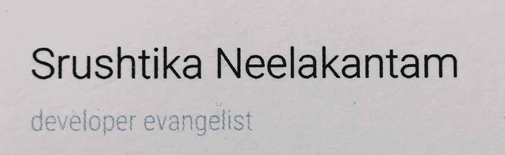
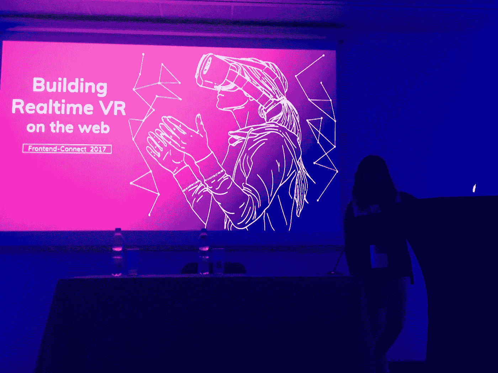
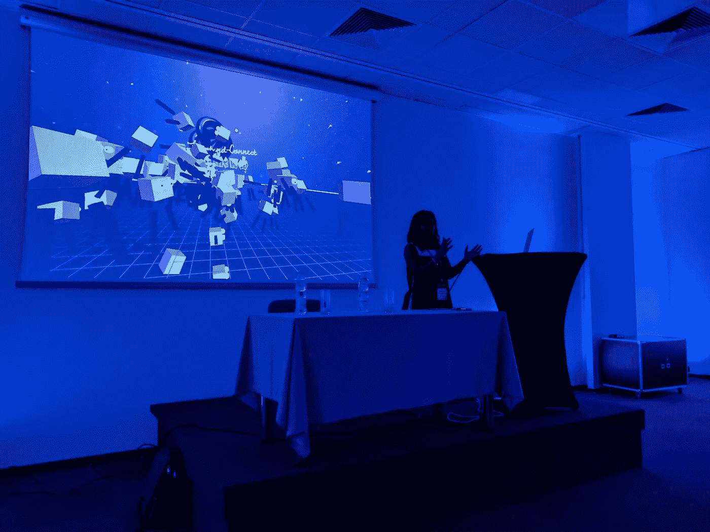

# 他们说我很幸运！

> 原文：<https://medium.com/hackernoon/they-say-im-lucky-ea4f8546cb0d>

今年早些时候，我从班加罗尔飞往保加利亚的索非亚，在一个名为欧洲移动通信会议的会议上发表演讲。那是三月，也是我作为一名计算机工程本科生的最后一个学期。我像往常一样谈论虚拟现实…啦啦啦啦..

等等！这个帖子是关于 Mobcon 的吗？不，不是的。

这个帖子讲的是之后发生的事情。因此，我想知道在这个事件中发生了什么，导致了之后发生了什么，这将是很有趣的。该死的，全是混淆视听的词？

嗯，在 Mobcon 期间，我遇到了一群了不起的人，演讲者，组织者以及与会者。我遇到的一个这样的人是 Phil Nash，Twilio 的开发者福音传播者。当我看到他的标题时，我超级好奇想知道它是关于什么的。这几乎是我第一次听到这个词！当他告诉我他所做的这些令人惊讶的事情，并因为做和谈论对他来说重要的事情而获得报酬时，我非常惊讶，心想这一定是一份非常棒的工作，对于像我这样喜欢谈论技术和接触来自世界不同角落的不同类型的人来说，这很容易成为一份“梦想的工作”。

六个月后，在一系列有趣且完全出乎意料的事情发生后，我现在在柏林，在一家名为 [deepstreamHub](https://deepstreamhub.com) 的令人惊叹的公司担任开发者传道者。(耶！)我来到柏林已经快一个多月了，在我工作的每一天、每一刻，都有很多学习和成长的机会。当我把这个告诉人们时，每个人都喜欢，哇，这是一些运气！有很多人指引我，帮助我到达现在的位置。

好吧，等等！我忘了提到这个故事中的一个重要细节。按时间顺序这发生在 Mobcon 事件之前。认识我的人都知道，在过去的四年里，我一直是 Mozilla 的志愿者和贡献者。因此，在这个漫长的旅程中，我有机会成为许多令人惊叹的事情的一部分——包括 Mozilla Techspeakers 计划。他们训练我说话，他们鼓励我谈论一项具有挑战性的技术，这就是我如何开始使用 A-Frame VR 的，并最终与人合著了一本小型入门书籍。

好了，让我们回到这篇博客真正的主题！这就是我上周在波兰华沙举行的 FrontendConnect 2017 会议上发言的内容。我演讲的题目是“在网络上构建实时虚拟现实”，这引起了许多与会者的注意(至少我是这么被告知的:P)

这是我第一次来波兰，因为我是从柏林飞来的，他们没有在我的护照上盖章，对此有点不满意。(我收集移民邮票，如果那是一件事的话)

所以，这个会议对我来说就是体验和曝光。我以前在会议上讲过话，但这是我第一次作为一个开发布道者参加会议。我使用了我以前经验中的所有技巧和诀窍，并且非常自信，而不是像上次那样超级紧张。

在一大群超级酷的演讲者中，我就像这个被欣赏的孩子，被建议在未来继续产生类似的影响。这一次，我享受作为一个孩子和被引导。这些令人惊叹的演讲者也是欧洲其他一些会议和聚会的组织者，他们说我很适合参加他们未来的活动。这样的恭维，多哇！

到这个时候，我觉得我完全失去了写这个帖子的目的。咩！

好吧，至少让我们谈谈我展示的东西。我用 A-Frame 做了一个 VR 演讲，只是这一次，我用 deepstream 为演讲提供了动力，告诉人们如何在网络上轻松制作实时运行的 VR 应用程序。我做了一个很酷的演示(至少我喜欢这么认为)，让观众中的每个人都实时连接到我的应用程序，一个幽灵般的化身会出现，并随着他们移动手机而旋转和移动。由于网速的原因，我对一些可能的延迟表示怀疑，但最终一切顺利，人们喜欢这个演示。(再次声明，如果他们撒谎，那不是我的错:P)

[演示](https://pear-hydrofoil.glitch.me)，相关代码和[幻灯片](https://speakerdeck.com/srushtika/building-realtime-vr-on-the-web)都是公开的(当然！).

如果你周围有一个会议，并且正在寻找像我一样的演讲者，只要在[推特](https://twitter.com/Srushtika) :D 上给我一个呼喊

我想，我今年确实很幸运，我期待着把它变成一些东西，让人们说，我值得这种运气，因果报应只是忠于我！