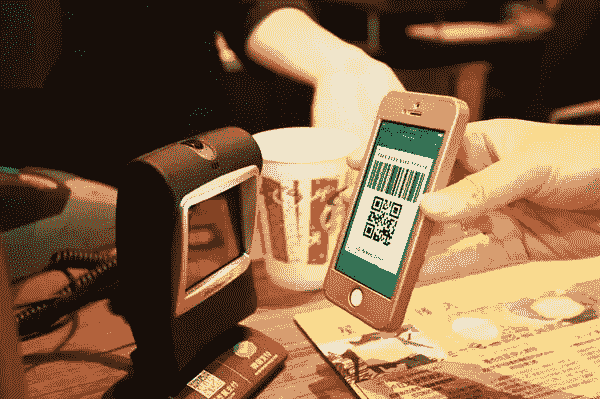
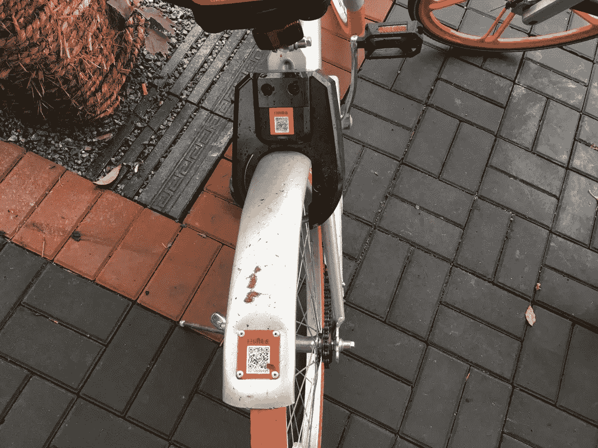
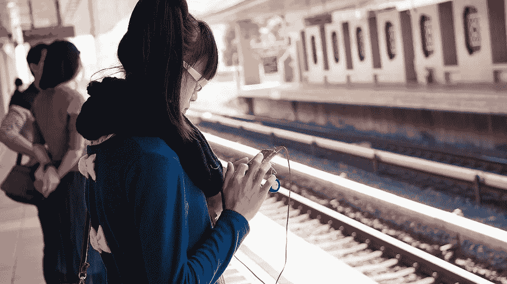

# 小偷正在中国扒窃钱包应用程序

> 原文：<https://medium.com/hackernoon/thieves-are-pickpocketing-wallet-apps-in-china-e64711c2bccc>

*Paying for Starbucks using WeChat in China. Photo credit: Tencent.*

二维码在[中国](https://hackernoon.com/tagged/china)至高无上。你可以用它支付几乎任何东西:街边小吃、卫生纸、龙虾大餐、足底按摩。你甚至可以用它来社交。在社交会议上，扫描某人的微信二维码而不是给他们你的名片并不罕见。

但是在上周发生了一起涉及欺诈性二维码和[1300 万美元被盗资金](http://www.chinadaily.com.cn/opinion/2017-03/02/content_28400890.htm)的事件后，中国最受欢迎的线下到线上工具的安全性正受到新的审视。

国有英文媒体网站《中国日报》(China Daily)在一篇专栏文章中写道:“一些犯罪分子将自己的二维码贴在原二维码上，以非法获取资金，因为普通消费者根本看不出区别。”。

“这就是为什么我们无力阻止二维码被用于欺诈活动，这也正是为什么使用二维码的企业应该承担自己的保护责任。”

*Users have to scan a QR code to unlock bikes from Mobike, a Chinese bike sharing startup. Photo credit: Tech in Asia.*

这不是二维码第一次在中国被用于恶意目的。二维码本质上是一个链接，可以用来[用病毒感染智能手机](http://tech.sina.com.cn/i/2013-12-03/16078971639.shtml)，然后让诈骗者从受害者的移动钱包(如支付宝)中窃取金钱。方法有时甚至更直接——不知情的受害者期望付款给店主或服务提供商，会被骗通过二维码转账。

> 不知情的受害者会被骗通过二维码转账。

最近，一连串的骗局与该国的自行车共享热潮联系在一起。用户通常可以扫码解锁租赁自行车；通过在自行车上贴上自己的二维码，欺诈者可以骗骑自行车的人向他们的账户转账 43 美元——与摩拜单车要求的押金相同。

随着印度等其他市场的科技初创公司准备推出自己的二维码解决方案，采取防御和主动的方法来保护用户将是至关重要的。(*亚洲科技*已联系摩拜单车寻求置评，尚未得到回复。)

“早期，当二维码刚刚出现时，支付宝担心网络钓鱼和病毒，”蚂蚁金服的一位发言人告诉亚洲科技。她表示，作为回应，阿里巴巴的子公司为其移动钱包开发了身份验证和加密软件，但拒绝透露该技术工作原理的具体细节。

此外，蚂蚁金服不得不对使用支付宝的店主和商家进行教育。“我们会告诉他们，他们必须保持警惕，确保其他人不会改变(他们商店里的)二维码，”她说。同样，该应用程序有推送通知，提醒用户可疑或危险的行为，比如当你的支付二维码截图被拍摄时。

# 人为误差

*Photo credit:* [*Antonio Tajuelo*](https://www.flickr.com/photos/antoniotajuelo/12264380453/in/photolist-jFLa2p-oH7nQP-ghrUrw-cjvaFj-cwCSwS-iZ7yzV-mbVdPp-h9FhsE-fapw4e-cwCSSG-d5eF5A-gFFfpL-dQYsnR-iZbsub-iZ9Evh-iZ7JrZ-kmLfur-fJEsQ9-g6WNbK-8V4AZA-bMj5dP-jLwrmN-qM9b6D-uSXTMe-o2XaJS-o9ropU-cwCSYS-qMsSo8-qTmTaY-eexbQj-a8iWWp-fPnaAU-fafkCf-oKxBoR-dzeR3Y-qNurGj-qe8d6H-fuC952-n4Tyyc-dXUXCf-f6ezMw-qLZsue-eSMaLJ-quAxSu-oU2mQv-qip8YS-fqjkoX-jCWw2S-quAAWf-e3RdY5)*.*

然而，保护软件是有限制的。如果用户没有受到适当的教育，欺诈者可能会通过伪造的二维码和网络钓鱼方案绕过[网络安全](https://hackernoon.com/tagged/cybersecurity)补丁。网址也是如此——除了二维码，很难通过看它来辨别其合法性。

“从网络安全的角度来看，二维码[……]没有固有的安全缺陷，但容易被恶意滥用，”香港科技大学网络安全实验室主任张朝阳副教授告诉【T4 科技亚洲论坛】。

> 需要更多的教育来提高用户意识，就像我们对香烟包装所做的那样。

他将其与 HTTP 进行了比较，HTTP 是一种在许多网络浏览器中用于数据通信的协议。他说，尽管网络浏览器和网络用户已经进化到“接受网络安全的概念”，但协议本身在很大程度上保持不变。因此，二维码安全的责任属于公司，如生成和读取二维码的公司。这些代码应该被数字签名，扫描仪应该被设计成更仔细地检查二维码。

但是用户也必须变得更加精明。

查尔斯说:“由于二维码很神秘，它们给大众用户一种安全的错觉。”。“当然，需要更多的教育来提高意识，就像我们对香烟包装所做的那样。”

举个例子，去年九月，中国东北的一名男子在火车站被偷了大约 100 美元。根据他的报告，一名年轻男子向他要现金，承诺立即通过支付宝转账相同的金额。当转账失败时，欺诈者归咎于互联网连接，并表示他将稍后完成支付。有时候，无论你的技术有多强大，你都无法防止人为错误。

*人民币兑换成的货币。汇率:1 美元= 6.91 元人民币。*

*原载于* [*亚洲理工*](https://www.techinasia.com/fake-qr-code-scams-china) *三月。*

> [黑客中午](http://bit.ly/Hackernoon)是黑客如何开始他们的下午。我们是 [@AMI](http://bit.ly/atAMIatAMI) 家庭的一员。我们现在[接受投稿](http://bit.ly/hackernoonsubmission)并乐意[讨论广告&赞助](mailto:partners@amipublications.com)机会。
> 
> 如果你喜欢这个故事，我们推荐你阅读我们的[最新科技故事](http://bit.ly/hackernoonlatestt)和[趋势科技故事](https://hackernoon.com/trending)。直到下一次，不要把世界的现实想当然！

