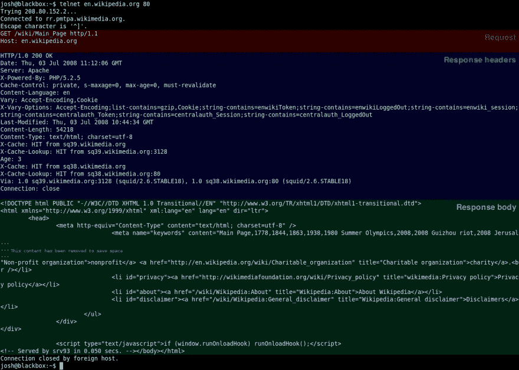

# 本周我复习的内容:HTTP 请求生命周期

> 原文：<https://medium.com/hackernoon/things-i-brushed-up-on-this-week-the-http-request-lifecycle-a321775a1282>

After a week of staring at this GIF I still can’t tell if it’s a dog or a hedgehog

我最近一直在面试，正如大多数开发人员所知，在面试中你可能会被问到的问题的广度和深度是不可估量的。考虑到这一点，我一直在询问招聘人员，在技术面试中我可能会被问到什么问题。有时我发现很难在我的头脑中保持所有可能的问题类别，更不用说问题本身了。我在压力下容易忘记事情， [*就像 bash 中的*](https://stackoverflow.com/questions/9553628/piping-and-redirection) `[*|*](https://stackoverflow.com/questions/9553628/piping-and-redirection)` [*是针对流程/程序的，*](https://stackoverflow.com/questions/9553628/piping-and-redirection) `[*>*](https://stackoverflow.com/questions/9553628/piping-and-redirection)` [*一般是针对文件的*](https://stackoverflow.com/questions/9553628/piping-and-redirection) 。为了更好地保留信息并强迫自己写作，我决定开始张贴我温习过的内容。我倾向于需要至少 3 个来源来获得一个完整的、正确的、写得很好的主题解释。我想为其他人巩固这一点。

本周，我查看了 HTTP 请求生命周期。这是一个非常宽泛的概述，它针对的是简单的 HTTP 1.1 请求，而不是持久连接，但是它可以作为 HTTP/2 和持久连接请求的一个很好的起点。我不会过多地介绍各种 HTTP 方法，因为这可能是一篇独立的文章，并且因为它们与许多开发人员的工作流程非常接近，读者可能已经掌握了基本知识。

> 注意:Medium 不支持脚注，所以所有脚注都链接到原始 dev.to post

## 步骤 1:本地处理

根据您想要获得的深度，根据发出请求的应用程序，在这个步骤中可能会发生很多事情。我将继续理解这个请求是由浏览器发出的，而不是 cURL，一个像 Postman 这样的 API 客户端，或者其他一些应用程序。

1.  您的浏览器提取“方案”/协议(我们已经建立了
    这将是 HTTP)、主机(*www.example.com)*，以及可选的端口号、资源路径和查询字符串，这些都在表单`<protocol>://<host><:optional port>/<path/to/resource><?query>`中指定。一个例子是`|http|://|www.example.com||:5000||/mainpage||?query=param&query2=param2|`
2.  既然浏览器已经有了请求的主机名，它需要解析一个 IP 地址  。然后，浏览器会查看自己最近请求的 URL 的缓存、操作系统最近查询的缓存、路由器的缓存和 DNS 缓存。

Making GIFs is hard

## 步骤 2:解析 IP

与本地完成的处理一样，从“DNS 服务器”  解析 IP 是一个包括许多步骤的序列，如果第一个请求未能返回地址，还包括故障转移。

I have no idea whether this dot is actually on the shortest path

1.  如果缓存查找失败(我们假设它会失败)，您的浏览器将使用[*UDP*](https://en.wikipedia.org/wiki/User_Datagram_Protocol)*发出一个 [*DNS 请求*](https://tools.ietf.org/html/rfc1035) 。DNS 请求包含为您的 DNS 服务器预先配置的 IP，并在其标题中包含您的返回 IP。您尝试解析 IP 的主机名位于请求的“问题”部分。UDP 是一种轻量级协议，但代价是它不提供交付方面的保证，并且除了发送和接收响应之外没有确认。*
2.  *您的请求现在必须通过许多网络设备才能到达其目标 DNS 服务器。每当数据包到达一台网络设备时，该设备就会使用路由表来确定它所连接的另一台设备最有可能位于到达目的地的最短路径上。 [⁴](https://dev.to/dangolant/things-i-brushed-up-on-this-week-the-http-request-lifecycle-#fn4)*
3.  *一旦您的请求到达您配置的 DNS 服务器，服务器就会寻找与请求的主机名相关联的地址。如果它找到一个，它发送一个响应。另一方面，如果您的目标 DNS 服务器无法定位给定的主机名，它会将请求传递给另一个它被配置为*委托*的 DNS 服务器。这种情况递归地发生，直到找到地址，或者命中一个 [*【权威】域名服务器*](https://en.wikipedia.org/wiki/Name_server#Authoritative_name_server) 。如果无法解析给定域的地址，服务器会以失败响应，并且您的浏览器会返回一个错误。*
4.  *尽管如此，我们将假设请求是成功的，因为所有这些仍然是一个前兆。如果响应返回(记住，使用 UDP 是没有保证的！)，请求客户端现在有了一个目标 IP。它还会收到一条信息，作为答案的一部分，让它知道返回的答案可以缓存多长时间。这意味着后续请求将从**步骤 1.2** 到这里走捷径。*

## *步骤 3:建立 TCP 连接*

*现在客户机有了 IP 地址，它可以发送一个 HTTP [⁵](https://dev.to/dangolant/things-i-brushed-up-on-this-week-the-http-request-lifecycle-#fn5) 请求，对吗？差不多，但是首先，由于请求是通过[*TCP*](https://en.wikipedia.org/wiki/Transmission_Control_Protocol)*[⁶](https://dev.to/dangolant/things-i-brushed-up-on-this-week-the-http-request-lifecycle-#fn6)发送的，这是一个*传输层协议*像 UDP，客户端必须打开一个 TCP 连接。**

1.  **TCP 和 UDP 的一个关键区别是，TCP 确保交付和有序的数据传输。大部分操作非常简单，对发送的每个字节使用一个被称为*的序列号*。这允许接收方将接收到的数据包重新排序为原始顺序，并允许发送方重新发送任何没有得到接收方确认的数据包。**
2.  **这些保证和更多的保证可以在维基百科上找到，值得一读，但最相关的是 TCP 连接是使用所谓的*三次握手*打开的。服务器必须已经在“监听”一个端口，执行*被动打开*，之后客户端可以发起*主动打开*，握手过程如下:**
3.  **客户端通过向服务器发送一个`SYN` [⁷](https://dev.to/dangolant/things-i-brushed-up-on-this-week-the-http-request-lifecycle-#fn7) 【控制】 [⁸](https://dev.to/dangolant/things-i-brushed-up-on-this-week-the-http-request-lifecycle-#fn8) 数据包来发起主动打开。出于安全考虑，客户端特意将第一个数据包的序列号*设置为随机值。我们现在将这个数字称为`x`。***
4.  **服务器用一个`SYN-ACK`消息 [⁹](https://dev.to/dangolant/things-i-brushed-up-on-this-week-the-http-request-lifecycle-#fn9) 进行响应，它包含一个用于原始消息的*确认号*总是`x+1`，以及一个用于响应本身的新序列号，它是另一个随机数`y`。**
5.  **在第三步中，客户端向服务器发回一个序列号等于`x+1`的`ACK`消息 [⁰](https://dev.to/dangolant/things-i-brushed-up-on-this-week-the-http-request-lifecycle-#fn10) ，该序列号应该与`SYN-ACK`消息的确认号相匹配，并确保我们的数据被可靠地传送。`ACK`消息的确认号(因为是*确认*和`SYN-ACK`)被设置为比接收到的序列号或`y+1`多 1。**
6.  **我们现在有了一个完整的三次握手和一个已建立的连接，其中客户端和服务器都收到了来自另一方的连接确认。该连接还为每个通信方向(客户端- >服务器，服务器- >客户端)建立了随机的顺序序列 [11](https://dev.to/dangolant/things-i-brushed-up-on-this-week-the-http-request-lifecycle-#fn11) ，允许沿着该连接进行双向并发通信，这也被称为 [**全双工通信**](https://en.wikipedia.org/wiki/Duplex_(telecommunications)#Full_duplex) **。****

## **步骤 4:发送一个 HTTP 请求**

**哇，那是一堆台阶！但是现在客户机有了 IP 地址*和 TCP 连接*，它终于可以发送一个 [*HTTP*](https://en.wikipedia.org/wiki/Hypertext_Transfer_Protocol) 请求了！除了…..不，我在开玩笑，这次我们真的可以发请求了！**

****

1.  **请求由“请求行”、请求头和请求体组成。“请求行”仅仅是一个指示 HTTP [**方法**](https://en.wikipedia.org/wiki/Hypertext_Transfer_Protocol#Request_methods) 、被请求的资源和协议版本的行。请求的报头由形式为`name:value <CR><LF>`的对组成。两个连续的`<CR><LF>`对表示标题部分的结束。HTTP 请求中唯一的必填字段是`HOST`，它包含请求发送到的域和端口(`domain.com:8080`，尽管在某些情况下可以省略端口。在主机字段之外，常见的标准 HTTP 头字段包括`Origin`、`Accept`、`Accept-Encoding`等等。请求还可以包含任何非标准的头字段，历史上的非标准字段通过在字段名前加上前缀`X-`来表示。HTTP 请求的主体内容完全是可选的，但通常包含表单数据或 JSON 之类的内容。**
2.  **一旦发送了 HTTP 请求，它将遵循与前面讨论的类似的路由过程，不同之处在于，使用 TCPs 神奇的序列号功能，服务器可以确保以正确的顺序接收整个请求。**
3.  **一旦服务器收到请求，处理它，并找到被请求的资源，它就生成一个 HTTP 响应。HTTP 响应的结构与 HTTP 请求类似，包含“状态行”、响应头字段和可选的主体。状态行包含一个 [*HTTP 状态代码*](https://en.wikipedia.org/wiki/List_of_HTTP_status_codes) ，指示请求的成功、失败或错误状态，以及一个提供详细信息的“原因消息”。**
4.  **一旦生成响应，服务器就会响应请求。在 TCP 层，客户端接收第一个数据包，其第一个字节应该包含 HTTP 响应头。更多的数据包开始进入，在 TCP 层根据需要对它们进行重新排序。对于客户端在 TCP 层收到的每两个数据包，它都会向服务器发送一条`ACK`消息。这种情况一直持续到响应(希望)被完全加载。**

## **第五步:拆除和清理**

****我们就快到了！****

1.  **一旦响应被完全传递，客户端在 TCP 层发送一个`FIN`包，服务器用一个`ACK`响应，然后通常发送自己的`FIN`，客户端用自己的`ACK`信号响应。然后，客户端等待短暂的超时，在此期间它不能接受新的连接，以防止在端口上的后续活动期间来自先前连接的延迟数据包到达。这个*四路握手* 信号表示 TCP 连接的结束。**
2.  **此时，您的浏览器开始处理它收到的内容。如果是图像、数据或其他媒体文件被浏览器中的某个应用程序使用，可能会发生各种情况。如果收到的数据是 HTML，浏览器将开始解析 HTML，并呈现您请求的页面。在解析过程中，浏览器可能会遇到图片或其他媒体的链接，这些链接位于它接收到的 HTML 的外部，并且会对这些内容提出新的请求，重新开始整个过程(尽管由于缓存，通常会跳过步骤 1 和 2)。但是，假设我们只对单个请求的生命周期感兴趣:我们(应用程序)的工作已经完成，恭喜！**

**同样，以上所有内容只是对简单 HTTP 事务的描述，而不是对持久事务的描述，持久事务将为多个请求保持相同的连接，但是除了 TCP 连接打开和交换第一个控制包时发生的行为之外，该模型没有太大的不同。它也没有涵盖并行 HTTP 事务，一旦第一个请求的连接建立，并行 HTTP 事务就会为后续请求建立额外的连接，但是生命周期并没有太大的变化。首先，这些其他方法有助于减轻您在阅读时可能注意到的问题:单个 TCP 连接的握手启动和拆除过程可能非常耗时，开发人员可以避免重复执行或连续执行它们。**

**好了，就是这样，这就是单个 HTTP 请求的多层生命周期！感谢您的阅读，请让我知道您的想法，如果您觉得需要任何更正，请联系我们！**

***原载于* [*dev.to*](https://dev.to/dangolant/things-i-brushed-up-on-this-week-the-http-request-lifecycle-) *。列表来源见* [*末*](https://dev.to/dangolant/things-i-brushed-up-on-this-week-the-http-request-lifecycle-) *原帖。***