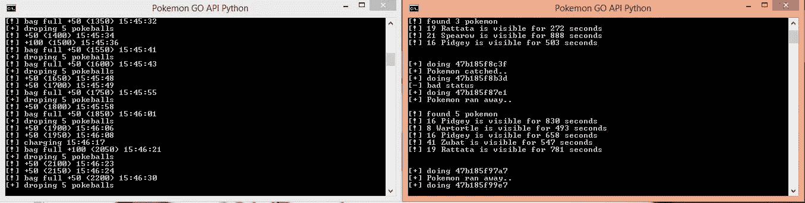

# 我使用 Pokemon Go API 学到的东西

> 原文：<https://medium.com/hackernoon/things-i-learned-using-the-pokemon-go-api-a9357eff130a>

正如你们中的许多人可能已经看到的，有一大批新的第三方 Pokemon Go 相关网站和应用程序首次亮相。比如口袋妖怪地图、雷达、机器人甚至交友网站。其中大多数(可能不是约会网站)实际上都在利用这个 Pokemon API，它模仿实际应用程序本身发送的服务器请求信息和响应。这可以得到口袋妖怪的精确位置，你自己的口袋妖怪的信息和携带的物品，它也可以捕捉口袋妖怪，旋转口袋妖怪，孵化鸡蛋。我一直在玩[其中的一个脚本](https://github.com/Mila432/Pokemon_Go_API)，它允许用户玩其中的一些功能。如果你是做软件开发的，或者非常熟悉 python 的来龙去脉，它很容易安装。这是我学到的。

脚本的输出

# 1.超级没有安全感

这应该是显而易见的。此应用违反 Pokemon Go 的服务条款。这也是一个黑客，让他们的服务认为你是一个真正的应用程序。因为你必须以明文的形式给出你的用户名和密码，任何第三方冒用你的身份开始访问你的网上银行等东西都是非常容易的**。**

# **2.完全修复脚印**

**如果你考虑得到那片杂草的准确经度和纬度，这是个问题，但是这些雷达和地图确实有用。你手机上的应用程序对你隐藏了位置。**

# **3.每天经验值是有限制的**

**我为昨晚和今天早上的大部分时间运行了一个脚本，将我的角色从 Pokestop 移动到 Pokestop 收集物品并获得 XP。总之，我从昨晚的 15 级升到了今天早上的 17 级，但是在 17 级时就停止了。我不知道确切的上限是多少，但我在大约 12 小时内获得了 40k 经验值。我会说我遇到了某种障碍。现在我不能从任何口袋妖怪那里收集或者抓到任何口袋妖怪，他们都跑了。**

# **4.您可以溢出项目**

**运行这个脚本真的很奇怪，我会检查我的库存，我会有 450/400 个项目。我的猜测是，你的库存限制实际上是在你的手机上，而不是服务器端，所以理论上，如果你只做这种方法，你可以从 pokestops 获得无限的物品。几乎太类似于原始游戏中的无作弊。**

# **5.孵蛋**

**剧本可以代替你，但这并不新鲜。它只是欺骗你的 GPS。**

**在我的实验之后，我不禁觉得使用这个脚本来获得一些经验有点肮脏。因为需要走出去与现实世界互动，这个游戏变得更加精彩。很可能对这个 api 的访问将很快关闭，但我希望仍然会有一些有限的 API，这样第三方就可以制作很酷的应用程序来增强所有玩家的体验。**

**如果你喜欢与开发这个 api 的开发者和其他喜欢它的人见面并交谈，请查看 [Pokemon Go Dev](https://www.facebook.com/l.php?u=https%3A%2F%2Fwww.reddit.com%2Fr%2Fpokemongodev%2F&h=cAQEAx0KV&s=1) subreddit！**