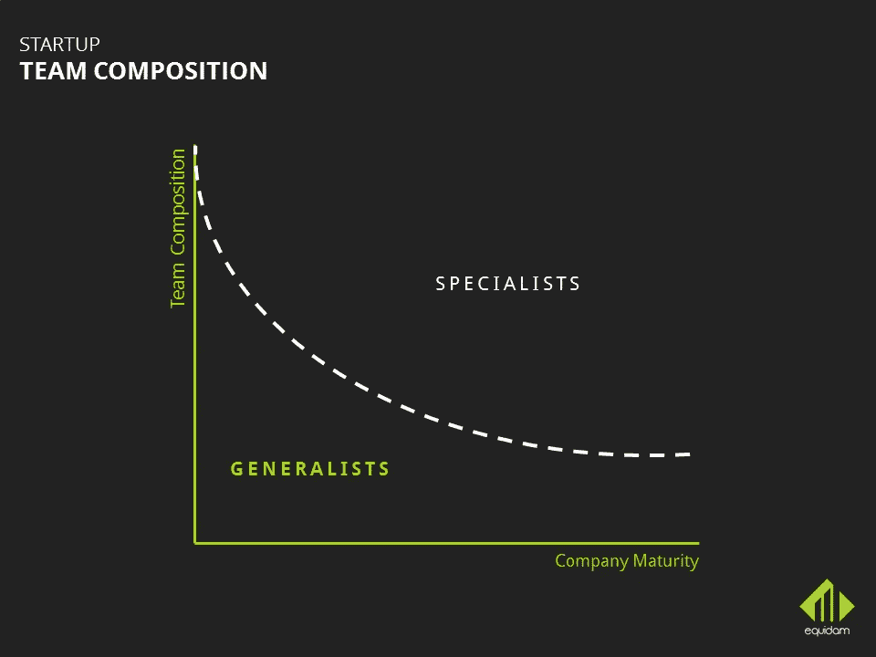

# 想想 10 倍的人，就像你想 10 倍的用户和系统一样

> 原文：<https://medium.com/hackernoon/think-10x-about-people-the-same-way-you-think-10x-about-users-and-systems-624503827f43>

## 在种子阶段建立团队

*本文原载于* [*Equidam*](http://www.equidam.com)

随着关于从 pre-seed 和 seed 阶段到[A 轮](https://www.equidam.com/milestones-to-raise-series-a-in-2017/)的创业成长和扩大的持续对话，我们与 Equidam 的联合创始人 [Daniel Faloppa](https://www.linkedin.com/in/danielfaloppa/) 进行了交流。

作为一家发展最快的荷兰公司的联合创始人，丹尼尔拥有组建团队和塑造种子期创业公司文化的经验。

鉴于 Equidam 在筹资方面的成功和知识，我们决定就招聘选择对公司整体价值和筹资成功的作用向他请教。

Daniel and Giulia discussing seed stage hiring choices in our office :)

**在这个阶段，公司还没有成立，也没有无限的资源可以支配。那么，在这种情况下，你该如何选择你的团队呢？**

团队是现阶段竞争优势的主要来源。您每天都会面临许多挑战，例如，流程没有很好地建立，公司中没有人了解某个特定领域，每个人都在现场学习。因此，在种子阶段，团队将决定公司是赢还是输。

> 团队需要准备好做出正确的决定，拥有正确的态度，甚至正确的斗志来实现生产。

在我看来，作为一家公司，你的规模越小，就技能和专业知识而言，你就越需要各种各样的人——简而言之，多面手。更进一步说，你的团队需要由有能力并且愿意做多件事情的人组成，而不是他们特别擅长的一件事情。

整个公司在种子期和种子前期的重点应该是推动产品适应市场，同时保持低成本。多面手是这种环境的理想选择。

然而，当你到达 PMF 的时候，你开始考虑如何尽可能快地扩大规模。那么你需要不同类型的人。在扩展阶段，你需要更具体、有专业知识的人，以及——在理想情况下——以前扩展过公司的人。

> 招聘更多地取决于产品与市场的契合度，而不是资金筹集。

你通常看到的是，种子前和种子资本在 PMF 之前被筹集，并作为到达 PMF 的一种手段。另一方面，首轮融资是为了获得足够的资本来扩大运营规模。从某种意义上说，你的团队越巩固，你的公司越准备扩大规模，就越容易筹集 A 轮融资，获得这些扩张资金。

自然，公司的成长和发展的各个阶段都需要不断的变化。公司内部的人需要能够适应正在发生的变化。出现的一个问题是，有些人可能无法做出这种改变。对于他们来说，从每天创建 10 个功能到在更长的时间内开发出可靠的产品可能会有很大的飞跃。因此，你需要训练团队，让他们从多面手转变为专家，或者更确切地说，从杂乱无章转变为坚实可靠。最重要的是，你有很多新员工进来，所以这也是需要注意的。

> 你的团队的组成会影响你的整体商业价值。在 [Equidam](https://secure.equidam.com/signup.php) 了解团队专业知识对你的估价有多大影响！

**让我们以多面手为例。创始人在与这类人打交道时应该注意什么？**

你可能遇到的风险之一是，某些人不想成为多面手。想象一下，一个人在办公室花了大约 5%的时间做他们喜欢做的事情，但最后却做了其他他们可能不喜欢的事情。这让一个不快乐的人很可能不会兑现承诺。以我的经验来看，寻找态度正确的人总是最好的。

> *在这个阶段最适合的人通常是那些热爱公司工作的人，而不是他们具体做什么。*

热爱公司工作的人会想方设法提高公司的整体业绩，而不仅仅是他们自己的领域或部门。

你可以在两个轴上列出人员的类型——范围和职责。通才通常属于大范围、大责任的范畴。然而，并不是每个人都从一开始就准备好了。根据你的团队，你可能需要让人们慢慢适应他们范围的扩展。你越快完成这个转变，你就越能在产品和人员上迭代。

总结一下，你的团队需要什么样的人，主要取决于你的业务成熟度。一家公司越成熟，专业角色就越多，因此雇佣的专家也就越多。

**在这个阶段，你如何协调和激励多面手团队？**

多面手的动力来自他们能学到的东西，他们自己对公司的贡献，以及与他们能学习的非常优秀的人一起工作。多面手也倾向于在混乱中奋斗。他们的动力来自于责任。多面手越有权力，他或她就越有动力。

让你团队的前 5 到 10 个人保持积极性是很容易的，因为你将会和他们有非常密切的接触。在最初阶段，当整个团队在同一张桌子上一起工作时，感觉更像是一个团队项目，而不是一项业务。周围的总体感觉也是挺积极和开心的。

然而，在随后的阶段，你必须在严肃、快乐和积极之间找到平衡。你成长得越多，公司和工作就越不像一个团队项目。然而，你应该至少在小组层面上保持这种积极和个人联系的感觉。

但是有很多人是多面手，能够处理种子期创业公司的工作量和任务。你如何从人才库中找出合适的人？

我们寻找的是具备这三种特质的人——对他们将要参与的 Equidam 项目充满热情、学习能力强且有主见。

**1|一般来说你应该寻找激情**。原因是，如果你对这些事情没有热情，要把事情做好或在你需要表现好的话题上教育自己是相当困难的。

**2|第二点是学习能力**或者说一个人能多快学会一些东西。这可以通过与某人交谈或回顾他们以前的成就来传达。

判断这个人是否合适的第三个标志是他们是否有自己的观点。多面手需要推动他们工作的领域朝着某个方向发展。首先，他们需要明确未来的状态，他们需要能够推动组织朝着那个方向发展。因此，如果你看到一个人不能把自己的空闲时间或自己的任务朝一个方向推进，那么这就是一个危险信号。

你的公司文化将由最初的 5-6 个人来塑造，所以你真的需要得到正确的第一批雇员。当你在寻找 PMF 的时候，你关注的是几乎立即或者至少尽可能快地发布特性。

> *一个很好的经验法则是把人想 10 倍，就像你把用户和系统想 10 倍一样。*

从一开始，你就需要找到能够处理比你现在多十倍的事情的人。在某一点上，他们将会达到开始招聘的水平，他们将会雇佣那些他们合得来的人——所以更多的人喜欢他们自己。因此，总结一下，在种子阶段，你需要寻找那些你想再拥有 100 个的人。

作为一家没有大品牌、也不能提供高薪酬的公司，你如何吸引这些人？

作为一家初创公司，你有一些优势可以用来吸引人才加入你的团队——你对公司和公司使命有**激情**、**自由**、**责任和授权**。例如，你无法在薪资或福利方面与谷歌等公司竞争。你在招聘中应该非常依赖的是非金钱利益。例如，员工授权和他们为公司所做的工作影响很多人生活的能力是吸引人才的两大优势。

**您之前简要提到了公司文化，它在现阶段有多重要？**

文化是非常短暂的东西。不可否认，这是人们呆在一起的主要原因之一。每个进来的人要么成为文化的一部分，要么被淘汰。正如我之前所说，企业文化将由公司的前 5-10 名员工塑造，它将决定谁将留下，谁将不得不离开，因为他们无法采用相同的做法。

例如，我们试图在 Equidam 中设定的态度是个人主义、合作和成长之间的平衡。我相信角色，从某种意义上说，一个人负责提出一个项目或想法。在这种情况下，小组的投入显然非常重要，但主要是作为最初想法的贡献者。小组讨论的目的不仅是为了使最初的建议更好，也是为了减轻这个人作为一个个体的痛苦。

**当你目睹与公司价值观或文化不符的行为时，该怎么办？**

行为通常由团队处理。你真的可以看到不合群的人，他们有不同的价值观，很快就会被孤立。他们自己也意识到了这一点。很简单，如果你想成为群体的一员，你需要采取某种行为方式。如果他们自己没有看到，你需要和他们谈谈，向他们解释这一点，因为大多数时候这只是一个沟通问题。但有时这个人本身就有如此不同的价值观，以至于不值得去修复这段关系。

**你意识到自己正在塑造一个团队和团队文化的那一刻是什么时候？**

对我来说，当我看到我的团队成员和其他团队成员以我和他们交谈的方式交谈时，我意识到了这一点。当你看到他们改变了沟通和工作方式，你一定能看到你作为创始人在这个学习和沟通的瀑布中是如何影响这些人的。

**在支持团队成员的成长方面，你自己不是专家，你需要事先学习很多东西并留出时间来教，你如何处理这一点？**

这里要考虑的一个重要方面是，一个公司在一个给定领域的能力受到在这个领域工作的人的知识的限制。因此，创始人不可能是知道最多的人——这只会限制公司的潜力。创始人需要鼓励人们自主学习。

> *创始人不可能是知道最多的人——这只会限制公司的潜力。*

在公司非常早期的阶段，创始人可能自己做所有的事情。因此，他们对经营企业的几乎每个方面都很熟悉。在我看来，在大多数情况下，培训和释放某人的知识是我作为创始人所能做的最有效的活动。我不是什么都懂的专家，但是我可以给你如何提升自己，如何学习的方向。

**从筹款的角度来看，团队的组成是怎样的？从投资者的角度来看，专家可能会降低可感知的风险。**

一个多面手团队将能够生产更多产品——更大的产量、更快的生产速度、获得牵引力等。

另一方面，从投资者的角度来看，一个专家团队在球场上看起来不错。

两者显然都有优势。你应该从长计议，因为最终目标是建立一个好的公司，资金是一种结果。

没有办法判断哪一个更好，但我的建议是不要仅仅为了筹集资金而雇佣那些在球场上看起来不错的人。

> 准备筹款？查看我们免费下载的[推介模板](https://www.equidam.com/how-to-create-a-startup-pitch-deck-template-included/)！

**继续我们关于多面手和专家之间的区别的讨论，如果您有资源雇佣一个初级专家团队，您会这样做吗？**

在理想的情况下，通才和专家都有。多面手和他们的态度会吸引专家。然而，也许专家们不会在种子阶段贡献那么多。当然，一个有经验的设计师会吸引其他愿意和他一起工作的设计师。但在早期阶段，这位专家可能无法展示他们的技能和能力，他们自己可能也意识到了这一点。

在我们确定多面手和专家之间的区别是在你的舒适区之外学习新事物的动力之前。你肯定会有一个专家对扩展他们专业领域之外的知识感兴趣。在这种情况下，我们回到之前确定的要点——激情、学习能力和观点。

这也取决于你想要完成什么。在早期，你需要最好的团队来完成你的使命。如果你在制造火箭，你需要有人知道他们在做什么——这是你竞争优势的来源。

从投资的角度来看——当你的团队中有超级明星的时候总是更好。但这不是因为他们的简历，而是因为他们提供了你需要的竞争优势。专家对行业和市场非常熟悉，让他加入团队可以降低潜在投资者的失败风险。这也意味着已经创业的人，或者在公司运营领域工作过的人有更高的机会获得资金。因此，他们也带来更多的价值，并影响整体公司价值。

> 已经创业或在特定领域工作过的人获得资助的机会更大

这样的人，除了经验，还会把自己的人脉带到台面上来。这反过来会影响公司的估值。总而言之，这绝对是你在组建和扩展团队时必须考虑的一个问题。

> 要想知道你的团队经历对你的企业估值有什么影响，请查看 [Equidam](https://secure.equidam.com/signup.php) ！

> [黑客中午](http://bit.ly/Hackernoon)是黑客如何开始他们的下午。我们是 [@AMI](http://bit.ly/atAMIatAMI) 家庭的一员。我们现在[接受投稿](http://bit.ly/hackernoonsubmission)并乐意[讨论广告&赞助](mailto:partners@amipublications.com)机会。
> 
> 如果你喜欢这个故事，我们推荐你阅读我们的[最新科技故事](http://bit.ly/hackernoonlatestt)和[趋势科技故事](https://hackernoon.com/trending)。直到下一次，不要把世界的现实想当然！

