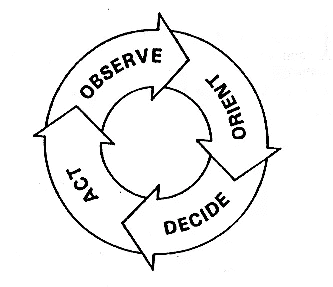

# 从大处着眼，从小处着手，快速行动

> 原文：<https://medium.com/hackernoon/think-big-start-small-act-fast-6fdab1f771ea>

## 🚀我的时事通讯是指数视图。在此注册 it。

你如何建造重要的东西？任何事情，不管是什么:一个产品，一个公司，一个爱好，一份新工作？这里有一句我认为可以帮助任何人做出有意义的事情的咒语:

**胸怀大志，从小处着手，快速行动。**

我第一次读到这篇文章是在七年前的一本[红杉资本](http://www.slideshare.net/dealhorizon/jim-goetz-of-sequoia-capital-at-stanford)的推介指南中。现在，它已经变成了一种更普遍的说法。作为一名产品企业家(兼教练和投资者)，我发现这是非常有价值的

大处着眼，小处着手，快速行动是一个非常有效的咒语。

显而易见的原因是:大事情是值得的，但看起来令人生畏。小事情可能看起来微不足道，没有组织目标也可能看起来漫无目的。

# 雄心勃勃

> “一项关于目标设定对绩效影响的实验室和实地研究的回顾结果显示，在 90%的研究中，具体和具有挑战性的目标比简单目标、“尽力而为”目标或没有目标带来了更高的绩效。目标通过引导注意力、调动努力、增加持久性和激励战略发展来影响绩效。

(摘自 Locke et al .[目标设定与任务绩效](http://psycnet.apa.org/index.cfm?fa=search.displayRecord&uid=1981-27276-001):1969–1980。心理学通报，第 90 卷(1)，1981 年 7 月，125-152 页。由于这里只免费提供摘要，我推荐一篇[后期洛克论文:](http://expand.nu/wp-content/uploads/M%C3%A5ls%C3%A6tning-review.pdf) **通过有意识的目标设定进行激励**。它只有三页长，非常值得。)

想想那些最常被提及的大型科技公司，你会发现那些正在进行大规模思考的公司:谷歌(整理世界信息)、优步(重新思考物流)、AirBNB(改变休闲和商务住宿)、亚马逊(万物商店)。

胸怀大志可以让平凡变得有趣。毕竟，优步只是一群本地出租车公司，而亚马逊只是一家基于仓库的目录商店。但通过设定一个崇高的目标，这些组织可以更好地利用努力，引导员工和支持者的注意力。

你的目标越大，你就越能激励自己去实现它。或者就像有人告诉我的，以金牌为目标，你可能只会得到一枚银牌。以铜牌为目标，你将幸运地完成比赛。

## 让你的 BHAG 可以传播

有些人把这些东西叫做 BHAGS(“大而多毛的大胆目标”)。但这不足以成为 BHAG。它还需要是可传播的。它需要有，在电影行业中所谓的，一个高概念。从它们的高概念来识别这些大胆的电影:

*   一个特立独行的菜鸟飞行员试图摆脱父亲的阴影
*   一个粗暴的底特律警察跟随一个犯罪到原始的贝弗利山。欢乐随之而来
*   四十岁的处女
*   在夏天占领柏林(不是电影，是二战期间的一个目标)

Guess the movie

高概念很重要，因为它们将你的 BHAG 总结成任何人都能理解的东西。

# 从小处着手

大事需要时间，需要计划。但是正如伟大的普鲁士军事战略家冯·毛奇所观察到的:

> 交战的战术结果构成了新战略决策的基础，因为一场战斗的胜利或失败会如此大程度地改变局势，以至于任何人类的智慧都无法超越第一场战斗。

Von Moltke and his spiky helmey

或者说，计划永远无法脱离现实，所以你需要把大事情分成小事情；同时提醒自己这些繁琐的小事才是通往大事的道路。

中国哲学家老子也明白这一点，“**千里之行始于足下”**我把它解释为这是世界的本质，你寻求实现的任何事情都需要从正确方向上的一个积极行动开始。(这就是为什么知道你要去哪里很重要。)

在商业规划课程的时代，Excel 电子表格和矩阵组织的伪准确性让我们很容易制定计划；而且非常复杂。任何人都可以制定复杂的计划。

但是复杂性很难管理。令人望而生畏。很难记在脑子里。比 11 位数的电话号码还难。

事实上，系统的理论家，他们的整个学科是理解一个大系统的整体运作，理解这种复杂性的本质。

这是高尔定律(以[约翰·高尔](http://en.wikipedia.org/wiki/John_Gall_%28author%29)命名)

当然，要达到你的 BHAG，你几乎肯定需要处理业务中的复杂性。

你的销售组织将需要区域和全球结构。他们将如何报道？您的产品团队需要针对不同的市场进行本地化。您的雇佣条例因国家而异。你的团队会遇到障碍和机会，使他们偏离正轨。

但是如果你一开始就考虑这个问题，你会淹没在一个制作精美的计划中——一个美妙的甘特图、系统图或 Excel——永远不会被公之于众。

精益[创业](https://hackernoon.com/tagged/startup)运动的教训是，在每个阶段，你都需要做最少的事情来证明和验证那个阶段(并最终做出决定)。这种方法基于 500 年的科学方法原则——一次测试一件事，这样你就能了解根本原因。

作为一名产品企业家，从小处着手让你对业务有一个发自内心的了解:它的运营流程或价值链(顾问可能会这么称呼)。以一种小的、低成本的方式做事，因为它们碰巧在触手可及的地方，可以验证你的高理念，让你更加自信地前进。

这些初始模型可能无法“扩展”。谷歌图书是从拉里·佩奇自己扫描几页开始的。杰夫·贝索斯过去常常打包亚马逊的快递。没关系。重要的是你开始了。

# 快速行动

行动越快，学习越快。因为你真的不知道你要做什么，所以你必须弥补。但是请记住，你是在小步快走，每走一步，你都会看到哪些有效，哪些无效。

快速行动让你有更快的 [OODA 循环](http://en.wikipedia.org/wiki/OODA_loop)。OODA 循环是由另一位军事战略家约翰·伯伊德开发的，也是现代精益产品管理的主干部分。

我认为这是“飞行中”的优化，或者如约翰·梅纳德·凯恩斯所说:“当事实改变时，我会改变主意。你是做什么的，先生？”

快速行动还有第二个好处。也就是说，对你来说，挑战更加严峻，你准备的时间更少，你需要运用你所拥有的技能(T4 正在学习 T5)。令人惊讶的是，这会让你变得更聪明，并迫使你创造新的策略。

这并不是说草率行事。也不意味着为了做事而做事。或者摇动棋盘看看棋子如何落地，我认为这是拉姆斯菲尔德的策略，也许这份备忘录最能说明问题。

快速行动就是在意识到自己在做什么的情况下，快速而积极地行动。而快速行动实际上可能意味着什么都不做。而是一种有意识的无所事事，与因拖延或分析麻痹而无所事事截然不同。

# 故障模式

我在很多场合都看到了(也让自己失望了)。以下是三种主要的故障模式:

*   计划得太远只是因为你可以。你变成了永远不动的象棋大师，最终耗尽了时间。
*   做好**事情却不知道为什么**。组织可以变得非常擅长执行，而不需要清楚地了解他们正在进行的战争。
*   行动太快，反应太快。这是一个判断的问题。我听说过它被称为“突然管理”，你经常在每周关注点都在变化的初创公司中看到它(我们是 B2B 还是 B2C，就是一个明显的例子)。

# 结论

我经常从大处着眼，从小处着手，快速行动。事实上，几乎每天都有。并不总是管用。有时你会应用错误。有时候其他人不想听。

很难。这需要重新思考问题。它不是立即思考你面前的是什么，而是迫使你站出来提醒自己这段旅程，然后再钻回去想下一步该做什么。快速行动的原则(知道你可能会扔掉你的工作)也可以是一个新颖的原则。大事化小，快速行动是处理不确定性的一种方式，也是你必须创造的一个世界。大多数人更喜欢确定性和为他们创造的世界。

然而，这是一门有价值的学科。所以再说一遍:

**大事**:让它对自己和他人都有意义

**从小处着手**:让它易消化、看得见、实用。一旦你知道你要去哪里 **，只建造你需要进入下一步*的东西。***

**快速行动**:创造动力，快速迈出许多小步。

## 🚀我的时事通讯是指数视图。[在此注册 it。](http://azeem.io/s)

— —

背景图片鸣谢: [ThePatternLibrary](http://thepatternlibrary.com/)

> [黑客中午](http://bit.ly/Hackernoon)是黑客如何开始他们的下午。我们是 AMI 家庭的一员。我们现在[接受投稿](http://bit.ly/hackernoonsubmission)并乐意[讨论广告&赞助](mailto:partners@amipublications.com)机会。
> 
> 如果你喜欢这个故事，我们推荐你阅读我们的[最新科技故事](http://bit.ly/hackernoonlatestt)和[趋势科技故事](https://hackernoon.com/trending)。直到下一次，不要把世界的现实想当然！

