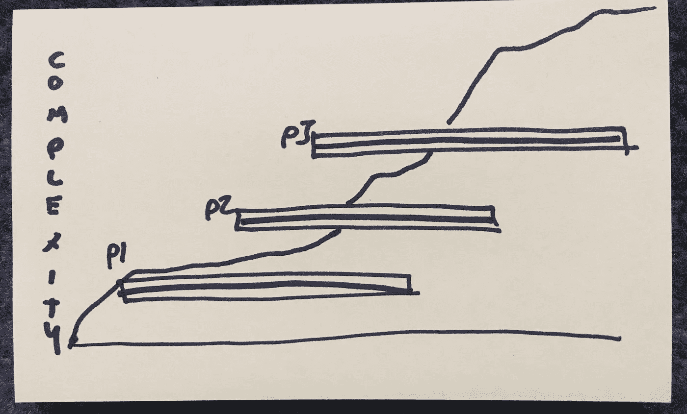
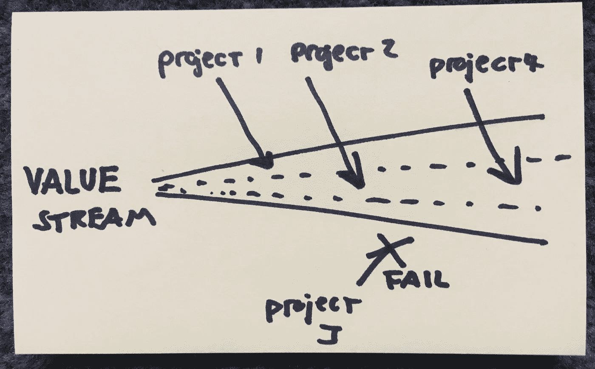
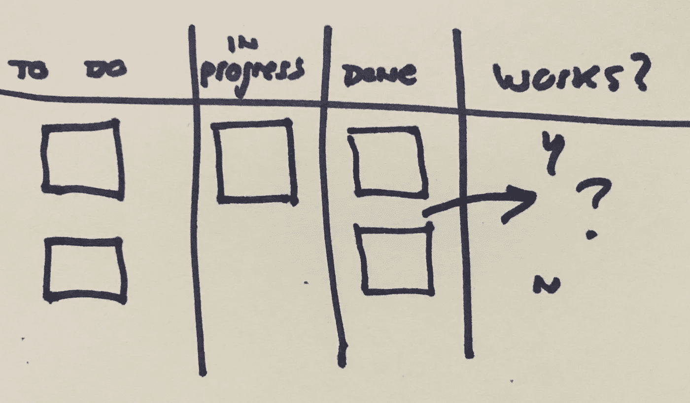

# 超越项目思考

> 原文：<https://medium.com/hackernoon/thinking-beyond-projects-71998e2524e7>

## 在产品开发中，项目是工具，而不是最终目标

*注意:这篇文章严重倾向于软件产品开发(一个产品，许多客户)，而不是定制软件开发(一个有时间限制的项目，一个客户)。*

作为一个参与软件产品开发的人，我尽量少用*项目*这个词。问题不在于将项目作为有时限的投资容器。或者召集一个临时团队进行临时工作。我觉得这很合理。相反，当我们*仅仅*看待项目和/或过于狭隘地定义我们的项目时，我们就会错过它。作为一名产品经理，我发现通过减少提及*项目*的次数——即使我的队友经常这么说——我会把注意力放在奖励上。

以增加产品复杂性的项目为例。复杂性比项目更持久，必须被维护，并且最终可能需要重构或重写以支持新的功能(或适应意外的增长)。当然，未来的工作可以封装在一个新项目中，但是你可能会失去一些背景和连续性。

或者考虑专注于改进特定指标(如保留率、采用率、收入等)的团队。)领导层同意为该任务提供资金，前提是团队能够继续产生影响。这个项目是整个任务吗，或者他们的每一项工作都应该被单独考虑(和管理)吗？这种情况下你还在“完成项目”吗？

最后，考虑一个非常常见的经历:拼命工作来完成一个项目(并根据你在一定时间内完成该项目的能力来衡量)，但后来发现该项目没有给企业和/或客户带来任何好处。它“像预期的那样工作”，但是它并不适合构建。

我们对项目的主导观点已经被定制软件承包商严重影响。该模型(基本上)是这样工作的:

*   客户要求一组特定的功能(X，Y，Z)
*   如果这些功能成为可能，客户同意支付$N
*   客户关心多长时间和多少钱
*   承包商交付了做 X、Y 和 Z 的东西并得到报酬
*   承包商赚现金

但是如果这不是你的商业模式呢？

交付 SaaS 产品的公司可能会在接下来的十年里改进他们交付特定功能的方式。堆栈将*而不是*保持不变(如果是这样，您就过早地优化了)。今天的 MVP 会激发无数次迭代，今天的“大 UI”可能有一天会被 Alexa 控制。简而言之，我们并不知道所有的事情，我们的世界也在变化(这也是机会的来源)。

当然，在这种模式下，你可以将你的工程师和设计师视为一家内部咨询公司。嘿 InternalDesignCrop，使 X，Y 和 Z 成为可能，我们将为你提供$N 的资源，告诉我们多长时间，交付它，我们会“付给你”。但是，当购买定制软件的公司开始实现收益时，同样的事情也困扰着他们(参见[收益实现管理](https://en.wikipedia.org/wiki/Benefits_realisation_management)，这是一件事)。他们可能会得到他们想要的东西…但这*不是正确的事情*。此外，当你的工程师和设计师是天才的问题解决者(而不是功能制造者)时，这有点糟糕。

对于定制软件开发人员来说，这不是问题。现金在银行账户里。客户要求的…我们制造了它。你想要这栋难看的没有窗户的办公大楼，而我们按时按预算建造了这栋大楼。但是对于产品公司来说，却是一个重大问题。

只有当我们的工作带来利益时，我们才会使*受益。我们有“普通”项目的所有挑战和陷阱(向定制软件开发人员脱帽致敬…这很难)，以及实现长期利益的挑战和陷阱:*

1.  高昂的启动成本
2.  项目范围过早趋同
3.  解的过早收敛
4.  未能利用新知识
5.  沉没成本偏差。失败/不利风险
6.  制度化的大批量和后期学习(如瀑布)
7.  激励:实现“完成”与推动预期收益
8.  跨多个项目排列优先级
9.  未充分考虑维护成本，需要迭代/扩展

这就是为什么我们使用增量和结果驱动的方法，为什么我们致力于团队解决问题，为什么我们在小批量工作。去打败这些东西！但是即使我们打败了这些东西…我们还是要考虑整个产品。

**所以基本上…项目不是问题**。它们是一个合理的人类概念(一个工作容器，一个目标，一个时间限制，一项任务)。危险在于将项目视为软件产品开发的一等公民。在产品公司中，项目是载体，而不是最终目标。你不会因为增加了一个功能而得到好评。你因获得更多收入、保持收入、降低成本或防止成本增加而获得荣誉。因此，当你问某人正在做什么，他们说“完成项目[xxxxxxx]”…一定要问“为什么，好处在哪里，有用吗？”