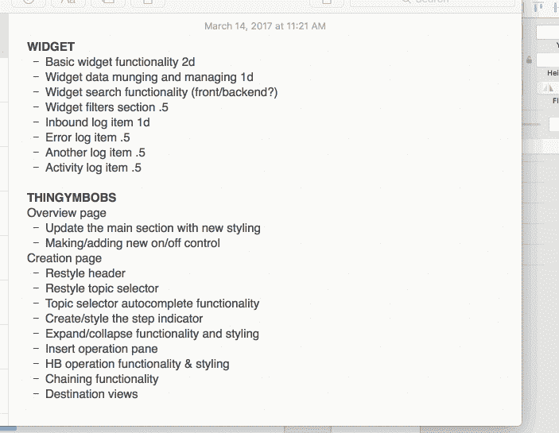

# 面对大量的新功能需求时，不变地思考

> 原文：<https://medium.com/hackernoon/thinking-immutably-when-slammed-with-a-ton-of-new-feature-requests-7d4cbef07eaa>

今天，大量的新设计和[功能](https://hackernoon.com/tagged/feature)需求摆在我的面前……我必须回答这个问题，“我如何对所有这些新工作进行优先级排序？？?"

## 不可变的数据结构和转换来拯救！

(我是个书呆子，但我喜欢它……)

1.  **从 comps & feature meetings 中创建一个任务数组:**我正在检查设计/特性，并创建一个完成它们需要做的所有事情的列表。
2.  **根据我们当前的能力过滤任务阵列:**我们的[设计师](https://hackernoon.com/tagged/designer)与业务部门合作来确定新的特性，但他并不完全清楚我们的 API 能做什么。我需要检查每项任务，删除太难的项目，并将它们添加到“延迟”列表中，当后端团队处理它时，可以将它们添加回我当前的任务阵列中。
3.  绘制任务列表，并添加我的估计:这只是意味着添加完成每项任务需要多长时间。
4.  **根据业务价值映射任务数组:**我需要很好地了解每一项的价值，以便正确排序。
5.  **按发布时机映射任务数组:**我需要回答问题“第一次发布能出什么？二次发布？”换句话说，这是一大块工作，可以迭代发布。
6.  ***最重要的是:按评估权重、商业价值、发布日期排序——输出我的可操作列表:*** 这是转换步骤# 1–5 的输出。如果我的权重和算法正确，我将有一个接下来一两个月的任务清单。

这样做之后，我将所有的任务添加到 JIRA，并跟踪那里的进度。

更多类似的内容，请查看我的每日开发博客:[https://www.snaptest.io/dailydevblog](https://www.snaptest.io/dailydevblog)

> 黑客中午是黑客如何开始他们的下午。我们是这个家庭的一员。我们现在[接受投稿](http://bit.ly/hackernoonsubmission)并乐意[讨论广告&赞助](mailto:partners@amipublications.com)机会。
> 
> 如果你喜欢这个故事，我们推荐你阅读我们的[最新科技故事](http://bit.ly/hackernoonlatestt)和[趋势科技故事](https://hackernoon.com/trending)。直到下一次，不要把世界的现实想当然！

