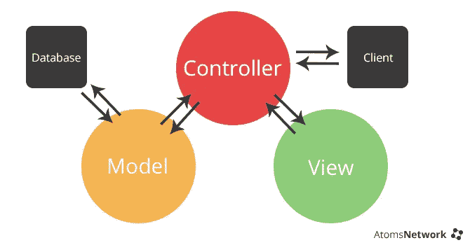
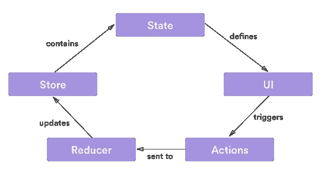

# 用 Redux 思考(当你只知道 MVC 的时候)

> 原文：<https://medium.com/hackernoon/thinking-in-redux-when-all-youve-known-is-mvc-c78a74d35133>

当我们在[宠](https://spoil.co)决定推出我们的移动应用时，我们必须做出的第一个决定是:我们使用什么语言？经过一番深思熟虑后，我们做出了一个决定:这将是一个非常自然的决定。[学习](https://hackernoon.com/tagged/learning)一种新的“语言”或[框架](https://hackernoon.com/tagged/framework)不是一个大问题，但是伙计哦伙计，确实有反应——native 和 redux 让我不好过。本文没有解释 React-Native 是如何工作的(因为这不是最难的部分)。接下来几段的目的是帮助任何人阅读从“用 MVC 思考”到“用 Redux 思考”的转变。希望有帮助。

# React-Native 和 Redux？

一旦你开始学习 react-native(或 react ),在有人提到 redux 之前，你大概有 3 个栈溢出问题或中等帖子。

你很开心。你开始了解状态和道具，你知道 componentDidMount 是做什么的，你甚至知道如何正确地创建你的组件，使它们可重用。现在你突然发现自己在 egghead.io 上，某个家伙正在谈论商店、reducer 合成、动作和将状态映射到道具。


您还意识到，虽然之前您能够做到:

```
$(“.my-button”).click(); 
```

得到做某事的按钮；现在已经过了大约 3 个小时，你的一个按钮没有任何作用。

# 一些类比

如果你来自 MVC(或 MVVC)世界，你会习惯模型、视图和控制器(咄)。然而，在 [Redux](http://redux.js.org/docs/introduction/) 中，我们处理的是动作、减少器、存储和组件。试图将 MVC“翻译”成 Redux 是一件棘手的事情，但我会这样做:

**动作=控制器。把你的行动想象成控制者。每当你想在你的应用程序中发生一些事情(例如，加载一些数据，改变一个 isLoading 标志从真到假…)你将不得不分派一个动作。就像在 MVC 中，你必须调用一个控制器端点。**

**减速器=型号。**有点。您的 reducers 将负责保存您的应用程序的当前状态(即用户信息、从 api 加载的信息、您想要显示的项目……)。它也是决定当一个动作被调用时做什么的部分。在 MVC 中，你可能有一个带有方法 setName()的模型，而在 Redux 中，你将让一个 reducer 处理一个动作来设置状态中的名称。

***编辑感谢*** [***普拉宾瓦尔马***](https://medium.com/u/1dc22d249ed1?source=post_page-----c78a74d35133--------------------------------) ***。这更好地解释了商店。***

**门店=？？？。**商店是 Redux 特有的，在 MVC 中并没有真正的对等物。不过不用担心。这部分是幕后处理的。存储就像一个状态容器，它聚集了所有的 reducers。它有一个获取当前状态的方法，并公开了订阅状态更改的方法(使用“connect()”方法)。这将允许你调用动作并把它们作为道具传递给你的组件。

**组件=视图。**组件有点像您的智能视图。他们展示从州政府获得的信息。我建议把你的组件分成两部分。一个仅用于表示部分(哑组件)，一个用于处理所有的动作和状态变化(智能组件)。

# 从 MVC 思维到 Redux 思维

MVC 和 Redux 之间的一个主要区别是，在 MVC 中数据可以双向流动，而在 Redux 中数据只能单向流动。



Typical MVC. When life was easy.

正如您在上面的图表中所看到的(并且从经验中知道),数据可以以两种方式流动。您在视图中按下一个按钮，它会向控制器发送一条消息并更新模型。模型更改一些值，将该值返回给控制器，控制器刷新视图。放松点，皮兹！



Redux flow. Life sucks now

有了 Redux，事情会有所不同。假设你有一个组件，当一个按钮被按下时，你想做一些事情。你从哪里开始？我是这样做的。

1.  定义您的行动
2.  定义您的减速器
3.  将动作定义为组件中的道具
4.  在你的视野中连线

这里有一个简单的代码示例来解释这些概念。在这个例子中，我将展示如何编辑文本输入，当用户按下按钮时，它将调用一个动作来保存它。

首先让我们从**动作**文件开始。

```
export const MODIFY_NAME = "MODIFY_NAME";
export const SAVE_NAME = "SAVE_NAME";/**
* This is the action we will call from our component whenever the user presses a button. Literally every letter that they will type, this action will be called with the new value in the text input field. Pay attention to the type and payload in this function. This is what we will use in the reducer to "modify" our model with the new values.
**/
export function modifyName(name){
    return {
        type: MODIFY_NAME,
        payload:{
            name
        }
    }
}/**
This is the action we will call when the user presses the save name button. Notice how we don't pass any value in. That is because the reducer already holds that value. Also there is no payload. The reason for that is the reducer doesn't need one. There is no extra information needed for the reducer step.
Also, normally this would call an api endpoint and all that jazz, but for brevity's sake I won't include that.
**/
export function saveName(){
 return {
   type: SAVE_NAME
 }
}
```

现在轮到我们的主持人 T21 了。基本上，减速器必须处理进来的动作。

```
//import the actions file we defined earlier
import * as constants from '../actions.js';/** 
The initial state is used to define your reducer. Usually you would just set this to default values and empty strings. The reason this is needed is so that when using these values you are guaranteed to at least have some default value. Think of it as the default constructor.
**/
const initialState = {
     name:'',
     isSaved: false
}/**
This action part is the part that will "listen" for emitted actions. So the saveName and modifyName functions that we defined earlier will be handled in here. The action parameter is what is being returned (the type and payload) in the functions above.
**/
function name(state=initialState,action){
  switch (action.type){
/**
in REDUX the state is immutable. You must always return a new one, which is why use the ES6 spread operator to copy the values from the states that's passed in.
**/
    case constants.MODIFY_NAME:
       return {
         ...state, 
         name:action.payload.name
      }
     case constants.SAVE_NAME:
       return {
           ...state, 
           isSaved:!state.isSaved
       }
   }
}
export default name;
```

注意**常量。修改名称**和**常量。SAVE_NAME** 正是我们在 type 字段中的操作所返回的内容。这就是你让减速器知道正在发生什么动作的方式。

现在来定义我们的【智能】组件**。实际上，这意味着这是定义动作调用的组件。**

```
/**
 * The home page for the app
 */
‘use strict’;
import React, { Component } from ‘react’;import { connect } from ‘react-redux’;import Name from ‘./presentational/Name’;import * as actions from ‘./actions/name’;/**
Both the actual values (name and isSaved) as well as the function to call those actions are passed in as props.**/
class NameContainer extends Component {
 render() {
   return (
    <Name 
      name = {this.props.name}
      isSaved = {this.props.isSaved}
      modifyName = {this.props.modifyName}
      saveName = {this.props.saveName}
     />
   );
 }
}/**
All this does is get the values that are saved in the reducer, and return it to the component so that we can call them using this.props
**/
const mapStateToProps = (state,ownProps) =>{
/**
using REDUX stores, it allows us to just access the reducer values       by going state.name. Notice how name is what is being exported in    the reducer above
**/
const { name, isSaved } = state.name;
 return {name,isSaved };
}/**
In mapStateToProps we were mapping the state variables as properties to pass into our presentational component. In mapDispatchToProps we are mapping the action functions to our container to be able to pass it into our presentational component.
**/
const mapDispatchToProps = (dispatch) => {
 return {
 modifyName:(name)=>{
  dispatch(actions.modifyName(name))
 },
 saveName:()=>{
 dispatch(actions.saveName())
 },
}/**
This is the reason we are able to pass in the functions and variables as props to our container. It's the connect function from the react-redux library that does all the magic.
**/
export default connect(mapStateToProps,mapDispatchToProps)(NameContainer);
```

现在是最简单的部分。您创建了用户将与之交互的表示组件(MVC 中的 V)。

```
/**
 * the dumb component which will use the props passed in from the smart component based on a user's actions
 */
‘use strict’;
import React, { Component } from ‘react’;
import {Text,TextInput, TouchableOpacity} from ‘react-native’;
import { Actions, ActionConst } from ‘react-native-router-flux’;class Name extends Componentrender() {
 return (
 <View>

 <TextInput
 multiline={false}
 //from the component above
 value={this.props.name}
 placeholder=”Full Name”
 //from the component above
 onChangeText={(name)=>this.props.modifyName(name)}
 />

  <TouchableOpacity onPress= {()=>{this.props.saveName()}>
     <Text>Save</Text>
  </TouchableOpacity>
 </View>
 );
 }
}export default Name;
```

就是这样！您仍然需要做一些基本的样板设置工作，但是我希望这能让您明白如何在 redux 中思考。

这让我困惑了一会儿(例如，什么信息在哪里以及如何传递…)，所以我希望能为你们节省一些时间和痛苦。

如果你想提高你的编码技能，我正在整理一本剧本，包括:

1.30 多种常见的代码气味&如何解决它们

1.15+设计模式实践&如何应用它们

1.20 多个常见的 JS 错误&如何防止它们

提前获得我的 [javascript 剧本](https://javascriptplaybook.com)。

[](http://bit.ly/HackernoonFB)[](https://goo.gl/k7XYbx)[](https://goo.gl/4ofytp)