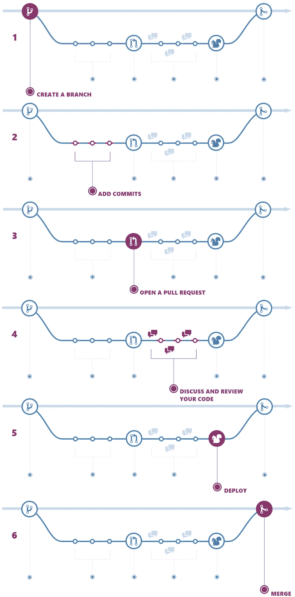
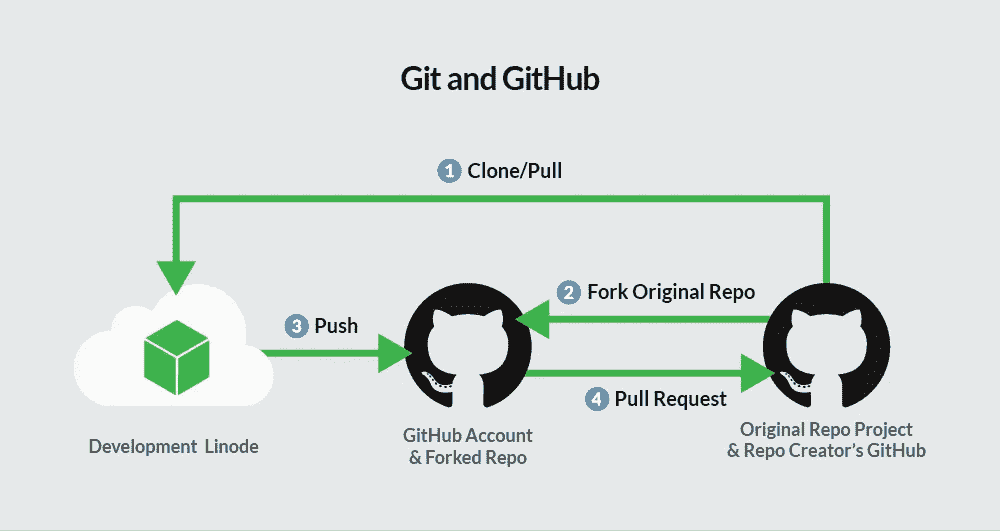
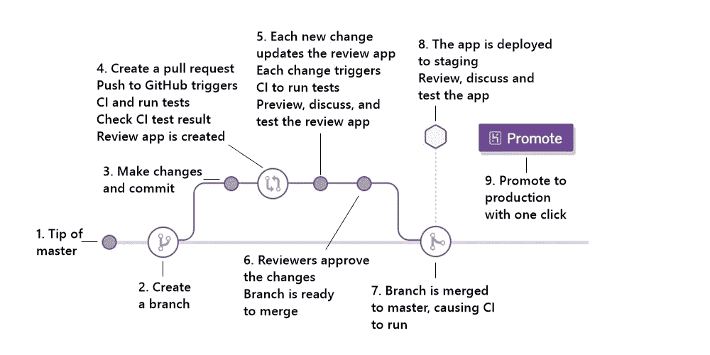
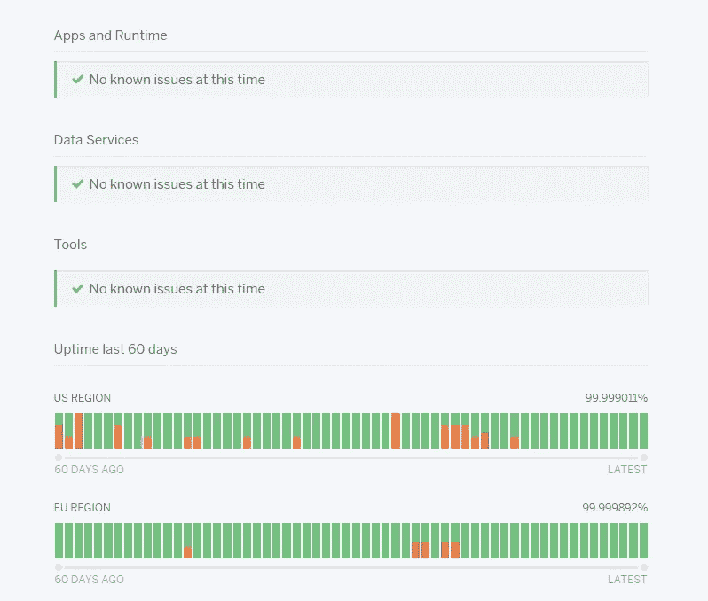
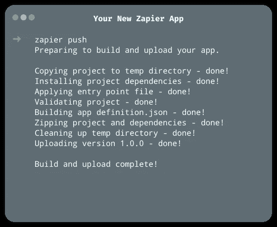
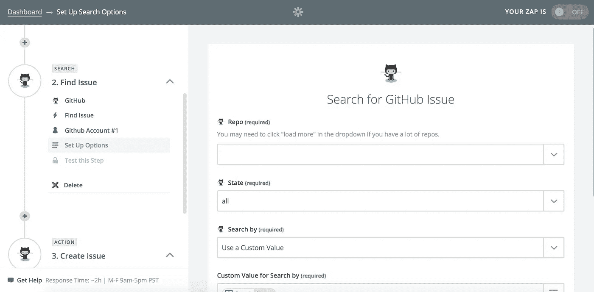
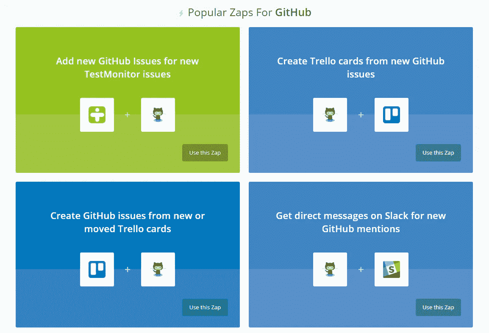
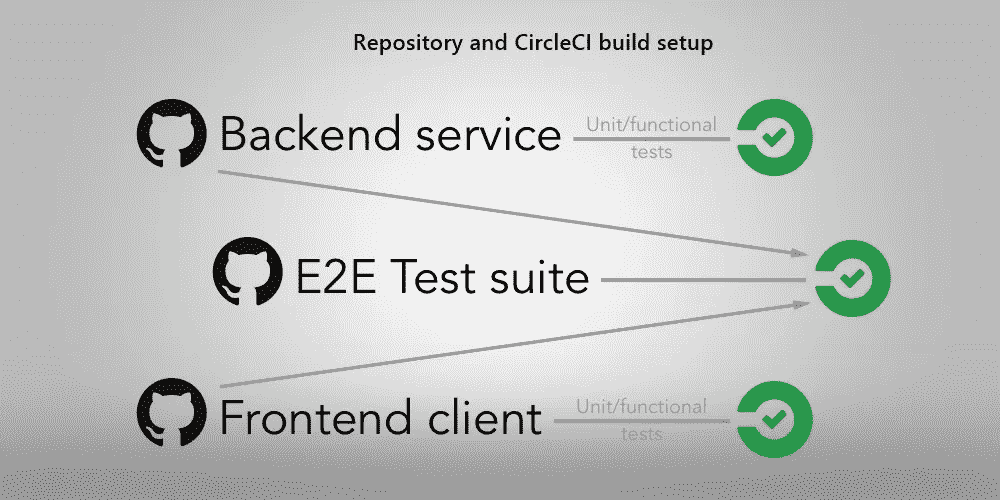
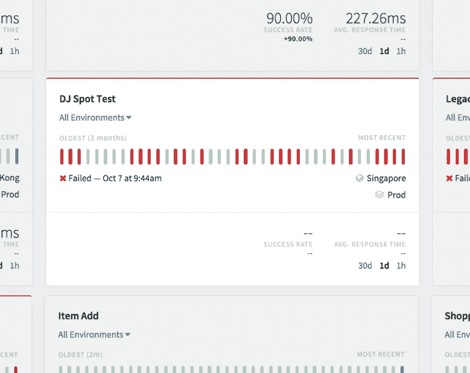
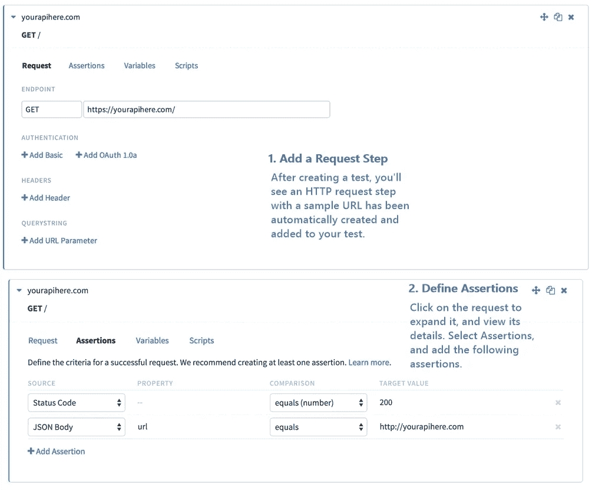

# Web 开发中使用的第三方应用程序

> 原文：<https://medium.com/hackernoon/third-party-applications-used-in-web-development-a4af1ca2793a>

自从万维网在 21 世纪初蓬勃发展以来，Web 应用程序的创建对于所有企业家、企业和政府组织都变得非常重要。

这些网络应用的复杂性增加了，包括功能、界面和设计。考虑到这一点，执行这些任务的工具也变得更加强大。

这反过来也导致软件开发人员不得不学习如何使用这些技术。

有许多第三方应用程序，它们有助于使开发 web 应用程序的工作变得更加容易。然而，在这篇文章中我们只是看了几个。

我们仔细挑选了那些我们认为对 web 应用程序开发过程有很大帮助的。不过，这并不是说，其他人就不那么重要了。

因此，本文将要讨论的应用包括:

*   开源代码库
*   赫罗库
*   扎皮尔
*   Pingdom
*   切尔莱西
*   运行范围

# 开源代码库

Github 是一个 Git 存储库托管服务。随着人们越来越意识到使用版本控制的好处，它变得非常流行。

Github 允许开发者在开发过程中在线托管他们的源代码。这给了他们恢复旧代码的选择，如果代码改变后事情变得混乱。这项服务还提供了开发人员之间的强大协作，因为 web 应用程序可以远程构建，而不必亲自见面。

GitHub flow

Github 使用 Git 技术工作，因此在开发 web 应用程序时，您可以将整个存储库复制到您自己的系统中，并在将它们提交到中央服务器之前，在本地副本上进行所需的更改。这节省了时间和资源，因为您不必每次修改代码时都连接到服务器。

Git 需要 CLI(命令行界面)进行文件管理，但是 GitHub 确保 Git 可以在没有命令行的情况下使用，因为它有一个 web 界面，更容易使用。

Workflow using Git with GitHub

您可以在这里创建一个 GitHub 账号 [**。**](https://github.com/join)

# 赫罗库

Heroku 是一个第三方云应用程序，它管理您的应用程序的基础设施，并为您的 web 应用程序的轻松部署提供服务。

Heroku flow

有了 Heroku，您可以使用 Git 技术在线部署您的应用程序。web 应用程序开发所涉及的技术已经变得越来越好，因为 Heroku 提供了诸如应用程序和数据库之类的附加资源等功能，确保应用程序可以轻松部署到在线空间。

Heroku 提供了一个很棒的 web 应用程序开发环境，所以你不必在构建过程中购买域名托管，因为它向用户免费提供了它的大部分功能。用户可以部署、运行和管理他们的应用程序，无论是用 Ruby、Node.js、Java、Python、Clojure、Scala、Golang 还是 PHP 编写的。

如果你对表演有任何疑问，请查看 Heroku 状态。

Heroku 的安装在所有平台上都很容易。你可以在网站 [**这里**](https://www.heroku.com/) 了解更多。

# 扎皮尔

web 应用程序开发的过程涉及到大量的例行程序，这会耗费大量的时间。Zapier 是一个 web 自动化应用程序，它允许您构建其他名为“zaps”的应用程序来自动化您自己的 web 应用程序的各个部分，从而使任务变得更容易。

Command line

Zapier 处理事件，因为当一个事件在另一个应用程序中被触发时，它在另一个应用程序中完成一些事情。它提供了与其他应用程序的良好集成，还提供了出色的用户体验和界面，因为您可以在无数的 web 应用程序之间自动执行操作。

Zapier flow

Zapier 为您节省了很多压力，因为它允许与许多其他服务集成。它提供了与其他服务的集成，如 GitHub、WordPress、Asana、Zendesk、MailChimp、Shopify 和许多其他服务。

在这里了解更多**。**

# **Pingdom**

****

**Pingdom 是一个流行的第三方应用程序，为您的 web 应用程序提供廉价、及时和可靠的网站性能和正常运行时间。在构建 web 应用程序时，如果没有工具，很难计算加载速度和性能。Pingdom 提供了所需的解决方案，因为它让您能够识别哪些特性使 web 应用程序变慢或滞后。不仅如此，Pingdom 还提供了一些可以提高 web 应用程序性能的建议。**

**事实上，不管 web 应用程序的特性有多好，用户很可能会对缓慢的 web 应用程序感到厌烦。**

**Pingdom 通过检查构成网页的文件来实现这一点，比如 HTML、JavaScript、CSS 和媒体文件。事实上，Pingdom 是每个 web 开发人员的最爱。**

**让 Pingdom 更容易使用的是，它不需要安装在您的系统上。您需要做的就是注册并输入 web 应用程序的链接(很可能是在 Heroku 上部署之后)。**

**只需访问 [**网站**](https://www.pingdom.com/) 即可上手。**

# **切尔莱西**

****

**CircleCI 是一项致力于持续集成和部署的服务。它检查您的 web 应用程序的依赖项，进行测试，然后部署它。**

**

Repository and CircleCI build setup** 

**使用 CircleCI，您现在可以将集成和部署过程完全自动化，这意味着您可以将更多的时间花在 web 应用程序的重要功能上。**

**CircleCI 所做的是查看对代码进行的频繁更改，执行单元、集成和功能测试，然后将代码中的更改推送到主存储库。**

****

**CircleCI 支持构建在 Linux 上的任何语言，如 Python、PHP、Ruby、JavaScript 和许多其他语言，它还为您的 web 应用程序提供了很高的速度和可配置性。**

**前往 [**此处**](https://circleci.com/) 即可上手。**

# **运行范围**

****

**Runscope 是一个基于 web 的应用程序，它创建 API 测试并监控 API 性能。应用程序编程接口(API)已经成为每个 web 应用程序的关键，因为它们为我们的 web 应用程序提供所需的数据或服务，而这些数据或服务是我们自己无法创建的。**

**然而，随着时间的推移，当我们开始维护我们的应用程序时，甚至在最初的开发或部署阶段，这些应用程序中的大多数都会出现问题。**

**这就是 Runscope 的用武之地:Runscope 测试 API，并在出现问题时通知开发人员。Runscope 在 GUI 自动化和手动测试开始之前测试 API，创建测试数据，从而在开发的早期阶段发现问题。**

****

**Dashboard**

**Runscope 是独立于语言的，支持 Java、JavaScript、Python、Ruby 等语言。有了它，即使您以前从未编写过程序代码，您也可以为 API 功能的各种检查编写简单的测试场景。它还提高了 web 应用程序的性能和安全性。**

**

Create Your First Test** 

**Runscope 可以与其他第三方服务集成，如 GitHub、Zapier、CircleCI、Heroku、Jenkins 等。**

**要了解更多关于 Runscope 的信息，请查看他们的 [**网页**](https://www.runscope.com/) 。**

**还有许多其他第三方 web 应用程序，它们可能会对您的 web 应用程序的开发产生巨大的影响，这里没有提到。**

**其中包括:**

*   **Bitbucket(用于 Git 和 mercurial 的源代码托管)**
*   **Jenkins CI(用于开源持续集成服务器)**
*   **New Relic(用于实时应用程序性能管理。)**
*   **Sentry(用于应用程序的实时错误记录。)**
*   **Codeship(用于 SaaS 的持续集成和部署。)**

**这些应用程序已经可以使用了。需要注意的是，也有做同样事情的应用，所以你选择最适合你的。例如，Github、Bitbucket 和 Gitlab 服务于几乎相同的目的，也可以是 CircleCI 和 Jenkins CI。最终，还是值得的。**

**[*德米特里·布德科*](https://www.linkedin.com/in/dmitrybudko/\)**

***想了解更多信息？* [*在这里查看*](https://dashbouquet.com/blog)**