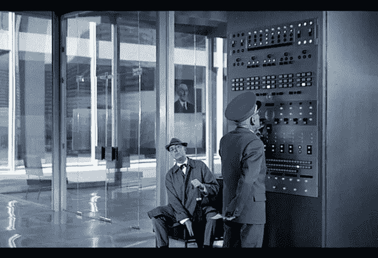
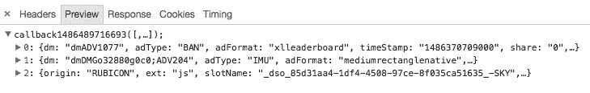

# 13 个月的服务器端头标生产:来自战壕的报告

> 原文：<https://medium.com/hackernoon/thirteen-months-of-server-side-header-bidding-in-production-a-report-from-the-trenches-4639efd03da5>

*在通过我们内部构建的服务器端解决方案运行了一年多的大量显示和移动流量后，结果显而易见:出版商获得了更多的控制和透明度，通过更好的收益和大幅改善的用户体验增加了收入。*

*在这段时间里，我确信服务器端方法至少是对抗谷歌和脸书创建的围墙花园的解决方案的一部分。移动服务器端将允许我们的部门进一步专业化，并为出版商和用户提供真正的透明度。这是在出版商和用户之间重建信任的重要一步，因为它解决了一些导致安装广告拦截器的不满。*

# 介绍

服务器端头部竞价以及它如何影响 SSP 拍卖模型是目前的热门话题。每天都有越来越多的数字广告专家表达他们的观点，我经常感到震惊的是，许多声音似乎把两个截然不同的主题视为同一个主题。是时候澄清了。

scene from ‘Playtime’ by Jacques Tati

服务器端头标结合了两件事。首先“如何从技术角度实现你的广告服务~服务器端”。其次，“如何在多个 SSPs ~表头竞价上货币化你的库存”。这两个主题包含不同的目标，它们的结果由不同的参数决定，并且它们通常不是一个媒体组织中同一个人的责任。如何实施广告是一个技术性的决定，如何货币化是一个战略性的商业决定。

在这篇文章中，我将从我在粘附的经历来讨论标题竞价的服务器端，粘附是一个整体的广告服务平台，被许多领域、平台和应用的各种媒体公司使用。

广告服务平台通常是一种技术解决方案，位于大型媒体公司的两个或更多部门之间:编辑部/网站设计部和销售部。

对于编辑和设计团队来说，广告服务器处理的是外包给另一个楼层或建筑的商业部门的在线不动产。广告服务解决方案通常实现一次，如果一切顺利，在接下来的几个月或几年中不需要更多的更改。
对于商业部门来说，广告服务器是他们的信息来源之一，也是他们需要掌握的让所有活动运行起来的工具之一。

两个利益相关方都有不同的 KPI，并且在不同的时间表上运作。这种差异是理解服务器端报头竞价的关键。

# 内容！=广告

网页设计团队和产品负责人经常在他们的产品和技术需求的不断发展的指引下，在计划的冲刺中工作。他们的 KPI 可能是更多的访问者、更多的页面浏览量、更长的花费时间、在多个平台上发布等等。从这个角度来看，广告服务被认为是页面或应用程序中的一个漏洞，需要由外部来源来填补。它应该正确地占据它的空间，而不干扰或减慢应用程序或网站。在最理想的情况下，它不应该干扰开发！

在标题竞价出现之前，网站管理员会实现广告服务器脚本，通常是一个 [JavaScript](https://hackernoon.com/tagged/javascript) 库和 html 页面主体中的一些代码。对于移动设备，广告服务器也提供库(称为 SDK ),类似的过程也会发生。[程序化](https://hackernoon.com/tagged/programmatic)将作为广告服务器中的一个活动来实现，作为瀑布系统的一部分，以特定的优先级运行，接收剩余的流量。产生程序基本上仅限于选择活动的优先级。

随着程序化收入开始上升，ssp 开始寻找越来越有价值的流量。为了打破瀑布，他们为广告服务器提供了 JavaScript 标签，这些标签仍将作为广告服务器中的一项活动运行，但可能会返回未售出的流量。通过这样做，项目团队可以提高他们开展 SSP 活动的优先级，而不会对直接销售产生太大影响。

这种变化的部分成本也由用户支付，因为在 SSP 不出售印象的情况下，是她/他的设备需要执行返回到广告服务器的额外请求。这导致了延迟问题，页面加载后跳转布局和其他一些问题，这些通常被认为是安装广告拦截器的原因。

但这也导致每个网站或应用程序上的脚本越来越复杂，更加依赖于网站管理员和设计师来正确地实现事情。这种方法最终导致了标题竞价，其中大多数“编程”逻辑以 Javascript 库和一些函数调用的形式直接在页面中实现。

即使有了这些回传脚本，或者客户端标题竞价，我们仍然在运行某种稍微优化的瀑布模型，同时让用户感觉更糟。我们现在可以向 SSP 发送更多的流量，但我们仍然没有在直接和编程之间做出最佳让步。

# 在服务器端

在 2014 年的某个时候，我们意识到，如果我们想要以一种可管理的方式有效地产生直接活动和编程，我们需要开始在服务器端实现外部收入来源。受此启发，我们开始思考将所有客户端逻辑转移到服务器会带来哪些可能性。与此同时，我们想出并开发了一些东西:

1/一个**高效且可管理的实施**。一个广告服务器从页面请求所有类型的广告，一个标准化的响应，不管广告的来源是什么。和保证的最大等待时间。

2/ **每次投放的确切收益**，使用实际的 e-cpm 进行直接活动和投标响应。向 SSP 公开直接活动的 e-cpm，以允许统一拍卖。不再有瀑布和印象级别的控制。

3/ **供应商灵活性**。由于到外部源的所有连接都是服务器端组件的一部分，因此更新这些连接或添加新连接是在服务器上完成的工作，而不需要在客户端进行更新。粒度控制允许基于任何类型的请求参数使用特定的 SSP，从基于地理位置的移动到视频内容持续时间。

4/ **清洁用户同步**。ssp 需要能够识别他们的用户。通过服务器设置，我们可以以可控的方式提供访问，将他们的用户与出版商的用户匹配，并将这些数据存储在一个地方。通过单点实现这一点使得隐私合规变得更加简单，并且发布者可以为用户提供对他们自己的设置的透明度和控制。

5/ **稳定可靠的报道**。由于所有东西在到达用户手中之前都要经过一个点，因此我们确切地知道向谁提供了什么，从而使我们能够提供详细的报告。这些报告可以洞察每个用户的体验。

我们在 2014 年开始致力于这个功能列表，基于 OpenRTB 标准，并结合 Rubicon 的 XAPI。这一过程最终导致[新产品](http://adhese.com/the-adhese-gateway/)，于 2015 年夏天投入生产，并在我们的几个 publisher 客户端上运行。

# 结果如何？

在我们到目前为止所做的每个实现中，转移到服务器对出版商的页面负载和用户体验都有直接的影响。

想象一下:一个出版商在一个页面上有 3 种格式，通过直接活动和程序销售。在瀑布设置中，考虑到 fi 的填充率。15%，85%的请求从 SSP 返回空值，需要第二次请求才能获得直接活动。

移动服务器端，您可以将 85%的流量的请求数量减少一半。在客户端报头竞价设置中，增益甚至更高，因为向 ssp 发送了多个请求。

Response time distribution for multi format requests.

在几个月的高负载生产流量之后，我们看到了持续降低的广告加载时间。在我们当前的实现中，我们的平台在一个请求中接收所有的广告位置。然后，它获取所有直接活动，并为每个位置发出并行投标请求。在 99%的情况下，这在不到 300 毫秒内完成。

通过将所有这些请求从客户机转移到服务器，用户体验通过更快的页面构建得到了显著改善。

Response array containing both direct and programmatic ads.

自从转移到服务器端以来，我们经历了各种更新周期，发送到 SSP 的数据发生了变化，库存结构发生了更新，等等。所有这些都是在无需更新客户端应用程序的情况下进行设置、测试和部署的。开发正确的调试工具以确保整个过程可以被正确地测试和监控确实花了一些时间。

我们已经看到了对收入的各种影响，从重新定位活动以找到更多匹配的用户，到基于价值更智能地交付直接活动，再到由于直接活动的代理竞价而增加的 e-cpm。对于我对每印象收益和标题出价的想法，我将在接下来的文章中详细介绍。

有些人警告用户在移动服务器端时会遇到匹配陷阱。我们的经验表明，通过集中服务严格控制用户匹配，我们可以获得可靠的统计数据，轻松识别问题，并不断提高匹配用户的百分比。在客户端设置中，像这样的方法几乎是不可能的，因为每个玩家都需要直接与客户端同步，而且没有人知道全局。

就我而言，我希望看到像 [www.digitru.st](http://www.digitru.st) 这样的倡议被广泛采用，我认为我们可以用它的欧洲版本来解决具体的隐私敏感问题。

# 结论

在通过我们内部构建的服务器端解决方案运行了一年多的大量显示和移动流量后，结果显而易见:出版商获得了更多的控制和透明度，通过更好的收益和大幅改善的用户体验增加了收入。

在这段时间里，我确信服务器端方法至少是对抗谷歌和脸书创建的围墙花园的解决方案的一部分。移动服务器端将允许我们的部门进一步专业化，并为出版商和用户提供真正的透明度。这是在出版商和用户之间重建信任的重要一步，因为它解决了一些导致安装广告拦截器的不满。

下一站:在服务器端注入所有广告，让用户得到一个真正干净的页面！

> [黑客中午](http://bit.ly/Hackernoon)是黑客如何开始他们的下午。我们是 [@AMI](http://bit.ly/atAMIatAMI) 家庭的一员。我们现在[接受投稿](http://bit.ly/hackernoonsubmission)，并乐意[讨论广告&赞助](mailto:partners@amipublications.com)机会。
> 
> 如果你喜欢这个故事，我们推荐你阅读我们的[最新科技故事](http://bit.ly/hackernoonlatestt)和[趋势科技故事](https://hackernoon.com/trending)。直到下一次，不要把世界的现实想当然！

