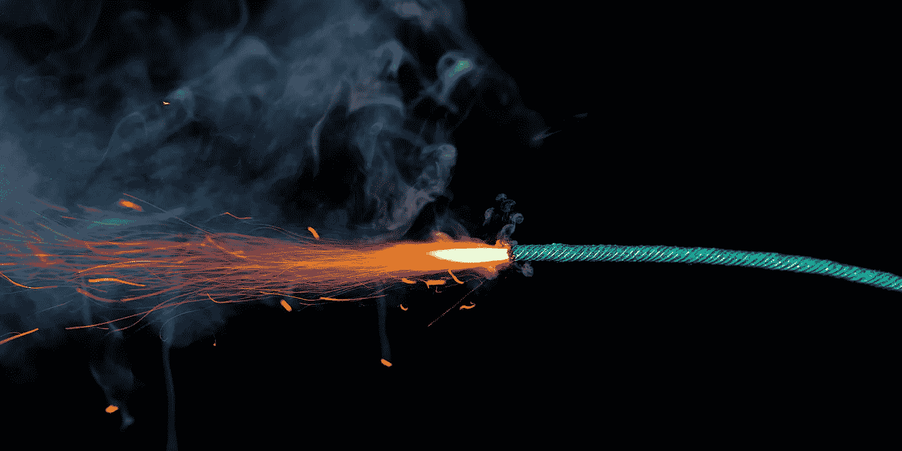

# 这个应用程序将在 5 个月内自毁 Counterpath 如何在 Mac 用户继续寻求收入的过程中欺骗他们

> 原文：<https://medium.com/hackernoon/this-app-will-self-destruct-in-5-months-how-counterpath-have-screwed-over-mac-users-in-the-a628b64b779e>

我们所有做生意的人都想增加销售额，创造更多收入，并希望获得更多利润。

但是企业的目标必须与顾客的需求和期望相一致。这是协议的基本部分。

正如我在我的上一篇文章中所讨论的—[—为什么我拥有一台 Macbook Pro 一天——以及它对我来说意味着苹果的未来](https://hackernoon.com/why-i-owned-a-macbook-pro-for-a-day-and-what-it-says-to-me-about-the-future-of-apple-75b84458d86c) —当你购买一个产品时，你不仅仅是购买产品本身(或者，如果是软件，使用它的许可)，你还购买了支持服务。

**当服务质量差的时候，公司没有向你推销他们承诺的东西。**

今天的抱怨是关于 [Counterpath](http://counterpath.com) 和他们的产品 Bria，这是一款 SIP 软电话，多年来已经发展到包括你可能在其他五款应用中拥有的相同功能——视频消息、语音聊天、联系人管理等

我从 2011 年开始使用 Bria 软件。目前我在 Bria 4 上，在我的 MacBook Pro 上运行。

它能满足我的需求——也就是说，它是一部不错的 SIP 软件手机。我不使用视频功能或聊天功能，我有其他我喜欢的应用程序。

我们拥有 Bria 的一些许可证——为我们没有或不想要实体 SIP 电话的员工，以及那些带着笔记本电脑旅行的员工。自 2011 年以来，它一直是我们选择的 SIP 软件。

Bria 5 于 6 月发布。它并没有为我们增加任何有价值的东西。我认为这提高了视频通话的质量，但同样，我们并没有把它用于那个目的。

不，Bria 4 对我们来说很好。

只不过，过几天就不是了。至少如果我们的 Mac 用户想升级到 High Sierra 就不会了。

尽管在他们的论坛上告诉在 High Sierra beta 上运行有问题的客户等到最终发布，他们现在承认在 High Sierra 下不会开始。

他们也不会修理它。

我不确定它不启动的原因是什么。起初我认为是 32/64 位的变化，但从我所看到的来看，32 位应用程序仍然兼容，直到明年。

不管是什么原因，作为一个终身开发者，我无法想象他们的团队会花很长时间来发布 Bria 4 在 High Sierra 下工作的修复程序。

**Counterpath 的解决方案？升级到 Bria 5。是的，现有客户升级有折扣，但 Bria 总是有折扣。**

这不是是否可能的问题，这只是他们在追逐销售、收入和利润。通过他们在这里的决定，有很多不满的 Bria 用户将不再为他们的销售、收入或利润做出贡献。

High Sierra 被视为维护版本。这不是一个全新的操作系统。

虽然 Bria 4 确实不是唯一一个在 High Sierra 下无法工作的应用程序——苹果自己的一些产品，如 Final Cut Studio 和 Logic Studio 都无法工作——但 Bria 4 今年仍在销售。

这两个苹果公司的项目在 2011 年停止了。虽然如果你还在使用它们的话肯定会很烦人，但是对于一个软件的生命来说，2011 年到 2017 年已经足够公平了。

**2017 年到 2017 年肯定不会。**

我已经通过支持票直接联系了 Bria，也参加了他们论坛上关于这个的许多讨论。

来自[对手](https://hackernoon.com/tagged/counterpath)的答案是坚定的。它不起作用。我们不会成功的。你需要升级到 Bria 5。我们有优惠的升级价格。

**不用了，谢谢反驳。**

在我参与的一个论坛上，人们一直在寻求替代方案。昨晚我发布了一个问题，想知道他们是否允许人们推荐替代品。

我在一夜之间收到了两条新消息的电子邮件通知。两者都提出了替代方案。

**我看了一下跟帖，那些帖子都被删除了，话题也已经被锁定。**

干得好。你不仅拒绝让一个几个月前刚售出的程序与 High Sierra 兼容，从而欺骗了你的用户，而且你现在还在审查用户，不让他们寻找替代方案。

这是你的选择，当然，这是你的论坛。但至少在你的论坛上，它是“内部”保存的。一旦你阻止了顾客在那里讨论它，它自然会跑到外面更广阔的互联网上。

所以，我面临一个选择。升级到 High Sierra，拥有与现代 macOS 保持同步的所有优势，或者忽略升级并继续运行 Bria 4。

**很明显，我要升级了。我会停止使用布里亚。**

如果我发现一个开源 SIP 电话足够好，我会使用它。如果我必须向另一家公司支付替代费用，我会很乐意这么做。

**我再也不会做的一件事是向 Counterpath 支付费用。这么多增加你的销售，收入和利润。从论坛来看，我不是唯一一个。**

非常欢迎对 mac(和 windows)替代品的推荐。此外——撇开严重的个人无礼不谈——这里没有审查制度；)

感谢阅读。如果你喜欢它，或者如果 Counterpath 的态度激怒了你，如果你想帮助对做“错事”的公司施加压力，请鼓掌并与朋友分享。谢谢你。

**更新#1:**

Counterpath 删除了我在他们客户论坛上的一些帖子。据我所知，我是顾客。他们还删除了其他不满顾客的帖子。难以置信。

**更新#2:**

我现在已经被禁止(“访问限制”)Counterpath 论坛的“滥用”。我没有发布任何辱骂，我非常希望 Counterpath 能够展示我是如何辱骂的。我只是质疑为什么我的帖子和其他客户的帖子会被删除。在我的上一篇文章中，我问删除这些评论的人是不是 CEO，如果不是，我建议他在继续删除付费用户的有效评论之前，应该先和 CEO 核实一下。

**更新# 3(9 月 30 日):**

Counterpath 再次关闭了讨论此问题的帖子，论坛管理员 Derek Jacobs 昨天发布了以下评论:

> 当 CounterPath 在 6 月 22 日发布其新的 Bria 5 Mac 版本时，我们鼓励所有现有的 Bria 4 用户升级到我们的新 Bria 5 产品，以确保他们保持在积极支持的代码基础上。随着 9 月 25 日苹果 High Sierra (10.13) macOS 更新的发布，许多 Bria 4 用户遇到了他们的 Bria 4 应用程序不再运行的问题。
> 
> 与大多数其他软件公司一样，CounterPath 定期发布重大产品升级，并收取升级费用。CounterPath 无法控制 Apple(和其他操作系统平台开发商)是否会包含不支持以前支持的功能的操作系统更改，我们也无法控制我们的用户是否会升级到最新的操作系统版本。虽然我们非常注重让现有用户满意，但 CounterPath 继续为我们的传统产品开发软件更新是不现实的。

在这种情况下，德里克完全忽略了一个事实，即有人在 6 月 22 日之前购买了 Bria 4。可能在 6 月 21 日。

他们唯一的选择——如果他们希望保持他们的操作系统是最新的——似乎是花钱升级到 Bria 5。Counterpath 提供打折升级，但价格仍在 30 美元左右。为什么在 6 月 22 日之前购买 Bria 4 的人会被“鼓励”为升级支付更多费用？但尤其是现在，当它停止对 Sierra 的最新维护版本的工作时。

一家像样的公司要么花时间让 Bria 4 在 High Sierra 上工作，要么至少给在 2017 年 6 月 22 日 Bria 5 推出免费升级之前不到一年购买 Bria 4 的用户。

声明一下，我最后一次从 Counterpath——Bria 4——购买是在 2016 年 6 月 1 日，所以我不符合免费升级的条件。那很好。我和 Counterpath 和 Bria 的关系结束了。但是客户已经发帖——虽然你不会再找到他们的帖子，因为他们已经被删除了——他们在 6 月 22 日之前购买了 Bria 4，他们应该得到他们的应用程序持续 3 或 4 个月以上。

最后，我还没有收到 Counterpath 关于我所谓的“滥用”的任何回应，这导致他们限制我访问论坛并阻止我发帖。据我所知，我是一个顾客，我不相信我发布的任何东西会被归类为滥用。除了明显试图让不满的顾客保持安静之外，我仍在等待他们对此的解释。

我甚至不能提交一张支持票来问我为什么被禁止，因为，嗯，我的“帐户被禁止”。真的对抗吗？你就是这样对待付费顾客的？

**更新# 4(10 月 4 日)**

虽然我仍然被禁止在 Counterpath 论坛上发帖(并且还没有收到他们关于我发布了什么“滥用”的任何回复)，但我仍然可以阅读它，客户抱怨说，即使是 Bria 5 在 High Sierra 下启动时也会崩溃。Counterpath 提出了几个建议(第一个是升级到 High Sierra 后重启...doh)，甚至暗示故障可能是人们升级 Bria 4 并告诉他们卸载 5，然后 4(如果他们有)，手动删除一些文件夹，然后重新安装并从头开始重新设置一切。唯一的问题是，这显然也不起作用。

很高兴我拒绝升级。