# 那不是比特币——你凭什么告诉我们不是比特币？

> 原文：<https://medium.com/hackernoon/this-is-bitcoin-who-are-you-to-tell-us-otherwise-8fc5966d4ac4>

## (Segwit)2x 失败原因的信息概要。

[https://twitter.com/Ragnarly/status/916072098245701632](https://twitter.com/Ragnarly/status/916072098245701632)

## 介绍

既然 2X hard-fork 计划已经结束，我已经决定对我的[原始帖子](/@StopAndDecrypt/thats-not-bitcoin-this-is-bitcoin-95f05a6fd6c2)进行后续跟进。我没打算让它成为更大的东西的“第一部分”,所以这两篇文章的结构不是这样。请先去读一下。我*希望*也能解决 2017 年两大分支*(和空投)*所开创的先例，以及这对我们都非常热爱的比特币协议的未来方向可能意味着什么，但就像最初的帖子一样，这变得太长了*(主要是由于截图)。我打算在某个时候继续写另一篇关于这些主题的文章，这篇文章将覆盖 2X。我的帖子试图在对比特币的入门级和中级理解以及推动比特币的政治丛林之间架起一座桥梁，所以我将努力保持在这个范围内。如果你*“不明白所有这些分叉是怎么回事”*但是你拥有比特币，或者多少知道比特币是如何工作的，这篇文章是给你的。*

# 2X 是什么？它从哪里来的？为什么会失败？

*在此之前，我想声明我并不讨厌 Barry Silbert 创造了 2X。我认为有可能他是真心想帮忙，只是没有预料到随之而来的混乱。也就是说，他在这里使用了他唯一的一击，所以让它成为他的一次学习经历，并成为未来任何认为他们可以做同样事情的人的榜样。*

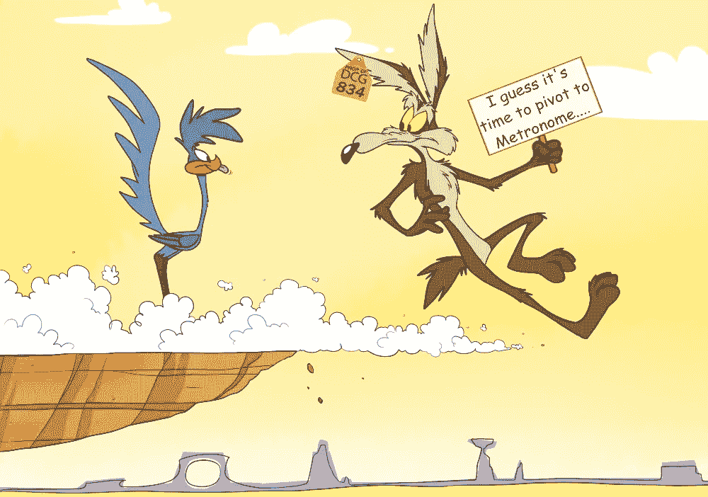

I’ll let you decide who Wile E. Coyote is.

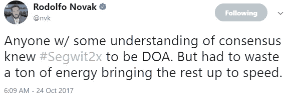

[https://twitter.com/nvk/status/922812211831042049](https://twitter.com/nvk/status/922812211831042049)

我愿意认为我写下面所有东西的时间是值得的，而不是浪费的，但是 Rodolfo 的观点仍然有效: **2X 是 DOA。让我们加快速度。**

第一，它不配叫 SegWit2x。我就直说了吧: **2X** 。

第二，任何在结尾附加+2X 的未来升级提案的未来劫持*(或开头、中间或完全从名称中删除)*只是同一攻击的另一种翻版。这种攻击看起来是无组织的，并且受到不知道自己是棋子的人的支持*(有时是领导)*。2X 就是 2X，无论它连接到什么，无论谁领导它，无论谁编码它。下面是 2X 这次 ***失败的原因。***

## 索引

*   2X 根源:*纽约协议*
*   2X 接收:*机构群体的回应*
*   2X 出尔反尔:*余波*
*   2X 撤销:*撤销*

# 纽约协定

## 我们先从 2X 的起源说起，以便理解它为什么会脱落。

这不是关于扩展争论的历史，只是知道“大块”已经被一个小团体吹捧了一段时间，作为“扩展问题”的解决方案。他们所有的尝试都失败了，有充分的理由，2X 也不例外。虽然社区的大多数人都认可即将激活的 [SegWit](https://bitcoincore.org/en/2016/06/24/segwit-next-steps/) ，但矿工们正在阻止它，所以第三方进来用“大块”包装 SegWit，称之为“妥协”。[比特大陆一直在利用](/@WhalePanda/asicboost-the-reason-why-bitmain-blocked-segwit-901fd346ee9f)优势 *(ASICBoost)* 在采矿过程中奖励给那些控制重要权力的人，**而 SegWit 间接阻止了这种优势。这意味着如果 SegWit 以其当前的软分叉形式被激活，比特大陆将损失数百万美元，因此比特大陆阻止了升级。他们公开控制两大矿池，有人推测前四*(超过 50%)* 。矿工可以离开，但他们的动机是利润，比特大陆提供了稳定的收入来源。用户已经受够了 SegWit 被封锁，所以他们中的一些人决定不经中央矿工通过 [UASF](/@jimmysong/uasf-bip148-scenarios-and-game-theory-9530336d953e) 的“批准”就激活 SegWit。尽管 SegWit 是一个数据块增长，但一个小团体和一些企业开始大声要求增加数据块大小**。**在此之前已经有很多关于这个话题的讨论，下面是 2015 年的一个小时的[专题讨论](https://www.youtube.com/watch?v=0iQSRGT3nfE)。这是来自 2017 共识的[小组](https://s3.amazonaws.com/media.coindesk.com/live-stream/Day1_Salons34.html)，这是该小组的一个片段:**

“We don’t sell cups of coffee”…“Our bread and butter is $5, 10, 20k price range for a typical transaction.”

这是 Stephen Pair*(bit pay 的首席执行官)* 在 5 月 22 日**的 Consensus 2017 上**，谈论比特币如何不再为他的公司*工作，他们别无选择，只能使用比特币的叉子。在 Consensus 没有发生的是，没有人告诉斯蒂芬，他的商业模式有缺陷，他的公司的软件效率低下，哦……而且**比特币从未为他的公司“工作”。**究竟是什么样的数据块大小阻碍了贵公司处理 20，000 美元交易的能力？他[在小组讨论前 4 天提出了这一点](/@spair/our-conspiracy-with-bitmain-936bc0eabb6)，试图否认他可能会被比特大陆收购。这是 Stephen 在那个剪辑的前一年(T14)，称赞开发者没有屈服于块大小的压力:*

*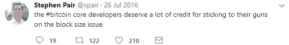*

*[https://twitter.com/spair/status/757908557949984769](https://twitter.com/spair/status/757908557949984769)*

*在**5 月 23 日**，[数字货币集团](https://en.wikipedia.org/wiki/Digital_Currency_Group) *(首席执行官是* [*巴里·希尔伯特*](/@charlescmackay/barry-silbert-and-the-cost-of-bitcoins-malfeasance-culture-f83d15ad07d1) *，他在那之前没有参与任何开发过程)**介入并宣布了后来被称为[纽约协议](/@DCGco/bitcoin-scaling-agreement-at-consensus-2017-133521fe9a77)。该协议的*含义*是所有上市公司走到一起，决定以一种“组合的”扩展解决方案向前推进:区块大小增加**SegWit+**2X。事实是，少数其他商业领袖刚刚收到了由 DCG*整理好的 **协议，并被告知如果他们想避免分歧就签字。很少有人真正想要 2X，他们只是不想要叉子，没有人真正代表声音或他们的顾客。我们也没有看到任何签署协议的公司公开表示，他们实际上参与了这份协议的起草过程，这一切都是巴里和 __？？__.*****

***一些团体已经利用大块推动了一段时间，通过淡化和嘲笑 SegWit 升级，并提供他们自己的解决方案，如比特币*【无限】*，其具有*无限*块大小。这种杠杆作用，再加上矿工们已经因为金钱原因阻止了 SegWit，给了这个严重分裂的社区一个*外观*。*【无限】*最终还是像它的前辈们一样失败了*经典*和*【XT】*被同一个集团推着走，最后被分成了 2X 和后来的*【现金】。*比特币*【现金】*成功分叉，但*大多数*知道它是为了失败而设计的，是一个骗局，所以 2X 支持者*(实际上只是一些首席执行官和想要分裂我们的‘现金’支持者)*继续推动 2X。有没有人夹在中间？是的，但是他们又远又少。***

**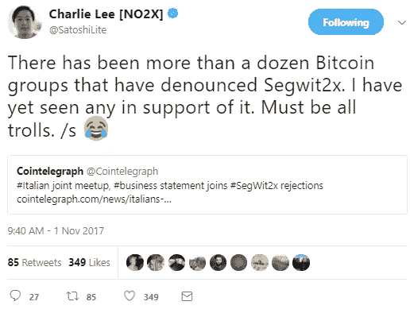**

**[https://twitter.com/SatoshiLite/status/925764562929848320](https://twitter.com/SatoshiLite/status/925764562929848320)**

# **社区的反应**

## **社区对 NYA 的最初反应并不积极。**

**随着时间的推移，反对意见是全面的，是从零开始建立的，直到它成为一个不可否认的失败，以整个事情被取消而告终。如果你愿意，你可以查看 [NYA 链接](/@DCGco/bitcoin-scaling-agreement-at-consensus-2017-133521fe9a77)并阅读所有评论，我推荐它，**请阅读其他人的意见。像所有的重大声明一样，这份声明随后被提交给 Reddit，也充满了反对意见。自己去读吧，这里有一些*(好吧很多)*亮点:****

**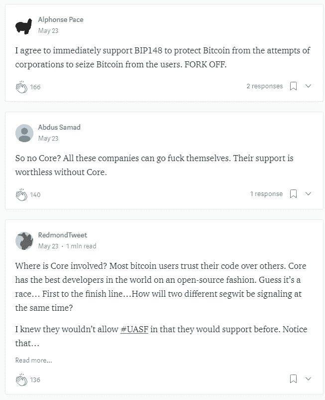****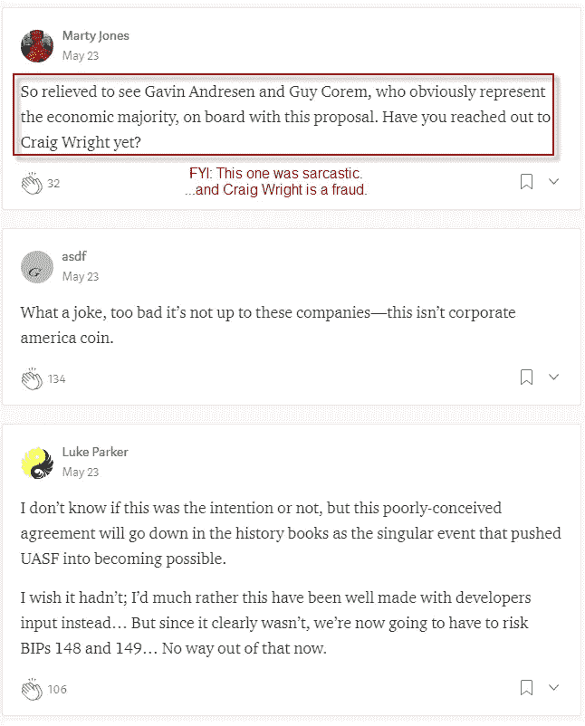****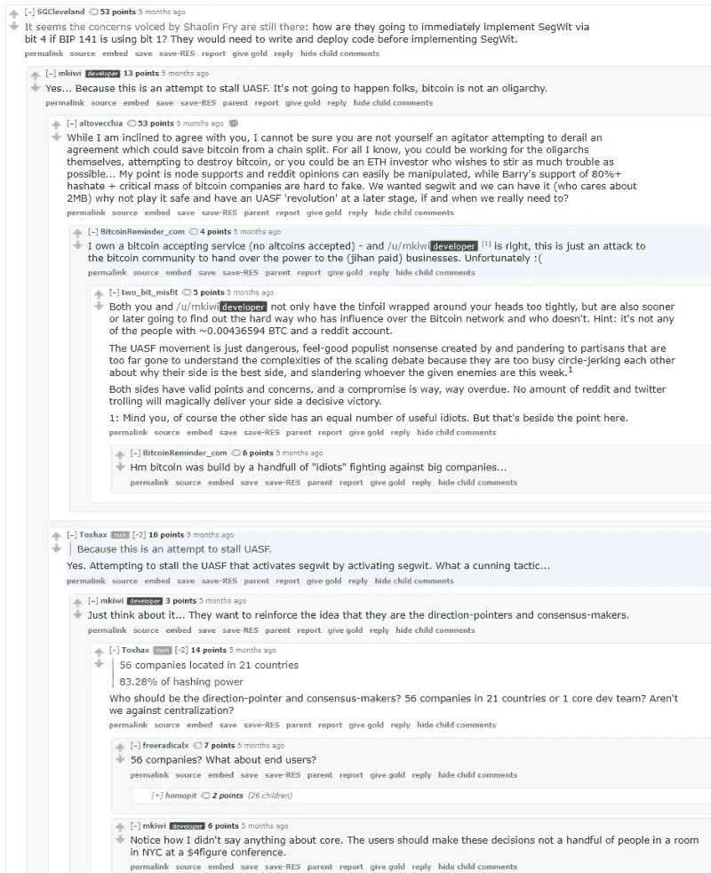****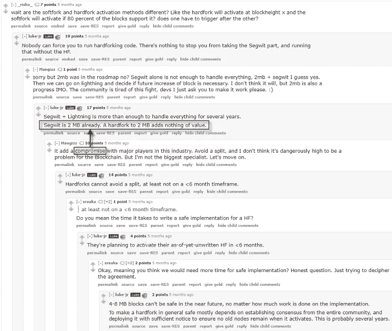****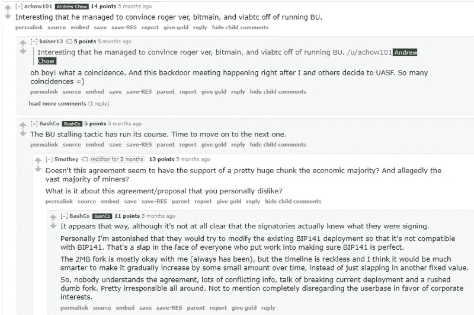****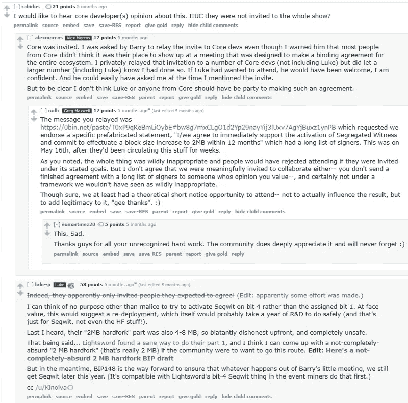**

**[https://0bin.net/paste/T0xP9qKeBmLiOybE#bw8g7mxCLgO1d2Yp29nayYij3lUxv7AgYjBuxz1ynPB](https://0bin.net/paste/T0xP9qKeBmLiOybE#bw8g7mxCLgO1d2Yp29nayYij3lUxv7AgYjBuxz1ynPB)**

## **如果从一开始就不清楚 2X 是一个广受争议的提议，那么还发生了什么导致它不可避免的消亡呢？**

**首先，*没有代码*。您无法下载并运行支持此提议的客户端。当杰夫·加齐克(Jeff Garzik)介入并创造出“btc1”时，情况发生了变化。你可以在这里查看 Bt C1，但你不会发现太多的活动，因为几乎所有的工作和决策过程都是私下进行的，这与共识正好相反。杰夫·加济克为复制比特币所做的所有“工作”都可以在那里找到。我承认这种说法被认为对社区的边缘部分有点偏见，但它*是*的翻版。它的目标是成为*的*比特币，但它并没有成功实现它的初衷，但这是如何实现的呢？我想保持简单，只是说社区决定了一个硬币，这是它，但它真的不是。那么为什么社区会这样决定呢？是 UASF/龙帽和推特标签吗？**

**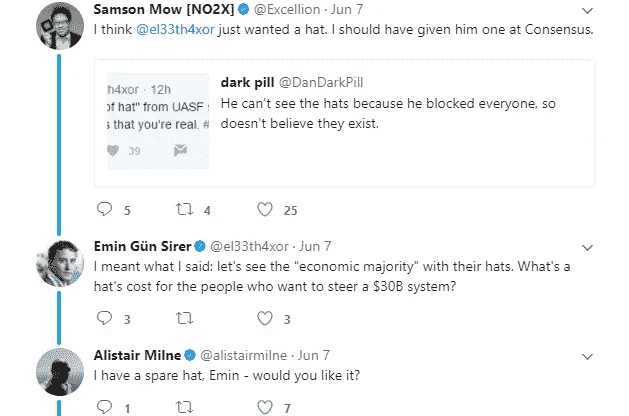**

**[https://twitter.com/Excellion/status/872646717266509824](https://twitter.com/Excellion/status/872646717266509824)**

**好吧，这比那要复杂一点，但事实是有些人喜欢“把他们的心穿在袖子上”**

**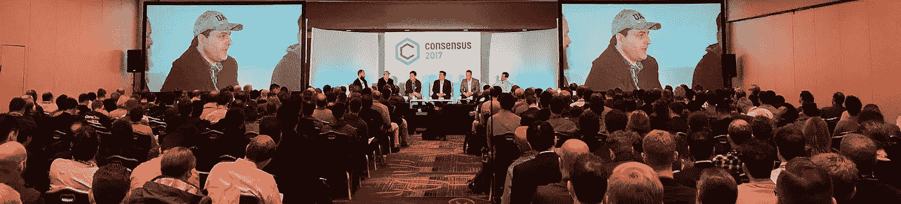******

**…他们想让每个人都知道他们支持谁，他们认为自己的观点是“正确的”。*他们可能是错的*，但这并不是某类群体特有的行为，这是一种跨越政治光谱的渴望。因此，当“私下交流”明显有利于所有渠道的一个观点**时，你可以合理地假设它对经济支持有影响，如果它不是直接的一部分。*(果然是，证明如下。)*****

*******现实是，*** 社区的大多数人，[包括公司](http://nob2x.org/)都反对 2X，我将提供分叉之前的许多迹象，让我对这一事实充满信心，从 Twitter 标签开始。整个比特币社区中有一小部分人积极使用 Twitter 进行交流，大部分人只是潜伏着。使用 NO2X 标签的人更少，所以我开始为 NO2X 和 Pro-2X 的支持者列一个清单。Twitter 只允许你一次搜索多达 108 个人，它会根据他们使用的某种算法向你显示最常见的联系，所以如果他们超过 108 人，你不会通过搜索找到准确的总数。其余的名单成员来自于在野外看到它们，并不时地重复搜索。请记住，如果我看到了 Pro2X 的评论，但随后这些人的历史记录显示他们支持比特币*‘现金’*，他们不会被包括在内:****

****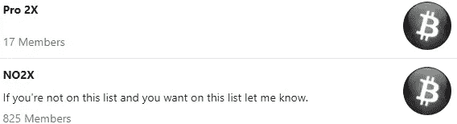****

****[https://twitter.com/StopAndDecrypt/lists/no2x](https://twitter.com/StopAndDecrypt/lists/no2x)****

****你也可以看看他们松散的社区之间的差异。这是他们两个最大通道的对比: **7，705 对 413******

****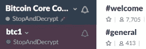****

****如果这是一个安慰的话，尽管这个很容易被争论，因为我没有任何有形的数据:#比特币是目前 Freenode 上第三大 IRC 频道，主要由核心支持者管理和经常光顾。没有 2X IRC 频道。有#以太坊频道，有#Monero 频道，有#莱特币频道，有#ZCash 频道，有#Dash 频道…#Dogecoin，#Gridcoin，#Filecoin，#IOTA，#Namecoin，#Vertcoin，#Siacoin，#Rubycoin，[X]coin，[Y]coin，[Z]coin，#BitcoinXT，#BitcoinChat *(bitcoin.com，' Cash '，r/btc)* ***，但是*******

****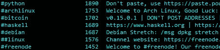****

*******现实是，*** 每个人都看穿了许多假 2X 支持者正在使用的滑稽动作，比如“反 NO2X”，**但随后又去支持比特币'*现金'*** *。*事实上，社交媒体上大多数 2X 支持*(除非首席执行官们提倡)*是由*【现金】*支持者发起的。我以前说过，现在再说一遍:**有人试图系统性地分化比特币社区。**不是每个人都有相同的最终目标，都是松散的/组织得很差的，但却是*真实的*。一些人想要另一种硬币*(像以太坊)*来取代它的位置，而另一些人只是坐在成堆的比特币上，很乐意有机会扔掉新分叉的硬币。下面的截图是一个比特币'*现金'*支持者推广的*(付费广告)*，贬低 NO2X，推广 2X 分成，在这个过程中撒谎。然后是 Tuur Demeester 对“各大交易所”的回复，以及 BitMEX 的回复:****

****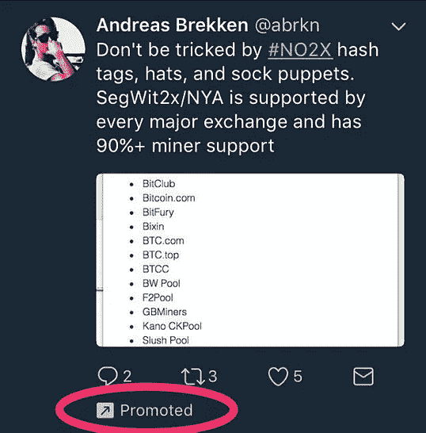********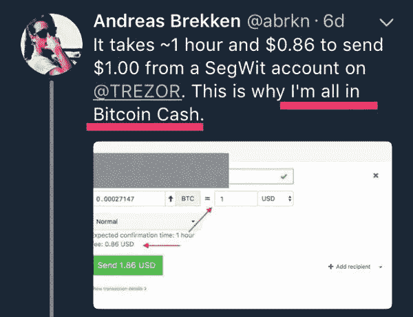********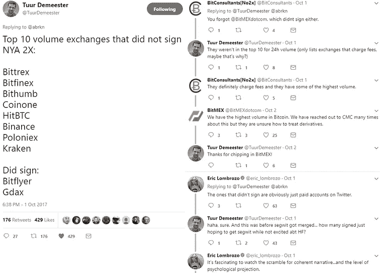****

****Roger Ver 利用 2X 来划分社区，以支撑比特币“现金”。由 2X 的主要开发者代言，知道罗杰的骗局:****

****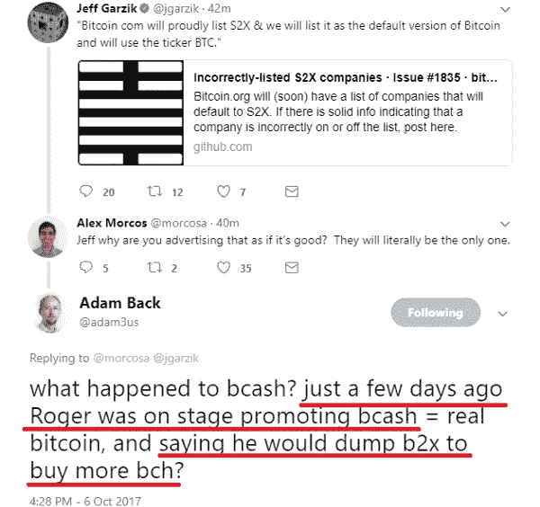****

****这是罗杰的演示，一周前他在台上宣传比特币*【现金】*。他为什么要在自己的网站上支持 2X？：****

****如果 Roger Ver 已经有了比特币*【现金】*，他为什么还要积极支持 2X 议程？嗯，这是每个人都问过自己的问题，而且…****

*******……现实是，*** 无论你如何撒谎和散布错误信息，整个社会还没有被它蒙蔽。对于那些被*(我的帖子旨在帮助防止这种情况发生)*诱惑的人来说，这很不幸，但我们中有太多的人关注并呼唤你出来。[这篇文章](/@thepiratewhocantbenamed/my-thoughts-on-your-thoughts-17474d800dda) *(作者*[对核心开发者 Matt Corallo 的采访](https://medium.com/u/89199265723b#3d6e28975b4f)。你想让“关于公司收购的噪音”消失吗，迈克？试着意识到你的行为直接导致了噪音。 **2X 没有真正的节点，他们(你)必须在亚马逊上组装 2000 个节点，** [你自己的员工](/@lopp/securing-your-financial-sovereignty-3af6fe834603)完全反对你的立场，你自己也承认了这一点:****

****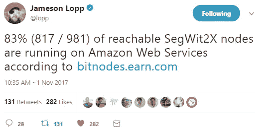********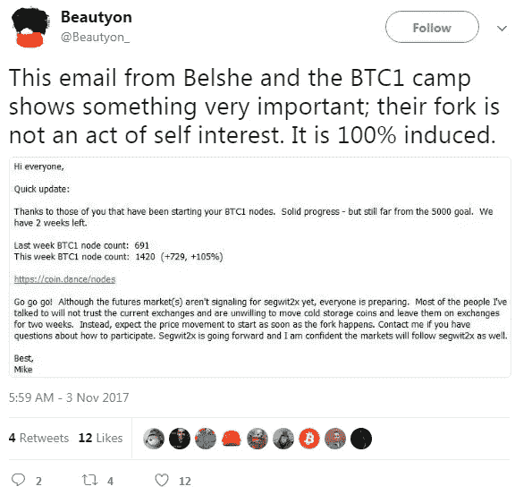****

****[https://twitter.com/lopp/status/925778410965647360](https://twitter.com/lopp/status/925778410965647360) — [https://twitter.com/Beautyon_/status/926433562613747713](https://twitter.com/Beautyon_/status/926433562613747713)****

**** [## 保持社区团结

### 从一开始，Segwit2x 就被设计来保持社区的团结。团队从来不想看到链条断裂…

medium.com](/@mikebelshe/keeping-the-community-together-5c4dcda7aeb4) 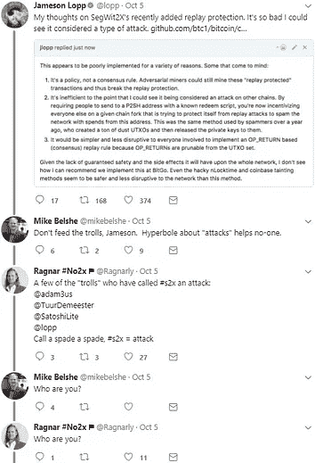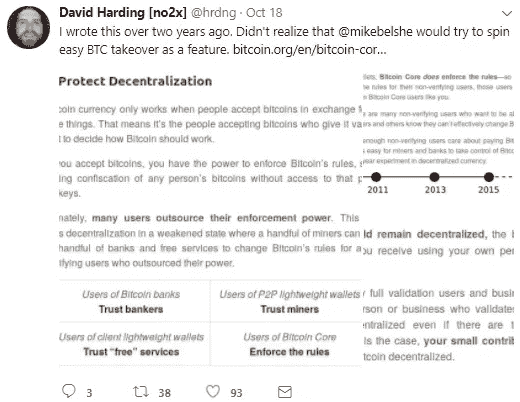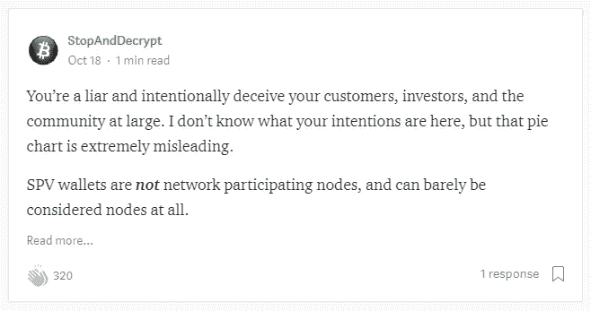

[https://twitter.com/hrdng/status/920714828934778880](https://twitter.com/hrdng/status/920714828934778880)

*   埃里克·沃尔赫斯*继续做埃里克。老实说，我只是认为他被严重误导了，并从一个想发展自己业务的首席执行官的角度看待这件事。对此，我的回答与斯蒂芬·帕奇相同:**比特币不关心你的生意**，埃里克，你最好早点意识到这一点。比特币从来不欠区块链的空间，也不欠 ShapeShift。学会适应和使用闪电网络。此外，不要说你将置身于辩论之外，然后在 Reddit 上发布关于辩论的帖子。*

*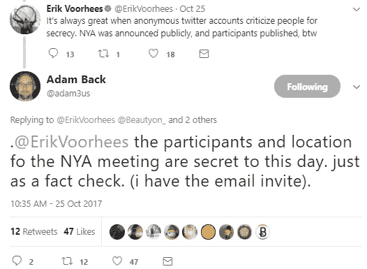**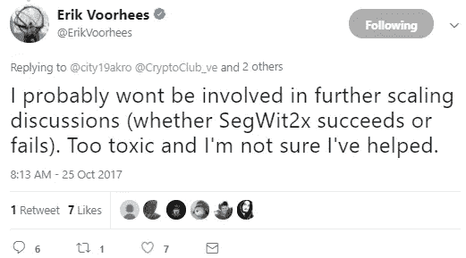**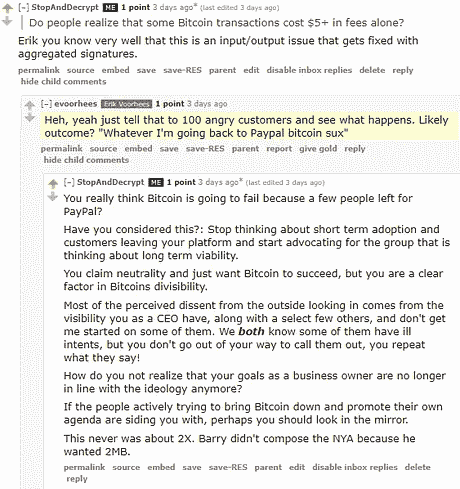*

*你在整个过程中的行为一直让我重新考虑是否应该怀疑你，很多人已经完全放弃你了。也就是说，你的最终声明目前让你陷入困境，在我看来，唯一让你保持漂浮的是你承诺不再倡导任何未来的缩放辩论:*

*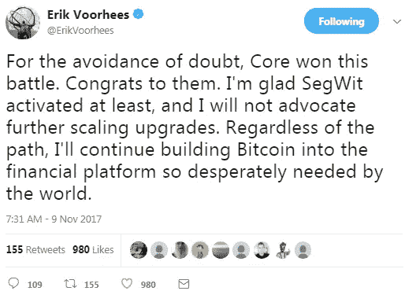*

*[https://twitter.com/ErikVoorhees/status/928646295249502208](https://twitter.com/ErikVoorhees/status/928646295249502208)*

*   *罗杰·韦尔***(Bitcoin.com 首席执行官)*** 宣布他的网站将推广 2X，尽管他是比特币*【现金】推广的倡导者和直接贡献者。*我在这上面反复喊他，他阻止了我。对于一个一直声称审查的人，你会认为他会允许我在他的推特上发表意见。如果你想了解罗杰，请观看理查德·哈特最近对他的采访。他真的相信自己是对的，但他是那种“为达目的不择手段”的人，为了达到他认为正确的目的，他会撒谎和欺骗。*

*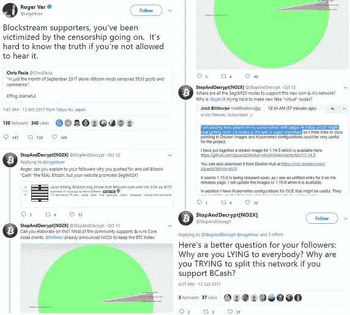**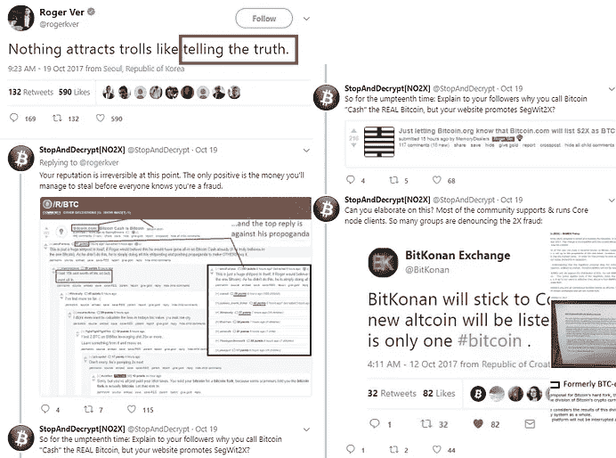**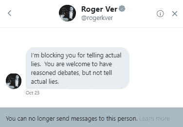*

*   *吴***(***CEO)尽管积极挖掘/鼓吹/直接贡献比特币*【现金】，但仍是的签约人。由于比特币混乱的 EDA 算法，一度有 50%的矿工转而使用比特币“现金”。如果矿商现在正在开采一个既不是现任也不是 2X 的替代链，你是否同意他们已经退出了 NYA？你怎么能签署一份协议说“我的 pools hashpower，占整个网络的 25%，支持 NYA”，但随后 hashpower 去做别的事情？**你如何为使用你泳池的矿工签名？Slushpool 让矿工们决定:****

*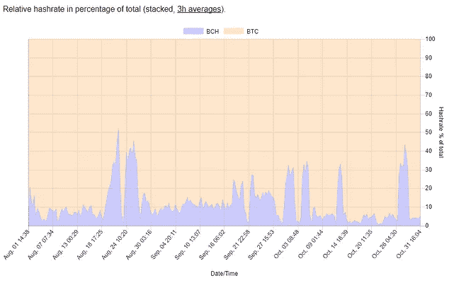**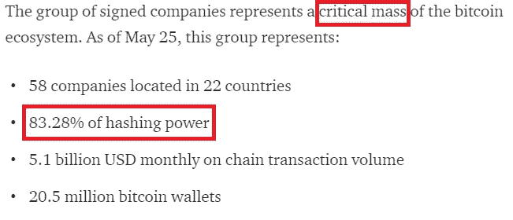**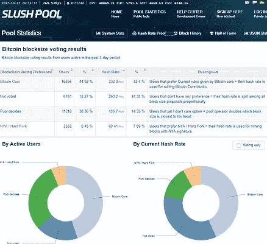*

*   *Vinny Lingham ***(思域 CEO)***从一开始就直言不讳了 2X。我在之前的文章中提到过他，因为他公开承认 2X 从来都不是关于块大小，而是关于从创建它的开发人员手中夺走权力。从那以后，在进行了这场 *(请去看那个)*的辩论后，他承认他关于缩放的观点不重要[。我同意，他是企业家，不是开发商。他说他会让步，我们就假定他无罪，然后他继续推销 2X。现在它失败了，他开始慢慢地谈论更多关于比特币的事情。哦，他是杰夫·加齐克公司的顾问](https://www.youtube.com/watch?v=f1c7fvTEvFk)*

*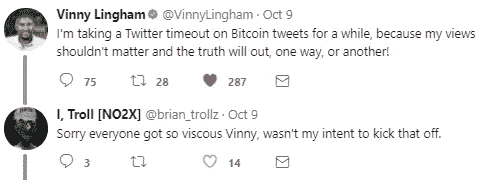**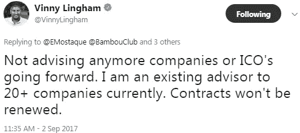**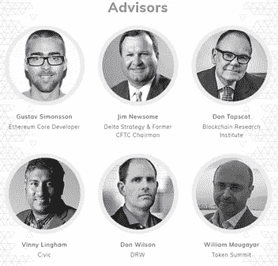*

*   ****蒋(CEO。*)**就直截了当地打破了 NYA 协议中他的一部分。你甚至不能质疑这个:*

*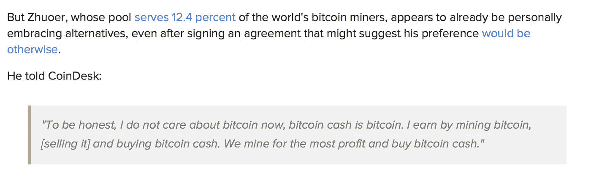*

*[https://www.coindesk.com/split-no-split-bitcoin-miners-see-no-certainty-segwit2x-fork/](https://www.coindesk.com/split-no-split-bitcoin-miners-see-no-certainty-segwit2x-fork/)*

*   *克雷格·赖特 ***(是诈骗):****

*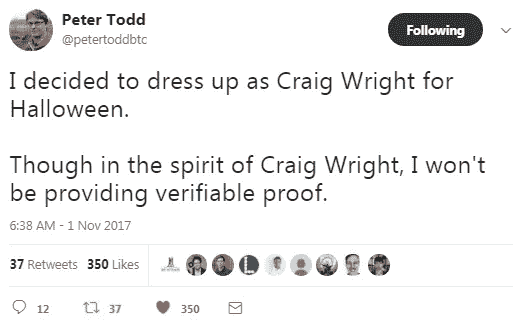**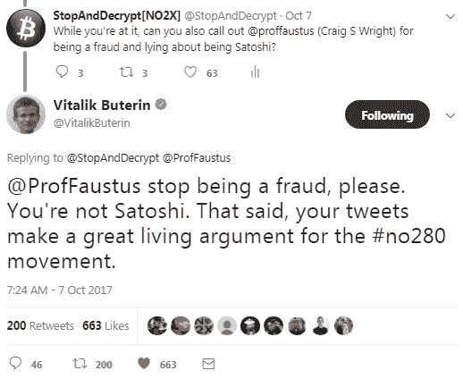**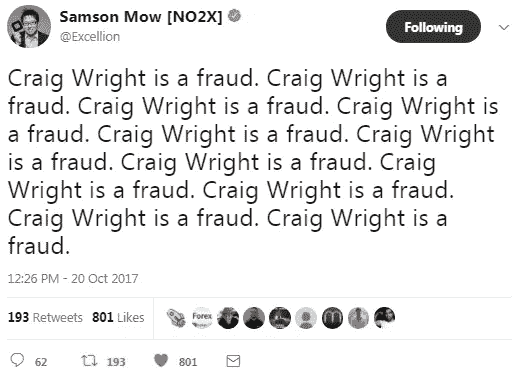*

*我将用全球各公司和团体发布的关于 2X *的声明汇编来结束这一部分(我可能错过了一些，因为有太多的***)*。我个人最喜欢的是 BitMEX 的回应:**

**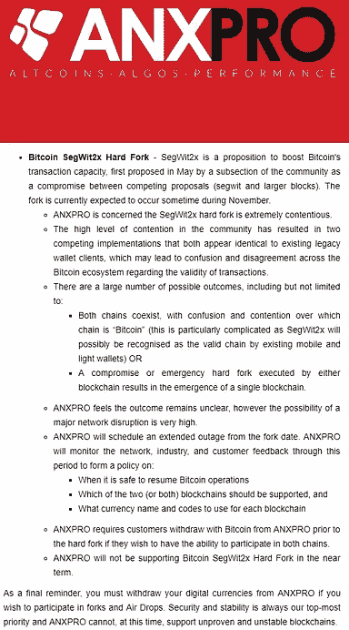****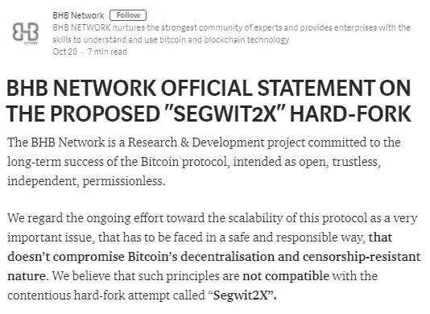****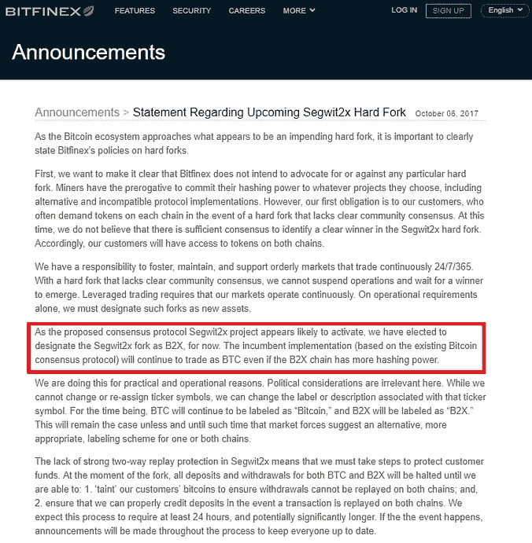****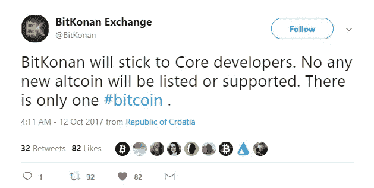****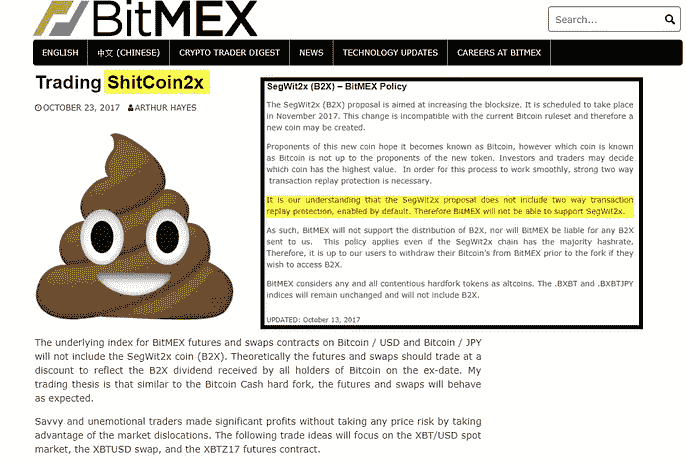****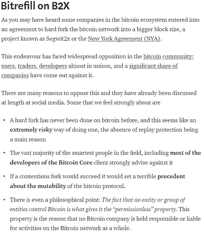****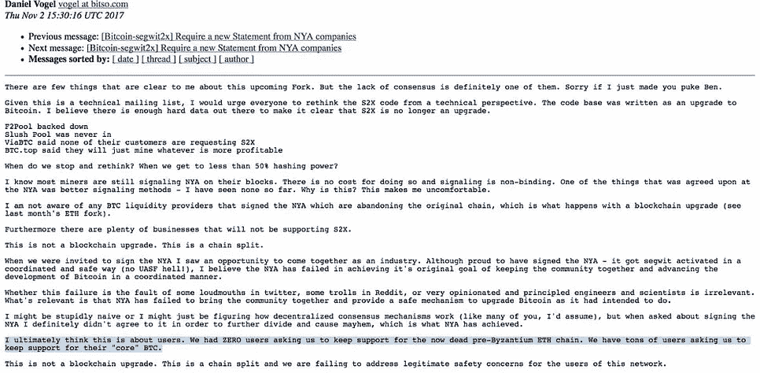********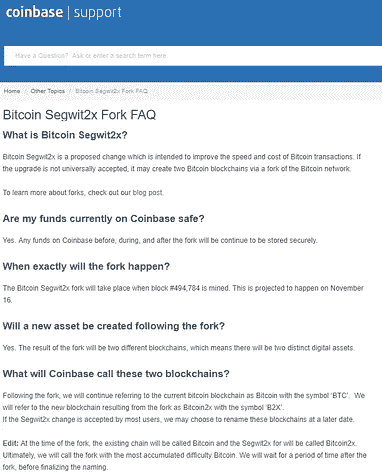****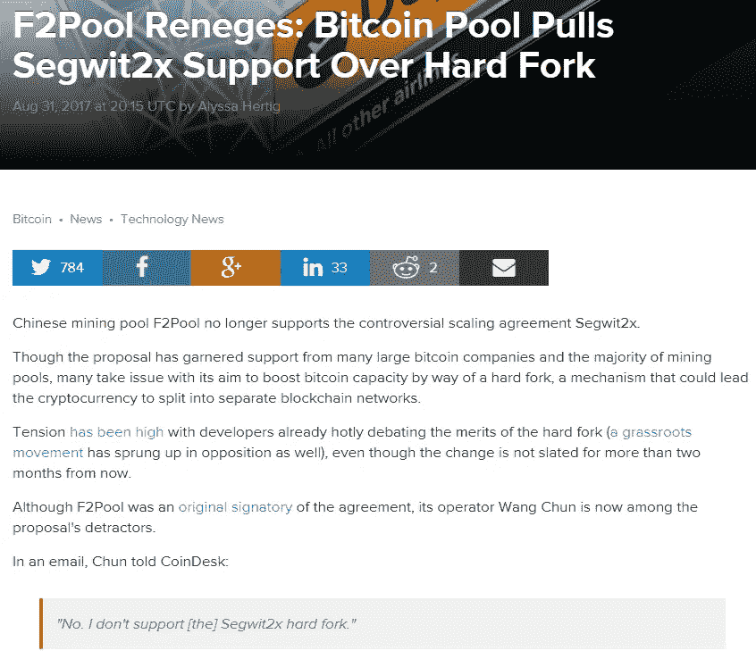**********************************************************

# ***取消***

**我本打算把最后一段加长。我保留它的细节，关于 2X 链分裂的最终结果。我打算在叉后有足够的材料做结案陈词时更新这篇后期文章。我知道我通常想触及什么，并有一个不同的标题，可能会在未来适用:*hash power 跟随价格(但不定义比特币)*。我想说的是，矿工们显然不会****也不应该**做出利他行为，或者被允许在协议范围内表达他们支持某事的意图。即使权力会跟随盈利能力，如果一个小团体积累并控制了一个系统中的大部分经济权重，他们会在很长一段时间内对价格产生严重影响，但除了他们之外，不会成为任何人想要的链条。如果你足够早地投资比特币，你现在可能已经是一个流动性差的万亿富翁了，你可以自己推动整个市场。从理论上讲，怎么会有人偷了 Satoshi 的钥匙，或者 Satoshi 可能是一个 3 个字母的政府机构。我想说的是，一旦你理解了这些含义，你就会明白:**市场也不能决定比特币。******

****这是直到电子邮件被发送到 2X 邮件列表。****

****六个人取消了 2X。****

******六:******

********

****这封邮件发出后，整个项目都被取消了。****

****六个人取消了 2X 后，整个项目被取消了。****

******六个。******

********

****[https://twitter.com/francispouliot_/status/928352267073355776](https://twitter.com/francispouliot_/status/928352267073355776)****

# ****附录****

## ****我说过我不会谈论比特币*‘现金’*但是我控制不住自己。****

****比特币*‘现金’*不是比特币， ***创造者*** 已经说过多次了:****

****************************************

## ****此外:****

*   ****罗杰·维尔是个骗子。****
*   ****吴对权力如饥似渴。****
*   ****克雷格·赖特是个骗子。****

********

****尽管我反对我在这篇文章中提到的所有人，但我拒绝在比特币发展方面对这三个人做出任何有利的怀疑。他们离开去使用/经营替代货币是比特币有史以来最好的事情。****

****他们不太喜欢我:****

********

****还有罗杰，你的 subreddit mods 行为不能让事情更清楚了。****

****你所谓的“言论自由”论坛到此为止****

****************

****[https://np.reddit.com/r/btc/comments/79w4lq/on_reaching_consensus_among_multiple_bitcoin/](https://np.reddit.com/r/btc/comments/79w4lq/on_reaching_consensus_among_multiple_bitcoin/)****

****托米斯拉夫·杜甘季奇。****

****大卫分享。****

****如果你曾经听了他们的建议:**你被骗了。******

****等不及他们也在推特上屏蔽我了。****

**** [## 🅂🅃🄾🄿 (@StopAndDecrypt) |推特

### 来自🅂🅃🄾🄿的最新消息(@StopAndDecrypt)。全栈社会工程师:10% FUD，20%迷因，15%集中…

twitter.com](https://twitter.com/StopAndDecrypt) 

克雷格·赖特是个骗子********