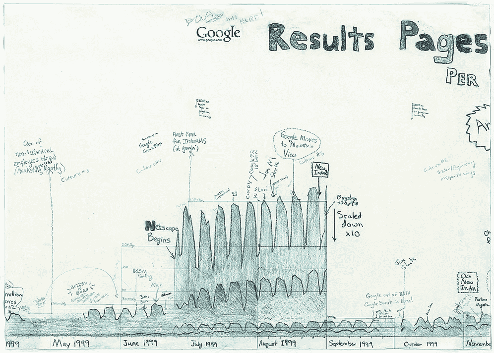
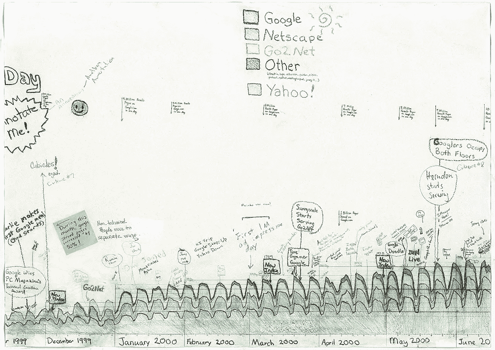
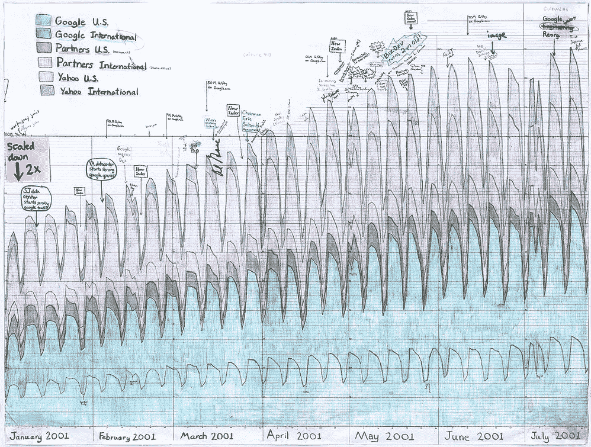
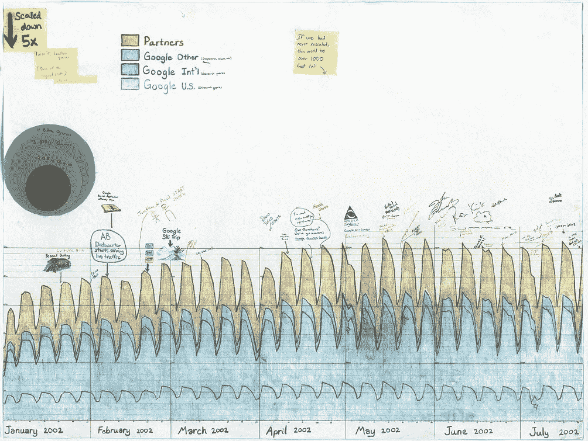
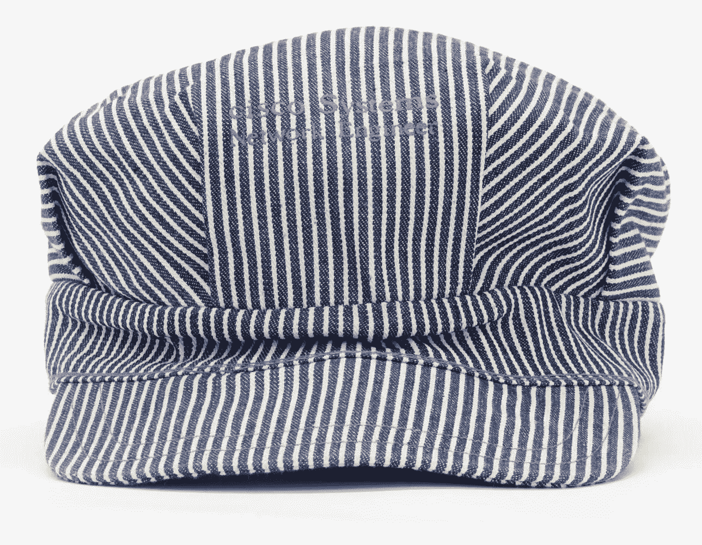
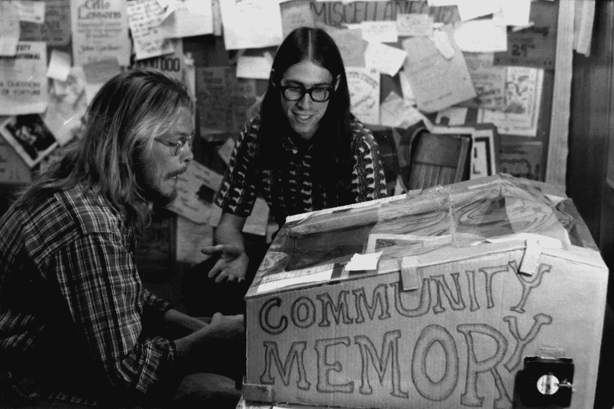

# “这将是巨大的”:谷歌创始人收藏来到计算机历史博物馆

> 原文：<https://medium.com/hackernoon/this-is-going-to-be-huge-google-founders-collection-comes-to-chm-27356256731f>

Crayon Graph, from the Google Founders Collection at the Computer History Museum

## 保持创新文化

1998 年 5 月，天使投资人罗恩·康韦第一次了解谷歌是在帕洛阿尔托的帝国酒吧，现在已经关闭。在收据上，他预言性地写道:“这将是一笔巨款！”

这张收据是被称为“谷歌创始人收藏”的计算机历史博物馆(CHM)的早期文物和数字资产的一部分。CHM 的指数中心的基石收购，致力于捕捉遗产和推进[未来](https://hackernoon.com/tagged/future)的创业和创新，收集包含谷歌前 10 年的对象，文件，照片和视频。

指数中心的执行董事[玛格丽特·龚·汉考克](https://medium.com/u/7cc574add135?source=post_page-----27356256731f--------------------------------)说:“谷歌体现了指数中心正在记录、解释并与世界各地的人们分享的创业和创新精神。“这些收藏将支持许多关于冒险、创新和大胆想法的丰富经验的产生，这些经验将讲述早期谷歌的故事，并激励未来的企业家。”

其他值得注意的人工制品包括谷歌的第一份商业计划和“蜡笔图”，最初由卢卡斯·佩雷拉绘制，用于跟踪查询增长，然后由其他谷歌人添加到其中，以突出里程碑和特殊事件。

> 跟随计算机历史博物馆[脸书](https://www.facebook.com/computerhistory) | [推特](https://twitter.com/ComputerHistory)

最初的收藏是在 YouTube 现任首席执行官苏珊·沃西基的领导下，由产品管理副总裁理查德·霍尔登在谷歌内部收集的，她在加州门洛帕克的家中存放了谷歌的早期运营——由联合创始人拉里·佩奇和谢尔盖·布林领导。(沃西基后来担任谷歌的高级副总裁，之后转到 YouTube。)CHM 互联网历史项目的策展总监 Marc Weber[与 Wojcicki 和 Google 密切合作，担任该项目的网络历史学家，并提供了重要的历史解释和范围。](https://medium.com/u/f48efd27ef76?source=post_page-----27356256731f--------------------------------)

> “我们很高兴与谷歌合作，保护和保留硅谷历史的这一重要部分，并感谢苏珊·沃西基证明了这些历史悠久的公司的保护文化对后代来说与创新文化一样重要。”
> 
> — [约翰·霍拉尔](https://medium.com/u/2f7245f402aa?source=post_page-----27356256731f--------------------------------)，计算机历史博物馆首席执行官&总裁

博物馆的藏品团队将领导藏品的编目和归档工作，预计这将需要数年时间。在与谷歌的持续合作中，博物馆还将接受未来与藏品所涵盖的创业十年相关的文物捐赠。虽然指数中心博物馆可能会根据这些藏品开发未来的项目，但目前公众无法进入。

> “计算机历史博物馆令人印象深刻的藏品和归档专业知识使该博物馆成为保存谷歌创始人藏品的自然选择。随着收藏的增加，我们期待着与 CHM 的合作。”
> 
> YouTube 首席执行官苏珊·沃西基

# 建立一种保护文化

This network engineer cap inspired the Cisco cultural tradition of unique hats as give-away items at the company’s yearly users symposium, previously Networkers — now Cisco Live! Center for Cisco Heritage, managed by the Computer History Museum.

谷歌创始人收藏加入了博物馆保存或管理的许多企业和组织档案，包括早期计算巨头数字设备公司和社交媒体先驱[社区记忆](http://www.computerhistory.org/collections/catalog/102733953)。这些收藏包括早期的文件、照片、记录、媒体和文物，体现了早期硅谷和新兴技术产业的创业精神。他们代表了一种创新文化。

最近，CHM 和思科进行了突破性的合作，成立了思科遗产中心[，该中心强调保存硅谷企业历史的重要性，并提出了开放商业档案的新模式。在 CHM 的 Paula Jabloner 和 Stephanie Waslohn 的领导下，该中心由一系列文物、文件、媒体和蜉蝣组成，从早期的竞选海报到该公司的一些首批产品，讲述了思科 30 年的历史。这个为期三年的项目以展览*我们的故事*达到高潮，该展览于 2017 年 3 月 31 日开幕，受到前任和现任员工、董事会成员和高管的欢呼，包括前思科首席执行官约翰·钱伯斯和约翰·摩根里奇。2016 年，该中心成为自己的有限责任公司，博物馆受托人兼思科高管唐·普罗克特(Don Proctor)担任其首席执行官，并接受捐赠以提供长期、可持续的保护。](http://www.computerhistory.org/ciscoarchive/)

在接下来的几周内，博物馆还将发布数字设备公司(DEC)最大最完整的一套记录，时间从 1947 年到 2002 年，其中大部分记录来自该公司从 1957 年到 1998 年的运营，当时它们被康柏计算机公司收购。DEC 由肯·奥尔森和哈兰·安德森于 1957 年创立，是 20 世纪最成功的计算机公司之一，年收入近 140 亿美元，全球员工超过 120，000 人。

Community Memory terminal at Leopold’s Records, Berkeley, California, ca. 1975\. Collection of the Computer History Museum, Community Memory records, Box 12, Folder 15, Catalog [102703229](http://www.computerhistory.org/collections/catalog/102703229).

> [黑客中午](http://bit.ly/Hackernoon)是黑客如何开始他们的下午。我们是 [@AMI](http://bit.ly/atAMIatAMI) 家庭的一员。我们现在[接受投稿](http://bit.ly/hackernoonsubmission)，并乐意[讨论广告&赞助](mailto:partners@amipublications.com)机会。
> 
> 如果你喜欢这个故事，我们推荐你阅读我们的[最新科技故事](http://bit.ly/hackernoonlatestt)和[趋势科技故事](https://hackernoon.com/trending)。直到下一次，不要把世界的现实想当然！

