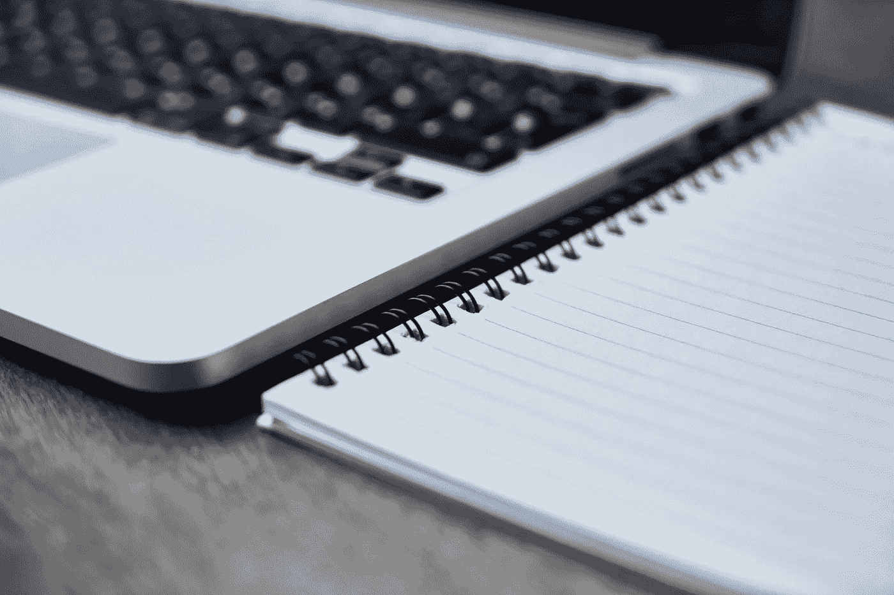

# 这就是我如何用笔记本电脑浪费我的一天

> 原文：<https://medium.com/hackernoon/this-is-how-i-waste-my-day-with-laptop-1d2998ff6893>

## 我就是这样修好的，你也可以！

Courtesy: [https://pixabay.com/en/computer-laptop-notebook-pen-table-2242262/](https://pixabay.com/en/computer-laptop-notebook-pen-table-2242262/)

我是千禧一代，这也意味着我比这个星球上的前辈们更有资格同时处理多项任务。当我指的是多任务处理时，这是它通常的样子——我的 Chrome 上平均打开 10 个标签页(我在这里是保守的),其中包含以下内容:

My Chrome Toolbar at any time instance ‘t’

1.  1 个谷歌和 1 个 Gmail
2.  2+ Youtube 视频
3.  2+ Github 链接
4.  2+中等文章
5.  Goodreads、维基百科等等

忘了提我手机上那些频繁的推送通知，短信，来电哔哔！

这些资产离我的手指只有一次点击的距离，我不断地在我的 Gmail、Medium Article、Github 之间变戏法——同时 Youtube 视频通过我的耳机播放给我听。我相信，所有可用的感觉器官都要同时处理很多任务。当这种情况发生时，我敢打赌我的工作效率会降到最低点，因为:

> 当我忙于改变我的浏览器标签时，我几乎什么也没做！

那么，我是怎么解决的呢？

**1。预定义的 SMART 目标:**

开始我的一天**设定**高度**简约** [**精明**](https://en.wikipedia.org/wiki/SMART_criteria) **一天的目标**。我明白这样一个事实，如果我锁定“我今天必须做这件事”开始我的一天，我的大脑会不断给我发送推送通知，敦促我完成这些目标(完成这些任务)，否则它会以焦虑和恐慌的形式发出士兵，这样我就完成了这些目标，感觉完成了(或者感觉不完整)

**2。跟踪笔&纸张:**

把**纸笔**(对，就是那个纸莎草纸的东西)放在我身边，**记下**自从开机以来我用笔记本电脑 ***完成*** 的每一件事情。你可能会想，“什么？你是一个坐在英特尔驱动的笔记本电脑前的千禧一代，那么为什么不在 *Notepad.exe"* 中记录下来呢，答案是，如果我这样做，它将成为我的换标签游戏中的另一个实体，而 Pen & Paper 确实是一个强大的日志，它还通过我的手(书写比打字需要更多的时间)、眼睛(阅读相同的内容)将我的表现反馈发送到我的控制中心(大脑)

**3。常量验证:**

我有两张桌子，一张是我想要的，另一张是我做的！重要的是不断验证 Pt。2(行动)导致划掉 Pt.1(目标),保持 ETA(估计可用时间——在笔记本电脑前，记住)。

**4。切换回来:**

我可能会在阅读一篇中型文章时开始一个 Youtube 视频，而另一个 Youtube 视频可能已经嵌入其中，因此我会暂停我的第一个视频，并开始新的视频。但这里重要的是，一旦我当前的视频完成，就切换回我的第一个视频，这样，我确保第一个视频进入我的完成列表(Pt 2)，而且任何人都可以开始一个半小时的视频，并在许多其他事情之间变戏法，但确保我回来完成我开始的那个，确保我对我的纪律的信心。

**5。关闭标签:**

Tabs Closed

保持标签页打开可能看起来很时尚，但是关闭标签页不仅释放了你的计算资源，还帮助你更多地关注那些未完成的标签页，而不是因为有很多未完成的标签页而沮丧。

**6。奖励&惩罚:**

最终，人类对奖励和惩罚都非常敏感。

先说**刑部**:

*   **关闭任务/标签**花费的时间**比你预期的时间**长得多。作为一个物种，我们讨厌让别人失望，除非我们是个混蛋。但有时你必须对自己做个混蛋，这是训练纪律的唯一方法，也就是说，你必须打断自己，停止那些真正耗费你大量时间的事情。
*   **熬夜，不喝咖啡/吃东西**——当你感到渴望的时候——直到你完成那个(唯一的目标或者至少一个你开始一天的目标。以这种方式惩罚会向你的大脑传递一个强烈的信息，当你错过最后期限时，你是一个坚强的人。
*   从第二天开始，继续今天剩下的任务/目标。这确保了目标不会被错过，而且一遍又一遍地看着待办清单中的同样的事情，只会激怒你的大脑，因此它会敦促你下次不要错过完成它们。

**奖励:**

*   完成纸上列出的任务，相信我，这种感觉真的很好，你的整个身体都会感到高兴和精神焕发。
*   自我欣赏用比无声更响亮的声音来表达自己，这样你的耳朵就能读懂信息，并将其反馈给大脑，这反过来又能在快乐中释放一些多巴胺。
*   **有趣的时间/任务**——给自己一些空闲时间，或者应该是有趣的任务，比如 Youtube 视频剪辑，或者只是一篇有趣的文章，或者浏览一些 reddit/twitter 的对话。

这不是一个关于生产力的 5 条规则，也不是说我是一个生产力大师，这是一个对我有用的方法，我希望它对你也有用！

> [黑客中午](http://bit.ly/Hackernoon)是黑客如何开始他们的下午。我们是 [@AMI](http://bit.ly/atAMIatAMI) 家庭的一员。我们现在[接受投稿](http://bit.ly/hackernoonsubmission)，并乐意[讨论广告&赞助](mailto:partners@amipublications.com)机会。
> 
> 如果你喜欢这个故事，我们推荐你阅读我们的[最新科技故事](http://bit.ly/hackernoonlatestt)和[趋势科技故事](https://hackernoon.com/trending)。直到下一次，不要把世界的现实想当然！

