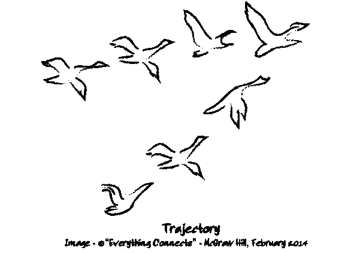
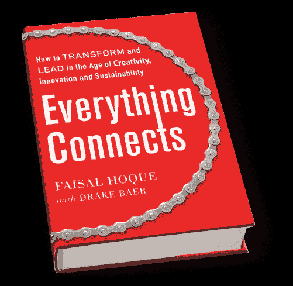

# 这是我们与自己和他人合作的方式

> 原文：<https://medium.com/hackernoon/this-is-how-we-work-with-ourselves-and-others-27d69f349624>

[Photo: [Jordan McQueen](https://unsplash.com/@jordanfmcqueen)]

## 创造、领导和维持的 9 个基本原则。世界上最新的问题在最古老永恒的实践中找到解决方案，如正念、真实和虔诚。

随着新技术和社会变革的不断涌现，我们不断面临激发创造力、推动创新和确保可持续发展的挑战。

有哪些补救措施？我们如何与自己和他人合作？

世界上最新的问题可以在最古老的永恒实践中找到解决方案，比如正念、真实和奉献——因为一切都是相互联系的。

连通性是一种旅程感，是一种目的感——它是一种个人的孤独追求，同时也是一种集体的友好追求。

我们的个人、人际和组织工作生活都是相互联系的。通过研究这些联系，我们学会了创造、创新、适应和领导的新方法。

从我的书 [*《万物互联:如何在创意、创新和可持续发展的时代转型和领导》*](http://www.everythingconnectsthebook.com/) 中，让我更深入地探讨一下我们如何通过连接看似不同的点来与自己和他人合作。

## 我们如何将日常生活与世卫组织联系起来？

**1。理解是基础。我们对世界的本质了解得越多，我们就能更好地适应这个世界。我们越了解自己的本质，我们就能更好地在自己内心活动。这就是为什么一代又一代的思想家和实干家以多种方式告诉我们认识自己——这是一个长期过程的结果。**

**2。理解导致真实性。当你[了解自己](https://www.fastcompany.com/3004785/self-improvement-strategies-becoming-more-authentic-leader)的时候，你就可以带着属于自己的自信去行动。这对你周围的人来说意味着原始和脆弱，这是一件非常好的事情，因为这种脆弱是定义我们的关系的基础。**

**3。虔诚是正念，正念是虔诚。举起一个巨大的重量不会让你变得强壮。你不能通过阅读一本书或参加一个研讨会来了解自己。这是每日虔诚的练习。奉献是我们可持续的资源。有了它，我们可以日复一日地改善我们自己、我们的团队和我们的世界。**

## 我们如何在组织内外激励和领导员工？

> *我们需要探索导致长期可持续发展的理解、促进共同繁荣的行动方式，以及最重要的是，领导者如何在这一过程中督促我们。*

**1。给人自由。**人们需要自由来做好他们的工作，人们需要感觉到他们能够将所有的努力投入到任务中，这需要一种开放的、以自治为导向的文化。

**2。给人结构。**但这不是无政府状态；伴随自由而来的是责任。责任可以通过定量和定性的方法来确保，并源于蓬勃发展的文化。

**3。策划才能。**当我们组建持久的组织时，我们将人们聚集在一个共同的目标周围。当合适的人以合适的方式聚集在一起时，整体会变得更大——也许是更大——而不是各个部分的总和。在他们生命中的正确时间，以正确的人才组合，聚集正确的人，就是*策展*。

## 我们如何产生想法、有根据的决策和持久的价值？

> 我们需要以一种能带来长期价值创造的方式来安排我们的生活和组织:审视想法产生、决策和创造持续价值的微妙和不那么微妙的艺术。

**1。想法源于好奇。经验是创造力的燃料。好奇心是对新体验的渴望。这种激情可以系统化。**

**2。绘制地图后，我们会做出更好的决定。无论是作为个人还是组织，当我们做出决定时，我们倾向于不检查我们的理解。将它们绘制出来让我们对我们的工作方式有一个更细致的了解。**

**3。为了创造长期价值，建立平台。**创造价值的最可持续方式是不断投资于我们作为个人和组织的能力。这些能力中最核心的是我们对自己和他人的理解。

这不仅仅是我们下一个财政季度的权宜之计；从长远来看，这是我们成功的途径。它是我们艺术、科学、商业和精神的系统化。

经 [*许可，节选自*](http://www.everythingconnectsthebook.com/) *[Faisal Hoque](https://www.fastcompany.com/user/faisal-hoque) 与 [Drake Baer](https://www.fastcompany.com/user/drake-baer) 合著的《万物互联:如何在创意、创新和可持续发展的时代进行变革和领导》* (麦格劳希尔，2014)。

***版权所有 2017 费萨尔·霍克。保留所有权利。***

我是一名[企业家兼作家](http://faisalhoque.com/speaking/)。[沙多卡](http://shadoka.com/)等公司创始人。Shadoka 让抱负成为领导、创新和变革的动力。Shadoka 的加速器和解决方案汇集了管理框架、数字平台和思想领导力，以实现创新、转型、创业、增长和社会影响。

著有《 [*万物互联——如何在创意、创新和可持续发展的时代转型和领导》*](http://www.amazon.com/Everything-Connects-Creativity-Innovation-Sustainability/dp/0071830758/ref=sr_1_1?ie=UTF8&qid=1376488798&sr=8-1&keywords=everything+connects%2Bfaisal+hoque) 》(麦格劳·希尔)和《 [*生存并茁壮成长:弹性企业家、创新者和领导者的 27 种实践*](http://survivetothrive.pub/) 》(励志出版社)。在推特上关注我。*免费使用* [*万物互联*](http://app.everythingconnectsthebook.com/login.php) *领导力 app 和* [*生存茁壮*](http://app.survivetothrive.pub/login.php) *弹性 app。*

> [黑客中午](http://bit.ly/Hackernoon)是黑客如何开始他们的下午。我们是 [@AMI](http://bit.ly/atAMIatAMI) 家庭的一员。我们现在[接受投稿](http://bit.ly/hackernoonsubmission)并乐意[讨论广告&赞助](mailto:partners@amipublications.com)机会。
> 
> 如果你喜欢这个故事，我们推荐你阅读我们的[最新科技故事](http://bit.ly/hackernoonlatestt)和[趋势科技故事](https://hackernoon.com/trending)。直到下一次，不要把世界的现实想当然！

