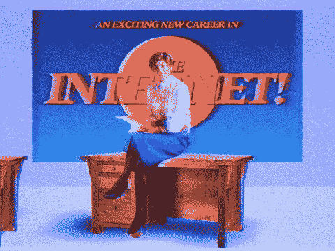
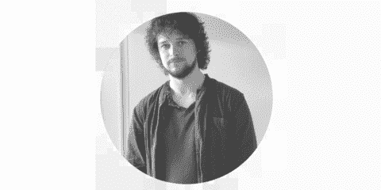
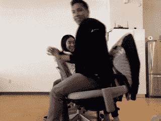

# 这是你持续吸引最好的技术人才的方法

> 原文：<https://medium.com/hackernoon/this-is-how-you-can-consistently-attract-the-best-tech-talent-3d8571e3bc26>

*我们的软件工程师和开发人员给招聘人员的 6 条建议*

你知道有句谚语说[员工是公司最有价值的资产](https://hbr.org/2011/10/valuing-your-most-valuable)。我们同意。

但是你如何确保你带来的是最好的人才呢？毕竟，一次糟糕的招聘不仅仅会让你一脸愁容(没人想要一张愁容)，[它会耗费公司大量资源](https://www.fastcompany.com/3028628/infographic-how-much-a-bad-hire-will-actually-cost-you)。

在 [VEON](/@VEONCareers) ，作为改进我们招聘工作的一种方式，我们实际上与我们的工程师坐下来讨论我们如何在吸引顶级技术人才方面做得更好。是的，我们在谈话中会带咖啡、茶和糖果。没有那些东西的谈话是什么？

无论如何，以下是我们从软件工程师和开发人员那里收集到的关于招聘人员如何做得更好的 6 条建议。看看你是否同意这些——以及你是否有什么想补充的！

# 1.阅读简历——你会看到一些很酷的东西

大多数招聘人员会进行关键字搜索，以筛选出不合格的候选人。这很好，但不一定能帮你找到这个职位的最佳工程师。

“我的技能和经验得到了这么多招聘人员的关注，这令人感到荣幸，但请通读简历/社交资料，以进一步了解我。测试自动化工程师 Andrew 建议说:不要仅仅搜索关键词，而是发送一条普通的信息。

有时候，你在简历中发现的不仅仅是告诉你这个人是否适合这份工作。内容可以是鼓舞人心的，独特的，甚至是有趣的。

Meet Andrew

> “我有一个朋友，他实际上在简历中间加了一段话，看看招聘人员是否会看。安德鲁描述道:“他写道，他做的乌克兰罗宋汤非常好。

现在，这很酷。

# 2.140 个字符或更少

VEON 的 DevOps 工程师 Adnan 惊叹道:“用 Twitter 的方式来做。”

阿德南是对的。招聘人员经常会写一些疯狂的长邮件——而且他们根本不会去读。

事实上，研究表明，最好的电子邮件简洁明了。招聘人员应该记住这一点。

> “招聘人员应该在不显得咄咄逼人的情况下建立联系。VEON 的人才团队最初引起了我的注意，因为他们只是简单地发送了一条消息，说:“让我们谈谈一个机会吧！”我说，‘好吧，我们谈谈吧！它简短而随意——我喜欢这样，”阿德南回忆道。

# 3.屏幕后面有个人！

招聘人员应该对这个人进行真正的搜索，并探索社交媒体资料，如 GitHub、Stack Overflow 和 LinkedIn 上的资料。通过寻找共同的联系人，了解他们的职业抱负，了解他们的兴趣和爱好，招聘人员可以为工程师定制第一份推介材料。

这对于 21 世纪的招聘来说怎么样？

我们的团队成员认为这种策略是可行的——只要以专业的方式进行。毕竟，招聘人员和工程师可能都喜欢[在沙滩上驾驶无人机](/@VEONCareers/get-out-of-the-swamp-and-play-with-drones-in-the-sky-9bcd2ffec3eb)或者吃太多冰淇淋，但是整个谈话不应该是关于这些事情。这里有工作讨论！

 [## 高飞:如何在天上玩无人机

### 认识一下俄罗斯直线公司的集成和系统支持主管 Igor。在这次采访中，他就…发表了见解

medium.com](/@VEONCareers/get-out-of-the-swamp-and-play-with-drones-in-the-sky-9bcd2ffec3eb) 

> “不要只知道名字，看看这个人是否有资格。iOS 开发人员朱莉娅说:“了解这个人的一些独特之处，并以直接、友好和个性化的方式进行沟通。

**与此同时，招聘人员第一次联系工程师时应该言简意赅。**

# 4.你真的需要一本小说吗？

除非你在寻找下一个莎士比亚，否则你真的不需要一个超长的应用程序。因为大多数人都可以整理出一份可靠的简历，并写一封体面的求职信，说明为什么他们会是一个很好的人选(包括对公司华丽的赞美)。

不幸的是，太多的人力资源部门想要一本小说。Glassdoor 的一项研究显示，申请过程比以往任何时候都要长。

> “请不要让我写小说。太多的公司都这样做，这真的让我很反感。相反，招聘人员应该想看看我做过的编程工作，以及什么让我感到兴奋，”阿德南建议道。

**简而言之，招聘人员应该把重点放在代码组合上——不要浪费时间让人们写出他们能做什么。**

# 5.天赋+团队合作=更高的生产力

这个等式不难理解。但这是真的— [优秀员工之间的优秀团队合作会带来优秀的结果](https://kateheddleston.com/blog/onboarding-and-the-cost-of-team-debt)。

为所有那些“例外”感到抱歉。但是你明白了。

# 对于招聘人员来说，这意味着展示团队运作良好，合作良好——从人力资源到产品到财务(以及其他一切)。

> “理想情况下，除了招聘人员之外，公司里的一些不同的人，尤其是那些你将要共事的人，会和你见面讨论这份工作。通过把它变成一个团队游戏，招聘人员可以展示他们是一个平衡的、高效的组织。朱莉娅指出:“当然，招聘人员必须相互配合。

最好的工程师是伟大的团队成员。所以，在招聘过程中，要表现出你的团队配合得很好。这就是我们如何让 UI/UX 设计师[本尼](/veon-careers/how-to-find-patterns-and-realize-dreams-ebcaffbfe096)加入 VEON 的。

> “VEON 正在经历的旅程(从电信到科技)给了我灵感。VEON 致力于雇佣顶尖人才并建立一个伟大的团队，公司的愿景与我的一致。”

 [## 如何找到模式，实现梦想

### 认识一下 Benny，他是 VEON 客户参与团队的 UX/UI 设计师和数据可视化专家。在这个…

medium.com](/veon-careers/how-to-find-patterns-and-realize-dreams-ebcaffbfe096) 

回顾 Benny 关于公司愿景如何与他的愿景一致的话。这让我们想到了第六点。

# 6.让它成为一个双赢的机会

[伟大的工程师有一个成长的心态](https://www.brainpickings.org/2014/01/29/carol-dweck-mindset/)——他们在挑战和突破极限中茁壮成长。

当然，对于一些优秀的工程师来说，直升机旅行和滑雪旅行的高薪已经足够了。但是伟大的人努力去比乘坐直升机更高的地方。

> “我建议各位程序员看看一份工作是否符合你的个性和抱负。我还告诉他们要明白没有理论是可靠的。研究、创造、测试和改进。“记住教老狗新把戏这句话，”敏捷负责人 Elena 解释道。

 [## 程序员的生活:创造、改进、冷却、重复

### 哦，程序员的生活！这是一段平稳的旅程——直到疯狂发生。

medium.com](/veon-careers/a-programmers-life-create-improve-chill-repeat-a48d8b8560b0) 

这让我们想到了另一点:招聘人员应该展示一份工作如何能让工程师学习和成长。因为这是他们完成更多的方法。

“我非常相信持续学习。我加入 VEON 是因为这家公司就像一片绿地，有很大的发展空间和新想法。你还必须挑战自己的解决方案，”后端工程师[皮耶朗基罗](/veon-careers/how-to-create-something-awesome-advice-from-a-backend-engineer-61cd6b4a535b)描述道。

 [## 接受这些心态将立即改善你的生活:来自后端工程师的建议

### 认识一下 VEON 的后端工程师 Pierangelo。我们与他进行了一次精彩的交谈，并希望分享他对以下方面的见解…

medium.com](/veon-careers/how-to-create-something-awesome-advice-from-a-backend-engineer-61cd6b4a535b) 

“我加入 VEON 是因为公司正在经历数字化转型。我们正在从基础上建立一些东西，这将影响很多人。有些日子是艰难的，但成为其中的一部分真的很值得。因为我们创造的东西令人惊叹，”后端工程师[奥利弗](/veon-careers/live-the-dream-today-e430204474a6)说。

# 最后一句话:追求卓越——不仅仅是好

> “一个伟大的工程师不只是学习新事物。最优秀的人学会如何正确选择他们的工具。这很重要，因为太多的工程师浪费时间和精力与语言斗争，而不是专注于实际问题，”后端开发人员[Rohit](/veon-careers/a-programmers-life-create-improve-chill-repeat-a48d8b8560b0) 证实道。

伟大的工程师:

*   习惯性的简化，让他们接触到的一切都变得更干净，更容易使用。
*   他们可以通过从不同角度攻击来找到问题，从而快速调试任何东西。
*   他们了解什么是有价值的，并确保他们正在解决那些关键问题。

在此申请:

 [## 在此申请

### 要了解更多有关 VEON 当前所有职位的信息，请点击此处:

medium.com](/veon-careers/apply-here-1c8366d85e87) 

# 建立一个超级英雄工程师团队

只要方法正确，这是可以做到的。您刚刚阅读的提示直接来自我们才华横溢的软件工程师和开发人员。加入一些你自己的好想法，你就能不断地吸引顶尖的技术人才加入你的团队。

然后，一旦你有了超级英雄团队，你就能创造奇迹——在一天结束时享受咖啡、茶和糖果。