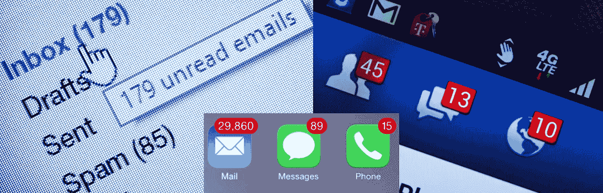

# 这是收件箱地狱。

> 原文：<https://medium.com/hackernoon/this-is-inbox-hell-60c62841811e>

警告！不要做…不要接电话…不要登录电脑…不要做！接下来你知道，你会和我一起，在 ***收件箱地狱*** 的深处。有这么多的电子邮件账户、日历邀请、短信、脸书信息、LinkedIn 信息和其他所有东西——我就是跟不上所有这些东西！

# 零收件箱

你听说过“零收件箱”的想法吗？这是一种让自己变得有条理的好方法，已经存在多年了。目标是让你的电子邮件收件箱，或者不管你的收件箱是什么，每天减少到零个项目。零。完蛋了。没有。无事可做。涅槃。听起来很棒，不是吗？是的，当你真的能做到的时候。有很多系统可以帮助你达到零项目，比如 T4 GTD 方法 T5。我已经使用了一些，并取得了不错的进展。嗯，我以为我是…

就在不久前，我只关注我的工作和个人邮箱。再加上永无止境的待办事项清单。这一切都相当容易管理，直到我注意到我使用的收件箱总数增加了。增加了很多。我花了几分钟时间查看了我与人交流的所有方式，电子邮件和其他方式，收件箱的总数，每个系统加起来都很可笑。说真的。可笑。

根据我粗略的计算，我至少有 15-20 个单独的系统需要检查，每个系统都有几个收件箱和通知，总共超过 200 个单独的收件箱！很疯狂，对吧？不相信我？让我展示给你看。

让我们从我们大多数人每天使用的常见嫌疑人开始。

# 电子邮件

个人的，工作的，我志愿服务的非营利组织的，还有一些电子邮件账户。总共差不多十个。幸运的是，我在我的电脑和 iPhone 上配置了电子邮件，以便能够同时看到所有这些收件箱，这样就不会有太多漏网之鱼。通过单一窗口查看我所有的电子邮件。

# 电话

在家，工作，谷歌语音，手机。还有每个人收到的短信。哦，还有 WhatsApp 和 Signal。他们也有自己的收件箱。又是六个。

# 任务管理

我用 [OmniFocus](https://www.omnigroup.com/omnifocus) 来管理我生活中的所有事情；工作、个人、非营利等。这个系统是最有效的，它与我所有的技术相结合。它也是基于前面提到的 GTD 方法。谢天谢地，我的一个任务收件箱。

# 脸谱网

是的，脸书。如果你认为像脸书这样的社交媒体只是用来和学校的朋友们联系的，那你就大错特错了。越来越多的人通过所有可用的社交渠道与我建立个人和专业联系。他们通过我的个人脸书账户和我的专业脸书[页面](http://facebook.com/BrianGreenberg.Net)联系我。所有这些联系都需要关注。他们还通过脸书的信使和我聊天。我还花时间回复人们对我的帖子的评论，参加我所在的所有小组，比如我公寓的脸书小组，或者芝加哥的 LiveLit、讲故事和即兴表演小组，以及大学和研究生院的小组。快速查看我在脸书上的群组列表，我属于 68 个群组。我还管理着 12 个脸书网页。注意所有的咀嚼和疯狂的注意力。

# 推特

我管理着 12 个 Twitter 账户，尽管其中只有几个是定期的。每个 Twitter 频道不仅需要关注我收到的直接消息，还需要关注每个频道上的活动通知，以及我参与的任何 Twitter 对话。

# 商务化人际关系网

像职业界的大多数人一样，我有一个 LinkedIn 账户，作为我的在线职业简历。此外，我还管理 LinkedIn 上的四个公司页面和七个群组，并且是 50 多个群组和子群组的成员。LinkedIn 的电子邮件系统 InMail 是我接收销售人员垃圾邮件的另一个地方，这些销售人员大多住在印度和乌克兰，试图向我出售廉价的软件开发。虽然 InMail 的信噪比很高，但有时还是会有重要的工作和网络连接通过。此外，如果你决定在 LinkedIn 上分享任何东西，你会收到来自喜欢或评论你帖子的人的通知，这些通知也需要引起注意。LinkedIn 也有自己的发布平台 Pulse，它超越了 LinkedIn 上任何人都可以写文章的标准帖子共享。你可能正在 [Pulse、](http://www.linkedin.com/in/bjgreenberg/recent-activity/posts/)上阅读这篇文章，因为我经常在 [LinkedIn](http://www.linkedin.com/in/bjgreenberg/recent-activity/posts/) 、[我的博客](http://blog.briangreenberg.net/)、 [Medium](/@brian.greenberg) 以及其他专业平台如[ciow 水冷却器](http://ciowatercooler.co.uk/members/brian-greenberg/activity/)上交叉发布我的文章。如果你喜欢这篇文章或对它发表评论，我会收到通知。

你觉得我们完事了吗？

没有。差远了。

这里有几个我们可能共有的收件箱…

# 约会应用

是的，有约会应用…所有的。让我们面对现实吧，我们都想找到爱，但在外面会很孤独。想和新认识的人联系吗？想找个人约会，结婚，还是别的？有一个应用程序…当然，有很多。大多数人同时使用一堆约会应用，每个应用都有一个收件箱，定期吸引你的注意力。而且经常是定时的。说真的，你的反应速度很快。如果有人喜欢你，你可能只有一两天的时间来回应，所以如果你想找到你生命中的爱，或者别的什么，你最好抓紧时间。你不想在你匹配的潜在约会对象上成为[的影子](http://www.psychologytoday.com/blog/living-forward/201511/is-why-ghosting-hurts-so-much),而不是另一个约会应用或另一个应用中的另一个收件箱。

# 健身和社交

说到在工作之外与他人联系，meetup.com 怎么样？Meetup 非常适合与志趣相投的人联系，或者如果你刚搬到一个新的城市。在你的城市寻找你想联系的人，他们有相同的兴趣，例如:徒步旅行，写作，电影，垒球，或寻找一个 Euchre 组？Meetup 在这方面很棒…也有自己的收件箱。我是 75 个聚会团体的成员。我不知道这个数字是如何变得如此之高的，我只是定期去几个小组，但他们都在那里，都在等待我的注意。

有 Fitbit 还是Watch？如果你这样做了，你可能会被邀请和你的朋友一起参加一周内最多步数的[挑战](http://community.fitbit.com/t5/Fitbit-Challenges-Adventures/All-About-Challenges/td-p/1562188)，或者你会从你的朋友那里得到今天达到他们的固定[目标](http://support.apple.com/en-us/HT204517)的更新。大量的健身应用程序都有这些社区联系。毕竟，当你和朋友一起变得更健康时，效果会比独自一人更好。

# 更多应用

你使用谷歌企业应用套件吗？常去的地方？有谷歌语音号码吗？Office365 订阅？他们的系统中也都有事件收件箱。

好像这还不够，我还用 Instagram，Pinterest，Swarm，Foursquare，Snapchat，Tumblr，微信，Shapr，Yammer，Skype，工作(职场)用脸书，还有 Slack。

他们都有收件箱和通知。

# 日历

最后，我们不要忘记日历。这对我来说是最重要的系统之一。幸运的是，它有自己的会议邀请收件箱，但邀请并不总是自动出现在我的日历中。例如，当有人发短信告诉我开会的时间和地点，或者只是想在下周下班后喝杯啤酒。那些东西不仅仅出现在我的日历上。我必须采取一些额外的步骤来确保那些约会被安排好。幸运的是，许多通过电子邮件收到的邀请确实会自动出现在我的日历中，算是吧。我还是得接受邀请。还有我从脸书、Meetup 订阅的日历，或者工作中共享的日历。这些只是出现在我的日历上——至少当一切正常并且我可以连接到互联网时。我的日历应用程序中有 12 个不同的日历，告诉我何时何地。照顾所有这些日历和会议邀请需要一个规范的护理和喂养手册，类似于一种稀有的丛林野猫。

来自应用程序、日历、电话、文本等的收件箱和收件箱。明白我在说什么吗？简直是疯了。这就像一百万个不同的收件箱！！

# 警告、警报和幻像振动…

当我拿起手机，看着屏幕上所有不同应用程序的通知，其中大多数我甚至没有在这里处理，难怪人们和待办事项会被遗漏。联系被抛弃，推文得不到回应，邮件被遗弃在我无数收件箱深处的某个角落。

如果，在那些罕见的情况下，我把我的手机落下了…我会在口袋里得到[幻影振动](http://en.wikipedia.org/wiki/Phantom_vibration_syndrome)。就好像我的身体已经变得如此习惯于收到通知，我感觉到振动，就好像缺席的电话是一个失去的肢体。

所有这些通知耗费了大量令人作呕的注意力和时间。这种持续的中断也不是在一个大的时间段内，而是在我的电脑、iPhone 和Watch.上收到的所有叮叮声、乒乒乓乓和振动通知的许多微小的、持续中断的时间里有时候，我觉得我走进东京的一家弹球店，一个小孩不停地拍打我的手腕，以引起我对所有通知的注意。

这是收件箱地狱。

这听起来像是完全的混乱，在某种程度上，的确如此。然而，我还是让它运转起来了。嗯，算是吧。

有没有更好的办法？大概吧。当一个新的热门应用程序出现时，这种方法会被搞砸吗？很有可能。将会有一种新的方式来交流或合并我们的联系人、日历和电子邮件帐户。这是一个永无止境的移动目标，来管理我生命中最重要的部分之一的这个飘渺的生态系统；我的个人信息管理系统。如果没有这个生活在[云](https://blog.briangreenberg.net/2016/05/29/there-is-no-cloud-its-just-someone-elses-computer/)中的系统，我的生活实际上会分崩离析。尽管它是如此令人愤怒的复杂和不同，但它的工作却令人惊讶。

所以如果我没有及时回复你，并不是我认为你对我不重要。只是……嗯……你的信息可能在太空中消失了。再联系我…我保证我会给你回复的。

你对此有不同的看法吗？一个不那么混乱的不同的解决方案，你知道，除了烧掉我们所有的技术模拟像。请在评论中告诉我。我很乐意收到你的来信。真的，我会的。

*联系我:* [*脸书*](http://facebook.briangreenberg.net/)*|*[*LinkedIn*](http://linkedin.briangreenberg.net/)*|*[*Twitter*](http://twitter.briangreenberg.net/)*|*[*博客*](https://blog.briangreenberg.net/)*|*[*Google+*](http://plus.briangreenberg.net/)

*布莱恩格林伯格*[*briangreenberg.net*](http://briangreenberg.net/)*2017。未经本网站作者和/或所有者的明确书面许可，严禁未经授权使用和/或复制本材料。可以使用摘录和链接，前提是完整、明确地注明布莱恩·格林伯格*[*【briangreenberg.net*](http://briangreenberg.net/)*以及对原始内容的适当和具体的说明。*

*原载于 2017 年 7 月 3 日 blog.briangreenberg.net***。**

******

> *[黑客中午](http://bit.ly/Hackernoon)是黑客如何开始他们的下午。我们是 [@AMI](http://bit.ly/atAMIatAMI) 家庭的一员。我们现在[接受投稿](http://bit.ly/hackernoonsubmission)并乐意[讨论广告&赞助](mailto:partners@amipublications.com)机会。*
> 
> *如果你喜欢这个故事，我们推荐你阅读我们的[最新科技故事](http://bit.ly/hackernoonlatestt)和[趋势科技故事](https://hackernoon.com/trending)。直到下一次，不要把世界的现实想当然！*

**