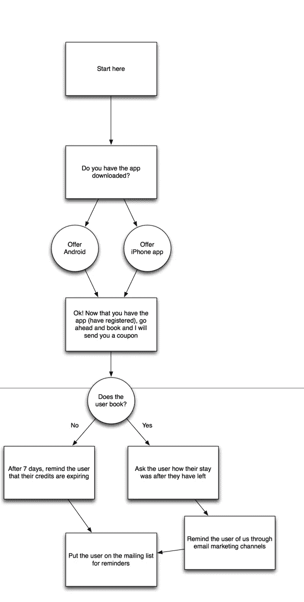
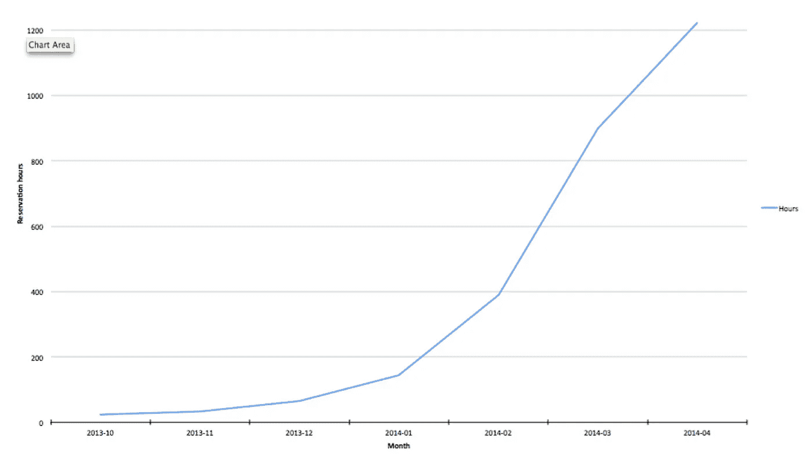

# 这是让我的整个公司起步的“成长秘诀”

> 原文：<https://medium.com/hackernoon/this-is-the-growth-hack-that-got-my-whole-company-started-f5572fa6d36f>

让我为你画一幅画。🌌

那是 2014 年 1 月——我经营着一家 8 人的公司，拥有绝对的**零**牵引力。

就在几个月前，我们刚刚开始[喘息者](http://breather.com)——只有我[和](https://www.linkedin.com/in/packy-mccormick-9883b354)一个 [几个](https://www.linkedin.com/in/chposchmann/en) [其他](https://www.linkedin.com/in/seraphinhochart) [男人](https://en.wikipedia.org/wiki/Evan_Prodromou) [和](https://www.linkedin.com/in/brandonreti) [女孩](https://www.linkedin.com/in/crizzi)——我完全不知道自己在做什么。

我们刚刚筹集了 150 万美元，我已经雇佣了一个**小而紧密的团队**:一名设计师，一名 iOS 开发者，一名高级工程师，一名纽约市运营商，以及其他一些人。当我们等待宝贵的“牵引力”、“用户”和“产品/市场适合度”出现时，我可以感觉到他们所有的目光都在看着我。

只有一个问题——我不知道如何创造这些东西。我甚至从来没有经营过一家初创公司。

见鬼，我甚至不知道我的服务是否有效。

这与今天有多么大的不同。

又过了两年，但现在， [Breather](https://breather.com/) 是所有“办公空间网络”初创公司中**获得资金最多的**——这些公司寻求为商业空间做 Airbnb 或优步为住宅和汽车所做的事情。从那时起，我们已经筹集了超过 3000 万美元。我们有**令人惊叹的、支持我们的投资者**，我们正在快速成长，我们每个月都在以比上个月更快的速度建立我们的网络和用户基础。当然，市场是巨大的。如果我们执行，一个令人印象深刻的结果几乎是必然的。🌠

不过那时候我知道**以上**都不是。2013 年 12 月，我几乎没有真正的客户，银行账户也在缩水。

彻底扭转局面让我的整个公司成为可能。这是一个如何发生的故事。

## 第一步。🌡🌡🌡🌡🌡

这一切都始于只能来自**绝望**的专注。

我们跑道的很大一部分已经消失了。呼吸者在我们的网络中几乎没有任何空间——总共可能有 3 个房间。**没人在用它们**。在我们的锁伙伴未能实现后，我们甚至没有我们需要的锁。🗝

到了秋天，我们的首席技术官**终于找到了我们可以使用的锁**，以及一个我们可以插入的 API。第一次，我们的房间可以用我们开发的应用程序打开了。感觉就像我们去了比赛。

但是到了 12 月，我们仍然一无所获。我曾请求(恳求)脸书的朋友尝试这项服务，但他们几乎从未回复。他们中的一些人给了我几个小时的办公空间的钱，但我很确定，如果我没有催促他们“捐赠”，我永远不会有任何进展。

我记得 12 月 26 日**坐在酒吧**喝啤酒，另一位首席执行官[给我建议。“只要选择一个数字，每周增长 8%，”他说。](/@mikaelcho)

“真的吗？但是，我如何实际增长这个数字呢？”我问。

“你会想出办法的。”🍻

我在 1 月 2 日度假回来，可能那时我的跑道已经走了一半。我在墙上贴了一个数字——每周预定的小时数。我告诉我的团队我们要种植它。8%，每周。“怎么会？”他们问。

“我不知道。但我们会想出办法的。”

## 第二步。😅😅😅😅😅

我什么都试过了。多问朋友。免费给他们。告诉人们自己来见我，在我自己的空间里…但是让他们预定。不惜一切代价！我将每周多工作 8%的时间。

而且它正在工作！但是我已经没有主意了。每一个想法都让人筋疲力尽，并且很快失去价值。

大约在这个时候，**我们推出了纽约**——我们知道，如果我们想有所作为，就必须赢得这个市场。这次咄咄逼人的发射，原来是**有先见之明**；这是一个里程碑，后来帮助我们筹集了首轮融资。

但是，当然，这并不重要，直到我们真正得到牵引。

## 第三步。🔑🔑🔑🔑🔑

随着我绝望感的加深，它开始向右转。我开始在 Twitter 上提供免费时间——对任何人。我不顾一切。我打算一周工作 8%小时，由于我之前成功的几周，要成功完成这件事变得越来越难。我还没有失败过一次，现在也不打算开始！

不可思议的是，在 Twitter 上捐出时间的想法**实际上开始真正发挥作用**。人们会说，“哇！这个新服务是什么？”我告诉他们如何下载这个应用，他们照做了。我给了他们自由时间。然后，他们中的一些人预订了。所有这些人都是陌生人，更疯狂的是，他们中的一些人*真的喜欢它*！**有的甚至回来了！**

在这一点上，有证据表明人们喜欢我们的服务和方法的工作，我开始努力打这个角度。你在左边看到的流程图是我建立的。我是从零开始的，但是久而久之就变成了机器。

## 第四步。💰💰💰💰💰

很快，就开始下一个台阶。我最初的 Twitter 受众大约是 40，000 人(我是第一个 10，000 Twitter 用户，所以我的关注者数量很早就开始增长)。但是我已经没有观众了。所以我采取了下一步:我利用 Twitter 的早期广告工具，在我的提议之外制作了一个广告。

**这是我写的一个广告**(它们基本上都是同一个想法):

你看到上面这个广告有多少转发和收藏了吗？嗯，它太成功了，以至于我接到了 Twitter 总部的电话。

**推特**:“你对你的广告做了什么？我们以前从未见过这样的事情。”

**我**:“什么意思？只是想引起人们的注意。”

推特(Twitter):“这看起来一点也不像广告——你还要求回复？为什么？大多数人都想要转发或关注，难道你不想要关注者吗？”

**我**:“没有。我想要回复。我想开始一段对话。”

我刚刚回头看了一下。在那几个月里，在我的收件箱里，有证据表明超过 1000 次对话都来自这个方法。

Yup, 1000.

好吧，事实证明，这个小把戏让我一路获得了 600 万美元的首轮融资，甚至更多。它在纽约、旧金山、加拿大等地都有效。最终，我们找到了更好的策略，我们发展了我们的团队，这样它就有了真正的营销人员，而不仅仅是写了几本营销书籍的笨蛋。😜

我记得我站在 RRE 合伙人会议上，Schlaf 领导了我们的首轮融资，Tom Loverro(现在在 IVP)质疑这种策略。我天真地告诉他，这将永远有效。当然，事实并非如此。但是它确实工作了足够长的时间，以至于对事情产生了影响。

如果你感兴趣，这里是上面的策略创建的图表(来自我们的 A 系列文件)。这让我至今难以置信，这就是我来到这里的原因。

回想起来，我非常非常幸运。

1.  我有一个服务人员*其实很喜欢*(即产品市场契合度)。
2.  在这个领域没有其他人真正参与竞争。
3.  我们一开始就有很多钱，所以我们可以尝试疯狂的事情。
4.  我们有一个很棒的团队，确保一切顺利进行。

我不知道我是否能想到任何特别的教训，除了通常的陈词滥调:

*   启动就像造一架飞机**却掉下悬崖**。你永远不知道什么会起作用。
*   有些实验将是智能的。其他人会哑口无言。**其实无所谓**。你只需要大量的实验和大量的奉献。
*   创造一个曲棍球棒(基本上不是废话的任何种类)是筹集 a 轮融资真正需要的。

最后，我希望你知道— **它实际上不会就此停止**。即使是现在，呼吸中心的每个星期都充满了这样的实验。我们永远不会停止。这是我们正在做的工作奏效的一个原因。

不管怎样，谢谢你的阅读。我希望你学到了一些东西，或者受到启发，在自己的创业中尝试一些东西。😁

> [黑客中午](http://bit.ly/Hackernoon)是黑客如何开始他们的下午。我们是 AMI 家庭的一员。我们现在[接受投稿](http://bit.ly/hackernoonsubmission)并乐意[讨论广告&赞助](mailto:partners@amipublications.com)机会。
> 
> 如果你喜欢这个故事，我们推荐你阅读我们的[最新科技故事](http://bit.ly/hackernoonlatestt)和[趋势科技故事](https://hackernoon.com/trending)。直到下一次，不要把世界的现实想当然！

