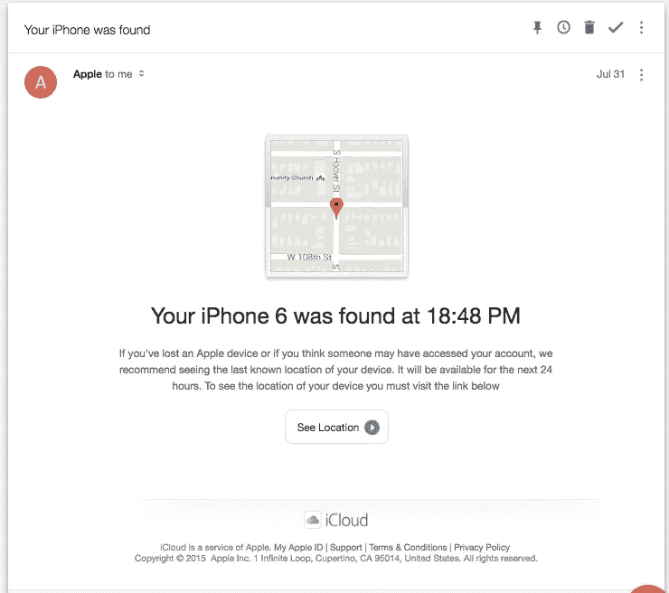
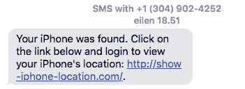
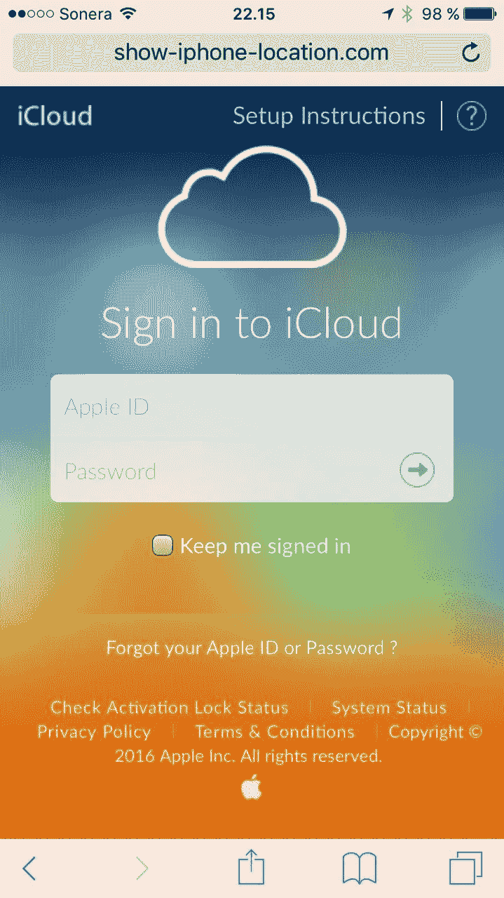
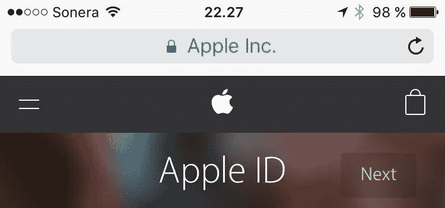
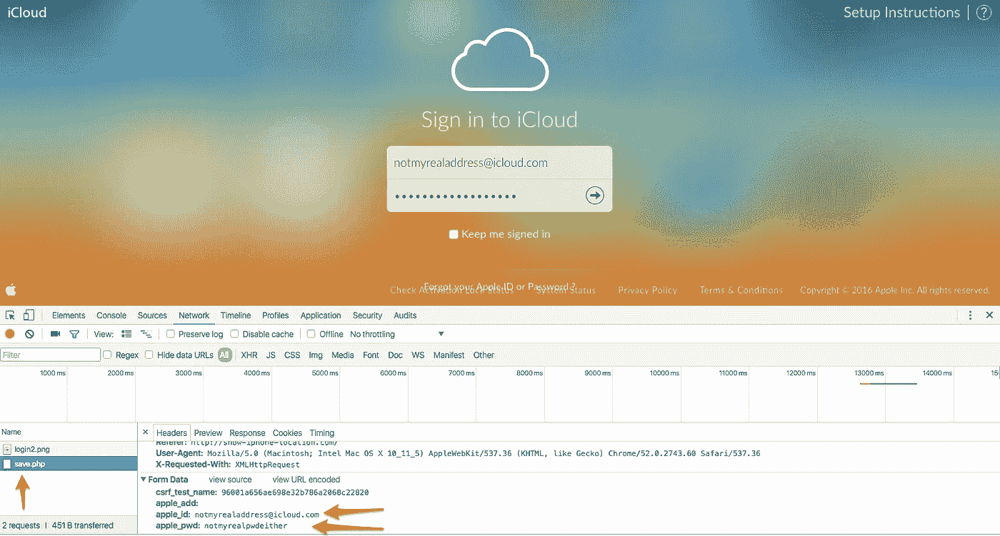

# 这是当你丢失 iPhone 时，苹果应该告诉你的

> 原文：<https://medium.com/hackernoon/this-is-what-apple-should-tell-you-when-you-lose-your-iphone-8f07cf73cf82>

两周前，我在意大利都灵度假时犯了一个小错误。我把手机忘在我们租来的车里了，去当地的户外水疗中心玩了两个小时，特别是对孩子们来说，非常有趣！).最终的结果是不幸的:当我们回到车上时，一扇窗户被打碎了，我的 iPhone 被偷了。

我立即做了一些显而易见的事情，比如用我妻子的手机打我的电话(不出所料，它关机了)，在“查找我的 iPhone”应用程序中标记手机丢失，输入一条文本以显示在手机上，以防它恢复在线，点击所有“当手机恢复在线时给我发送电子邮件”复选框，然后开车去吃午饭。没有人可以访问我手机上的数据，因为它连接到我的 iCloud 帐户，其他人不能为自己重新激活手机。

我们在几个小时内修好了车窗，我后来买了一部新手机等等，但是昨天——手机被偷后的第 11 天——最有趣的事情发生了:**我收到一条短信和一封电子邮件，通知我手机找到了！**

The email looks exactly like an Apple email should. The sender is “Apple”. Google Inbox, Apple Mail and the traditional Gmail all let the email pass as non-suspicious. All the links in the footer lead to the right places.

我当然冲向链接上的地址，然后开始输入我的凭据，但后来突然停止了。有些事情就是不对劲。

在这一点上，可能最好注意到我是专业的。我是一家建立和支持大型网站的公司的总经理。我们整天都在和网络打交道。我很确定许多人会输入他们的苹果 id 和密码，然后才想知道为什么登录不了。

It does look very convincing, doesn’t it? All the links work, there’s jQuery features in place for a smooth user experience etc.

## 激动的时刻

让我带你进入一个丢失手机一段时间的人的内心世界。你当然会对它被偷感到失望。每个人都至少有点自责。然后，您将所有通知设置为 on，以便在它重新联机时发出通知。最后，你可能会忘记它——当找到它的消息最终到达时，你会全速赶来了解你亲爱的手机的冒险经历。

看着上面的页面，有两件事让我感到震惊。首先，地址似乎有点不对。这不是苹果会用的东西，对吧？然而，真实的情况是，与服务器的连接没有加密——你会在地址栏上看到它，就像下面的正版苹果页面一样:

The lock and green text on the address bar show that the connection is secure and the site really belongs to Apple Inc.

深入调查后，我注意到这封邮件实际上不是来自苹果，而是来自 icloud.insideappleusa@gmail.com。网站注册的不是苹果，而是拿骚的某个没用的公司。“iCloud 登录”在提交凭据时会做一个很棒的摇动手势，并说你的帐户名或密码无效。同时将“无效”凭证发送到 save.php 的*文件中以备将来利用。*

Oops, there goes my data.

## 但是为什么呢？

如上所述，只要 iPhone(或任何 iOS 设备)连接到某人的 iCloud 帐户，您就不能激活它。然而，当你偷手机的时候，你也可以通过偷那个可怜的混蛋的身份来完善犯罪。然后只需登录找到我的 iPhone，将帐户与设备解耦，噗，你就有了一部解锁的手机！

## 精心的尝试

据我所知，这是我第一次被企图盗用身份的人盯上。这个骗子做了很多非常正确的事情，几乎让我放弃了我的账户信息。也许如果我在看短信之前先看了邮件(在短信中，那个奇怪的地址更突出一点)，他们就会发现我了。

给我印象最深的是，一切似乎都非常“正确”和专业。电子邮件和网站内容看起来很棒，我的手机真的是 iPhone 6，他们甚至在电子邮件中得到正确的时区。

这封邮件没有在我使用的任何电子邮件客户端上引发任何警报，包括谷歌收件箱、mail.google.com 和苹果邮箱。没有网络浏览器，手机或桌面，显示任何虚假网站的警报。Google.com 对这个网站、电子邮件地址或者(可能是假的)美国电话号码一无所知。做得非常好。

据我猜测(如果你打开手机时，手机没有显示 iCloud 电子邮件)，他们使用手机上的“医疗 ID”功能来查看它属于谁，由于我奇怪的名字以及我的电子邮件地址和电话号码(用于发送消息)，我在 wunderkraut.com 找到了我——事实上，我确实检查了网站分析，发现我的个人资料在手机被盗的第二天就被谷歌点击了一次。

不管实际的方法是什么，一个真实的人真的试图欺骗我。

# 外卖

当然，显而易见的是——不要把贵重物品留在车里。然后是数据保护的东西:如果你没有在你的设备上启用密码，今天就启用它。此外，请记住不断备份所有数据，这样当您因任何原因丢失设备时，您就不会错过这些数据。所有移动生态系统都有简单而廉价的云服务。此外，只要有可能，使用双因素认证(通常是密码+短信中的代码),这样密码本身永远不足以窃取您的身份。

然后是新的——至少对我来说:**如果你丢失了你的 iPhone、iPad 或 iPod，要格外警惕即将到来的身份盗窃企图。**这是 12 天前当我在搜索该做什么时，Google.com 和苹果应该告诉我的。这个骗局是如此专业，完美的英文和手机响应网页，我认为自己很幸运没有泄露我的密码。如前所述，我算是专业人士。

回想起来，我为自己在造成不可挽回的损失之前识破了这个骗局并把我的密码给了拿着我偷来的手机的那个混蛋而感到非常自豪。我也很高兴在更严重的事情发生之前被“警告”。我们确实经营着一个相当大的企业，我也读过一些声誉好的公司在网上身份盗窃中损失数百万的故事。让我们花点时间想想我们是如何被骗的。

希望这篇文章有助于防止至少一个在线骗局，从而不会助长日益增长的网络欺诈。

> [黑客中午](http://bit.ly/Hackernoon)是黑客如何开始他们的下午。我们是 [@AMI](http://bit.ly/atAMIatAMI) 家庭的一员。我们现在[接受投稿](http://bit.ly/hackernoonsubmission)，并乐意[讨论广告&赞助](mailto:partners@amipublications.com)机会。
> 
> 如果你喜欢这个故事，我们推荐你阅读我们的[最新科技故事](http://bit.ly/hackernoonlatestt)和[趋势科技故事](https://hackernoon.com/trending)。直到下一次，不要把世界的现实想当然！

