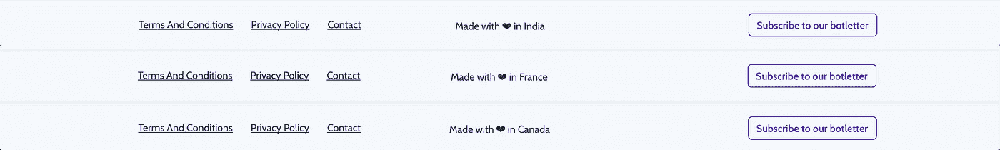
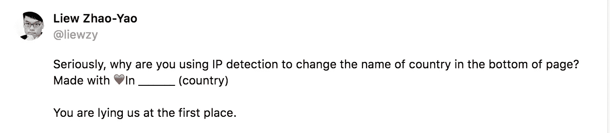
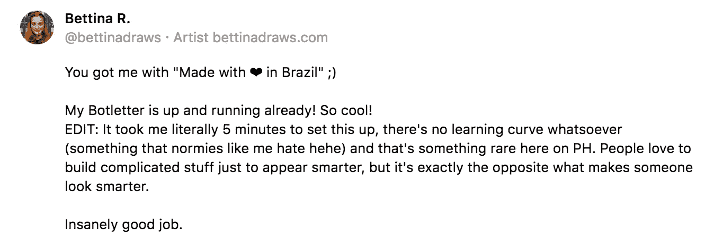
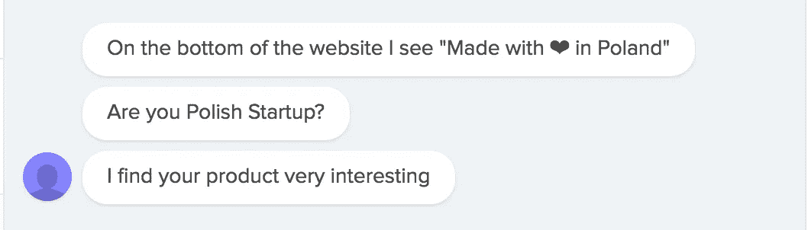

# 这种“定位黑客”可以帮助你吸引用户

> 原文：<https://medium.com/hackernoon/this-location-hack-helps-you-engage-with-your-users-15ce6f04bc94>


你面前有两个相似的产品。唯一的区别是它们是在哪里建造的。你选哪一个？

**当然是你们国家的那个。**如果你有选择的余地，你会很乐意购买本国制造的产品。这让你感觉很好。

[数码](https://hackernoon.com/tagged/digital)货呢？最近看到很多公司骄傲地展示自己的位置。例， [Agricool](https://en.agricool.co/) :


当我创作 [Botletter](https://www.botletter.com) 时，我也想自豪地展示“用爱在法国制造”。问题是，作为一个不断从一个国家迁移到另一个国家的数字流浪者，把法国作为公司的所在地实在没有意义。

# 如果每个用户都看到自己的国家显示在页脚会怎么样？🤔

然后，我想到了编写一个脚本来显示“用爱在{{user_country}}”公式的用户位置。

这可以吸引游客的注意力，提高转化率。目标是鼓励人们联系我，并开始关于 Botletter 的讨论。这样，我将更好地了解谁是我的访问者，他们是如何发现 Botletter 的，以及他们对该产品的期望是什么。

不利的一面是有伤害别人的风险，让他们觉得我在愚弄他们……我稍后会讨论实验的结果。

# 如何用 Ruby on Rails 实现它

在你应用程序中创建这样的“黑客”真的很容易。我将使用 Rails 作为一个例子，但我相信您可以使用其他技术来实现。

首先，我们希望使用访问者的 IP 地址来定位他们。 [Geocoder](https://github.com/alexreisner/geocoder) 是一个完整的 Ruby 地理编码解决方案。它将允许我们使用 IP 地址找到位置。

像任何其他 Ruby gem 一样安装 Geocoder:

```
gem install geocoder
```

并在命令提示符下运行:

```
bundle install
```

Geocoder 向标准的`Rack::Request`对象添加了`location`和`safe_location`方法，因此您可以通过 IP 地址轻松查找任何 HTTP 请求的位置。

我们希望在呈现视图之前检查用户的位置。因此，我们在应用程序控制器中添加了一个`before action`，根据用户的 IP 地址创建了一个用户位置变量。这样，用户的位置将在我们所有的视图中可用。

```
before_action :loc_functiondef loc_function
    # We check if geocoder finds the location
    if request.location
      result = request.location
      [@loc](http://twitter.com/loc) = result.country
    # If geocoder does not find it, we display 'France'
    else
      [@loc](http://twitter.com/loc) = "France"
    end
end
```

在页脚中，我们现在可以显示带有用户位置的位置公式:

```
<span>Made with ❤ in <%= [@loc](http://twitter.com/loc) %></span>
```

瞧啊。



Botletter’s footer using different locations with a CDN

# 实验结果和思考

到目前为止，效果真的很好。但是，这种“伎俩”也能得罪人。



最后，真的很少有人抱怨这个黑客…为了避免伤害到别人，我在僵尸信的 FAQ 中添加了一些解释。我委婉地解释了我这样做的原因:

> 作为一个数字流浪者，我周游世界，在页脚显示一个特定的位置对我来说没有意义。这就是为什么我决定显示访问者的位置。这是和像你这样有趣的人联系的好方法！；)

通常，人们会很好地接受它，并被它逗乐。然后，这是询问他们如何发现 Botletter 以及他们对该产品有何看法的最佳时机。



这种“定位黑客”创造了许多本来不会发生的对话。每天都有人通过 [Crisp](http://crisp.im/en/) 聊天联系我，问我我们是不是他们国家的。我与来自世界各地的了不起的企业家、营销人员、[软件](https://hackernoon.com/tagged/software)工程师交谈。

如果我没有用普通页脚测试它，因此不知道对主页转化率的影响，对我从访问者那里获得的信息量的影响是巨大的。

***如何看待这种“外景黑”？喜欢的话，别忘了鼓掌；)***

更新

Mathieu Le Roux 给了我一个很好的反馈，让配方不那么不诚实。我把它改成了“用爱为{{user_country}}”制作。

*我是* [*Botletter 的创始人，这是一个允许你在 Facebook Messenger*](https://www.botletter.com)*上发送时事通讯和更新的在线服务。看看吧！*