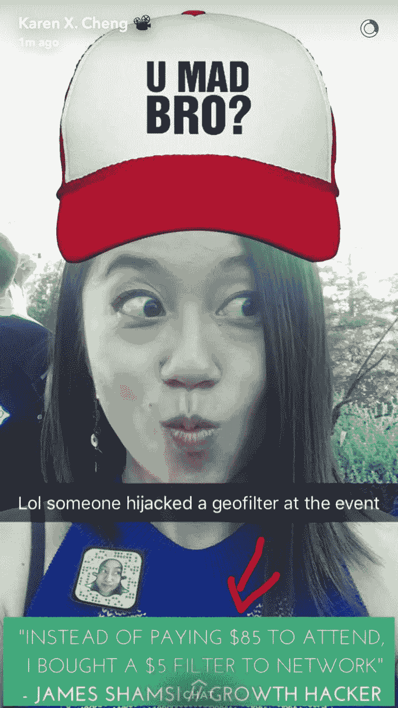
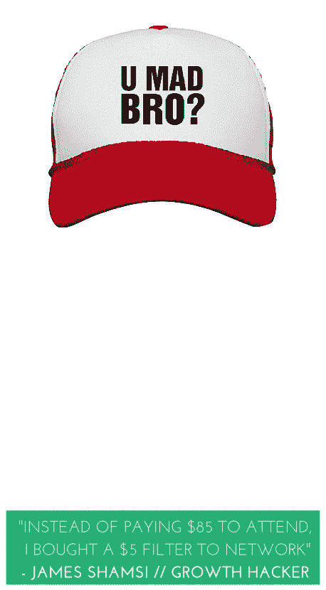
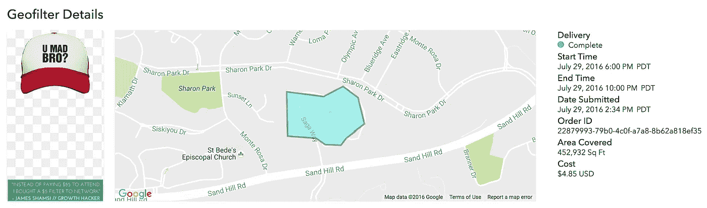

# 这个人劫持了 Tech Crunch 的夏季派对…用一个过滤器

> 原文：<https://medium.com/hackernoon/this-man-hijacked-tech-crunchs-summer-party-with-a-filter-4212077998dc>

Source: @snapkarenx

随着 Snapchat 和 Instagram 以新的“InstaStory”功能占据了所有头条，一个人找到了一种以前所未有的方式使用 Snapchat 过滤器的方法。

认识一下 [**詹姆斯·沙姆西**](http://www.JShamsi.com) ，被《商业内幕》戏称为“[社交媒体](https://hackernoon.com/tagged/social-media)专家”——理由很充分…

Shamsi 是一名 23 岁的英国人，现居住在洛杉矶，负责 2016 年一些最大的病毒式宣传活动和公关噱头。虽然他不能公开谈论他与主要一线明星和艺术家的特技表演，但他努力让自己每个月都像病毒一样传播，以证明他知道自己的手艺。

例如: [Shamsi](http://www.JShamsi.com) 创造了病毒式轰动 [Kardblock](http://www.JShamsi.com) (后来证明是一个 SEO 噱头)，到[与 Tinder](http://www.JShamsi.com) 联网，将[男性乳头上传到 Instagram](http://www.JShamsi.com) ，在 [200 个假阴道](http://www.JShamsi.com)里藏了 10，000 美元，或者在 30 天内在 Kickstarter 上筹集了 500，000 美元……他是几十个大型病毒宣传活动和公关噱头的幕后主脑(参见

几个月前，Snapchat 开始允许人们购买 geofilter，让每个人都可以选择在自己喜欢的地方短期放置一个定制的 geo filter。到目前为止，它已经被预测用于私人活动的通用过滤器，例如像“50 周年纸杯蛋糕大会”或“迈克 20 岁生日”这样的横幅广告…直到现在。

Shamsi(也是一家科技初创公司的顾问)听说过 TechCrunch 的年度夏季派对，但当他看到 85 美元的门票价格时，他的兴奋并没有持续多久。“我看到它是 85 美元，我就像他妈的，我不会支付那么多只是网络，无论谁在那里，”Shamsi 解释说。听他说，这是一个讨厌不必要花钱的人。

> “我讨厌花钱。我是印度人，廉价是我的天性” —詹姆斯·沙姆西

“我意识到，我可以只花 5 美元买一个涵盖整个活动的过滤器，而不是花 85 美元买一张票。这不仅为我节省了一大笔钱，还让我的工作效率大大提高，因为我现在可以给那里的所有风投、有影响力的人、初创企业等留下持久的印象，而不是花一天时间只和 15 到 20 个人交谈。

那么他做了什么？他在活动中购买了以下滤镜。

Source: [www.JShamsi.com](http://www.JShamsi.com)

**结果如何？** Shamsi 说他得到了超过 7000 个印象，来自 64 个自拍和使用他的滤镜的人——考虑到这是一个令人难以置信的小众活动，有高调的天使、投资者和科技界的重量级人物(他们也有有影响力的追随者)…这是非常史诗般的。

Source: [www.JShamsi.com](http://www.JShamsi.com)

# 那么，这一切意味着什么呢？

作为营销人员，我们需要更多的创新。像 Snapchat 过滤器这样的工具不应该被认为是用于预期的事情。在与[詹姆斯](http://www.JShamsi.com)的交谈中，他建议 Snapchat 和小企业的许多潜在用途，从在当地重大活动中购买 geofilters 以在当地和可承受的水平上提高品牌知名度，到使用像他的过滤器一样的“增长黑客”网络！

Snapchat 还没有死，伙计们，继续推出创意，发送这些照片吧！

**喜欢这篇文章？**分享给朋友让我知道:)

> [黑客中午](http://bit.ly/Hackernoon)是黑客如何开始他们的下午。我们是 [@AMI](http://bit.ly/atAMIatAMI) 家庭的一员。我们现在[接受投稿](http://bit.ly/hackernoonsubmission)并乐意[讨论广告&赞助](mailto:partners@amipublications.com)机会。
> 
> 如果你喜欢这个故事，我们推荐你阅读我们的[最新科技故事](http://bit.ly/hackernoonlatestt)和[趋势科技故事](https://hackernoon.com/trending)。直到下一次，不要把世界的现实想当然！

