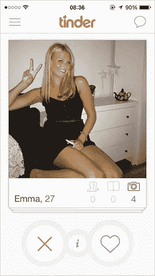
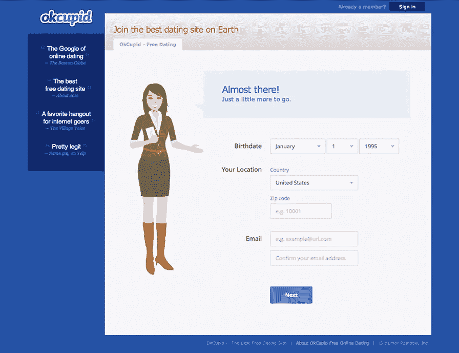
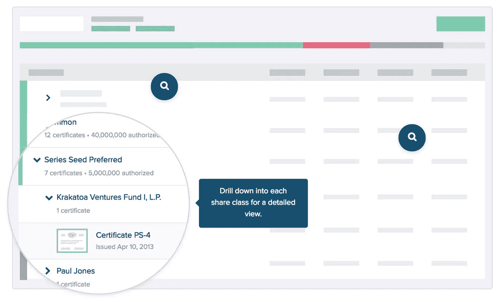
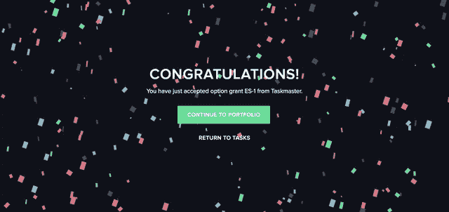
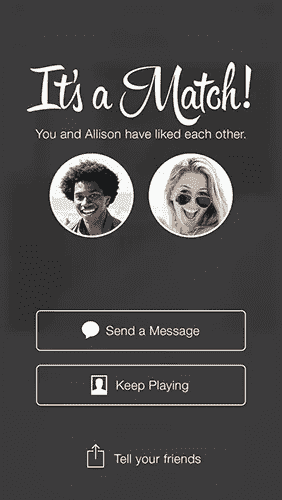
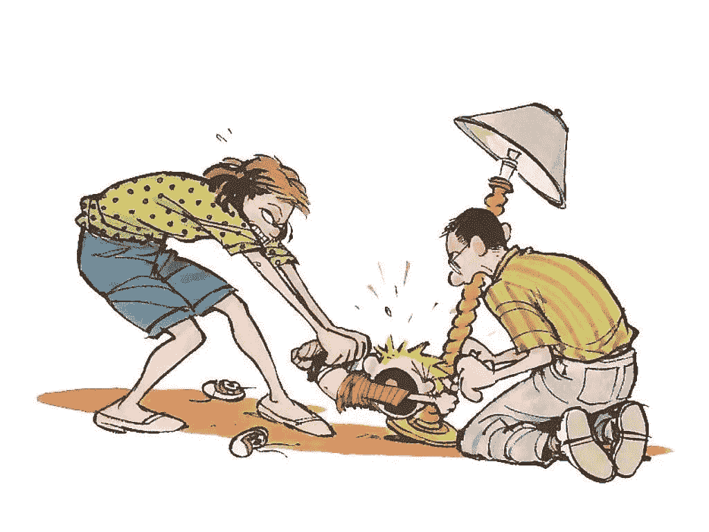

# 这个 UX 的选择让 Tinder 无法抗拒

> 原文：<https://medium.com/hackernoon/this-one-ux-choice-makes-tinder-irresistible-9acf38ee6efd>

伟大的软件有能力改变你的生活。有时候，当你看到一个性感的登录页面，或者读到一个诱人的价值主张时，你会一见钟情，但这只是开始。

入职就像求爱。如果一个产品团队在关系的这个阶段不尊重他们客户的感受，用户体验将会变糟，并且不会有第二次约会。

在产品设计中，初吻是用户的付出有回报的时候。我称之为庆祝时刻，这是至关重要的。

从输入机智的简历到选择完美的个人资料照片，入职需要努力。所以初吻一定要激动人心！一个难忘的庆祝时刻将我们喜爱的产品与我们容忍的产品区分开来。

## [网恋](https://psiloveyou.xyz/tagged/online-dating)成为主流

当 Tinder 出现的时候，市场已经成熟，因为 Match.com 和 eHarmony 的名声对 20 多岁的单身人士来说太大了。这些网站也是在 iPhone 和 UX 设计兴起之前推出的。

OKCupid 把事情向前推进了。它通过将网上约会游戏化赢得了认可。文案是新的。当 OKCupid 通知你一场比赛时，它更像一个朋友，而不是一个软件。

risqué民意调查和诱人的图形设计也有帮助，但推广移动约会应用的是 Tinder 的轻量级用户体验。

突然之间，任何一个拥有智能手机和脸书账户的人都可以通过 API 上传几张照片，在他们的个人资料上开几个玩笑，并进入现实世界中在线约会的勇敢新世界。

> Tinder 解除了网上约会的负担，随之而来的是耻辱。

由于设置如此之少，庆祝时刻的门槛——让客户知道产品团队关心的第一个吻——很低。然而，Tinder 利用了这种罕见的完美匹配的感觉。

整个应用程序以白色为主题，但当你匹配时，屏幕会变暗。一个大的，白色的，风格化的字体惊呼，“这是一个匹配！”

Tinder 的庆祝时刻代表了该应用的核心价值主张。它捕捉到了在现实生活中遇到你喜欢的人时那种明显的兴奋感。

## 私人股本是一项严肃的业务

独特的刺激是约会应用的领域，但企业软件中的庆祝时刻呢？

自 2013 年以来，我一直在私募股权管理初创公司 [eShares](https://esharesinc.com) 工作。从发布前开始，我就是那里的产品设计师。我们为公司提供了一种发行电子证券(股票、期权等)的方式。)并跟踪他们公司中谁拥有什么。

我们的客户为他们的权益努力工作。在某些情况下，长期发展的潜力是他们在创业公司工作的原因。我们在创造标志性的庆祝时刻时考虑到了这一点。

当用户接受一个安全时，屏幕变暗，出现一个彩色纸屑动画，上面写着“恭喜！”白色的。

我们的用户喜欢这个时刻。这不是我的功劳，这是我们首席执行官的主意，但这一刻表达的喜悦与私募股权的沉闷名声大相径庭，令人放下心来。用户一直在推特上谈论它。

偶尔会有诋毁者，这是有道理的。这是严肃的事情。这就像讲笑话，或者赤脚去参加董事会议(我们的首席执行官也这样做——我们在 eShares 有“不穿鞋政策”)。

有些人喜欢悠闲的氛围，有些人不喜欢。

## 值得分享的时刻

在 Tinder 的庆祝时刻，你会注意到一个雅致的社交分享按钮。在所有要求别人推广应用的时候，都是在第一次接吻之后。

Tinder 还要求用户在匹配后对应用程序进行评级。他们善于把握提问的时机。

当这个帖子的想法出现时，我在 eShares 上模拟了一个社交版的五彩纸屑屏幕。我在我们公司 Slack 的随机频道上发布了它，反应是有争议的。

虽然许多人喜欢它，但其他人认为在我们的产品中出现社交分享按钮会很俗气。然而，如果用户未经我们要求就在 Twitter 上分享这一时刻，或许私人股本管理的声誉正在发生变化。

## 抚养孩子

接纳客户就像抚养孩子一样。假设他们做的每个选择都是错的。这不是他们的错。对他们来说，一切都太新鲜了。

和孩子一样，用户在做好某件事的时候，也需要鼓励和奖励。利用庆祝时刻让用户知道你感谢他们的努力。

## 更多关于这个

看看凯文·黑尔关于如何打造用户喜欢的产品的讲座。他是 Y-Combinator 的管理合伙人，也是 [Wufoo](http://www.wufoo.com/) 的联合创始人。

山姆·奥特曼和彼得·泰尔的整个视频系列是非凡的，但凯文·黑尔对庆祝时刻的慷慨激昂的表现更为突出。

> [黑客中午](http://bit.ly/Hackernoon)是黑客如何开始他们的下午。我们是 [@AMI](http://bit.ly/atAMIatAMI) 家庭的一员。我们现在[接受投稿](http://bit.ly/hackernoonsubmission)并乐意[讨论广告&赞助](mailto:partners@amipublications.com)机会。
> 
> 如果你喜欢这个故事，我们推荐你阅读我们的[最新科技故事](http://bit.ly/hackernoonlatestt)和[趋势科技故事](https://hackernoon.com/trending)。直到下一次，不要把世界的现实想当然！

