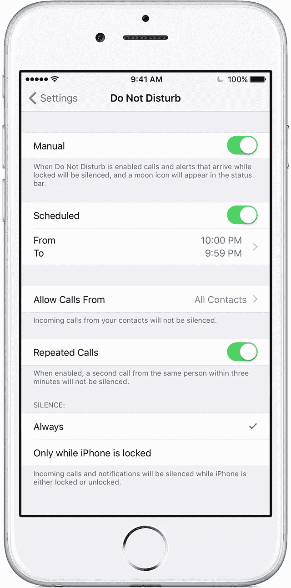
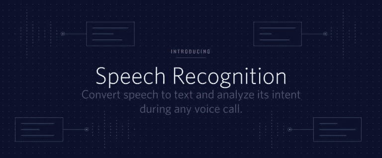

# 这个机器人反击机器人电话

> 原文：<https://medium.com/hackernoon/this-robot-fights-back-against-robocalls-e61c7d89bf27>

## 我如何使用 Twilio 和几行 Python 来永久阻止所有不需要的呼叫者。

我和大多数人一样，对电话推销员感到恼火。但最近，由于诈骗电话的自动化，这个问题变得更加严重。这一点在 NPR 的《金钱星球》中有详细报道，并在一个令人惊讶的 2 集播客中被《回复》广泛调查。《星球货币》显示，这些机器人电话不太可能很快结束，因为联邦贸易委员会在这个问题上进展非常缓慢。然后，就在这个片段的中间，他们播放了一个谷歌云平台的广告，我有了一个想法。我可以做一个机器人来过滤不想要的电话，只让高质量的电话通过。就像数字个人助理。

当谈到阻止机器人电话时，有几个应用程序以可承受的成本做得很好。[《纽约时报》的这篇文章强调了一些最佳选择。](https://www.nytimes.com/2017/05/11/smarter-living/stop-robocalls.html)我想更进一步，在我和不必要的电话之间设置一道坚固的防线。

## 机器人如何工作:

1.  电话打进了我的普通电话线。
2.  如果号码在我的联系人里，电话会自动接通。
3.  如果没有，机器人会回答并询问打电话的人有什么事。
4.  然后，打电话的人被置于等待状态，他们的回答会通过短信发给我。
5.  如果这个电话看起来是合法的，我回短信“ok ”,机器人就给我接通了。
6.  如果我没有回应，打电话的人会被要求留言。
7.  信息被转录并发送到我的电子邮件。

# 分解每个功能:

## *第一步:保持正常的电话线路。*



把软件放在你的手机和世界之间要比想象中困难得多。Twilio 为创建程序电话系统提供了一个很好的界面，但是[将一个电话号码移植到 Twilio](https://support.twilio.com/hc/en-us/articles/223179348-Porting-a-Phone-Number-to-Twilio) 需要六个步骤，可能需要长达四周的时间。

在我看来，一个更好的选择(如果你有 iPhone)，包括为 Twilio 创建一个新号码，你将公开使用它，然后限制你的个人电话线路，只接受来自你通讯录中号码的电话。您可以限制未知号码让您的电话响铃，方法是将“请勿打扰”模式设定为允许来自您的联系人的来电，并将所有其他号码设为静音。这里的关键是设置从晚上 10:00 到晚上 9:59 的时间表，这样免打扰模式将永久保持。

这本身就是一个良好的开端，将有助于清理不想要的电话。但这有点矫枉过正，所以设置一个新号码，你可以公开使用，根据你设置的标准将来电转移给你，这是一个很好的下一步。

## 第二步:通过 Google API 检查联系人

如果你用谷歌同步你的 iPhone 联系人，通过 API 访问你的联系人列表相对简单。你只需要[从 Google People API 获取人力资源](https://developers.google.com/people/api/rest/v1/people#Person)。我发现最好每天抓取这个更新，并将所有“已知号码”保存到一个 JSON 文件中，以便于访问(它只是一个电话号码列表，将被传递到您的真实号码)。

当您设置的 Twilio 号码有新的来电时(并且是免费发出的)，Python 会打开包含所有存储号码的 JSON 文件，并检查来电者是否在列表中。如果是，来电将被自动转接，而来电者并不知道这一过程；如果不是，来电者将被提示解释他们是谁以及为什么来电。

## 步骤 3:通过 Twilio 语音识别提示呼叫者进行解释



Twilio 提供[出色的开箱即用语音识别](https://www.twilio.com/blog/2017/05/introducing-speech-recognition.html)，允许你给来电者提示信息，然后自动记录和转录他们的回复。

```
from twilio.twiml.voice_response import Gather, VoiceResponse, Say

speech_result = VoiceResponse()
gather = Gather(input='speech', action='/completed')
gather.say('You have reached John's automated answering service, please state your name and why you are calling.')
speech_result.append(gather)
```

这将返回一个转录的 ***SpeechResult*** 对象以供进一步处理。有机会在这个步骤中注入一些机器学习，以了解为什么有人打电话，也许可以将它与我的日历或最近的电子邮件相关联，并相应地处理电话，但这超出了本文的范围。

## 第四步:通过可编程的短信把转录文本发给我

对于 Twilio 来说，通过文本将结果发送给我是微不足道的。python 代码如下所示:

```
client = Client(account_sid, auth_token)client.messages.create(
  to="YOUR PHONE NUMBER HERE",
  from_="YOUR TWILIO NUMBER HERE",
  body="Call {}. Message: {}".format(caller_number, speech_result))
```

然后，根据号码和转录的信息，如果看起来像一个值得接听的电话，我可以回复“是”以便接通。

## 第五步:如果我同意，将电话转给我。

一旦得到肯定的答复，这个电话就需要接到我的真实号码上。由于我在通讯录中保存了我的 Twilio 号码，因此电话会接通并在我的私人线路上响起。 [Twilio Labs 开发了一款小应用，可以实现简单的呼叫转移。URL 结构很简单，我只是替换了我自己的电话号码，并记录了一个语音邮件，以防呼叫失败。](https://www.twilio.com/labs/twimlets/forward)

```
from twilio.twiml.voice_response import Dial, Number, VoiceResponse

response = VoiceResponse()
dial = Dial()
dial.number('YOUR PHONE NUMBER HERE')
response.append(dial)

print(response)
```

幸运的是，这一步只需要很少的定制。

## 第六步:如果我不想说话，请留言。

如果我很忙，没有回复短信，Twilio 就会提示来电者留言。我认为 60 秒是让未知来电者等待的最长时间，所以 Twilio 脚本在请求留言之前会等待 60 秒的响应。

## 第七步:转录信息并发送到我的电子邮件。

就像以前一样，语音消息使用 Twilio 的语音识别服务进行转录，然后使用 Python 的简单 smtplib 通过电子邮件发送给我。[用 Python 发送电子邮件是有据可查的](https://www.tutorialspoint.com/python/python_sending_email.htm)，所以我不会在这里详述如何做。

# 后续步骤:

我很想在未来将它变成一个自助服务应用程序，并与其他感兴趣的人分享，但目前我有太多的事情要做，我相信在不久的将来，公司会开始将这些功能添加到电话系统中。

如果你想要一个更基本的版本，你可以使用[谷歌语音](http://voice.google.com)来筛选电话，并获得一些相同的功能，尽管它的可定制性要差得多。谷歌语音呼叫屏蔽解决方案仍然会让你的手机真正响起来(相比之下，侵入性小得多的短信)。

我完全可以理解有些人可能会认为这有点过了，但我认为这对我们当前的社会交流模式来说是合适的。越来越多的传统电话系统被滥用于垃圾邮件，大多数人已经转向短信或各种社交平台作为主要的沟通形式。我很想让联邦贸易委员会推出一个解决这个问题的好办法，但我认为这还不够快。在那之前，我可能会继续让[黑](https://hackernoon.com/tagged/hacking)我的手机，直到我的生活中有最少的可容忍的分心。


***感谢阅读！如果你觉得这很有趣，请点击拍手按钮！***

***你可以在推特上联系我:***[***www.twitter.com/johncoogan***](http://www.twitter.com/johncoogan)