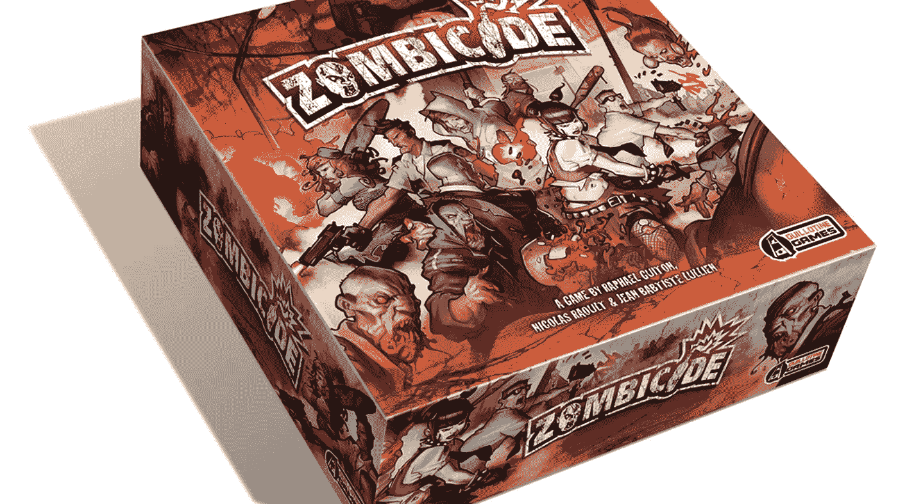
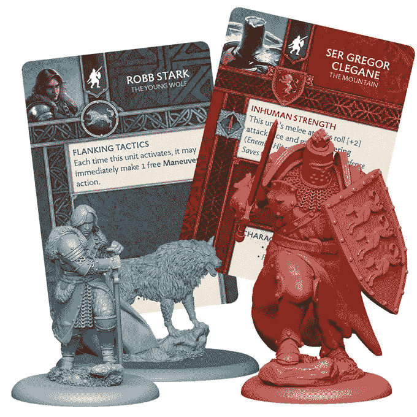
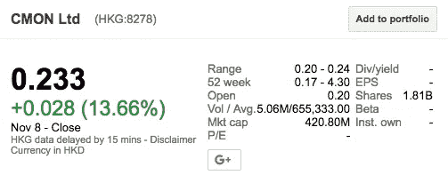

# 这家初创公司通过 28 次 Kickstarter 活动筹集了 35，943，270 美元的资金

> 原文：<https://medium.com/hackernoon/this-startup-raised-35-943-270-of-funding-via-28-kickstarter-campaigns-24d184e871a3>

*由* [*约瑟夫*](https://twitter.com/josephflaherty) *负责内容&社区*

在一个创业公司为资本抵押未来的时代，一家名为 CMON 的公司脱颖而出，在 Kickstarter 上筹集了 35，943，270，000 美元的非摊薄资金。可以把 CMON 想象成一个跨 Warby Parker 和 Parker 兄弟——这是一个桌面游戏的数字原生垂直品牌。这家 50 人的公司在亚特兰大、巴西和新加坡设有办事处；设计、制作、销售游戏名称为*[*血怒*](https://www.kickstarter.com/projects/cmon/blood-rage)；最近众筹了一部改编自 [*《冰与火之歌》*](https://www.kickstarter.com/projects/cmon/a-song-of-ice-and-fire-tabletop-miniatures-game) *，*启发了*权力的游戏的书。**

*大多数创业公司将众筹视为一次发布活动。CMON 把它当作信用额度。虽然桌面游戏和科技初创公司没有太多重叠，但 CMON 在寻找和利用一种不寻常、非稀释性资本来源方面取得的前所未有的成功值得研究。*

# *从前…*

*CMON 以 CoolMiniorNot 起家，这是一个以 Tinder 的 Web 1.0 前身 Hot 与否为原型的网站。爱好者会上传在*地下城&龙族*战役中使用的彩绘小雕像的照片，而不是给头像打分。这是一个爱好者们交换关于狡猾奥秘的技巧的地方，比如绿色颜料的适当混合，以获得完美的地精肤色。在吸引了数量惊人的观众后，该网站的创始人 Chern Ann Ng 和 David Doust 建立了一个电子商务商店，向社交不便者出售颜料、油灰模型和其他杂物。*

*在经营了十年之后，创始人决定制作一款他们自己的游戏。该团队与了解微型塑料雕像设计艺术的行业资深雕塑家合作，着手发布一款名为 [*Zombicide*](https://www.kickstarter.com/projects/cmon/zombicide) 的游戏，这成为他们的第一次众筹活动。*僵尸杀手*在 Kickstarter 的游戏类别中创下了一项纪录，并衍生出了四部续集。*

# *延伸目标的艺术*

**

*CMON 成功的秘密之一是，它有一种与制造过程相匹配的延伸目标的能力，这种制造过程具有高固定成本和低边际成本结构。为杰米·兰尼斯特雕像制作一个金属注射模具可能要花费数万美元，但从一个模具制作一个新的卡丽熙便签的增量成本只需几便士。CMONs 的核心优势是用数百个可收集的角色填充他们的游戏盒。延伸目标允许他们根据支持者的消费意愿，给游戏增加新的内容。*

# *跳出(游戏)框框思考*

*除了在最初的众筹活动中筹集资金，该公司还投资了定制软件，以填补 Kickstarter 留下的空白。支持者在 CMON 的平台上单独支付运费，这使得初创公司可以避免向 Kickstarter 支付这些费用。它还允许后期支持者参与交易，并允许客户在活动结束后的几个月内追加订单。这是一个听起来简单的软件，但对业务很重要。“这产生了重大影响，我们的认捐经理增加 20%的收入并不罕见，”Ng 说。因此，通过这些活动筹集的资金总额实际上可能接近 4200 万美元。*

*在资助和提供了 20 多个活动，并在此期间向 Kickstarter 支付了$2M 的费用后，令人惊讶的是，CMON 没有掷骰子，创建一个自托管工具来运行他们的活动。激光切割机初创公司 [Glowforge 创造了一项纪录，通过定制的众筹工具](https://glowforge.com/glowforge-3d-laser-printer-sets-record-biggest-crowdfunding-campaign)筹集了 2100 万美元。凭借 CMON 内置的粉丝群和定期发布的节奏，这似乎也将是他们的一个成功模式。*

*ng 说:“我们的众筹活动可能会从 Kickstarter 开始，但不会就此结束，会有自营和零售商承诺。”“当然，我们正在考虑所有可行的方案，并定期进行评估。目前，Kickstarter 仍然让我们的粉丝群感到兴奋，因此我们将继续相互支持。”*

*众筹的成功也转化为零售销售。2016 年，CMON 通过四次 Kickstarter 活动筹集了 5872873 美元，而他们当年的总收入仅略低于 T2 的 2100 万美元，几乎比 2014 年的 1200 万美元翻了一番。*

# *创始人找到资金*

**

*2016 年，CMON 筹集了[500 万美元的传统风险资本](http://www.belloflostsouls.net/2016/01/cmon.html)以扩大他们的业务，并在年底在香港证券交易所举行了[IPO](https://cmon.com/press/cmon-limited-announces-public-listing-on-hong-kong-stock-market)，对该公司的估值虽然不高，但仍然令人印象深刻[5000 万美元](https://finance.google.com/finance?q=HKG%3A8278&ei=F1IDWqCMMNPFe77AtpgL)。CMON 可能是第一家从 Kickstarter 上市的公司。你可能想知道为什么 Ng 和 Doust 在公司发展初期就决定让他们的公司上市？“桌面游戏不是一个传统领域，在那里有很多风险投资竞争对手寻求投资，因此拥有一个市场底线非常有帮助。”Ng 说。“当然，因为人们说我们做不到。”*

*创业公司很难模仿 CMON。5000 万美元的市值并不是一个风险投资规模的结果。他们的产品和商业模式与众筹产生了共鸣，这可能不适用于许多其他产品类别。但不难相信，还有其他类型的创业公司可以受益于 CMON 开创的非摊薄融资模式。*

*如果没有别的，CMON 证明了有了创造力，资本并不那么难得到。[风险投资是一种可怕的药物](https://techcrunch.com/2016/09/16/venture-capital-is-a-hell-of-a-drug/)，Kickstarter 可能就是它的解药。*